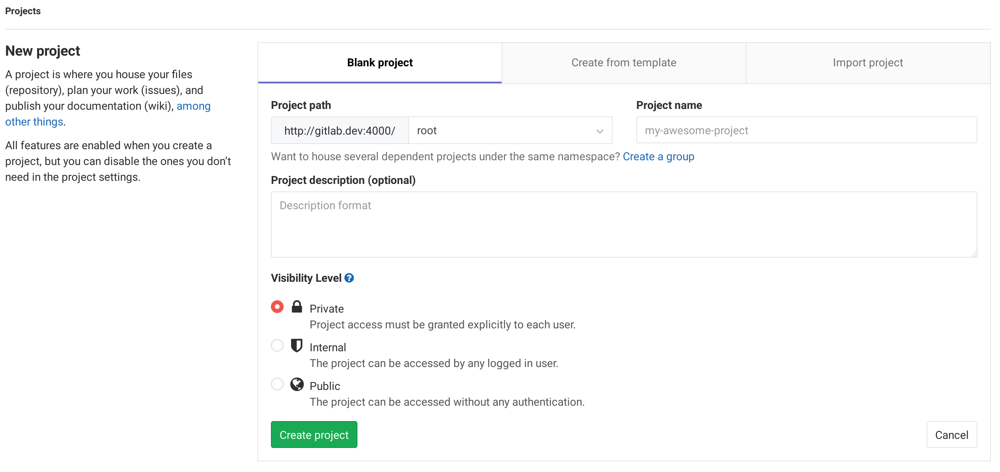
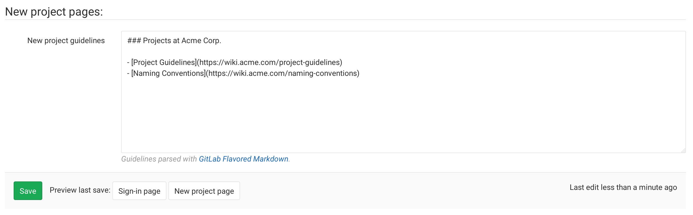
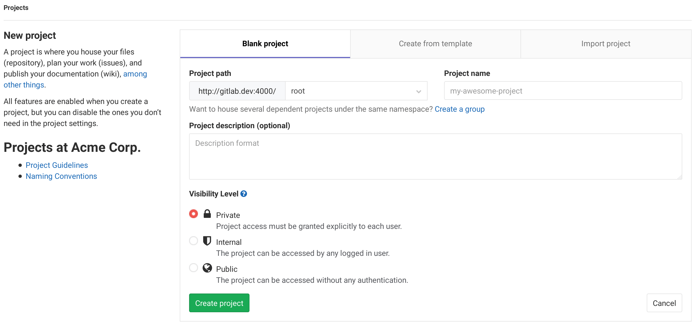

# Customizing the new project page

It is possible to add a markdown-formatted message to your GitLab
new project page.

By default, the new project page shows a sidebar with general information:

## Changing the appearance of the new project page

Navigate to the **Admin** area and go to the **Appearance** page.

Fill in your project guidelines:

After saving the page, your new project page will show the guidelines in the sidebar, below the general information:

