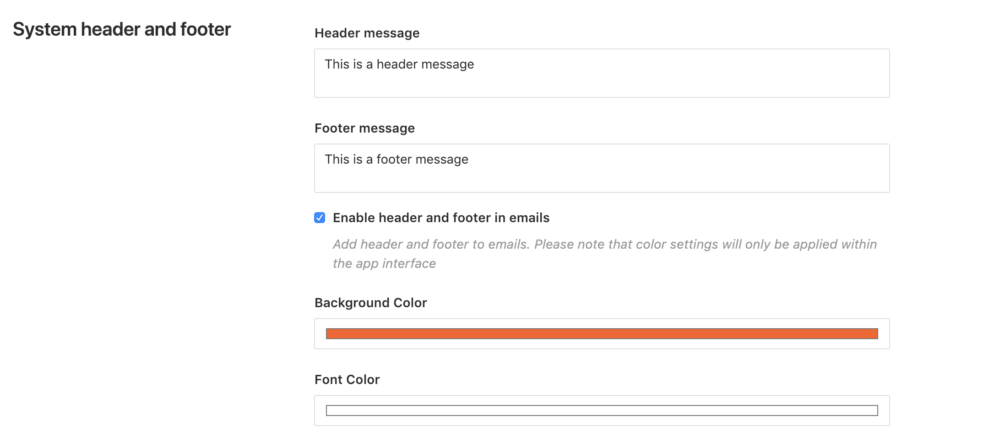
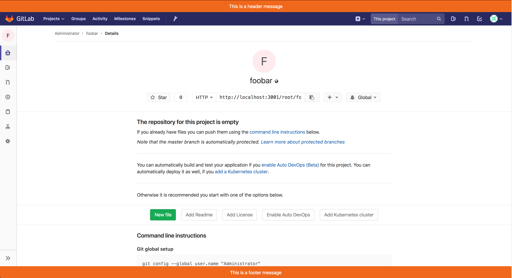
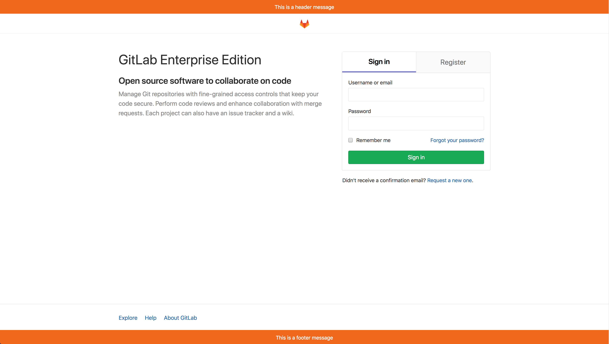

# Adding a system message to every page

Navigate to the **Admin** area and go to the **Appearance** page.

Under **System header and footer** insert your header message and/or footer message.
Both background and font color of the header and footer are customizable.

After saving, all GitLab pages will contain the custom system header and/or footer messages:

The GitLab sign in page will also show the header and the footer messages:

