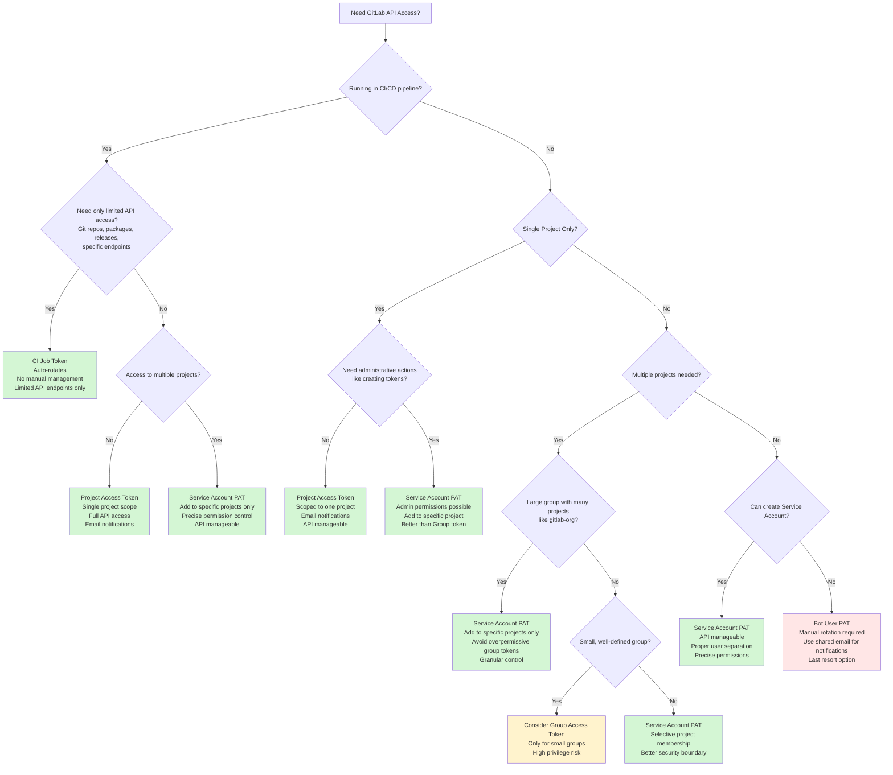

This guide helps you choose the right access token type for your needs within the GitLab project, prioritizing security best practices.

## Security principles

1. **Minimize manual rotation** - Prefer tokens that rotate automatically or through API
1. **Smallest scope possible** - Use the most restrictive scope that meets your needs
1. **Expiration visibility** - Ensure proper notifications before token expiration
1. **Easy rotation** - Choose tokens that can be rotated without significant downtime

## Decision tree

## Token type comparison

| Token Type | Rotation | Scope Flexibility | Visibility | Best Use Case | Availability |
|------------|----------|-------------------|------------|---------------|--------------|
| **CI Job Token** | Automatic | Very limited ([specific endpoints only](../ci/jobs/ci_job_token.md#job-token-access)) | Built-in logs | Limited pipeline API access | All tiers |
| **Project Access Token** | Manual/API | Single project | Email notifications | Single-project automation | Premium+ |
| **Group Access Token** | Manual/API | Group + subgroups/projects (**HIGH RISK**) | Email notifications | **Rarely recommended** - use Service Account instead | Free+ (Self-managed) |
| **Service Account PAT** | Manual/API | **Selective project/group membership** | Email possible | Multi-project with precise control | Premium+ |
| **Bot User PAT** | Manual only | User-level permissions | Manual setup required | Legacy/fallback option | All tiers |

## When to use each token type

### CI Job Token

See the [CI/CD job tokens documentation](../ci/jobs/ci_job_token.md) for complete details.

**Use when:**

- Running inside GitLab CI/CD pipelines
- Need **limited API access only**: Git repos, container/package registries, releases, deployments, environments, specific job/pipeline endpoints ([full list](../ci/jobs/ci_job_token.md#job-token-access))
- Access is limited to pipeline duration
- Target resources are in same project or properly allowlisted

**Limitations:**

- **Cannot access most GitLab API endpoints** (issues, merge requests, users, groups, etc.)
- **Cannot perform administrative actions** like creating tokens or managing users
- **Cannot access external APIs** or services outside GitLab

**Avoid when:**

- Need full GitLab API access (issues, MRs, users, groups, admin actions)
- Need persistent access outside pipeline context
- Require tokens for external systems integration

### Project Access Token

See the [project access tokens documentation](../user/project/settings/project_access_tokens.md) for complete details.

**Use when:**

- Automation is scoped to a single project
- Need persistent API access outside CI/CD
- Want automatic expiry notifications to maintainers
- Can manage through GitLab API for rotation

**Avoid when:**

- Need access to multiple projects
- Need to create other access tokens (bootstrapping problem)
- Working with public projects where scope limitation is needed

### Group Access Token

See the [group access tokens documentation](../user/group/settings/group_access_tokens.md) for complete details.

**Use when:**

- Automation spans multiple projects in **small, well-defined groups**
- Group has limited number of projects with similar security requirements
- Need access to group-level features
- Can manage through GitLab API for rotation

**High Risk - Use Sparingly:**

- **Grants access to ALL projects in group** - massive blast radius if leaked
- **Especially dangerous for large groups** like `gitlab-org` with hundreds of projects
- **Consider Service Account PAT instead** for better scope control

**Avoid when:**

- Working with large groups (>10-20 projects)
- Projects have different security requirements
- Can achieve same goal with more targeted tokens

### Service Account PAT

See the [service accounts documentation](../user/profile/service_accounts.md) for complete details.

**Use when:**

- Need to create/manage other access tokens (Terraform use case)
- **Multiple specific projects access needed** - add service account to each project individually
- Cross-group or instance-wide access required
- Want proper user separation for audit trails
- **Better alternative to Group Access Token** for precise permission control

**Key Advantage:**

- **Granular permissions**: Add service account only to specific projects/groups with minimal required role
- **Much safer than Group Access Tokens** for large organizations

**Avoid when:**

- Simpler scoped tokens meet the requirements
- Don't have Premium+ license
- Cannot manage service accounts at org level

### Bot User PAT (Legacy)

See the [personal access tokens documentation](../user/profile/personal_access_tokens.md) for complete details.

**Use only when:**

- Service accounts are not available
- Existing automation already depends on it
- Temporary solution during migration

**Required setup:**

- Use shared email address for expiry notifications
- Document rotation procedures clearly
- Plan migration to better token types

## Security best practices

- **Use the smallest scope possible** - Never use `api` scope unless absolutely necessary
- **Set expiration dates** - Keep token lifetimes under 365 days
- **Store tokens securely** - Use GitLab CI/CD variables (masked), vault systems, or credential managers
- **Monitor expiry dates** - Set up notifications and rotation procedures

## Related documentation

- [Personal access tokens](../user/profile/personal_access_tokens.md)
- [Project access tokens](../user/project/settings/project_access_tokens.md)
- [Group access tokens](../user/group/settings/group_access_tokens.md)
- [Service accounts](../user/profile/service_accounts.md)
- [CI/CD job tokens](../ci/jobs/ci_job_token.md)
- [GitLab token overview](../security/tokens/_index.md)
