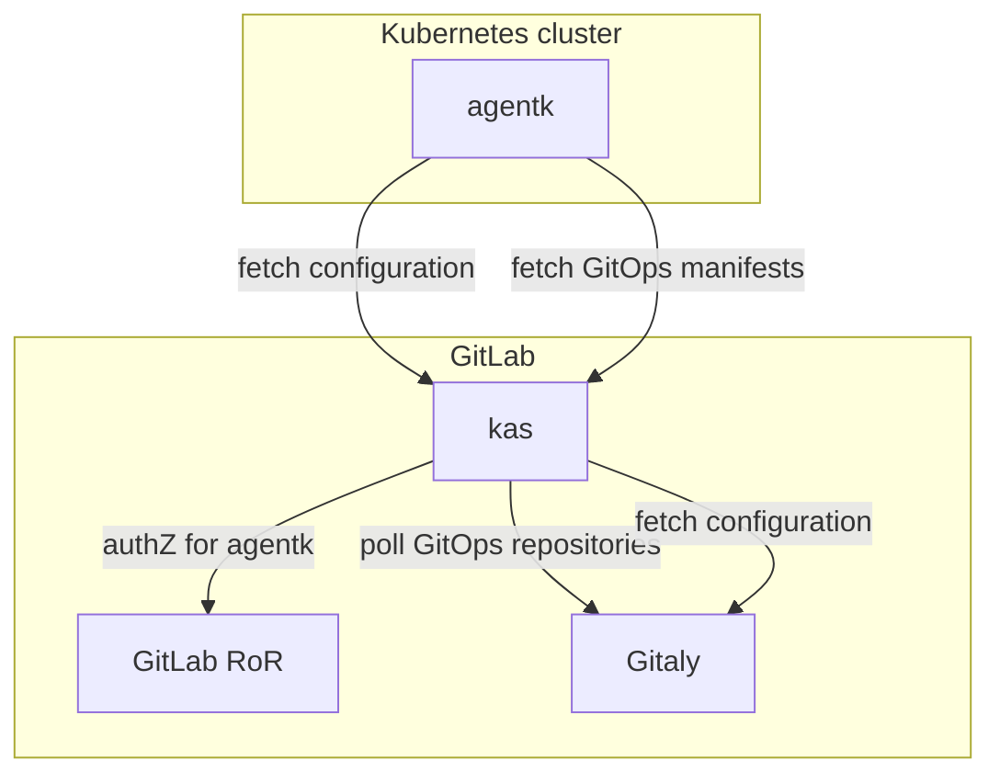
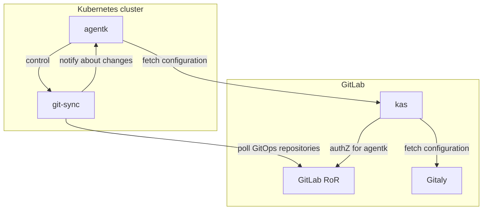

# GitOps with the Kubernetes Agent **(PREMIUM SELF)**

The [GitLab Kubernetes Agent](../../user/clusters/agent/index.md) supports the
[pull-based version](https://www.gitops.tech/#pull-based-deployments) of
[GitOps](https://www.gitops.tech/). To be useful, the feature must be able to perform these tasks:

- Connect one or more Kubernetes clusters to a GitLab project or group.
- Synchronize cluster-wide state from a Git repository.
- Synchronize namespace-scoped state from a Git repository.
- Control the following settings:

  - The kinds of objects an agent can manage.
  - Enabling the namespaced mode of operation for managing objects only in a specific namespace.
  - Enabling the non-namespaced mode of operation for managing objects in any namespace, and
    managing non-namespaced objects.

- Synchronize state from one or more Git repositories into a cluster.
- Configure multiple agents running in different clusters to synchronize state
  from the same repository.

## GitOps architecture

In this architecture, the Kubernetes cluster (`agentk`) periodically fetches
configuration from (`kas`), spawning a goroutine for each configured GitOps
repository. Each goroutine makes a streaming `GetObjectsToSynchronize()` gRPC call.
`kas` accepts these requests, then checks if this agent is authorized to access
this GitLab repository. If authorized, `kas` polls Gitaly for repository updates
and sends the latest manifests to the agent.

Before each poll, `kas` verifies with GitLab that the agent's token is still valid.
When `agentk` receives an updated manifest, it performs a synchronization using
[`gitops-engine`](https://github.com/argoproj/gitops-engine).

If a repository is removed from the list, `agentk` stops the `GetObjectsToSynchronize()`
calls to that repository.

## Architecture considered but not implemented

As part of the implementation process, this architecture was considered, but ultimately
not implemented.

In this architecture, `agentk` periodically fetches configuration from `kas`. For each
configured GitOps repository, it spawns a goroutine. Each goroutine then spawns a
copy of [`git-sync`](https://github.com/kubernetes/git-sync). It polls a particular
repository and invokes a corresponding webhook on `agentk` when it changes. When that
happens, `agentk` performs a synchronization using
[`gitops-engine`](https://github.com/argoproj/gitops-engine).

For repositories no longer in the list, `agentk` stops corresponding goroutines
and `git-sync` copies, also deleting their cloned repositories from disk:

## Comparing implemented and non-implemented architectures

Both architectures attempt to answer the same question: how to grant an agent
access to a non-public repository?

In the **implemented** architecture:

- Favorable: Fewer moving parts, as `git-sync` and `git` are not used, making this
  design more reliable.
- Favorable: Uses existing connectivity and authentication mechanisms are used (gRPC + `agentk` token).
- Favorable: No polling through external infrastructure. Saves traffic and avoids
  noise in access logs.

In the **unimplemented** architecture:

- Favorable: `agentk` uses `git-sync` to access repositories with standard protocols
  (either HTTPS, or SSH and Git) with accepted authentication and authorization methods.

  - Unfavorable: The user must put credentials into a `secret`. GitLab doesn't have
    a mechanism for per-repository tokens for robots.
  - Unfavorable: Rotating all credentials is more work than rotating a single `agentk` token.

- Unfavorable: A dependency on an external component (`git-sync`) that can be avoided.
- Unfavorable: More network traffic and connections than the implemented design

### Ideas considered for the unimplemented design

As part of the design process, these ideas were considered, and discarded:

- Running `git-sync` and `gitops-engine` as part of `kas`.

  - Favorable: More code and infrastructure under our control for GitLab.com
  - Unfavorable: Running an arbitrary number of `git-sync` processes would require
    an unbounded amount of RAM and disk space.
  - Unfavorable: Unclear which `kas` replica is responsible for which agent and
    repository synchronization. If done as part of `agentk`, leader election can be
    done using [client-go](https://pkg.go.dev/k8s.io/client-go/tools/leaderelection?tab=doc).

- Running `git-sync` and a "`gitops-engine` driver" helper program as a separate
  Kubernetes `Deployment`.

  - Favorable: Better isolation and higher resiliency. For example, if the node
    with `agentk` dies, not all synchronization stops.
  - Favorable: Each deployment has its own memory and disk limits.
  - Favorable: Per-repository synchronization identity (distinct `ServiceAccount`)
    can be implemented.
  - Unfavorable: Time consuming to implement properly:

    - Each `Deployment` needs CRUD (create, update, and delete) permissions.
    - Users may want to customize a `Deployment`, or add and remove satellite objects
      like `PodDisruptionBudget`, `HorizontalPodAutoscaler`, and `PodSecurityPolicy`.
    - Metrics, monitoring, logs for the `Deployment`.
