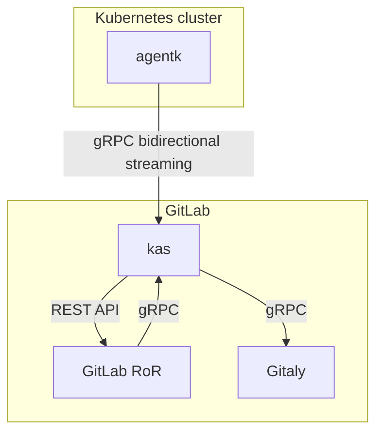

# Kubernetes Agent development **(PREMIUM ONLY)**

This page contains developer-specific information about the GitLab Kubernetes Agent.
[End-user documentation about the GitLab Kubernetes Agent](../../user/clusters/agent/index.md)
is also available.

The agent can help you perform tasks like these:

- Integrate a cluster, located behind a firewall or NAT, with GitLab. To
  learn more, read [issue #212810, Invert the model GitLab.com uses for Kubernetes integration by leveraging long lived reverse tunnels](https://gitlab.com/gitlab-org/gitlab/-/issues/212810).
- Access API endpoints in a cluster in real time. For an example use case, read
  [issue #218220, Allow Prometheus in K8s cluster to be installed manually](https://gitlab.com/gitlab-org/gitlab/-/issues/218220#note_348729266).
- Enable real-time features by pushing information about events happening in a cluster.
  For example, you could build a cluster view dashboard to visualize changes in progress
  in a cluster. For more information about these efforts, read about the
  [Real-Time Working Group](https://about.gitlab.com/company/team/structure/working-groups/real-time/).
- Enable a [cache of Kubernetes objects through informers](https://github.com/kubernetes/client-go/blob/ccd5becdffb7fd8006e31341baaaacd14db2dcb7/tools/cache/shared_informer.go#L34-L183),
  kept up-to-date with very low latency. This cache helps you:

  - Reduce or eliminate information propagation latency by avoiding Kubernetes API calls
    and polling, and only fetching data from an up-to-date cache.
  - Lower the load placed on the Kubernetes API by removing polling.
  - Eliminate any rate-limiting errors by removing polling.
  - Simplify backend code by replacing polling code with cache access. While it's another
    API call, no polling is needed. This example describes [fetching cached data synchronously from the front end](https://gitlab.com/gitlab-org/gitlab/-/issues/217792#note_348582537) instead of fetching data from the Kubernetes API.

## Architecture of the Kubernetes Agent

The GitLab Kubernetes Agent and the GitLab Kubernetes Agent Server use
[bidirectional streaming](https://grpc.io/docs/guides/concepts/#bidirectional-streaming-rpc)
to allow the connection acceptor (the gRPC server, GitLab Kubernetes Agent Server) to
act as a client. The connection acceptor sends requests as gRPC replies. The client-server
relationship is inverted because the connection must be initiated from inside the
Kubernetes cluster to bypass any firewall or NAT the cluster may be located behind.
To learn more about this inversion, read
[issue #212810](https://gitlab.com/gitlab-org/gitlab/-/issues/212810).

This diagram describes how GitLab (`GitLab RoR`), the GitLab Kubernetes Agent (`agentk`), and the GitLab Kubernetes Agent Server (`kas`) work together.

- `GitLab RoR` is the main GitLab application. It uses gRPC to talk to `kas`.
- `agentk` is the GitLab Kubernetes Agent. It keeps a connection established to a
  `kas` instance, waiting for requests to process. It may also actively send information
  about things happening in the cluster.
- `kas` is the GitLab Kubernetes Agent Server, and is responsible for:
  - Accepting requests from `agentk`.
  - [Authentication of requests](https://gitlab.com/gitlab-org/cluster-integration/gitlab-agent/-/blob/master/doc/identity_and_auth.md) from `agentk` by querying `GitLab RoR`.
  - Fetching agent's configuration from a corresponding Git repository by querying Gitaly.
  - Matching incoming requests from `GitLab RoR` with existing connections from
    the right `agentk`, forwarding requests to it and forwarding responses back.
  - (Optional) Sending notifications through ActionCable for events received from `agentk`.
  - Polling manifest repositories for [GitOps support](https://gitlab.com/gitlab-org/cluster-integration/gitlab-agent/-/blob/master/doc/gitops.md) by communicating with Gitaly.

## Guiding principles

GitLab prefers to add logic into `kas` rather than `agentk`. `agentk` should be kept
streamlined and small to minimize the need for upgrades. On GitLab.com, `kas` is
managed by GitLab, so upgrades and features can be added without requiring you
to upgrade `agentk` in your clusters.

`agentk` can't be viewed as a dumb reverse proxy because features are planned to be built
[on top of the cache with informers](https://github.com/kubernetes/client-go/blob/ccd5becdffb7fd8006e31341baaaacd14db2dcb7/tools/cache/shared_informer.go#L34-L183).
