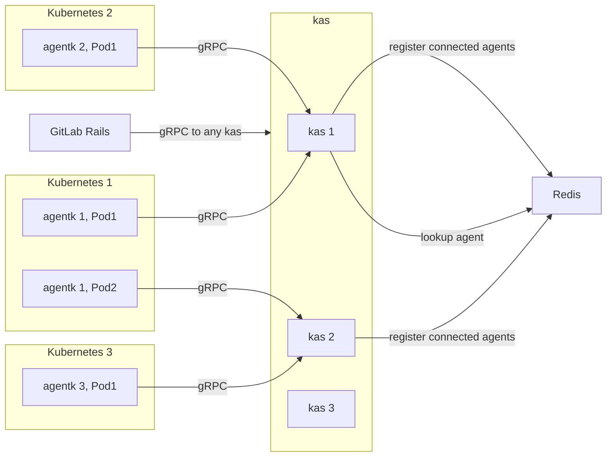
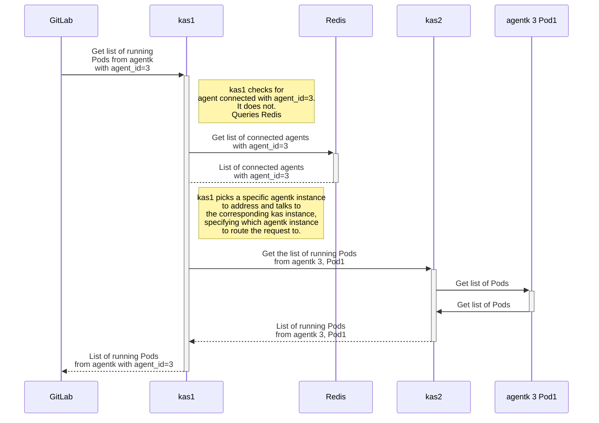

# Routing `kas` requests in the Kubernetes Agent **(PREMIUM ONLY)**

This document describes how `kas` routes requests to concrete `agentk` instances.
GitLab must talk to GitLab Kubernetes Agent Server (`kas`) to:

- Get information about connected agents. [Read more](https://gitlab.com/gitlab-org/gitlab/-/issues/249560).
- Interact with agents. [Read more](https://gitlab.com/gitlab-org/gitlab/-/issues/230571).
- Interact with Kubernetes clusters. [Read more](https://gitlab.com/gitlab-org/gitlab/-/issues/240918).

Each agent connects to an instance of `kas` and keeps an open connection. When
GitLab must talk to a particular agent, a `kas` instance connected to this agent must
be found, and the request routed to it.

## System design

For an architecture overview please see
[architecture.md](https://gitlab.com/gitlab-org/cluster-integration/gitlab-agent/-/blob/master/doc/architecture.md).



For this architecture, this diagram shows a request to `agentk 3, Pod1` for the list of pods:



Each `kas` instance tracks the agents connected to it in Redis. For each agent, it
stores a serialized protobuf object with information about the agent. When an agent
disconnects, `kas` removes all corresponding information from Redis. For both events,
`kas` publishes a notification to a Redis [pub-sub channel](https://redis.io/topics/pubsub).

Each agent, while logically a single entity, can have multiple replicas (multiple pods)
in a cluster. `kas` accommodates that and records per-replica (generally per-connection)
information. Each open `GetConfiguration()` streaming request is given
a unique identifier which, combined with agent ID, identifies an `agentk` instance.

gRPC can keep multiple TCP connections open for a single target host. `agentk` only
runs one `GetConfiguration()` streaming request. `kas` uses that connection, and
doesn't see idle TCP connections because they are handled by the gRPC framework.

Each `kas` instance provides information to Redis, so other `kas` instances can discover and access it.

Information is stored in Redis with an [expiration time](https://redis.io/commands/expire),
to expire information for `kas` instances that become unavailable. To prevent
information from expiring too quickly, `kas` periodically updates the expiration time
for valid entries. Before terminating, `kas` cleans up the information it adds into Redis.

When `kas` must atomically update multiple data structures in Redis, it uses
[transactions](https://redis.io/topics/transactions) to ensure data consistency.
Grouped data items must have the same expiration time.

In addition to the existing `agentk -> kas` gRPC endpoint, `kas` exposes two new,
separate gRPC endpoints for GitLab and for `kas -> kas` requests. Each endpoint
is a separate network listener, making it easier to control network access to endpoints
and allowing separate configuration for each endpoint.

Databases, like PostgreSQL, aren't used because the data is transient, with no need
to reliably persist it.

### `GitLab : kas` external endpoint

GitLab authenticates with `kas` using JWT and the same shared secret used by the
`kas -> GitLab` communication. The JWT issuer should be `gitlab` and the audience
should be `gitlab-kas`.

When accessed through this endpoint, `kas` plays the role of request router.

If a request from GitLab comes but no connected agent can handle it, `kas` blocks
and waits for a suitable agent to connect to it or to another `kas` instance. It
stops waiting when the client disconnects, or when some long timeout happens, such
as client timeout. `kas` is notified of new agent connections through a
[pub-sub channel](https://redis.io/topics/pubsub) to avoid frequent polling.
When a suitable agent connects, `kas` routes the request to it.

### `kas : kas` internal endpoint

This endpoint is an implementation detail, an internal API, and should not be used
by any other system. It's protected by JWT using a secret, shared among all `kas`
instances. No other system must have access to this secret.

When accessed through this endpoint, `kas` uses the request itself to determine
which `agentk` to send the request to. It prevents request cycles by only following
the instructions in the request, rather than doing discovery. It's the responsibility
of the `kas` receiving the request from the _external_ endpoint to retry and re-route
requests. This method ensures a single central component for each request can determine
how a request is routed, rather than distributing the decision across several `kas` instances.

### API definitions

```proto
syntax = "proto3";

import "google/protobuf/timestamp.proto";

message KasAddress {
    string ip = 1;
    uint32 port = 2;
}

message ConnectedAgentInfo {
    // Agent id.
    int64 id = 1;
    // Identifies a particular agentk->kas connection. Randomly generated when agent connects.
    int64 connection_id = 2;
    string version = 3;
    string commit = 4;
    // Pod namespace.
    string pod_namespace = 5;
    // Pod name.
    string pod_name = 6;
    // When the connection was established.
    google.protobuf.Timestamp connected_at = 7;
    KasAddress kas_address = 8;
    // What else do we need?
}

message KasInstanceInfo {
    string version = 1;
    string commit = 2;
    KasAddress address = 3;
    // What else do we need?
}

message ConnectedAgentsForProjectRequest {
    int64 project_id = 1;
}

message ConnectedAgentsForProjectResponse {
    // There may 0 or more agents with the same id, depending on the number of running Pods.
    repeated ConnectedAgentInfo agents = 1;
}

message ConnectedAgentsByIdRequest {
    int64 agent_id = 1;
}

message ConnectedAgentsByIdResponse {
    repeated ConnectedAgentInfo agents = 1;
}

// API for use by GitLab.
service KasApi {
    // Connected agents for a particular configuration project.
    rpc ConnectedAgentsForProject (ConnectedAgentsForProjectRequest) returns (ConnectedAgentsForProjectResponse) {
    }
    // Connected agents for a particular agent id.
    rpc ConnectedAgentsById (ConnectedAgentsByIdRequest) returns (ConnectedAgentsByIdResponse) {
    }
    // Depends on the need, but here is the call from the example above.
    rpc GetPods (GetPodsRequest) returns (GetPodsResponse) {
    }
}

message Pod {
    string namespace = 1;
    string name = 2;
}

message GetPodsRequest {
    int64 agent_id = 1;
    int64 connection_id = 2;
}

message GetPodsResponse {
    repeated Pod pods = 1;
}

// Internal API for use by kas for kas -> kas calls.
service KasInternal {
    // Depends on the need, but here is the call from the example above.
    rpc GetPods (GetPodsRequest) returns (GetPodsResponse) {
    }
}
```
