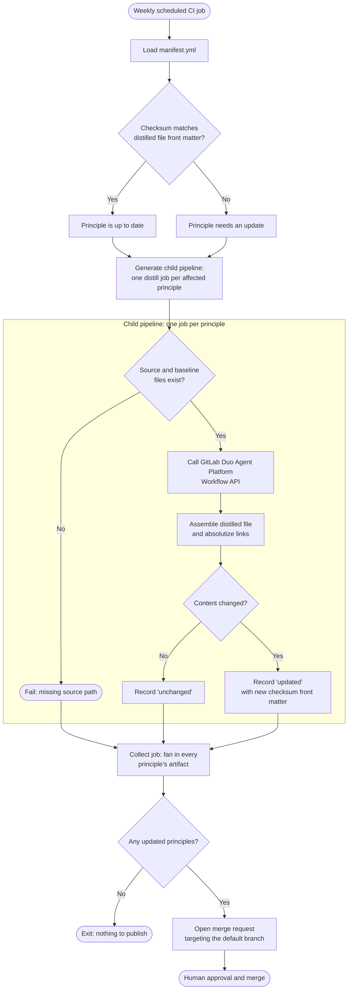

The weekly sync distills AI development principles from documentation.
Review this flow before changing the manifest, the distiller gem, or the sync schedule.

For the step-by-step description, see
[How the sync works](_index.md#how-the-sync-works).

## Distillation flow

Each sync run starts with drift detection and ends with a merge request that updates the distilled files.

The run spans two pipelines. A generate job scans for drift and emits a child
pipeline with one distill job per affected principle. Those jobs run in
parallel, then fan back in to a single collect job that publishes.

### Why the run is split

Every principle used to distill inside one CI job under a shared two-hour
budget. A principle that fails with invalid content burns roughly 20 minutes of
retry backoff, and that time was charged to every other principle. On
2026-07-30 the job timed out and discarded 19 successfully distilled principles,
because the publish step was never reached.

Giving each principle its own job gives it its own timeout, so one slow
principle can no longer threaten the rest of the run. Concurrency stays capped
at four through CI resource groups, so this adds no load to the shared
GitLab Duo Agent Platform scheduler.

Publishing remains a single job. It groups principles by owning team and builds
each team's branch against one shared working tree, so it cannot be split the
same way.

### Incomplete runs

The collect job distinguishes a principle that failed distillation from one
whose job never completed, such as after a runner outage or a job timeout. Only
the first fails the pipeline: a principle whose job never ran has not been shown
to be undistillable. Either way the principle keeps its committed checksum, so
the next scheduled run re-attempts it.

## Related

- [Manifest reference](manifest_reference.md) for `.ai/principles/manifest.yml`.
- [`gems/gitlab-ai-principles-distiller`](https://gitlab.com/gitlab-org/gitlab/-/tree/master/gems/gitlab-ai-principles-distiller)
  for the gem that drives the sync.
