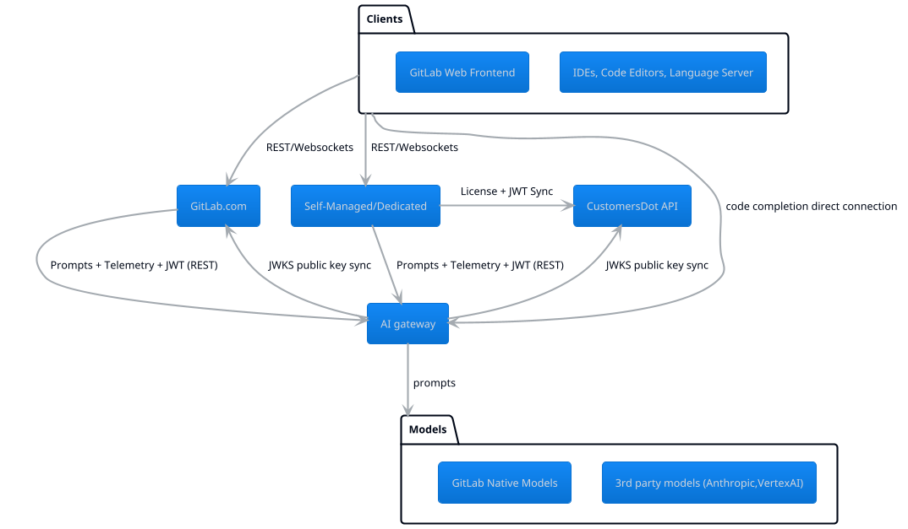

This document describes architecture shared by the GitLab Duo AI features. For historical motivation and goals of this architecture, see the [AI gateway Architecture design document](https://handbook.gitlab.com/handbook/engineering/architecture/design-documents/ai_gateway/).

## Introduction

The following diagram shows a simplified view of how the different components in GitLab interact.

- **AI Abstraction layer** - Every GitLab instance (Self-Managed, GitLab.com, ..) contains an [AI Abstraction layer](ai_features/_index.md) which provides a framework for implementing new AI features in the monolith. This layer adds contextual information to the request and does request pre/post processing.

### Systems

- [GitLab instances](https://gitlab.com/gitlab-org/gitlab) - GitLab monolith that powers all types of GitLab instances
- [CustomersDot](https://gitlab.com/gitlab-org/customers-gitlab-com) - Allows customers to buy and upgrade subscriptions by adding more seats and add/edit payment records. It also manages self-managed licenses.
- [AI gateway](https://gitlab.com/gitlab-org/modelops/applied-ml/code-suggestions/ai-assist) - System that provides unified interface for invoking models. Deployed in Google Cloud Run (using [Runway](https://gitlab.com/gitlab-com/gl-infra/platform/runway)).
- Extensions
  - [Language Server](https://gitlab.com/gitlab-org/editor-extensions/gitlab-lsp) (powers Code Suggestions in VS Code, Visual Studio 2022 for Windows, and Neovim)
  - [VS Code](https://gitlab.com/gitlab-org/gitlab-vscode-extension)
  - [JetBrains](https://gitlab.com/gitlab-org/editor-extensions/gitlab-jetbrains-plugin)
  - [Visual Studio 2022 for Windows](https://gitlab.com/gitlab-org/editor-extensions/gitlab-visual-studio-extension)
  - [Neovim](https://gitlab.com/gitlab-org/editor-extensions/gitlab.vim)

### Difference between how GitLab.com and Self-Managed/Dedicated access AI gateway

- GitLab.com
  - GitLab.com instances self-issue JWT Auth token signed with a private key.
- Other types of instances
  - Self-Managed and Dedicated regularly synchronise their licenses and AI Access tokens with CustomersDot.
  - Self-Managed and Dedicated instances route traffic to appropriate AI gateway.

## SaaS-based AI abstraction layer

GitLab operates a cloud-hosted AI architecture. We will allow access to it for licensed self managed instances using the AI-gateway. See [the design document](https://handbook.gitlab.com/handbook/engineering/architecture/design-documents/ai_gateway/) for details.

There are two primary reasons for this: the best AI models are cloud-based as they often depend on specialized hardware designed for this purpose, and operating self-managed infrastructure capable of AI at-scale and with appropriate performance is a significant undertaking. We are actively [tracking self-managed customers interested in AI](https://gitlab.com/gitlab-org/gitlab/-/issues/409183).

## AI gateway

The AI gateway (formerly the [model gateway](https://gitlab.com/gitlab-org/modelops/applied-ml/code-suggestions/ai-assist)) is a standalone-service that will give access to AI features to all users of GitLab, no matter which instance they are using: self-managed, dedicated or GitLab.com. The SaaS-based AI abstraction layer will transition to connecting to this gateway, rather than accessing cloud-based providers directly.

Calls to the AI-gateway from GitLab-rails can be made using the
[Abstraction Layer](ai_features/_index.md#feature-development-abstraction-layer).
By default, these actions are performed asynchronously via a Sidekiq
job to prevent long-running requests in Puma. It should be used for
non-latency sensitive actions due to the added latency by Sidekiq.

At the time of writing, the Abstraction Layer still directly calls the AI providers. [Epic 11484](https://gitlab.com/groups/gitlab-org/-/epics/11484) proposes to change this.

When a certain action is latency sensitive, we can decide to call the
AI-gateway directly. This avoids the latency added by Sidekiq.
[We already do this for `code_suggestions`](https://gitlab.com/gitlab-org/gitlab/-/blob/master/ee/lib/api/code_suggestions.rb)
which get handled by API endpoints nested in
`/api/v4/code_suggestions`. For any new endpoints added, we should
nest them within the `/api/v4/ai_assisted` namespace. Doing this will
automatically route the requests on GitLab.com to the `ai-assisted`
fleet for GitLab.com, isolating the workload from the regular API and
making it easier to scale if needed.

## Supported technologies

As part of the AI working group, we have been investigating various technologies and vetting them. Below is a list of the tools which have been reviewed and already approved for use within the GitLab application.

It is possible to utilize other models or technologies, however they will need to go through a review process prior to use. Use the [AI Project Proposal template](https://gitlab.com/gitlab-org/gitlab/-/issues/new?issuable_template=AI%20Project%20Proposal) as part of your idea and include the new tools required to support it.

### Models

The following models have been approved for use:

- Google's [Vertex AI](https://cloud.google.com/vertex-ai) and [model garden](https://cloud.google.com/model-garden)
- [Anthropic models](https://docs.anthropic.com/en/docs/about-claude/models)
- [Suggested reviewer](https://gitlab.com/gitlab-org/modelops/applied-ml/applied-ml-updates/-/issues/10)

### Embeddings

For more information regarding GitLab embeddings, see our [AI embeddings architecture](ai_features/embeddings.md).

## Code Suggestions

Code Suggestions is being integrated as part of the GitLab-Rails repository which will unify the architectures between Code Suggestions and AI features that use the abstraction layer, along with offering [self-managed support](#self-managed-support) for the other AI features.

The following table documents functionality that Code Suggestions offers today, and what those changes will look like as part of the unification:

| Topic              | Details                                                                                                                                                                       | Where this happens today                                                                                                                                              | Where this will happen going forward                         |
|--------------------|-------------------------------------------------------------------------------------------------------------------------------------------------------------------------------|-----------------------------------------------------------------------------------------------------------------------------------------------------------------------|--------------------------------------------------------------|
| Request processing |                                                                                                                                                                               |                                                                                                                                                                       |                                                              |
|                    | Receives requests from IDEs (VS Code, GitLab Web IDE, MS Visual Studio 2022 for Windows, IntelliJ, JetBrains, VIM, Emacs, Sublime), including code before and after the cursor | GitLab Rails                                                                                                                                                          | GitLab Rails                                                 |
|                    | Authenticates the current user, verifies they are authorized to use Code Suggestions for this project                                                                         | GitLab Rails + AI gateway                                                                                                                                             | GitLab Rails + AI gateway                                    |
|                    | Preprocesses the request to add context, such as including imports via TreeSitter                                                                                             | AI gateway                                                                                                                                                            | Undecided                                                    |
|                    | Routes the request to the AI Provider                                                                                                                                         | AI gateway                                                                                                                                                            | AI gateway                                                   |
|                    | Returns the response to the IDE                                                                                                                                               | GitLab Rails                                                                                                                                                          | GitLab Rails                                                 |
|                    | Logs the request, including timestamp, response time, model, etc                                                                                                              | Both                                                                                                                                                                  | Both                                                         |
| Telemetry          |                                                                                                                                                                               |                                                                                                                                                                       |                                                              |
|                    | User acceptance or rejection in the IDE                                                                                                                                       | AI gateway                                                                                                                                                            | [Both](https://gitlab.com/gitlab-org/gitlab/-/issues/418282) |
|                    | Number of unique users per day                                                                                                                                                | [GitLab Rails](https://app.periscopedata.com/app/gitlab/1143612/Code-Suggestions-Usage), AI gateway                                                                   | Undecided                                                    |
|                    | Error rate, model usage, response time, IDE usage                                                                                                                             | [AI gateway](https://log.gprd.gitlab.net/app/dashboards#/view/6c947f80-7c07-11ed-9f43-e3784d7fe3ca?_g=(refreshInterval:(pause:!t,value:0),time:(from:now-6h,to:now))) | Both                                                         |
|                    | Suggestions per language                                                                                                                                                      | AI gateway                                                                                                                                                            | [Both](https://gitlab.com/groups/gitlab-org/-/epics/11017)   |
| Monitoring         |                                                                                                                                                                               | Both                                                                                                                                                                  | Both                                                         |
|                    |                                                                                                                                                                               |                                                                                                                                                                       |                                                              |
| Model Routing      |                                                                                                                                                                               |                                                                                                                                                                       |                                                              |
|                    | Currently we are not using this functionality, but Code Suggestions is able to support routing to multiple models based on a percentage of traffic                            | AI gateway                                                                                                                                                            | Both                                                         |
| Internal Models    |                                                                                                                                                                               |                                                                                                                                                                       |                                                              |
|                    | Currently unmaintained, the ability to run models in our own instance, running them inside Triton, and routing requests to our own models                                     | AI gateway                                                                                                                                                            | AI gateway                                                   |

### Self-managed support

Code Suggestions for GitLab Self-Managed was introduced as part of the [Cloud Connector MVC](https://gitlab.com/groups/gitlab-org/-/epics/10516).

For more information on the technical solution for this project see the [Cloud Connector architecture documentation](cloud_connector/architecture.md).

The intention is to evolve this solution to service other AI features under the Cloud Connector product umbrella.

### Code Suggestions Latency

Code Suggestions acceptance rates are _highly_ sensitive to latency. While writing code with an AI assistant, a user will pause only for a short duration before continuing on with manually typing out a block of code. As soon as the user has pressed a subsequent keypress, the existing suggestion will be invalidated and a new request will need to be issued to the Code Suggestions endpoint. In turn, this request will also be highly sensitive to latency.

In a worst case with sufficient latency, the IDE could be issuing a string of requests, each of which is then ignored as the user proceeds without waiting for the response. This adds no value for the user, while still putting load on our services.

See our discussions [here](https://gitlab.com/gitlab-org/gitlab/-/issues/418955) around how we plan to iterate on latency for this feature.

## Future changes to the architecture

- We plan on deploying [AI gateway](https://gitlab.com/gitlab-org/modelops/applied-ml/code-suggestions/ai-assist) in different regions to improve latency (see the ed epic [Multi-region support for AI gateway](https://gitlab.com/groups/gitlab-com/gl-infra/-/epics/1206)).
- We would like to centralize telemetry. However, centralizing AI (or, Cloud Connector) telemetry is a difficult and unsolved problem as of now.
