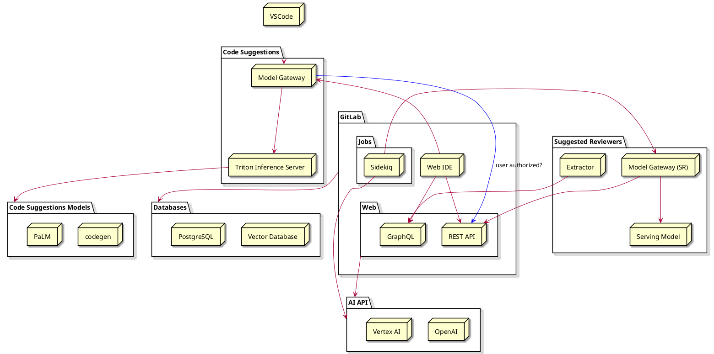

# AI Architecture (Experiment)

GitLab has created a common set of tools to support our product groups and their utilization of AI. Our goals with this common architecture are:

1. Increase the velocity of feature teams by providing a set of high quality, ready to use tools
1. Ability to switch underlying technologies quickly and easily

AI is moving very quickly, and we need to be able to keep pace with changes in the area. We have built an [abstraction layer](../../ee/development/ai_features.md) to do this, allowing us to take a more "pluggable" approach to the underlying models, data stores, and other technologies.

The following diagram shows a simplified view of how the different components in GitLab interact. The abstraction layer helps avoid code duplication within the REST APIs within the `AI API` block.

## SaaS-based AI abstraction layer

GitLab currently operates a cloud-hosted AI architecture. We are exploring how self-managed instances integrate with it.

There are two primary reasons for this: the best AI models are cloud-based as they often depend on specialized hardware designed for this purpose, and operating self-managed infrastructure capable of AI at-scale and with appropriate performance is a significant undertaking. We are actively [tracking self-managed customers interested in AI](https://gitlab.com/gitlab-org/gitlab/-/issues/409183). 

## Supported technologies

As part of the AI working group, we have been investigating various technologies and vetting them. Below is a list of the tools which have been reviewed and already approved for use within the GitLab application.

It is possible to utilize other models or technologies, however they will need to go through a review process prior to use. Use the [AI Project Proposal template](https://gitlab.com/gitlab-org/gitlab/-/issues/new?issuable_template=AI%20Project%20Proposal) as part of your idea and include the new tools required to support it.

### Models

The following models have been approved for use:

- [OpenAI models](https://platform.openai.com/docs/models)
- Google's [Vertex AI](https://cloud.google.com/vertex-ai) and [model garden](https://cloud.google.com/model-garden)
- [AI Code Suggestions](https://gitlab.com/gitlab-org/modelops/applied-ml/code-suggestions/ai-assist/-/tree/main)
- [Suggested reviewer](https://gitlab.com/gitlab-org/modelops/applied-ml/applied-ml-updates/-/issues/10)

### Vector stores

The following vector stores have been approved for use:

- [`pgvector`](https://github.com/pgvector/pgvector) is a Postgres extension adding support for storing vector embeddings and calculating ANN (approximate nearest neighbor).
