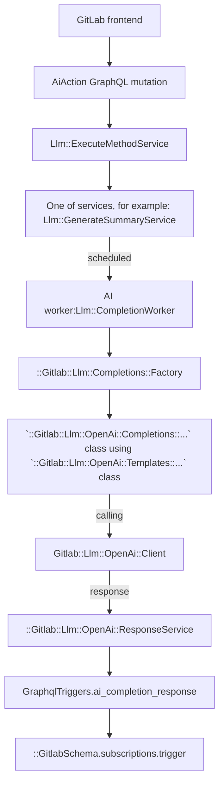

# AI features based on 3rd-party integrations

[Introduced](https://gitlab.com/gitlab-org/gitlab/-/merge_requests/117296) in GitLab 15.11.

## Features

- Async execution of the long running API requests
  - GraphQL Action starts the request
  - Background workers execute
  - GraphQL subscriptions deliver results back in real time
- Abstraction for
  - OpenAI
  - Google Vertex AI
- Rate Limiting
- Circuit Breaker
- Multi-Level feature flags
- License checks on group level
- Snowplow execution tracking
- Tracking of Token Spent on Prometheus
- Configuration for Moderation check of inputs
- Automatic Markdown Rendering of responses
- Centralised Group Level settings for experiment and 3rd party
- Experimental API endpoints for exploration of AI API’s by GitLab team members without the need for credentials
  - OpenAI
  - Google Vertex AI

## Feature flags

Apply the following two feature flags to any AI feature work:

- A general that applies to all AI features.
- A flag specific to that feature. The feature flag name [must be different](feature_flags/index.md#feature-flags-for-licensed-features) than the licensed feature name.

See the [feature flag tracker](https://gitlab.com/gitlab-org/gitlab/-/issues/405161) for the list of all feature flags and how to use them.

## Implement a new AI action

To implement a new AI action, connect to the OpenAI API. You can connect to this API using either the:

- Experimental REST API.
- Abstraction layer.

All AI features are experimental.

## Test AI features locally

1. Enable the required general feature flags:

   ```ruby
   Feature.enable(:ai_related_settings)
   Feature.enable(:openai_experimentation)
   ```

1. Simulate the GDK to [simulate SaaS](ee_features.md#simulate-a-saas-instance) and ensure the group you want to test has an Ultimate license
1. Enable `Experimental features` and `Third-party AI services`
   1. Go to the group with the Ultimate license
   1. **Group Settings** > **General** -> **Permissions and group features**
   1. Enable **Experiment features**
   1. Enable **Third-party AI services**
1. Enable the specific feature flag for the feature you want to test
1. Set either the required access token `OpenAi` or `Vertex`. Ask in [`#ai_enablement_team`](https://gitlab.slack.com/archives/C051K31F30R) to receive an access token.

### Set up the embedding database

For features that use the embedding database, additional setup is needed.

1. Enable [pgvector](https://gitlab.com/gitlab-org/gitlab-development-kit/-/blob/main/doc/howto/pgvector.md#enable-pgvector-in-the-gdk) in GDK
1. Enable the embedding database in GDK

   ```shell
     gdk config set gitlab.rails.databases.embedding.enabled true
   ```

1. Run `gdk reconfigure`
1. Run database migrations to create the embedding database

### Setup for GitLab chat

To populate the embedding database for GitLab chat:

1. Open a rails console
1. Run [this script](https://gitlab.com/gitlab-com/gl-infra/production/-/issues/10588#note_1373586079) to populate the embedding database

### Internal-Only GCP account access

In order to obtain a GCP service key for local development, please follow the steps below:

- Create a sandbox GCP environment by visiting [this page](https://about.gitlab.com/handbook/infrastructure-standards/#individual-environment) and following the instructions
- In the GCP console, go to `IAM & Admin` > `Service Accounts` and click on the "Create new service account" button
- Name the service account something specific to what you're using it for. Select Create and Continue. Under `Grant this service account access to project`, select the role `Vertex AI User`. Select `Continue` then `Done`
- Select your new service account and `Manage keys` > `Add Key` > `Create new key`. This will download the **private** JSON credentials for your service account.
- In the rails console, you will use this by `Gitlab::CurrentSettings.update(tofa_credentials: File.read('/YOUR_FILE.json'))`

## Experimental REST API

Use the [experimental REST API endpoints](https://gitlab.com/gitlab-org/gitlab/-/blob/master/ee/lib/api/ai/experimentation/open_ai.rb) to quickly experiment and prototype AI features.

The endpoints are:

- `https://gitlab.example.com/api/v4/ai/experimentation/openai/completions`
- `https://gitlab.example.com/api/v4/ai/experimentation/openai/embeddings`
- `https://gitlab.example.com/api/v4/ai/experimentation/openai/chat/completions`

To use these endpoints locally, set the OpenAI API key in the application settings:

```ruby
Gitlab::CurrentSettings.update(openai_api_key: "<open-ai-key>")
```

These endpoints are only for prototyping, not for rolling features out to customers.
The experimental endpoint is only available to GitLab team members on production. Use the
[GitLab API token](../user/profile/personal_access_tokens.md) to authenticate.

## Abstraction layer

### GraphQL API

To connect to the OpenAI API using the Abstraction Layer, use an extendable GraphQL API called
[`aiAction`](https://gitlab.com/gitlab-org/gitlab/blob/master/ee/app/graphql/mutations/ai/action.rb).
The `input` accepts key/value pairs, where the `key` is the action that needs to be performed.
We only allow one AI action per mutation request.

Example of a mutation:

```graphql
mutation {
  aiAction(input: {summarizeComments: {resourceId: "gid://gitlab/Issue/52"}}) {
    clientMutationId
  }
}
```

As an example, assume we want to build an "explain code" action. To do this, we extend the `input` with a new key,
`explainCode`. The mutation would look like this:

```graphql
mutation {
  aiAction(input: {explainCode: {resourceId: "gid://gitlab/MergeRequest/52", code: "foo() { console.log()" }}) {
    clientMutationId
  }
}
```

The GraphQL API then uses the [OpenAI Client](https://gitlab.com/gitlab-org/gitlab/blob/master/ee/lib/gitlab/llm/open_ai/client.rb)
to send the response.

#### How to receive a response

As the OpenAI API requests are handled in a background job, we do not keep the request alive and
the response is sent through the `aiCompletionResponse` subscription:

```mutation
subscription aiCompletionResponse($userId: UserID, $resourceId: AiModelID!) {
  aiCompletionResponse(userId: $userId, resourceId: $resourceId) {
    responseBody
    errors
  }
}
```

WARNING:
You should only subscribe to the subscription once the mutation is sent. If multiple subscriptions are active on the same page, they currently all receive updates as our identifier is the user and the resource. To mitigate this, you should only subscribe when the mutation is sent. You can use [`skip()`](You can use [`skip()`](https://apollo.vuejs.org/guide/apollo/subscriptions.html#skipping-the-subscription)) for this case. To prevent this problem in the future, we implement a [request identifier](https://gitlab.com/gitlab-org/gitlab/-/issues/408196).

#### Current abstraction layer flow



## CircuitBreaker

The CircuitBreaker concern is a reusable module that you can include in any class that needs to run code with circuit breaker protection. The concern provides a `run_with_circuit` method that wraps a code block with circuit breaker functionality, which helps prevent cascading failures and improves system resilience. For more information about the circuit breaker pattern, see:

- [What is Circuit breaker](https://martinfowler.com/bliki/CircuitBreaker.html).
- [The Hystrix documentation on CircuitBreaker](https://github.com/Netflix/Hystrix/wiki/How-it-Works#circuit-breaker).

### Use CircuitBreaker

To use the CircuitBreaker concern, you need to include it in a class and define the `service_name` method, which should return the name of the service that the circuit breaker is protecting. For example:

```ruby
class MyService
  include Gitlab::Llm::Concerns::CircuitBreaker

  def call_external_service
    run_with_circuit do
      # Code that interacts with external service goes here

      raise MyCustomError
    end
  end

  private

  def service_name
    my_service
  end
end
```

The `call_external_service` method is an example method that interacts with an external service.
By wrapping the code that interacts with the external service with `run_with_circuit`, the method is executed within the circuit breaker.
The circuit breaker is created and configured by the `circuit` method, which is called automatically when the `CircuitBreaker` module is included.
The method should raise a custom error, that matches the `exceptions` from the concern.

The circuit breaker tracks the number of errors and the rate of requests,
and opens the circuit if it reaches the configured error threshold or volume threshold.
If the circuit is open, subsequent requests fail fast without executing the code block, and the circuit breaker periodically allows a small number of requests through to test the service's availability before closing the circuit again.

### Configuration

The circuit breaker is configured with two constants which control the number of errors and requests at which the circuit will open:

- `ERROR_THRESHOLD`
- `VOLUME_THRESHOLD`

You can adjust these values as needed for the specific service and usage pattern.
The concern also raises an `InternalServerError` exception, which is counted towards the error threshold if raised during the execution of the code block.
This is the exception class that triggers the circuit breaker when raised by the code that interacts with the external service.
By default, the `CircuitBreaker` concern uses `StandardError`.

NOTE:
The service_name method must be implemented by the including class to provide a unique identifier for the service being protected. The `CircuitBreaker` module depends on the `Circuitbox` gem to provide the circuit breaker implementation.

### Testing

To test code that uses the `CircuitBreaker` concern, you can use `RSpec` shared examples and pass the `service` and `subject` variables:

```ruby
it_behaves_like 'has circuit breaker' do
  let(:service) { dummy_class.new }
  let(:subject) { service.dummy_method }
end
```

## How to implement a new action

### Register a new method

Go to the `Llm::ExecuteMethodService` and add a new method with the new service class you will create.

```ruby
class ExecuteMethodService < BaseService
  METHODS = {
    # ...
    amazing_new_ai_feature: Llm::AmazingNewAiFeatureService
  }.freeze
```

### Create a Service

1. Create a new service under `ee/app/services/llm/` and inherit it from the `BaseService`.
1. The `resource` is the object we want to act on. It can be any object that includes the `Ai::Model` concern. For example it could be a `Project`, `MergeRequest`, or `Issue`.

```ruby
# ee/app/services/llm/amazing_new_ai_feature_service.rb

module Llm
  class AmazingNewAiFeatureService < BaseService
    private

    def perform
      ::Llm::CompletionWorker.perform_async(user.id, resource.id, resource.class.name, :amazing_new_ai_feature)
      success
    end

    def valid?
      super && Ability.allowed?(user, :amazing_new_ai_feature, resource)
    end
  end
end
```

### Authorization

We recommend to use [policies](policies.md) to deal with authorization for a feature. Currently we need to make sure to cover the following checks:

1. General AI feature flag is enabled
1. Feature specific feature flag is enabled
1. The namespace has the required license for the feature
1. User is a member of the group/project
1. Resource is allowed to be sent (see `send_to_ai?` method)
1. `experiment_features_enabled` and `third_party_ai_features_enabled` flags are set on the `Namespace`

For our example, we need to implement the `allowed?(:amazing_new_ai_feature)` call. As an example, you can look at the [Issue Policy for the summarize comments feature](https://gitlab.com/gitlab-org/gitlab/-/blob/master/ee/app/policies/ee/issue_policy.rb). In our example case, we want to implement the feature for Issues as well:

```ruby
# ee/app/policies/ee/issue_policy.rb

module EE
  module IssuePolicy
    extend ActiveSupport::Concern
    prepended do
      with_scope :subject
      condition(:ai_available) do
        ::Feature.enabled?(:openai_experimentation) &&
          subject_container.root_ancestor.experiment_features_enabled &&
          @subject.send_to_ai?
      end

      with_scope :subject
      condition(:amazing_new_ai_feature_enabled) do
        ::Feature.enabled?(:amazing_new_ai_feature, subject_container) &&
          subject_container.licensed_feature_available?(:amazing_new_ai_feature)
      end

      rule do
        ai_available & amazing_new_ai_feature_enabled & is_project_member
      end.enable :amazing_new_ai_feature
    end
  end
end
```

### Implement `send_to_ai?`

To make sure we only send data that is allowed to be sent, we have the `send_to_ai?` method. It checks if the resource is not confidential and public data.
Some resources already implement `send_to_ai?`. Make sure yours does as well. In our case, `Issue` is already covered with the `Issuable` concern. This is an example how it could look like:

```ruby
# ee/app/models/concerns/ee

def send_to_ai?
  !try(:confidential) && resource_parent.public? && resource_parent.third_party_ai_features_enabled
end
```

### Implement calls to AI APIs and the prompts

The `CompletionWorker` will call the `Completions::Factory` which will initialize the Service and execute the actual call to the API.
In our example, we will use OpenAI and implement two new classes:

```ruby
# /ee/lib/gitlab/llm/open_ai/completions/amazing_new_ai_feature.rb

module Gitlab
  module Llm
    module OpenAi
      module Completions
        class AmazingNewAiFeature
          def initialize(ai_prompt_class)
            @ai_prompt_class = ai_prompt_class
          end

          def execute(user, issue, options)
            options = ai_prompt_class.get_options(options[:messages])

            ai_response = Gitlab::Llm::OpenAi::Client.new(user).chat(content: nil, **options)

            ::Gitlab::Llm::OpenAi::ResponseService.new(user, issue, ai_response, options: {}).execute(
              Gitlab::Llm::OpenAi::ResponseModifiers::Chat.new
            )
          end

          private

          attr_reader :ai_prompt_class
        end
      end
    end
  end
end
```

```ruby
# /ee/lib/gitlab/llm/open_ai/templates/amazing_new_ai_feature.rb

module Gitlab
  module Llm
    module OpenAi
      module Templates
        class AmazingNewAiFeature
          TEMPERATURE = 0.3

          def self.get_options(messages)
            system_content = <<-TEMPLATE
              You are an assistant that writes code for the following input:
              """
            TEMPLATE

            {
              messages: [
                { role: "system", content: system_content },
                { role: "user", content: messages },
              ],
              temperature: TEMPERATURE
            }
          end
        end
      end
    end
  end
end
```

### Add Ai Action to GraphQL

TODO

## Circuit Breaker concern

The `CircuitBreaker` concern is a reusable module that can be included in any class that needs to run code with circuit breaker protection. The concern provides a `run_with_circuit` method that wraps a code block with circuit breaker functionality, which can help prevent cascading failures and improve the resilience of the system. Resources about the circuit breaker pattern:

- [What is Circuit breaker](https://martinfowler.com/bliki/CircuitBreaker.html)
- [How it works](https://github.com/Netflix/Hystrix/wiki/How-it-Works#circuit-breaker)

The CircuitBreaker module depends on the [Circuitbox](https://github.com/yammer/circuitbox) gem to provide the circuit breaker implementation.

### Usage

To use the `CircuitBreaker` concern, include it in a class and define the `service_name` method, which should return the name of the service that the circuit breaker is protecting. For example:

```ruby
class MyService
  include Gitlab::Llm::Concerns::CircuitBreaker

  def call_external_service
    run_with_circuit do
      # Code that interacts with external service goes here

      raise InternalServerError
    end
  end

  private

  def service_name
    :my_service
  end
end
```

The `call_external_service` method is an example method that interacts with an external service. By wrapping the code that interacts with the external service with `run_with_circuit`, the method will be executed within the circuit breaker. The circuit breaker is created and configured by the `circuit` method, which is called automatically when the `CircuitBreaker` module is included. The method should raise `InternalServerError` error which will be counted towards the error threshold if raised during the execution of the code block.

The circuit breaker will track the number of errors and the rate of requests, and open the circuit if it reaches the configured error threshold or volume threshold. If the circuit is open, subsequent requests will fail fast without executing the code block, and the circuit breaker will periodically allow a small number of requests through to test the service's availability before closing the circuit again.

### Configuration

The circuit breaker is configured with two constants: `ERROR_THRESHOLD` and `VOLUME_THRESHOLD`, which control the number of errors and requests at which the circuit will open. These values can be adjusted as needed for the specific service and usage pattern. The `InternalServerError` is the exception class that will trigger the circuit breaker when raised by the code that interacts with the external service.

### Testing

To test code that uses the `CircuitBreaker` concern, use RSpec shared examples and pass the `service` and `subject` variables:

```ruby
it_behaves_like 'has circuit breaker' do
  let(:service) { dummy_class.new }
  let(:subject) { service.dummy_method }
end
```

## Security

Refer to the [secure coding guidelines for Artificial Intelligence (AI) features](secure_coding_guidelines.md#artificial-intelligence-ai-features).
