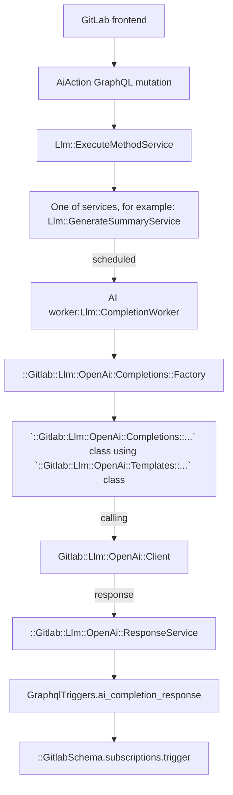

# AI features based on 3rd-party integrations

[Introduced](https://gitlab.com/gitlab-org/gitlab/-/merge_requests/117296) in GitLab 15.11.

## Feature flags

Apply the following two feature flags to any AI feature work:

- A general that applies to all AI features.
- A flag specific to that feature.

See the [feature flag tracker](https://gitlab.com/gitlab-org/gitlab/-/issues/405161) for the list of all feature flags and how to use them.

## Implement a new AI action

To implement a new AI action, connect to the OpenAI API. You can connect to this API using either the:

- Experimental REST API.
- Abstraction layer.

All AI features are experimental.

## Experimental REST API

Use the [experimental REST API endpoints](https://gitlab.com/gitlab-org/gitlab/-/blob/master/ee/lib/api/ai/experimentation/open_ai.rb) to quickly experiment and prototype AI features.

The endpoints are:

- `https://gitlab.example.com/api/v4/ai/experimentation/openai/completions`
- `https://gitlab.example.com/api/v4/ai/experimentation/openai/embeddings`
- `https://gitlab.example.com/api/v4/ai/experimentation/openai/chat/completions`

To use these endpoints locally, set the OpenAI API key in the application settings:

```ruby
Gitlab::CurrentSettings.update(openai_api_key: "<open-ai-key>")
```

These endpoints are only for prototyping, not for production.

Production endpoints are available only to GitLab team members. To use the production endpoints, use the
[GitLab API token](../user/profile/personal_access_tokens.md).

## Abstraction layer

### GraphQL API

To connect to the OpenAI API using the Abstraction Layer, use an extendable GraphQL API called
[`aiAction`](https://gitlab.com/gitlab-org/gitlab/blob/master/ee/app/graphql/mutations/ai/action.rb).
The `input` accepts key/value pairs, where the `key` is the action that needs to be performed.
We only allow one AI action per mutation request.

Example of a mutation:

```graphql
mutation {
  aiAction(input: {summarizeComments: {resourceId: "gid://gitlab/Issue/52"}}) {
    clientMutationId
  }
}
```

As an example, assume we want to build an "explain code" action. To do this, we extend the `input` with a new key,
`explainCode`. The mutation would look like this:

```graphql
mutation {
  aiAction(input: {explainCode: {resourceId: "gid://gitlab/MergeRequest/52", code: "foo() { console.log()" }}) {
    clientMutationId
  }
}
```

The GraphQL API then uses the [OpenAI Client](https://gitlab.com/gitlab-org/gitlab/blob/master/ee/lib/gitlab/llm/open_ai/client.rb)
to send the response.

#### How to receive a response

As the OpenAI API requests are handled in a background job, we do not keep the request alive and
the response is sent through a special `aiCompletionResponse` subscription:

```mutation
subscription aiCompletionResponse($userId: UserID, $resourceId: AiModelID!) {
  aiCompletionResponse(userId: $userId, resourceId: $resourceId) {
    responseBody
    errors
  }
}
```

#### Current abstraction layer flow



## How to implement a new action

...
