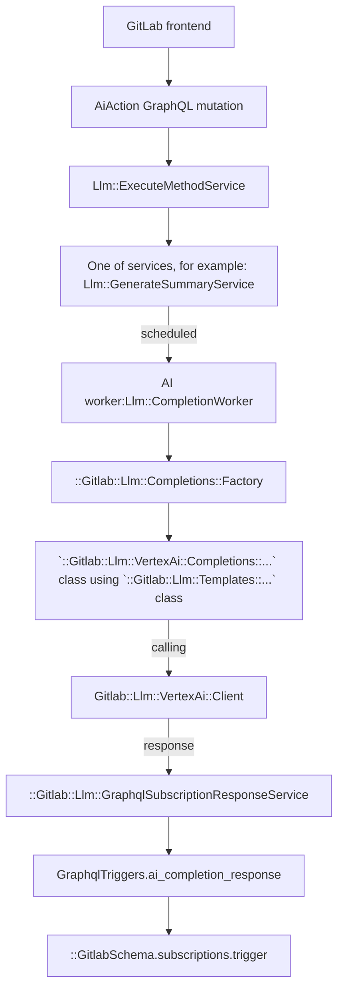

## Instructions for setting up GitLab Duo features in the local development environment

### Required: Install AI gateway

**Why:** All Duo features route LLM requests through the AI gateway.

**How:**
Follow [these instructions](https://gitlab.com/gitlab-org/gitlab-development-kit/-/blob/main/doc/howto/gitlab_ai_gateway.md#install)
to install the AI gateway with GDK. We recommend this route for most users.

You can also install AI gateway by:

1. [Cloning the repository directly](https://gitlab.com/gitlab-org/modelops/applied-ml/code-suggestions/ai-assist).
1. [Running the server locally](https://gitlab.com/gitlab-org/modelops/applied-ml/code-suggestions/ai-assist#how-to-run-the-server-locally).

We only recommend this for users who have a specific reason for *not* running
the AI gateway through GDK.

### Required: Setup Licenses in GitLab-Rails

**Why:** GitLab Duo is available to Premium and Ultimate customers only. You
likely want an Ultimate license for your GDK. Ultimate gets you access to
all GitLab Duo features.

**How:**

Follow [the process to obtain an EE license](https://handbook.gitlab.com/handbook/engineering/developer-onboarding/#working-on-gitlab-ee-developer-licenses)
for your local instance and [upload the license](../../administration/license_file.md).

To verify that the license is applied, go to **Admin area** > **Subscription**
and check the subscription plan.

### Set up and run GDK

#### Option A: in SaaS (GitLab.com) Mode

**Why:** Most Duo features are available on GitLab.com first, so running in SaaS
mode will ensure that you can access most features.

**How:**

Run the Rake task to set up Duo features for a group:

```shell
GITLAB_SIMULATE_SAAS=1 bundle exec 'rake gitlab:duo:setup[test-group-name]'
```

```shell
gdk restart
```

Replace `test-group-name` with the name of any top-level group. Duo will
be configured for that group. If the group doesn't exist, it creates a new
one.

Make sure the script succeeds. It prints error messages with links on how
to resolve any errors. You can re-run the script until it succeeds.

In SaaS mode, membership to a group with Duo features enabled is what enables
many AI features. Make sure that your test user is a member of the group with
Duo features enabled (`test-group-name`).

This Rake task creates Duo Enterprise add-on attached to that group.

In case you need Duo Pro add-on attached, please use:

```shell
GITLAB_SIMULATE_SAAS=1 bundle exec 'rake gitlab:duo:setup[test-group-name,duo_pro]'
```

Duo Pro add-on serves smaller scope of features. Usage of add-on depends on what features you want to use.

#### Option B: in Self-managed Mode

**Why:** If you want to test something specific to self-managed, such as Custom
Models.

**How:**

Run the Rake task to set up Duo features for the instance:

```shell
GITLAB_SIMULATE_SAAS=0 bundle exec 'rake gitlab:duo:setup_instance'
```

```shell
gdk restart
```

This Rake task creates Duo Enterprise add-on attached to your instance.

In case you need Duo Pro add-on attached, please use:

```shell
GITLAB_SIMULATE_SAAS=0 bundle exec 'rake gitlab:duo:setup_instance[duo_pro]'
```

Duo Pro add-on serves smaller scope of features. Usage of add-on depends on what features you want to use.

### Recommended: Set `CLOUD_CONNECTOR_SELF_SIGN_TOKENS` environment variable

**Why:** Setting this environment variable will allow the local GitLab instance to
issue tokens itself, without syncing with CustomersDot first.
With this set, you can skip the
[CustomersDot setup](https://gitlab.com/gitlab-org/gitlab-development-kit/-/blob/main/doc/howto/gitlab_ai_gateway.md#option-2-use-your-customersdot-instance-as-a-provider).

**How:** The following should be set in the `env.runit` file in your GDK root:

```shell
# <GDK-root>/env.runit

export CLOUD_CONNECTOR_SELF_SIGN_TOKENS=1
```

You need to restart GDK to apply the change.

If you use `CLOUD_CONNECTOR_SELF_SIGN_TOKENS=1`, the `root`/`admin` user must
have a [seat assigned](../../subscriptions/subscription-add-ons.md#for-gitlabcom)
to receive a "Code completion test was successful" notification from the health check
on the `http://localhost:3000/admin/code_suggestions` page.

Our customers (production environment) do not need to do that to run a Code
Suggestions health check.

### Recommended: Test clients in Rails console

**Why:** you've completed all of the setup steps, now it's time to confirm that
GitLab Duo is actually working.

**How:**

After the setup is complete, you can test clients in GitLab-Rails to see if it can
correctly reach to AI gateway:

1. Run `gdk start`.
1. Login to Rails console with `gdk rails console`.
1. Talk to a model:

   ```ruby
   # Talk to Anthropic model
   Gitlab::Llm::Anthropic::Client.new(User.first, unit_primitive: 'duo_chat').complete(prompt: "\n\nHuman: Hi, How are you?\n\nAssistant:")

   # Talk to Vertex AI model
   Gitlab::Llm::VertexAi::Client.new(User.first, unit_primitive: 'documentation_search').text_embeddings(content: "How can I create an issue?")

   # Test `/v1/chat/agent` endpoint
   Gitlab::Llm::Chain::Requests::AiGateway.new(User.first).request({prompt: [{role: "user", content: "Hi, how are you?"}]})
   ```

NOTE:
See [this doc](../cloud_connector/_index.md) for registering unit primitives in Cloud Connector.

### Optional: Enable authentication and authorization in AI gateway

**Why:** The AI gateway has [authentication and authorization](https://gitlab.com/gitlab-org/modelops/applied-ml/code-suggestions/ai-assist/-/blob/main/docs/auth.md)
flow to verify if clients have permission to access the features. Auth is
enforced in any live environments hosted by GitLab infra team. You may want to
test this flow in your local development environment.

NOTE:
In development environments (for example: GDK), this process is disabled by default.

To enable authorization checks, set `AIGW_AUTH__BYPASS_EXTERNAL` to `false` in the
[application setting file](https://gitlab.com/gitlab-org/modelops/applied-ml/code-suggestions/ai-assist/-/blob/main/docs/application_settings.md)
(`<GDK-root>/gitlab-ai-gateway/.env`) in AI gateway.

#### Option 1: Use your GitLab instance as a provider

**Why:** this is the simplest method of testing authentication and reflects our setup on GitLab.com.

**How:**
Assuming that you are running the [AI gateway with GDK](#required-install-ai-gateway),
apply the following configuration to GDK:

```shell
# <GDK-root>/env.runit

export GITLAB_SIMULATE_SAAS=1
```

Update the [application settings file](https://gitlab.com/gitlab-org/modelops/applied-ml/code-suggestions/ai-assist/-/blob/main/docs/application_settings.md) in AI gateway:

```shell
# <GDK-root>/gitlab-ai-gateway/.env

AIGW_AUTH__BYPASS_EXTERNAL=false
AIGW_GITLAB_URL=<your-gdk-url>
```

and `gdk restart`.

#### Option 2: Use your customersDot instance as a provider

**Why**: CustomersDot setup is required when you want to test or update functionality
related to [cloud licensing](https://about.gitlab.com/pricing/licensing-faq/cloud-licensing/)
or if you are running GDK in non-SaaS mode.

NOTE:
This setup is challenging. There is [an issue](https://gitlab.com/gitlab-org/gitlab/-/issues/463341)
for discussing how to make it easier to test the customersDot integration locally.
Until that is addressed, this setup process is time consuming and should be
avoided if possible.

If you need to get customersDot working for your local GitLab Rails instance for
any reason, reach out to `#s_fulfillment_engineering` in Slack. For questions around the integration of CDot with other systems to deliver AI use cases, reach out to `#g_cloud_connector`.
assistance.

### Help

- [Here's how to reach us!](https://handbook.gitlab.com/handbook/engineering/development/data-science/ai-powered/ai-framework/#-how-to-reach-us)
- View [guidelines](duo_chat.md) for working with GitLab Duo Chat.

## Tips for local development

1. When responses are taking too long to appear in the user interface, consider
   restarting Sidekiq by running `gdk restart rails-background-jobs`. If that
   doesn't work, try `gdk kill` and then `gdk start`.
1. Alternatively, bypass Sidekiq entirely and run the service synchronously.
   This can help with debugging errors as GraphQL errors are now available in
  the network inspector instead of the Sidekiq logs. To do that, temporarily alter
  the `perform_for` method in `Llm::CompletionWorker` class by changing
  `perform_async` to `perform_inline`.

## Feature development (Abstraction Layer)

### Feature flags

Apply the following feature flags to any AI feature work:

- A general flag (`ai_duo_chat_switch`) that applies to all GitLab Duo Chat features. It's enabled by default.
- A general flag (`ai_global_switch`) that applies to all other AI features. It's enabled by default.
- A flag specific to that feature. The feature flag name [must be different](../feature_flags/_index.md#feature-flags-for-licensed-features) than the licensed feature name.

See the [feature flag tracker epic](https://gitlab.com/groups/gitlab-org/-/epics/10524) for the list of all feature flags and how to use them.

### Push feature flags to AI gateway

You can push [feature flags](../feature_flags/_index.md) to AI gateway. This is helpful to gradually rollout user-facing changes even if the feature resides in AI gateway.
See the following example:

```ruby
# Push a feature flag state to AI gateway.
Gitlab::AiGateway.push_feature_flag(:new_prompt_template, user)
```

Later, you can use the feature flag state in AI gateway in the following way:

```python
from ai_gateway.feature_flags import is_feature_enabled

# Check if the feature flag "new_prompt_template" is enabled.
if is_feature_enabled('new_prompt_template'):
  # Build a prompt from the new prompt template
else:
  # Build a prompt from the old prompt template
```

**IMPORTANT:** At the [cleaning up](../feature_flags/controls.md#cleaning-up) step, remove the feature flag in AI gateway repository **before** removing the flag in GitLab-Rails repository.
If you clean up the flag in GitLab-Rails repository at first, the feature flag in AI gateway will be disabled immediately as it's the default state, hence you might encounter a surprising behavior.

**IMPORTANT:** Cleaning up the feature flag in AI gateway will immediately distribute the change to all GitLab instances, including GitLab.com, GitLab Self-Managed, and GitLab Dedicated.

**Technical details:**

- When `push_feature_flag` runs on an enabled feature flag, the name of the flag is cached in the current context,
  which is later attached to the `x-gitlab-enabled-feature-flags` HTTP header when `GitLab-Sidekiq/Rails` sends requests to AI gateway.
- When frontend clients (for example, VS Code Extension or LSP) request a [User JWT](../cloud_connector/architecture.md#ai-gateway) (UJWT)
  for direct AI gateway communication, GitLab returns:

  - Public headers (including `x-gitlab-enabled-feature-flags`).
  - The generated UJWT (1-hour expiration).

Frontend clients must regenerate UJWT upon expiration. Backend changes such as feature flag updates through [ChatOps](../feature_flags/controls.md) render the header values to become stale. These header values are refreshed at the next UJWT generation.

Similarly, we also have [`push_frontend_feature_flag`](../feature_flags/_index.md) to push feature flags to frontend.

### GraphQL API

To connect to the AI provider API using the Abstraction Layer, use an extendable
GraphQL API called [`aiAction`](https://gitlab.com/gitlab-org/gitlab/blob/master/ee/app/graphql/mutations/ai/action.rb).
The `input` accepts key/value pairs, where the `key` is the action that needs to
be performed. We only allow one AI action per mutation request.

Example of a mutation:

```graphql
mutation {
  aiAction(input: {summarizeComments: {resourceId: "gid://gitlab/Issue/52"}}) {
    clientMutationId
  }
}
```

As an example, assume we want to build an "explain code" action. To do this, we extend the `input` with a new key,
`explainCode`. The mutation would look like this:

```graphql
mutation {
  aiAction(
    input: {
      explainCode: { resourceId: "gid://gitlab/MergeRequest/52", code: "foo() { console.log() }" }
    }
  ) {
    clientMutationId
  }
}
```

The GraphQL API then uses the [Anthropic Client](https://gitlab.com/gitlab-org/gitlab/-/blob/master/ee/lib/gitlab/llm/anthropic/client.rb)
to send the response.

#### How to receive a response

The API requests to AI providers are handled in a background job. We therefore do not keep the request alive and the Frontend needs to match the request to the response from the subscription.

WARNING:
Determining the right response to a request can cause problems when only `userId` and `resourceId` are used. For example, when two AI features use the same `userId` and `resourceId` both subscriptions will receive the response from each other. To prevent this interference, we introduced the `clientSubscriptionId`.

To match a response on the `aiCompletionResponse` subscription, you can provide a `clientSubscriptionId` to the `aiAction` mutation.

- The `clientSubscriptionId` should be unique per feature and within a page to not interfere with other AI features. We recommend to use a `UUID`.
- Only when the `clientSubscriptionId` is provided as part of the `aiAction` mutation, it will be used for broadcasting the `aiCompletionResponse`.
- If the `clientSubscriptionId` is not provided, only `userId` and `resourceId` are used for the `aiCompletionResponse`.

As an example mutation for summarizing comments, we provide a `randomId` as part of the mutation:

```graphql
mutation {
  aiAction(
    input: {
      summarizeComments: { resourceId: "gid://gitlab/Issue/52" }
      clientSubscriptionId: "randomId"
    }
  ) {
    clientMutationId
  }
}
```

In our component, we then listen on the `aiCompletionResponse` using the `userId`, `resourceId` and `clientSubscriptionId` (`"randomId"`):

```graphql
subscription aiCompletionResponse(
  $userId: UserID
  $resourceId: AiModelID
  $clientSubscriptionId: String
) {
  aiCompletionResponse(
    userId: $userId
    resourceId: $resourceId
    clientSubscriptionId: $clientSubscriptionId
  ) {
    content
    errors
  }
}
```

The [subscription for Chat](duo_chat.md#graphql-subscription) behaves differently.

To not have many concurrent subscriptions, you should also only subscribe to the subscription once the mutation is sent by using [`skip()`](https://apollo.vuejs.org/guide-option/subscriptions.html#skipping-the-subscription).

#### Current abstraction layer flow

The following graph uses VertexAI as an example. You can use different providers.



## Reuse the existing AI components for multiple models

We thrive optimizing AI components, such as prompt, input/output parser, tools/function-calling, for each LLM,
however, diverging the components for each model could increase the maintenance overhead.
Hence, it's generally advised to reuse the existing components for multiple models as long as it doesn't degrade a feature quality.
Here are the rules of thumbs:

1. Iterate on the existing prompt template for multiple models. Do _NOT_ introduce a new one unless it causes a quality degradation for a particular model.
1. Iterate on the existing input/output parsers and tools/functions-calling for multiple models. Do _NOT_ introduce a new one unless it causes a quality degradation for a particular model.
1. If a quality degradation is detected for a particular model, the shared component should be diverged for the particular model.

An [example](https://gitlab.com/gitlab-org/modelops/applied-ml/code-suggestions/ai-assist/-/issues/713) of this case is that we can apply Claude specific CoT optimization to the other models such as Mixtral as long as it doesn't cause a quality degradation.

## Monitoring

- Error ratio and response latency apdex for each Ai action can be found on [Sidekiq Service dashboard](https://dashboards.gitlab.net/d/sidekiq-main/sidekiq-overview?orgId=1) under **SLI Detail: `llm_completion`**.
- Spent tokens, usage of each Ai feature and other statistics can be found on [periscope dashboard](https://app.periscopedata.com/app/gitlab/1137231/Ai-Features).
- [AI gateway logs](https://log.gprd.gitlab.net/app/r/s/zKEel).
- [AI gateway metrics](https://dashboards.gitlab.net/d/ai-gateway-main/ai-gateway3a-overview?orgId=1).
- [Feature usage dashboard via proxy](https://log.gprd.gitlab.net/app/r/s/egybF).

## Security

Refer to the [secure coding guidelines for Artificial Intelligence (AI) features](../secure_coding_guidelines.md#artificial-intelligence-ai-features).
