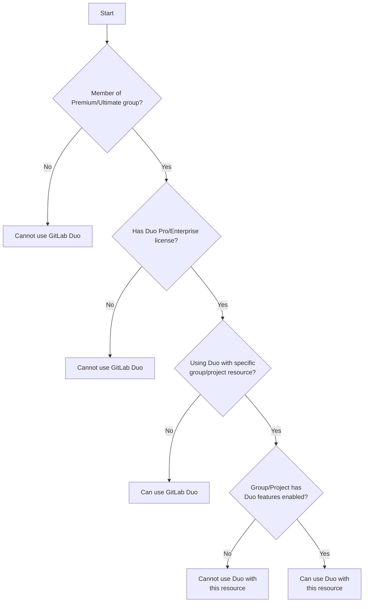
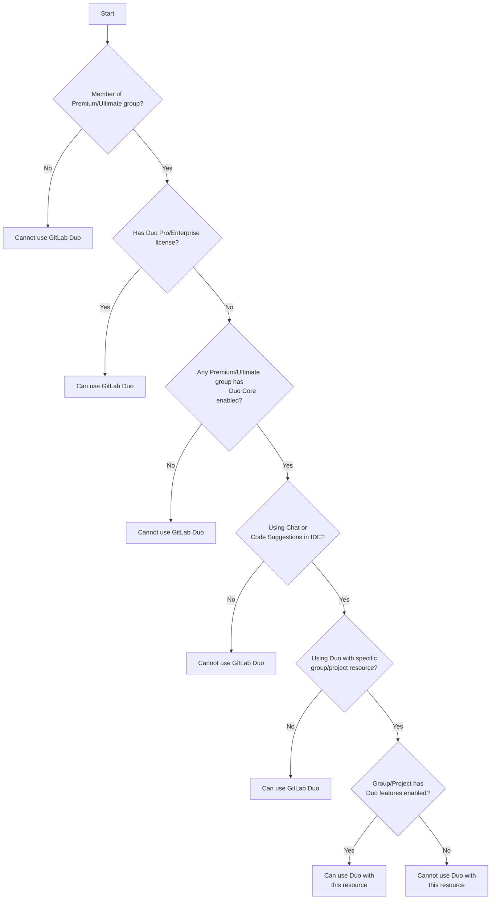
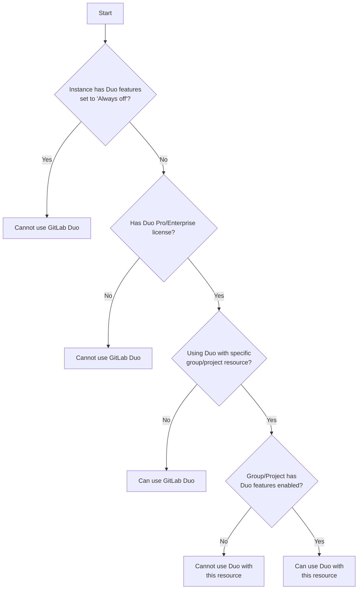
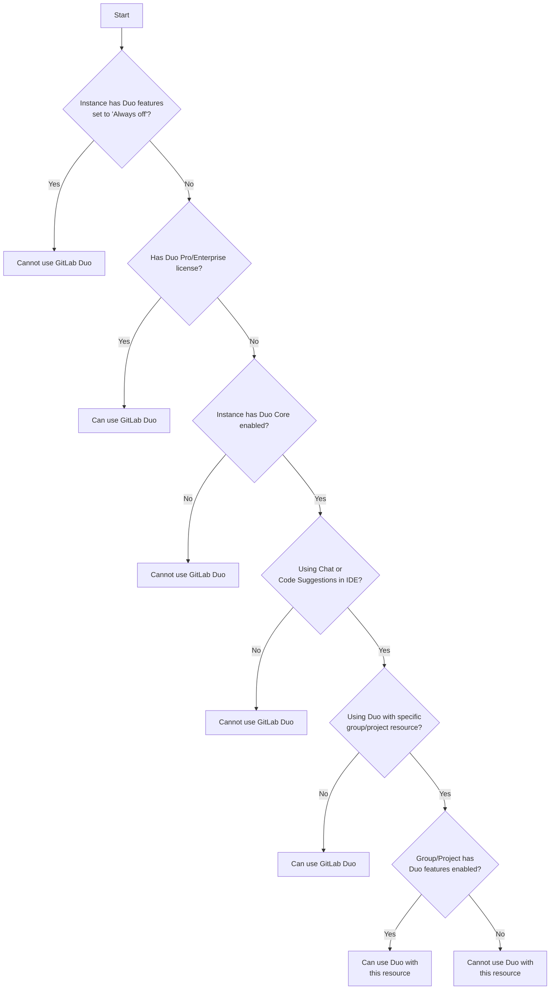

This document explains how GitLab Duo features are controlled, who can access them, and how they are configured across GitLab deployments.

## Controlling GitLab Duo Feature Availability

Various settings control when and how users can interact with GitLab Duo features. The
[end-user documentation](../../user/gitlab_duo/turn_on_off.md) explains this from a
user perspective. This document explains the implementation logic from a
developer perspective and includes technical details.

### UI Options and Database States

In the UI, the "GitLab Duo Enterprise availability" setting shows 3 options:

1. **On by default** - Features are enabled and child entities inherit this setting
1. **Off by default** - Features are disabled but can be overridden by child entities
1. **Always off** - Features are disabled and cannot be overridden by child entities

These UI options map directly to the following database states:

| UI Option | `duo_features_enabled` | `lock_duo_features_enabled` |
|-----------|------------------------|----------------------------|
| On by default | `true` | `false` |
| Off by default | `false` | `false` |
| Always off | `false` | `true` |

### Cascading Settings Implementation

The `duo_features_enabled` setting is a [cascading setting](../cascading_settings.md), which impacts how GitLab Duo features are propagated through the hierarchy.

This cascading behavior means:

1. The setting can be configured at any level: instance, group, subgroup, or project
1. For GitLab.com, the instance-wide setting is always `true`
1. Child entities can override their parent's setting. For example:
   - An instance with `duo_features_enabled: false` can have a group with `duo_features_enabled: true`
   - A group with `duo_features_enabled: true` can have a subgroup with `duo_features_enabled: false`
1. When the setting is `true` at a parent level, all child entities are reset to `true`
1. When the setting is `false` at a parent level, all child entities are reset to `false`
1. A parent entity can "lock" the setting using `lock_duo_features_enabled: true` (displayed as "Always off" in the UI)
   - When locked, child entities cannot override the parent setting
   - This effectively disables GitLab Duo features for the entire hierarchy below that point

## Feature Accessibility By Context

### Where Users Can Access GitLab Duo Features

Users with a paid GitLab Duo license (Duo Pro or Duo Enterprise) can access Chat and Code Suggestions in both the Web UI and IDE for:

1. Resources that cannot disable GitLab Duo features:
   - [Personal GitLab namespaces and projects](https://gitlab.com/gitlab-org/gitlab/-/issues/493850#note_2128888470)
   - Free tier GitLab groups and projects
   - Premium and Ultimate groups and projects without a paid GitLab Duo license

1. Resources where GitLab Duo features are enabled:
   - In GitLab Self-Managed and GitLab Dedicated: Groups or projects in an instance with a paid GitLab Duo license
   - In GitLab.com: Groups or projects in a group with a paid GitLab Duo license

### Additional IDE Access Scenarios

In the IDE environment specifically, users with a GitLab Duo license can always use Chat and Code Suggestions for:

1. Repositories without Git configuration
1. Repositories with Git configuration pointing to unknown origins (such as GitHub or other GitLab instances where the user is not authenticated)

## Platform-Specific Behavior

### GitLab.com License Assignment

On GitLab.com, a GitLab Duo license is associated with the individual user to
whom it is assigned, not the group that assigned the seat. User accounts on
GitLab.com are independent entities that belong to the entire GitLab instance
rather than being "owned" by any specific group.

#### Impact on Feature Availability

Disabling GitLab Duo features (`duo_features_enabled: false`) in a group:

- Does not revoke GitLab Duo access for group members who have GitLab Duo licenses
- Only prevents licensed users from using GitLab Duo features with resources belonging to that group

#### Example Scenario

If a user has a GitLab Duo license but belongs to a group where GitLab Duo features are set to "Always off", they can still:

- Use GitLab Duo Chat for questions about issues in free projects
- Use Code Suggestions on their personal projects
- Ask GitLab Duo Chat general coding questions or questions about GitLab
- Use GitLab Duo features with resources from other groups where GitLab Duo features are enabled

This flow diagram shows how GitLab Duo feature availability works on GitLab.com:

#### GitLab.com with Duo Core, Duo Pro, and Duo Enterprise

GitLab offers three tiers of AI functionality:

1. **Duo Core** - Basic AI capabilities
1. **Duo Pro** - Enhanced AI capabilities with more advanced features
1. **Duo Enterprise** - Comprehensive AI capabilities with additional controls and features

##### Duo Core Configuration

With the introduction of Duo Core, a new setting is available for top-level Premium and Ultimate groups.

This setting allows group owners to control Duo Core availability:

- When Duo Core is enabled ("on"): Every member of the group automatically receives a Duo Core seat
- When Duo Core is disabled ("off"): No members of the group have Duo Core seats

##### Feature Availability by License Tier

| Feature | Duo Core | Duo Pro | Duo Enterprise |
|---------|----------|---------|----------------|
| Chat | Limited to IDE | Full functionality | Full functionality |
| Code Suggestions | Availble in IDE and Web IDE | Available in IDE and Web IDE | Available in IDE and Web IDE |
| Additional AI features | Not available | Some Available | All Available |

This flow diagram shows how GitLab Duo feature availability works on GitLab.com with
Duo Core settings taken into consideration:

### Configuration Locations

#### GitLab.com Settings Pages

The following settings pages are available for configuring GitLab Duo on GitLab.com:

##### Admin Level

- `/admin/gitlab_duo`
  - Onboard GitLab Duo Agent Platform

##### Top-Level Group Settings

- `/groups/$GROUP_FULL_PATH/-/settings/gitlab_duo`
  - Assign paid GitLab Duo seats (if available)
  - Access GitLab Duo Configuration
- `/groups/$GROUP_PATH/-/settings/gitlab_duo/configuration`
  - Configure GitLab Duo availability ("On by default", "Off by default", or "Always off")
  - Enable experimental and beta GitLab Duo features

##### Subgroup Settings

- `/groups/$GROUP_FULL_PATH/-/edit`
  - Configure GitLab Duo availability for the subgroup and all its children

##### Project Settings

- `/$PROJECT_FULL_PATH/edit`
  - Under "Visibility, project features, permissions" section
  - Configure GitLab Duo availability for the specific project

### GitLab Self-Managed and Dedicated Instances

For Premium and Ultimate GitLab Self-Managed and Dedicated instances, the feature availability logic follows similar patterns as GitLab.com with one key difference:

Instance administrators have the ability to set GitLab Duo features to "Always off" at the instance level. When configured this way, all GitLab Duo features are disabled for all users across the entire instance, regardless of individual license assignments.

#### GitLab Self-Managed and Dedicated with Duo Core, Duo Pro, and Duo Enterprise

##### Instance-Wide Duo Core Configuration

For GitLab Self-Managed and Dedicated instances, Duo Core is controlled through an instance-level setting.
This setting is available to all Premium and Ultimate instances.

Instance administrators can:

- Enable Duo Core ("on") - Every user in the instance automatically receives a Duo Core seat
- Disable Duo Core ("off") - No users in the instance have Duo Core seats

##### License Tier Differences in Self-Managed and Dedicated Instances

The same feature differentiation between Duo Core, Duo Pro, and Duo Enterprise applies to self-managed and dedicated instances:

- **Duo Core**: Basic AI capabilities limited to IDE use cases and general coding assistance
- **Duo Pro**: Enhanced AI capabilities with broader feature access
- **Duo Enterprise**: Comprehensive AI capabilities with additional enterprise controls

Self-managed instances have additional configuration options for integrating with self-hosted AI models and controlling feature behavior.

This flow diagram shows how Duo feature availability works on non-GitLab.com
instances with Duo Core settings taken into consideration:

#### GitLab Self-Managed and Dedicated Settings Pages

The following settings pages are available for configuring GitLab Duo on self-managed and dedicated instances:

##### Instance Admin Settings

- `/admin/gitlab_duo`
  - Assign paid GitLab Duo seats to users
  - Access GitLab Duo Configuration
- `/admin/gitlab_duo/configuration`
  - Configure instance-wide GitLab Duo availability
  - Enable experimental and beta GitLab Duo features
  - Configure Duo Chat conversation expiration periods
  - Enable Code Suggestions direct connections
  - Enable beta AI models for self-hosted deployments
  - Configure AI logging settings
  - Set AI Gateway URL for self-hosted deployments
- `/admin/ai/duo_self_hosted`
  - Configure self-hosted AI model integrations
  - Select specific self-hosted models for different GitLab Duo features

##### Group and Subgroup Settings

- `/groups/$GROUP_FULL_PATH/-/edit`
  - Configure GitLab Duo availability for the group and all its child entities

##### Project Settings

- `/$PROJECT_FULL_PATH/edit`
  - Under "Visibility, project features, permissions" section
  - Configure GitLab Duo availability for the specific project
