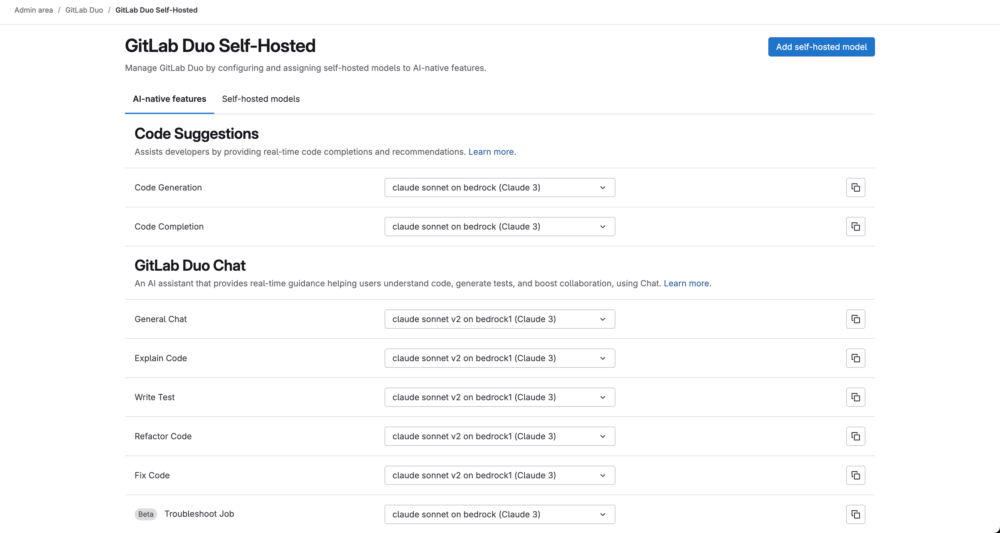

This document outlines the process for developing AI features for GitLab Duo Self-Hosted. Developing AI features for GitLab Duo Self-Hosted is quite similar to developing AI features for Duo SaaS, but there are some differences.

## Gaining access to a hosted model

The following models are currently available to GitLab team members for development purposes as of July, 2025:

- `Claude Sonnet 3.5` on AWS Bedrock
- `Claude Sonnet 3.5 v2` on AWS Bedrock
- `Claude Sonnet 3.7` on AWS Bedrock
- `Claude Sonnet 4` on AWS Bedrock
- `Claude Haiku 3.5` on AWS Bedrock
- `Llama 3.3 70b` on AWS Bedrock
- `Llama 3.1 8b` on AWS Bedrock
- `Llama 3.1 70b` on AWS Bedrock
- `Mistral Small` on Fireworks AI
- `Mixtral 8x22b` on Fireworks AI
- `Codestral 22b v0.1` on Fireworks AI
- `Llama 3.1 70b` on Fireworks AI
- `Llama 3.1 8b` on Fireworks AI
- `Llama 3.3 70b` on Fireworks AI

Development environments provide access to a limited set of models for cost optimization. The [complete model catalog](../../administration/gitlab_duo_self_hosted/supported_models_and_hardware_requirements.md#supported-models) is available in production deployments.

### Gaining access to models on Fireworks AI

To gain access to Fireworks AI, first create an [access request in the Lumos App Store](https://handbook.gitlab.com/handbook/security/corporate/systems/lumos/ar/).

Our Fireworks AI account is managed by [Code Creation Group](https://handbook.gitlab.com/handbook/engineering/ai/code-creation/). Once access is granted, navigate to `https://app.fireworks.ai/settings/users/api-keys` to create an API key.

### Gaining access to models on AWS Bedrock

To gain access to models in AWS Bedrock, create an [access request using the `aws_services_account_iam_update` template](https://gitlab.com/gitlab-com/gl-security/corp/issue-tracker/-/issues/new?description_template=aws_services_account_iam_update). See [this example access request](https://gitlab.com/gitlab-com/gl-security/corp/issue-tracker/-/issues/949) if you aren't sure what information to fill in.

Once your access request is approved, you can gain access to AWS credentials by visiting [https://gitlabsandbox.cloud/login](https://gitlabsandbox.cloud/login).

After logging into `gitlabsandbox.cloud`, perform the following steps:

1. Select the `cstm-mdls-dev-bedrock` AWS account.
1. On the upper-right corner of the page, select **View IAM Credentials**.
1. In the model that opens up, you should be able to see `AWS Console URL`, `Username` and `Password`. Visit this AWS Console URL and input the obtained username and password to sign in.

On AWS Bedrock, you must gain access to the models you want to use. To do this:

1. Visit the [AWS Model Catalog Console](https://us-east-1.console.aws.amazon.com/bedrock/home?region=us-east-1#/model-catalog).
1. Make sure your location is set to `us-east-1`.
1. From the list of models, find the model you want to use, and hover on the **Available to request** link. Then select **Request access**.
1. Complete the form to request access to the model.

Your access should be granted within a few minutes.

### Generating Access Key and Secret Key on AWS

To use AWS Bedrock models, you must generate access keys. To generate these access keys:

1. Visit the [IAM Console](https://us-east-1.console.aws.amazon.com/iam/home?region=us-east-1#/home).
1. Select the **Users** tab.
1. Select your username.
1. Select the **Security credentials** tab.
1. Select **Create access key**.
1. Select **Download .csv** to download the access keys.

Keep the access keys in a secure location. You will need them to configure the model.

Alternatively, to generate access keys on AWS, you can follow this [video on how to create access and secret keys in AWS](https://www.youtube.com/watch?v=d1e-2ToweXQ).

## Setting up your GDK environment

GitLab Duo Self-Hosted requires that your GDK environment runs on Self-Managed mode. It does not work in Multi-Tenant/SaaS mode.

To set up your GDK environment to run the GitLab Duo Self-Hosted, follow the steps in this [AI development documentation](_index.md#run-gitlabduosetup-script), under **GitLab Self-Managed / Dedicated mode**.

### Setting up Environment Variables

To use the hosted models, set the following environment variables on your AI gateway:

1. In the `GDK_ROOT/gitlab-ai-gateway/.env` file, set the following variables:

   ```plaintext
   AWS_ACCESS_KEY_ID=your-access-key-id
   AWS_SECRET_ACCESS_KEY=your-secret-access-key
   AWS_REGION=us-east-1
   FIREWORKS_AI_API_KEY=your-fireworks-api-key
   AIGW_CUSTOM_MODELS__ENABLED=true
   # useful for debugging
   AIGW_LOGGING__ENABLE_REQUEST_LOGGING=true
   AIGW_LOGGING__ENABLE_LITELLM_LOGGING=true
   ```

1. In the `GDK_ROOT/env.runit` file, set the following variables:

   ```plaintext
   export GITLAB_SIMULATE_SAAS=0
   ```

1. Seed your Duo self-hosted models using `bundle exec rake gitlab:duo:seed_self_hosted_models`.

1. Running `bundle exec rake gitlab:duo:list_self_hosted_models` should output the list of created models

1. Restart your GDK for the changes to take effect using `gdk restart`.

## Configuring the custom model in the UI

To enable the use of self-hosted models in the GitLab instance, follow these steps:

1. On your GDK instance, go to `/admin/gitlab_duo/configuration`.
1. Select the **Use beta models and features in GitLab Duo Self-Hosted** checkbox.
1. For **Local AI Gateway URL**, enter the URL of your AI gateway instance. In most cases, this will be `http://localhost:5052`.
1. Save the changes.

1. To save your changes, select **Create self-hosted model**.

- Save your changes by clicking on the `Create self-hosted model` button.

### Using the self-hosted model to power AI features

To use the created self-hosted model to power AI-native features:

1. On your GDK instance, go to `/admin/gitlab_duo/self_hosted`.
1. For each AI feature you want to use with your self-hosted model (for example, Code Generation, Code Completion, General Chat, Explain Code, and so on), select your newly created self-hosted model (for example, **Claude 3.5 Sonnet on Bedrock**) from the corresponding dropdown list.
1. Optional. To copy the configuration to all features under a specific category, select the copy icon next to it.
1. After making your selections, the changes are usually saved automatically.



With this, you have successfully configured the self-hosted model to power AI-native features in your GitLab instance. To test the feature using, for example, Chat, open Chat and say `Hello`. You should see the response powered by your self-hosted model in the chat.

### Cleaning up Duo Self-hosted

To revert to using .com configuration and remove any duo self-hosted related data, use `bundle exec rake gitlab:duo:clean_up_duo_self_hosted`.

## Moving a feature available in GitLab.com or GitLab Self-Managed to GitLab Duo Self-Hosted

To move a feature available in GitLab.com or GitLab Self-Managed to GitLab Duo Self-Hosted:

1. Make the feature configurable to use a self-hosted model.
1. Add prompts for the feature, for each model family you want to support.

### Making the feature configurable to use a self-hosted model

When a feature is available in GitLab.com or GitLab Self-Managed, it should be configurable to use a self-hosted model. To make the feature configurable to use a self-hosted model:

- Add the feature's name to `ee/app/models/ai/feature_setting.rb` as a stable feature or a beta/experimental feature.
- Add the feature's name to the `ee/lib/gitlab/ai/feature_settings/feature_metadata.yml` file, including the list of model families it supports.
- Add the unit primitive to `config/services/self_hosted_models.yml` in the [`gitlab-cloud-connector` repository](https://gitlab.com/gitlab-org/cloud-connector/gitlab-cloud-connector). This [merge request](https://gitlab.com/gitlab-org/cloud-connector/gitlab-cloud-connector/-/merge_requests/134) can be used as a reference.
- Associated spec changes based on the above changes.

Please refer to the following merge requests for reference:

- [Move Code Review Summary to Beta in Self-Hosted Duo](https://gitlab.com/gitlab-org/gitlab/-/merge_requests/186662)
- [Move Vulnerability Explanation to Beta in Self-Hosted Duo](https://gitlab.com/gitlab-org/gitlab/-/merge_requests/186500)

### Adding prompts for the feature

For each model family you want to support for the feature, you must add a prompt. Prompts are stored in the [AI Gateway repository](https://gitlab.com/gitlab-org/modelops/applied-ml/code-suggestions/ai-assist).

In most cases, the prompt that is used on GitLab.com is also used for Self-Hosted Duo.

Please refer to the following Merge Requests for reference:

- [Add prompts for Code Review Summary](https://gitlab.com/gitlab-org/modelops/applied-ml/code-suggestions/ai-assist/-/merge_requests/2260)
- [Add prompts for Vulnerability Explanation](https://gitlab.com/gitlab-org/modelops/applied-ml/code-suggestions/ai-assist/-/merge_requests/2223)

Your feature should now be available in GitLab Duo Self-Hosted. Restart your GDK instance to apply the changes and test the feature.

## Testing your feature

After implementing your AI feature, it's essential to validate its quality and effectiveness. This section outlines how to test your feature using the [Centralized Evaluation Framework (CEF)](https://gitlab.com/gitlab-org/modelops/ai-model-validation-and-research/ai-evaluation/prompt-library#centralized-evaluation-framework).

When designing your evaluation, you are responsible for selecting the most appropriate metric for your feature (for example, the percentage of responses rated 3 or 4 by an LLM judge) and setting a threshold that reflects acceptable performance. All evaluations use a standardized traffic-light scoring system:

- **Green / Fully compatible:** The results meet or exceed your defined threshold for the chosen metric.
- **Yellow / Largely compatible:** The results are close to the threshold but do not fully meet it.
- **Red / Not compatible:** The results fall significantly below the threshold.

The traffic-light system will automatically interpret your results according to these thresholds, providing a consistent classification across all AI features.

For example, to evaluate Duo Chat's performance on GitLab documentation questions, we use an LLM-based scoring system. Another language model rates each response on a 1-4 scale, and we calculate the percentage of responses that achieve scores of 3 or 4. This percentage serves as our benchmark metric for comparing the effectiveness of different LLMs, and the traffic-light system indicates the level of compatibility for each model based on the defined threshold.

The general process for testing your feature is as follows:

1. **Create a dataset:** Prepare a representative dataset that covers the scenarios your feature is expected to handle.
1. **Define evaluation metrics and thresholds:** Choose at least one metric that reflects your feature's goals and set a threshold for the traffic-light system.
1. **Automate the evaluation:** Use the [evaluation-runner](https://gitlab.com/gitlab-org/modelops/ai-model-validation-and-research/ai-evaluation/evaluation-runner) to automate running your evaluation pipeline. Refer to the evaluation-runner [README](https://gitlab.com/gitlab-org/modelops/ai-model-validation-and-research/ai-evaluation/evaluation-runner#how-to-use) for setup instructions.
1. **Review and iterate:** After running your evaluation, review the results. If the results are unsatisfactory, iterate on your prompts, dataset, or model configuration, and re-run the evaluation.

For more details, refer to the [CEF documentation](https://gitlab.com/gitlab-org/modelops/ai-model-validation-and-research/ai-evaluation/prompt-library#centralized-evaluation-framework) or this [step-by-step guide](https://gitlab.com/gitlab-org/modelops/ai-model-validation-and-research/ai-evaluation/prompt-library/-/blob/main/doc/index.md).
