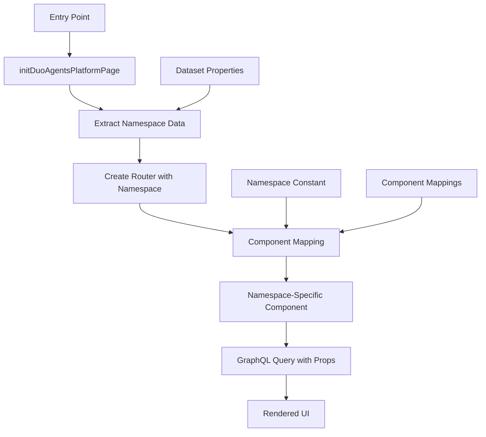

This guide explains how to work with the Duo Agent Platform.

## Overview

The Duo Agent Platform is a Single Page Application (SPA) built with Vue.js that provides a unified interface for AI-powered automation features. The platform uses a scoped routing system that allows multiple navigation items to coexist under the `/automate` path.

The platform is architected with a flexible namespace system that allows the same frontend infrastructure to be reused across different contexts (projects, groups, etc.) while providing context-specific functionality through a component mapping system.

This page is behind the feature flag `duo_workflow_in_ci`

## Namespace Architecture

The namespace system is built around a central mapping mechanism that:

1. **Checks the namespace** - Determines which context the platform is running in
1. **Maps to Vue components** - Routes to the appropriate Vue component for that namespace
1. **Passes GraphQL queries as props** - Provides namespace-specific data through dependency injection

### Entry Point

The main entry point is located at:

```markdown
ee/app/assets/javascripts/pages/projects/duo_agents_platform/index.js
```

This file imports and initializes the platform:

```javascript
import { initDuoAgentsPlatformProjectPage } from 'ee/ai/duo_agents_platform/namespace/project';

initDuoAgentsPlatformProjectPage();
```

### App Structure



## Adding a New Navigation Item

The Duo Agent Platform uses a router-driven navigation system where the Vue Router configuration directly drives the breadcrumb navigation. The key insight is that **the router structure in `ee/app/assets/javascripts/ai/duo_agents_platform/router/index.js` determines both the URL structure and the breadcrumb hierarchy**.

### How Router-Driven Navigation Works

The system works through these interconnected components:

1. **Router Structure**: Nested routes with `meta.text` properties define breadcrumb labels
1. **Breadcrumb Component**: `duo_agents_platform_breadcrumbs.vue` automatically generates breadcrumbs from matched routes
1. **Route Injection**: `injectVueAppBreadcrumbs()` in `index.js` connects the router to the breadcrumb system

#### Router Analysis

Looking at the current router structure in `ee/app/assets/javascripts/ai/duo_agents_platform/router/index.js`:

```javascript
routes: [
  {
    component: NestedRouteApp, // Simple <router-view /> wrapper
    path: '/agent-sessions',
    meta: {
      text: s__('DuoAgentsPlatform|Sessions'), // This becomes a breadcrumb
    },
    children: [
      {
        name: AGENTS_PLATFORM_INDEX_ROUTE,
        path: '', // Matches /agent-sessions exactly
        component: AgentsPlatformIndex,
      },
      {
        name: AGENTS_PLATFORM_NEW_ROUTE,
        path: 'new', // Matches /agent-sessions/new
        component: AgentsPlatformNew,
        meta: {
          text: s__('DuoAgentsPlatform|New'), // This becomes a breadcrumb
        },
      },
      // ...
    ],
  },
];
```

#### Breadcrumb Generation

The breadcrumb component (`duo_agents_platform_breadcrumbs.vue`) works by:

1. Taking all matched routes from `this.$route.matched`
1. Extracting `meta.text` from each matched route
1. Creating breadcrumb items with the text and route path
1. Combining with static breadcrumbs (like "Automate")

```javascript
// From duo_agents_platform_breadcrumbs.vue
const matchedRoutes = (this.$route?.matched || [])
  .map((route) => {
    return {
      text: route.meta?.text, // Uses meta.text for breadcrumb label
      to: { path: route.path },
    };
  })
  .filter((r) => r.text); // Only routes with meta.text become breadcrumbs
```

### Adding a New Navigation Item

To add a new top-level navigation item (like "Your Feature"), you need to add a new route tree to the router:

#### Step 1: Add Route Constants

**File**: `ee/app/assets/javascripts/ai/duo_agents_platform/router/constants.js`

```javascript
// Add route name constants for your feature
export const AGENTS_PLATFORM_YOUR_FEATURE_INDEX = 'your_feature_index';
export const AGENTS_PLATFORM_YOUR_FEATURE_NEW = 'your_feature_new';
export const AGENTS_PLATFORM_YOUR_FEATURE_SHOW = 'your_feature_show';
```

#### Step 2: Add Routes to Router

**File**: `ee/app/assets/javascripts/ai/duo_agents_platform/router/index.js`

```javascript
import YourFeatureIndex from '../pages/your_feature/your_feature_index.vue';
import YourFeatureNew from '../pages/your_feature/your_feature_new.vue';
import YourFeatureShow from '../pages/your_feature/your_feature_show.vue';

export const createRouter = (base, namespace) => {
  return new VueRouter({
    base,
    mode: 'history',
    routes: [
      // Existing agent-sessions routes
      {
        component: NestedRouteApp,
        path: '/agent-sessions',
        meta: {
          text: s__('DuoAgentsPlatform|Sessions'),
        },
        children: [
          {
            name: AGENTS_PLATFORM_INDEX_ROUTE,
            path: '',
            component: getNamespaceIndexComponent(namespace),
          },
          // ... existing children
        ],
      },

      // NEW: Your feature routes
      {
        component: NestedRouteApp,
        path: '/your-feature', // This becomes the URL path
        meta: {
          text: s__('DuoAgentsPlatform|Your Feature'), // This becomes the breadcrumb
        },
        children: [
          {
            name: AGENTS_PLATFORM_YOUR_FEATURE_INDEX,
            path: '', // Matches /your-feature exactly
            component: YourFeatureIndex,
          },
          {
            name: AGENTS_PLATFORM_YOUR_FEATURE_NEW,
            path: 'new', // Matches /your-feature/new
            component: YourFeatureNew,
            meta: {
              text: s__('DuoAgentsPlatform|New'), // Breadcrumb: "Your Feature > New"
            },
          },
          {
            name: AGENTS_PLATFORM_YOUR_FEATURE_SHOW,
            path: ':id(\\d+)', // Matches /your-feature/123
            component: YourFeatureShow,
            // No meta.text - will use route param as breadcrumb
          },
        ],
      },

      { path: '*', redirect: '/agent-sessions' },
    ],
  });
};
```

#### Step 3: Add Backend Route (if needed)

The existing wildcard route in `ee/config/routes/project.rb` should handle your new paths:

```ruby
scope :automate do
  get '/(*vueroute)' => 'duo_agents_platform#show', as: :automate, format: false
end
```

**Important**: If you're adding a sidebar menu item (Step 4), you must add a named route helper:

```ruby
scope :automate do
  get '/(*vueroute)' => 'duo_agents_platform#show', as: :automate, format: false
  # Named routes for sidebar menu helpers
  get 'agent-sessions', to: 'duo_agents_platform#show', as: :automate_agent_sessions, format: false
  get 'your-feature', to: 'duo_agents_platform#show', as: :automate_your_features, format: false
end
```

**Note**: Use plural form for the route name (e.g., `automate_your_features`) to match the existing pattern and ensure the Rails path helper is generated correctly.

#### Step 4: Add Sidebar Menu Item

**File**: `ee/lib/sidebars/projects/super_sidebar_menus/duo_agents_menu.rb`

Add the menu item to the `configure_menu_items` method and create the corresponding menu item method:

```ruby
override :configure_menu_items
def configure_menu_items
  return false unless Feature.enabled?(:duo_workflow_in_ci, context.current_user)

  add_item(duo_agents_runs_menu_item)
  add_item(duo_agents_your_feature_menu_item)  # Add your new menu item
  true
end

private

def duo_agents_your_feature_menu_item
  ::Sidebars::MenuItem.new(
    title: s_('Your Feature'),
    link: project_automate_your_features_path(context.project),  # Note: plural 'features'
    active_routes: { controller: :duo_agents_platform },
    item_id: :agents_your_feature
  )
end
```

#### Step 5: Create Vue Components

**File**: `ee/app/assets/javascripts/ai/duo_agents_platform/pages/your_feature/your_feature_index.vue`

```vue
<script>
export default {
  name: 'YourFeatureIndex',
};
</script>

<template>
  <div>
    <h1>Your Feature</h1>
  </div>
</template>
```

## Adding New Namespaces

To add a new namespace (e.g., for groups):

### 1. Define the Namespace Constant

```javascript
// ee/app/assets/javascripts/ai/duo_agents_platform/constants.js
export const AGENT_PLATFORM_GROUP_PAGE = 'group';
```

### 2. Create Namespace Directory Structure

```markdown
ee/app/assets/javascripts/ai/duo_agents_platform/namespace/group/
├── index.js
├── group_agents_platform_index.vue
└── graphql/
    └── queries/
        └── get_group_agent_flows.query.graphql
```

### 3. Implement Namespace Initialization

```javascript
// ee/app/assets/javascripts/ai/duo_agents_platform/namespace/group/index.js
import { initDuoAgentsPlatformPage } from '../../index';
import { AGENT_PLATFORM_GROUP_PAGE } from '../../constants';

export const initDuoAgentsPlatformGroupPage = () => {
  initDuoAgentsPlatformPage({
    namespace: AGENT_PLATFORM_GROUP_PAGE,
    namespaceDatasetProperties: ['groupPath', 'groupId'],
  });
};
```

### 4. Create Namespace-Specific Component

```vue
<!-- ee/app/assets/javascripts/ai/duo_agents_platform/namespace/group/group_agents_platform_index.vue -->
<script>
import getGroupAgentFlows from './graphql/queries/get_group_agent_flows.query.graphql';
import DuoAgentsPlatformIndex from '../../pages/index/duo_agents_platform_index.vue';

export default {
  components: { DuoAgentsPlatformIndex },
  inject: ['groupPath'], // Group-specific injection
  apollo: {
    workflows: {
      query: getGroupAgentFlows, // Group-specific query
      variables() {
        return {
          groupPath: this.groupPath,
          // ...
        };
      },
      // ...
    },
  },
};
</script>

<template>
  <duo-agents-platform-index
    :is-loading-workflows="isLoadingWorkflows"
    :workflows="workflows"
    :workflows-page-info="workflowsPageInfo"
    :workflow-query="$apollo.queries.workflows"
  />
</template>
```

### 5. Update Component Mappings

```javascript
// ee/app/assets/javascripts/ai/duo_agents_platform/router/utils.js
import { AGENT_PLATFORM_PROJECT_PAGE, AGENT_PLATFORM_GROUP_PAGE } from '../constants';
import ProjectAgentsPlatformIndex from '../namespace/project/project_agents_platform_index.vue';
import GroupAgentsPlatformIndex from '../namespace/group/group_agents_platform_index.vue';

export const getNamespaceIndexComponent = (namespace) => {
  const componentMappings = {
    [AGENT_PLATFORM_PROJECT_PAGE]: ProjectAgentsPlatformIndex,
    [AGENT_PLATFORM_GROUP_PAGE]: GroupAgentsPlatformIndex, // New mapping
  };

  return componentMappings[namespace];
};
```

### 6. Create Entry Point

```javascript
// ee/app/assets/javascripts/pages/groups/duo_agents_platform/index.js
import { initDuoAgentsPlatformGroupPage } from 'ee/ai/duo_agents_platform/namespace/group';

initDuoAgentsPlatformGroupPage();
```

## Benefits of This Architecture

1. **Code Reuse**: The same frontend infrastructure works across different contexts
1. **Separation of Concerns**: Each namespace handles its own data fetching and business logic
1. **Scalability**: Easy to add new namespaces without modifying existing code
1. **Type Safety**: Clear contracts through namespace constants and required properties
1. **Maintainability**: Isolated namespace implementations reduce coupling

### Key Implementation Details

#### Router-Driven Breadcrumbs

The breadcrumb system automatically generates navigation from the router structure:

- **Parent routes** with `meta.text` become breadcrumb segments
- **Child routes** with `meta.text` extend the breadcrumb chain
- **Routes without `meta.text`** use route parameters (like `:id`) as breadcrumb text
- **Static breadcrumbs** (like "Automate") are prepended to all routes

#### URL Structure

Each top-level navigation item gets its own URL namespace:

- Sessions: `/automate/agent-sessions`, `/automate/agent-sessions/new`, `/automate/agent-sessions/123`
- Your Feature: `/automate/your-feature`, `/automate/your-feature/new`, `/automate/your-feature/456`

#### Nested Route Pattern

The platform uses a consistent nested route pattern:

1. **Parent route**: Defines the URL path and top-level breadcrumb
1. **NestedRouteApp component**: Simple `<router-view />` wrapper for child routes
1. **Child routes**: Define specific pages and additional breadcrumb segments

### Example: Current Agent Sessions Implementation

The existing agent sessions feature demonstrates this pattern:

```javascript
{
  component: NestedRouteApp,           // Renders child routes
  path: '/agent-sessions',             // URL: /automate/agent-sessions
  meta: {
    text: s__('DuoAgentsPlatform|Sessions'),  // Breadcrumb: "Sessions"
  },
  children: [
    {
      name: AGENTS_PLATFORM_INDEX_ROUTE,
      path: '',                        // URL: /automate/agent-sessions
      component: AgentsPlatformIndex,  // No additional breadcrumb
    },
    {
      name: AGENTS_PLATFORM_NEW_ROUTE,
      path: 'new',                     // URL: /automate/agent-sessions/new
      component: AgentsPlatformNew,
      meta: {
        text: s__('DuoAgentsPlatform|New'),  // Breadcrumb: "Sessions > New"
      },
    },
    {
      name: AGENTS_PLATFORM_SHOW_ROUTE,
      path: ':id(\\d+)',               // URL: /automate/agent-sessions/123
      component: AgentsPlatformShow,   // Breadcrumb: "Sessions > 123"
      // No meta.text - uses :id parameter as breadcrumb
    },
  ],
}
```

This creates the breadcrumb hierarchy:

- `/automate/agent-sessions` → "Automate > Sessions"
- `/automate/agent-sessions/new` → "Automate > Sessions > New"
- `/automate/agent-sessions/123` → "Automate > Sessions > 123"

## Key Files Reference

- **Entry Point**: `ee/app/assets/javascripts/pages/projects/duo_agents_platform/index.js`
- **Main Initialization**: `ee/app/assets/javascripts/ai/duo_agents_platform/index.js`
- **Router**: `ee/app/assets/javascripts/ai/duo_agents_platform/router/index.js`
- **Component Mapping**: `ee/app/assets/javascripts/ai/duo_agents_platform/router/utils.js`
- **Constants**: `ee/app/assets/javascripts/ai/duo_agents_platform/constants.js`
- **Utilities**: `ee/app/assets/javascripts/ai/duo_agents_platform/utils.js`
- **Project Namespace**: `ee/app/assets/javascripts/ai/duo_agents_platform/namespace/project/`

## Best Practices

1. **Router Structure**: Use nested routes with `meta.text` properties to define breadcrumb hierarchy
1. **URL Naming**: Use kebab-case for URL paths (`/your-feature`, not `/yourFeature`)
1. **Route Names**: Use descriptive constants for route names (`AGENTS_PLATFORM_YOUR_FEATURE_INDEX`)
1. **Component Organization**: Place feature components in `pages/[feature]/` directories
1. **Breadcrumb Text**: Use internationalized strings (`s__()`) for all `meta.text` values
1. **Consistent Patterns**: Follow the existing nested route pattern with `NestedRouteApp`
1. **Namespace Separation**: Keep namespace-specific logic in dedicated directories under `namespace/`
1. **Component Mapping**: Use the component mapping system to route to namespace-specific components
1. **Data Injection**: Use Vue's provide/inject pattern for namespace-specific data

## Troubleshooting

### Common Issues

1. **Breadcrumbs not showing**: Ensure parent routes have `meta.text` properties
1. **Routes not working**: Check that the wildcard route in `ee/config/routes/project.rb` exists
1. **Sidebar not highlighting**: Verify the sidebar menu item has correct `active_routes`
1. **404 errors**: Ensure your route paths don't conflict with existing routes

### Debugging Tips

1. **Vue DevTools**: Inspect `$route.matched` to see which routes are being matched
1. **Router State**: Check the router configuration in the Vue DevTools
1. **Breadcrumb Debug**: Add `console.log(this.$route.matched)` in the breadcrumb component
1. **URL Testing**: Test routes directly by navigating to URLs in the browser

## Generating fake flows

To generate fake flows to test out the platform, you can run
`ee/lib/tasks/gitlab/duo_workflow/duo_workflow.rake` Rake task.

Example to make 50 flows, 20 made by the specified user in specific project

```shell
bundle exec rake "gitlab:duo_workflow:populate[50,20,user@example.com,gitlab-org/gitlab-test]
```
