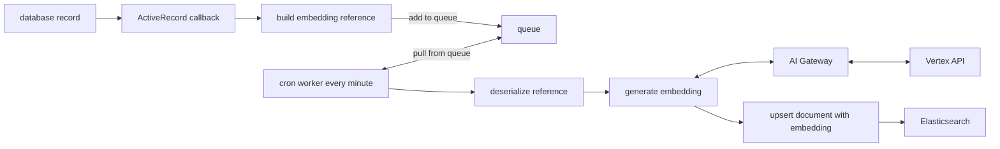
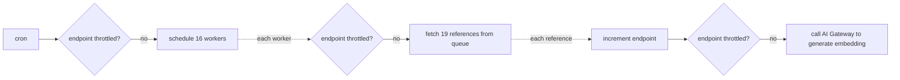

# Embeddings

Embeddings are a way of representing data in a vectorised format, making it easy and efficient to find similar documents.

Currently embeddings are only generated for issues which allows for features such as

- [Issue search](https://gitlab.com/gitlab-org/gitlab/-/issues/440424)
- [Find similar issues](https://gitlab.com/gitlab-org/gitlab/-/issues/407385)
- [Find duplicate issues](https://gitlab.com/gitlab-org/gitlab/-/issues/407385)
- [Find similar/related issues for Zendesk tickets](https://gitlab.com/gitlab-org/gitlab/-/issues/411847)
- [Auto-Categorize Service Desk issues](https://gitlab.com/gitlab-org/gitlab/-/issues/409646)

## Architecture

Embeddings are stored in Elasticsearch which is also used for [Advanced Search](../advanced_search.md).

The process is driven by `Search::Elastic::ProcessEmbeddingBookkeepingService` which adds and pulls from a Redis queue.

### Adding to the embedding queue

The following process description uses issues as an example.

An issue embedding is generated from the content `"issue with title '#{issue.title}' and description '#{issue.description}'"`.

Using ActiveRecord callbacks defined in [`Search::Elastic::IssuesSearch`](https://gitlab.com/gitlab-org/gitlab/-/blob/master/ee/app/models/concerns/search/elastic/issues_search.rb), an [embedding reference](https://gitlab.com/gitlab-org/gitlab/-/blob/master/ee/lib/search/elastic/references/embedding.rb) is added to the embedding queue if it is created or if the title or description is updated and if [embedding generation is available](https://gitlab.com/gitlab-org/gitlab/-/blob/master/ee/app/models/concerns/search/elastic/issues_search.rb#L38-47) for the issue.

### Pulling from the embedding queue

A `Search::ElasticIndexEmbeddingBulkCronWorker` cron worker runs every minute and does the following:

Therefore we always make sure that we don't exceed the rate limit setting of 450 embeddings per minute even with 16 concurrent processes generating embeddings at the same time.

### Backfilling

An [Advanced Search migration](../search/advanced_search_migration_styleguide.md) is used to perform the backfill. It essentially adds references to the queue in batches which are then processed by the cron worker as described above.

## Adding a new embedding type

The following process outlines the steps to get embeddings generated and stored in Elasticsearch.

1. Do a cost and resource calculation to see if the Elasticsearch cluster can handle embedding generation or if it needs additional resources.
1. Decide where to store embeddings. Look at the [existing indices in Elasticsearch](../../integration/advanced_search/elasticsearch.md#advanced-search-index-scopes) and if there isn't a suitable existing index, [create a new index](../advanced_search.md#add-a-new-document-type-to-elasticsearch).
1. Add embedding fields to the index: [example](https://gitlab.com/gitlab-org/gitlab/-/merge_requests/149209).
1. Update the way [content](https://gitlab.com/gitlab-org/gitlab/-/blob/master/ee/lib/search/elastic/references/embedding.rb#L75-77) is generated to accommodate the new type.
1. Add a new unit primitive: [here](https://gitlab.com/gitlab-org/modelops/applied-ml/code-suggestions/ai-assist/-/merge_requests/918) and [here](https://gitlab.com/gitlab-org/gitlab/-/merge_requests/155835).
1. Use `Elastic::ApplicationVersionedSearch` to access callbacks and add the necessary checks for when to generate embeddings. See [`Search::Elastic::IssuesSearch`](https://gitlab.com/gitlab-org/gitlab/-/blob/master/ee/app/models/concerns/search/elastic/issues_search.rb) for an example.
1. Backfill embeddings: [example](https://gitlab.com/gitlab-org/gitlab/-/merge_requests/154940).
