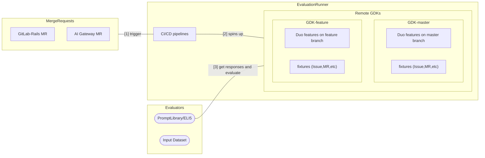

Evaluation runner (`evaluation-runner`) allows GitLab employees to run evaluations on specific GitLab AI features with one click.

- You can run the evaluation on GitLab.com and GitLab-supported self-hosted models.
- To view the AI features that are currently supported, see
  [Evaluation pipelines](https://gitlab.com/gitlab-org/modelops/ai-model-validation-and-research/ai-evaluation/evaluation-runner#evaluation-pipelines).

Evaluation runner spins up a new GDK instance on a remote environment, runs an evaluation, and reports the result.

For more details, view the
[`evaluation-runner` repository](https://gitlab.com/gitlab-org/modelops/ai-model-validation-and-research/ai-evaluation/evaluation-runner).

## Architecture

