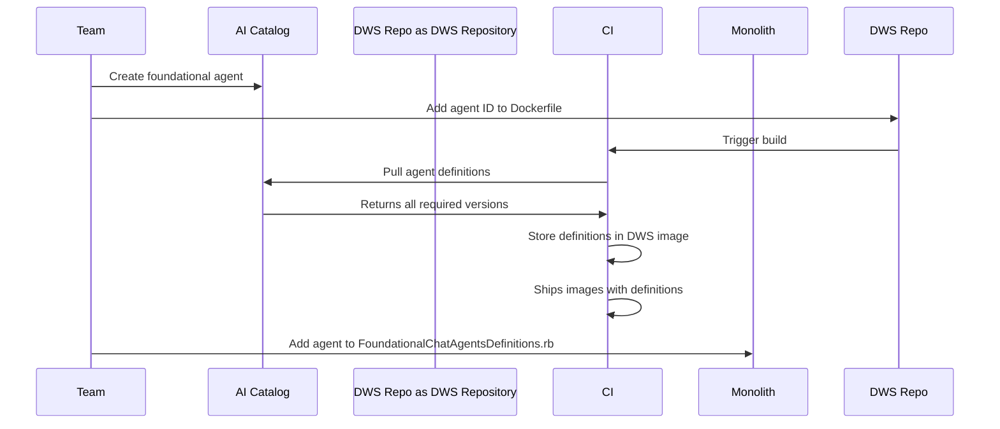
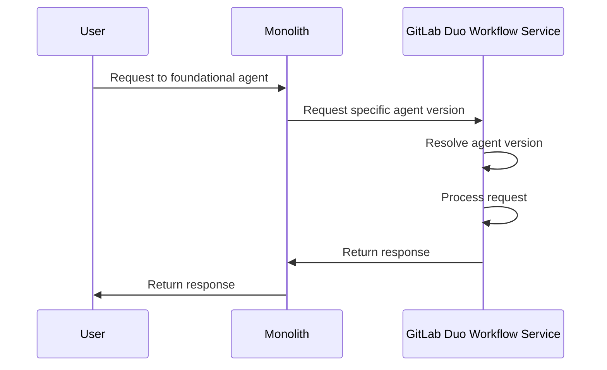

[Foundational agents](../../user/duo_agent_platform/agents/foundational_agents/_index.md) are specialized agents
that are created and maintained by GitLab, providing more accurate responses for specific use cases. These agents are
available by default on any place chat and GitLab Duo chat are available, including groups, and are supported on GitLab Duo Self-Hosted.

## Create a foundational agent

There are two ways of creating a foundational agent, using the AI Catalog or GitLab Duo Workflow Service. AI Catalog provides
a user-friendly interface, and it is the preferred approach, but writing a definition on GitLab Duo Workflow Service provides
more flexibility for complex cases.

### Using the AI catalog

1. Create your agent on the [AI Catalog](https://gitlab.com/explore/ai-catalog/agents/), and note its ID. Make sure the agent is set to
   public. Example: [Planner Agent](https://gitlab.com/explore/ai-catalog/agents/356/) has ID 356.

1. Agents created on the AI Catalog need to be bundled into GitLab Duo Workflow Service, so they can be available to self-hosted
   setups that do not have access to our SaaS. To achieve this, open an MR to GitLab Duo Workflow Service adding the ID of the
   agent:

   ```diff
   # https://gitlab.com/gitlab-org/modelops/applied-ml/code-suggestions/ai-assist/-/blob/main/Dockerfile
   - RUN poetry run fetch-foundational-agents "https://gitlab.com" "$GITLAB_TOKEN" "348" \
   + RUN poetry run fetch-foundational-agents "https://gitlab.com" "$GITLAB_TOKEN" "duo_planner:348,<agent-reference>:<agent-catalog-id>" \
   ```

   The command above can also be executed locally for testing purposes. Agent reference must be lowercase without spaces (example: 'test_agent').

1. To make the agent be selectable, add it to the [`FoundationalChatAgentsDefinitions.rb`](https://gitlab.com/gitlab-org/gitlab/blob/master/ee/lib/ai/foundational_chat_agents_definitions.rb).
   Use the reference used in the Dockerfile:

   ```ruby
   {
     id: 3,
     reference: '<agent-reference>',
     version: 'experimental',
     name: 'Test Agent',
     description: "An agent for testing"
   }
   ```

1. Update [user facing documentation](../../user/duo_agent_platform/agents/foundational_agents/_index.md).

### Using GitLab Duo Workflow Service

1. Create a flow configuration file in `/duo_workflow_service/agent_platform/v1/flows/configs/` (located either on your GDK under `PATH-TO-YOUR-GDK/gdk/gitlab-ai-gateway` or on the [ai-assist repository](https://gitlab.com/gitlab-org/modelops/applied-ml/code-suggestions/ai-assist/-/tree/main/duo_workflow_service/agent_platform/v1/flows/configs/)):

   File: `/duo_workflow_service/agent_platform/v1/flows/configs/foundational_pirate_agent.yml`

   ```yaml
   version: "v1"
   environment: chat-partial
   components:
     - name: "foundational_pirate_agent"
       type: AgentComponent
       prompt_id: "foundational_pirate_agent_prompt"
       inputs:
         - from: "context:goal"
           as: "goal"
         - from: "context:project_id"
           as: "project_id"
       toolset: []
       ui_log_events: []
   prompts:
     - name: Foundational Pirate Agent
       prompt_id: "foundational_pirate_agent_prompt"
       model:
         params:
           model_class_provider: anthropic
           max_tokens: 2_000
       prompt_template:
         system: |
           You are a seasoned pirate from the Golden Age of Piracy. You speak exclusively in pirate dialect, using nautical
           terms, pirate slang, and colorful seafaring expressions. Transform any input into authentic pirate speak while
           maintaining the original meaning. Use terms like 'ahoy', 'matey', 'ye', 'aye', 'landlubber', 'scallywag',
           'doubloons', 'plunder', etc. Add pirate exclamations like 'Arrr!', 'Shiver me timbers!', and 'Yo ho ho!' where
           appropriate. Refer to yourself in the first person as a pirate would.
         user: |
           {{goal}}
         placeholder: history
   routers: []
   flow:
     entry_point: "foundational_pirate_agent"
   ```

1. Add your agent definition to [FoundationalChatAgentsDefinitions.rb](https://gitlab.com/gitlab-org/gitlab/blob/master/ee/lib/ai/foundational_chat_agents_definitions.rb):

   ```ruby
   # frozen_string_literal: true

   module Ai
     module FoundationalChatAgentsDefinitions
       extend ActiveSupport::Concern

       ITEMS = [
         {
           id: 1,
           reference: 'chat',
           version: '',
           name: 'GitLab Duo Agent',
           description: "GitLab Duo is your general development assistant"
         },
         {
           id: 2,
           reference: 'foundational_pirate_agent',
           version: 'v1',
           name: 'Foundational Pirate Agent',
           description: "A most important agent that speaks like a pirate"
         }
       ].freeze
     end
   end
   ```

1. Update [user facing documentation](../../user/duo_agent_platform/agents/foundational_agents/_index.md).

Tips:

1. You can use the AI Catalog to test foundational agents, even before you add them to the codebase.
   Create a new private agent in the AI Catalog with the same prompt and same tools, and enable it on your test project.
   Once results reach desired levels, add to GitLab Duo Workflow Service.
1. Add prompts to the GitLab Duo Workflow Service to enable testing the agent in your local GDK.
1. When using AI catalog, the version field of an agent in `FoundationalChatAgentsDefinitions.rb` should be `experimental`.
   When creating the definition in GitLab Duo Workflow Service, the version should be `v1`.

## Use feature flags for releasing chat agents

Control the release of new foundational agents with feature flags:

```ruby
# ee/app/graphql/resolvers/ai/foundational_chat_agents_resolver.rb

  def resolve(*, project_id: nil, namespace_id: nil)
    project = GitlabSchema.find_by_gid(project_id)

    filtered_agents = []
    filtered_agents << 'foundational_pirate_agent' if Feature.disabled?(:my_feature_flag, project)
    # filtered_agents << 'foundational_pirate_agent' if Feature.disabled?(:my_feature_flag, current_user)

    ::Ai::FoundationalChatAgent
 .select {|agent| filtered_agents.exclude?(agent.reference) }
      .sort_by(&:id)
  end
```

This also allows making a foundational agent available to a specific tier.

## Scoping

Not every agent is useful in every area. For example, some agents operate in projects, while others are more useful or have more capabilities in groups. Scoping is not supported. See [issue 577395](https://gitlab.com/gitlab-org/gitlab/-/issues/577395).

## Triggers

Triggers are not supported for foundational chat agents. However, if they are defined on AI Catalog, users can
still add it to their project at which point they can be used through triggers.

## Versioning

Versioning of agents is not yet supported. Consider potential breaking changes to older GitLab versions
before doing changes to an agent.

## Local testing

It is possible to test the setup locally.

1. For AI catalog created agents, you need to sync the agents locally. To do so, either create the agent in the local AI
   Catalog or on GitLab.com AI Catalog. Then, on `$GDK/gitlab-ai-gateway`, run the following command:

   ```shell
   poetry run fetch-foundational-agents "http://gdk.test:3000 or https://gitlab.com" "<token-to-your-local-gdk>" \
     "<agent-reference>:<agent-id-in-local-catalog>" \
     --output-path duo_workflow_service/agent_platform/experimental/flows/configs
   ```

1. Restart GitLab Duo Workflow Service.

   ```shell
   gdk restart duo-workflow-service
   ```

1. With the changes to `FoundationalChatAgentsDefinitions.rb`, you can now select your foundational agent in the web chat locally.

## Architecture design

[Foundational Chat Agents](../../development/ai_features/glossary.md#agent-types) are developed by GitLab and must be available to all GitLab deployments (GitLab.com, Self-Managed, and Dedicated).

The architecture of how Foundational Agents are made available avoids connecting to AI Catalog to fetch definitions at runtime and allows GitLab engineering teams full control over when they are released.

This design could also be extended to support
[Foundational flows](../../development/ai_features/glossary.md#flow-types).

### Foundational Agents in Monolith

Defining foundational agents in the monolith serves two purposes: backwards compatibility support and release control.

With [`FoundationalChatAgentsDefinitions`](https://gitlab.com/gitlab-org/gitlab/blob/master/ee/lib/ai/foundational_chat_agents_definitions.rb)
The [`FoundationalChatAgentsDefinitions`](https://gitlab.com/gitlab-org/gitlab/blob/master/ee/lib/ai/foundational_chat_agents_definitions.rb)
module manages agent versioning based on the GitLab instance version.
affecting older GitLab versions, similar to [prompt versioning](https://handbook.gitlab.com/handbook/engineering/architecture/design-documents/prompts_migration/#versioning).

Additionally, on [`FoundationalChatAgentsResolver`](https://gitlab.com/gitlab-org/gitlab/blob/master/ee/app/graphql/resolvers/ai/foundational_chat_agents_resolver.rb),
teams are able to select which conditions can make a foundational chat agent available, for situations like:

- does the user have Ultimate,
- is the feature flag enabled,
- is the agent SaaS exclusive

If we relied exclusively on AI Catalog or Duo Workflow Service, such flexibility wouldn't be possible

#### Version resolution

Agent versions are resolved based on the `version` field in `FoundationalChatAgentsDefinitions.rb`,
which maps to a
folder in GitLab Duo Workflow Service (for example, `v1`, `experimental`).

In the future, [version resolution will be based on semantic versioning](https://gitlab.com/gitlab-org/modelops/applied-ml/code-suggestions/ai-assist/-/issues/1577).
This will allow:

- **Patch and minor updates** (bug fixes, performance improvements, prompt refinements) to be shipped to existing
  GitLab versions without requiring a GitLab instance update
- **Major version releases** for breaking changes that require new GitLab features (such as new tools, API changes,
  or schema modifications) to be shipped only to compatible GitLab versions

This approach ensures backward compatibility while enabling continuous improvement of foundational agents.

### Bundling into GitLab Duo Workflow Service

Bundling agents into GitLab Duo Workflow Service makes agents defined in AI Catalog available on all deployments,
including self-hosted setups.
[With semantic versioning support](https://gitlab.com/gitlab-org/modelops/applied-ml/code-suggestions/ai-assist/-/issues/1577),
the latest version of each major release will be bundled,
along with specific pinned versions of each foundational
agent.

The alternative to this would be to ship the YAML definitions themselves as part of GitLab monolith,
but that comes with
the downside of not being able to quickly ship fixes to cloud-connected self-managed instances.

Eventually, if labels are implemented on AI Catalog,
teams wouldn't need to add their entries to the Dockerfile, versions
could be fetched by the correct labels.

### Creation flow



### Usage flow



The execution flows are the same whether the user is using a local monolith, GitLab SaaS,
the cloud-connected DWS or a
local installation of DWS.
