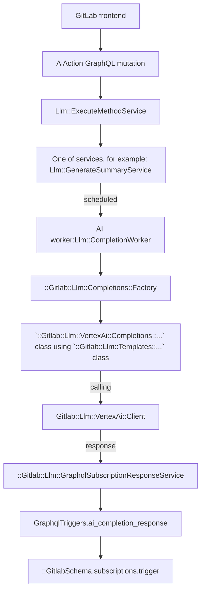

# AI features based on 3rd-party integrations

## Instructions for setting up GitLab Duo features in the local development environment

### Required: Install AI Gateway

**Why:** Certain AI operations are provided by AI Gateway only, such as text completion, embedding and semantic search.

**How:**
Follow [these instructions](https://gitlab.com/gitlab-org/gitlab-development-kit/-/blob/main/doc/howto/gitlab_ai_gateway.md#install)
to install the AI Gateway with GDK.

### Required: Setup Google Cloud Platform in AI Gateway

**Why:** You may not be able to boot AI Gateway if Google Cloud Platform
credentials isn't correctly setup because AI Gateway checks the access at boot
time.

**How:**

1. Set up a Google Cloud project
   1. Option 1 (recommended for GitLab team members): use the existing
      `ai-enablement-dev-69497ba7`) Google Cloud project.
      Using the existing project is recommended because this project has Vertex
      APIs and Vertex AI Search already enabled.
      Also, all GitLab team members should already have access to this project.
      Visit the [Google Cloud console](https://console.cloud.google.com) to
      confirm that you already have access.
   1. Option 2: Create a sandbox Google Cloud project by following the instructions
      in [the handbook](https://handbook.gitlab.com/handbook/infrastructure-standards/#individual-environment).
      If you are using an individual Google Cloud project, you may also need to
      enable the Vertex AI API:
      1. Visit [welcome page](https://console.cloud.google.com/welcome), choose
         your project (for example: `jdoe-5d23dpe`).
      1. Go to **APIs & Services > Enabled APIs & services**.
      1. Select **Enable APIs and Services**.
      1. Search for `Vertex AI API`.
      1. Select **Vertex AI API**, then select **Enable**.
1. Install the [`gcloud` CLI](https://cloud.google.com/sdk/docs/install)
   1. If you already use [`asdf`](https://asdf-vm.com/) for runtime version
      management, you can install `gcloud` with the
      [`asdf gcloud` plugin](https://github.com/jthegedus/asdf-gcloud)
1. Authenticate locally with Google Cloud using the
   [`gcloud auth application-default login`](https://cloud.google.com/sdk/gcloud/reference/auth/application-default/login) command.

    NOTE:
    This command tries to find a quota project from gcloud's context
    and write it to ADC(Application Default Credentials)
    so that Google client libraries can use it for billing and quota.
    To be able to use a project as the quota project, the account in
    ADC must have the `serviceusage.services.use` permission on the project.
    If you don't have a project with this permission and you always want to
    bill the project owning the resources,
    you can disable the quota project and authenticate using
    `gcloud auth application-default login --disable-quota-project` command.
1. Update the [application settings file](https://gitlab.com/gitlab-org/modelops/applied-ml/code-suggestions/ai-assist/-/blob/main/docs/application_settings.md) in AI Gateway:

   ```shell
   # <GDK-root>/gitlab-ai-gateway/.env

   # PROJECT_ID = "ai-enablement-dev-69497ba7" for GitLab team members with access
   # to the shared project

   # PROJECT_ID = "your-google-cloud-project-name" for those with their own sandbox
   # Google Cloud project.

   AIGW_GOOGLE_CLOUD_PLATFORM__PROJECT='PROJECT_ID'
   ```

### Required: Setup Anthropic in the AI Gateway

**Why:** some GitLab Duo features use Anthropic models.

**How:**
After filling out an
[access request](https://gitlab.com/gitlab-com/team-member-epics/access-requests/-/issues/new?issuable_template=AI_Access_Request),
you can sign up for an Anthropic account and
[create an API key](https://docs.anthropic.com/en/docs/getting-access-to-claude).

Update the [application settings file](https://gitlab.com/gitlab-org/modelops/applied-ml/code-suggestions/ai-assist/-/blob/main/docs/application_settings.md) in AI Gateway:

```shell
# <GDK-root>/gitlab-ai-gateway/.env

ANTHROPIC_API_KEY='<your-anthropic-api-key>'
```

### Required: Setup AI Gateway endpoint in GitLab-Rails

**Why:** Your need to tell your local GitLab instance to talk to your local AI
Gateway. Otherwise, it tries to talk to the production AI Gateway
(`cloud.gitlab.com`), which results in an authentication error.

**How:**

Update following variable in the `env.runit` file in your GDK root:

```shell
# <GDK-root>/env.runit

export AI_GATEWAY_URL=http://0.0.0.0:5052
```

By default, the above URL works as-is.

You can also change it to a different URL by updating the [application settings file](https://gitlab.com/gitlab-org/modelops/applied-ml/code-suggestions/ai-assist/-/blob/main/docs/application_settings.md) in AI Gateway:

```shell
# <GDK-root>/gitlab-ai-gateway/.env

AIGW_FASTAPI__API_HOST=0.0.0.0
AIGW_FASTAPI__API_PORT=5052
```

To check if your monolith is using correct AI Gateway, please visit `http://<your-gdk-url>/help/instance_configuration#ai_gateway_url`
page.

### Required: Setup Licenses in GitLab-Rails

**Why:** GitLab Duo is available to Premium and Ultimate customers only. You
likely want an Ultimate license for your GDK. Ultimate gets you access to
all GitLab Duo features.

**How:**

Follow [the process to obtain an EE license](https://handbook.gitlab.com/handbook/developer-onboarding/#working-on-gitlab-ee-developer-licenses)
for your local instance and [upload the license](../../administration/license_file.md).

To verify that the license is applied, go to **Admin Area** > **Subscription**
and check the subscription plan.

### Required: Enable feature flags in GitLab-Rails

**Why:** some GitLab Duo functionality is behind a feature flag.

**How:**

Enable all feature flags maintained by "group::ai framework" by running this command in your `/gitlab` directory:

```shell
bundle exec rake gitlab:duo:enable_feature_flags
```

### Recommended: Run GDK in SaaS mode and enable AI features for a test group

**Why:** By default, GDK runs GitLab as a self-managed instance. But, the Duo
licensing setup for self-managed is more complex than it is for GitLab.com. If
the feature you are working on available on GitLab.com, you should
run GDK in "SaaS" mode so that you can skip the
[customersDot setup](#option-2-use-your-customersdot-instance-as-a-provider).

**How:** the following should be set in the `env.runit` file in your GDK root:

```shell
# <GDK-root>/env.runit

export GITLAB_SIMULATE_SAAS=1
```

Run `gdk restart rails` after you update the file so that the value
is picked up by your local instance.

If you are running GDK in SaaS mode, you also need to enable Duo
features for at least one group. To do this, run this command in your `/gitlab` directory:

```shell
GITLAB_SIMULATE_SAAS=1 RAILS_ENV=development bundle exec rake 'gitlab:duo:setup[<test-group-name>]'
```

Replace `<test-group-name>` with the name of any top-level group. If the
group doesn't exist, it creates a new one. You might need to
re-run the script multiple times; it prints error messages with links
on how to resolve the error.

Membership to a group with Duo features enabled is what enables many AI
features. To enable AI feature access locally, make sure that your test user is
a member of the group with Duo features enabled.

Finally, you must clear the GitLab-Rails Redis cache. User access to GitLab Duo
features in SaaS mode is cached in Redis. This cache expires every 60 minutes.
A manual cache-clearing ensures that you can use Duo features immediately:

```shell
bundle exec rake cache:clear
```

**Troubleshooting:** If you have problems with your setup at this point, double-check your admin settings. When GDK is running, go to admin settings (Navigation -> Admin), then go to general settings (Settings -> General), and expand the "Account and limit" section. Scroll to the bottom of this section to make sure the setting "Allow use of licensed EE features" is toggled on.

### Recommended: Test clients in Rails console

**Why:** you've completed all of the setup steps, now it's time to confirm that
GitLab Duo is actually working.

**How:**

After the setup is complete, you can test clients in GitLab-Rails to see if it can
correctly reach to AI Gateway:

1. Run `gdk start`.
1. Login to Rails console with `gdk rails console`.
1. Talk to a model:

  ```ruby
  # Talk to Anthropic model
  Gitlab::Llm::Anthropic::Client.new(User.first, unit_primitive: 'duo_chat').complete(prompt: "\n\nHuman: Hi, How are you?\n\nAssistant:")

  # Talk to Vertex AI model
  Gitlab::Llm::VertexAi::Client.new(User.first, unit_primitive: 'documentation_search').text_embeddings(content: "How can I create an issue?")

  # Test `/v1/chat/agent` endpoint
  Gitlab::Llm::Chain::Requests::AiGateway.new(User.first).request(prompt: [{role: "user", content: "Hi, how are you?"}])
  ```

NOTE:
See [this doc](../cloud_connector/index.md) for registering unit primitives in Cloud Connector.

### Optional: Enable logging in AI Gateway

**Why:** Logging makes it easier to debug any issues with GitLab Duo requests.

**How:**

Update the [application settings file](https://gitlab.com/gitlab-org/modelops/applied-ml/code-suggestions/ai-assist/-/blob/main/docs/application_settings.md) in AI Gateway:

```shell
# <GDK-root>/gitlab-ai-gateway/.env

AIGW_LOGGING__LEVEL=debug
AIGW_LOGGING__FORMAT_JSON=false
AIGW_LOGGING__TO_FILE='./ai-gateway.log'
```

For example, you can watch the log file with the following command when in the
`gitlab-ai-gateway` directory:

```shell
tail -f ai-gateway.log | fblog -a prefix -a suffix -a current_file_name -a suggestion -a language -a input -a parameters -a score -a exception
```

### Optional: Enable authentication and authorization in AI Gateway

**Why:** The AI Gateway has [authentication and authorization](https://gitlab.com/gitlab-org/modelops/applied-ml/code-suggestions/ai-assist/-/blob/main/docs/auth.md)
flow to verify if clients have permission to access the features. Auth is
enforced in any live environments hosted by GitLab infra team. You may want to
test this flow in your local development environment.

NOTE:
In development environments (for example: GDK), this process is disabled by default.

To enable authorization checks, set `AIGW_AUTH__BYPASS_EXTERNAL` to `false` in the
[application setting file](https://gitlab.com/gitlab-org/modelops/applied-ml/code-suggestions/ai-assist/-/blob/main/docs/application_settings.md)
(`<GDK-root>/gitlab-ai-gateway/.env`) in AI Gateway.

#### Option 1: Use your GitLab instance as a provider

**Why:** this is the simplest method of testing authentication and reflects our setup on GitLab.com.

**How:**
Assuming that you are running the [AI Gateway with GDK](#required-install-ai-gateway),
apply the following configuration to GDK:

```shell
# <GDK-root>/env.runit

export GITLAB_SIMULATE_SAAS=1
```

Update the [application settings file](https://gitlab.com/gitlab-org/modelops/applied-ml/code-suggestions/ai-assist/-/blob/main/docs/application_settings.md) in AI Gateway:

```shell
# <GDK-root>/gitlab-ai-gateway/.env

AIGW_AUTH__BYPASS_EXTERNAL=false
AIGW_GITLAB_URL=<your-gdk-url>
```

and `gdk restart`.

#### Option 2: Use your customersDot instance as a provider

**Why**: CustomersDot setup is required when you want to test or update functionality
related to [cloud licensing](https://about.gitlab.com/pricing/licensing-faq/cloud-licensing/)
or if you are running GDK in non-SaaS mode.

NOTE:
This setup is challenging. There is [an issue](https://gitlab.com/gitlab-org/gitlab/-/issues/463341)
for discussing how to make it easier to test the customersDot integration locally.
Until that is addressed, this setup process is time consuming and should be
avoided if possible.

If you need to get customersDot working for your local GitLab Rails instance for
any reason, reach out to `#s_fulfillment_engineering` in Slack. For questions around the integration of CDot with other systems to deliver AI use cases, reach out to `#g_cloud_connector`.
assistance.

### Help

- [Here's how to reach us!](https://handbook.gitlab.com/handbook/engineering/development/data-science/ai-powered/ai-framework/#-how-to-reach-us)
- View [guidelines](duo_chat.md) for working with GitLab Duo Chat.

## Tips for local development

1. When responses are taking too long to appear in the user interface, consider
   restarting Sidekiq by running `gdk restart rails-background-jobs`. If that
   doesn't work, try `gdk kill` and then `gdk start`.
1. Alternatively, bypass Sidekiq entirely and run the service synchronously.
   This can help with debugging errors as GraphQL errors are now available in
  the network inspector instead of the Sidekiq logs. To do that, temporarily alter
  the `perform_for` method in `Llm::CompletionWorker` class by changing
  `perform_async` to `perform_inline`.

## Feature development (Abstraction Layer)

### Feature flags

Apply the following feature flags to any AI feature work:

- A general flag (`ai_duo_chat_switch`) that applies to all GitLab Duo Chat features. It's enabled by default.
- A general flag (`ai_global_switch`) that applies to all other AI features. It's enabled by default.
- A flag specific to that feature. The feature flag name [must be different](../feature_flags/index.md#feature-flags-for-licensed-features) than the licensed feature name.

See the [feature flag tracker epic](https://gitlab.com/groups/gitlab-org/-/epics/10524) for the list of all feature flags and how to use them.

### GraphQL API

To connect to the AI provider API using the Abstraction Layer, use an extendable
GraphQL API called [`aiAction`](https://gitlab.com/gitlab-org/gitlab/blob/master/ee/app/graphql/mutations/ai/action.rb).
The `input` accepts key/value pairs, where the `key` is the action that needs to
be performed. We only allow one AI action per mutation request.

Example of a mutation:

```graphql
mutation {
  aiAction(input: {summarizeComments: {resourceId: "gid://gitlab/Issue/52"}}) {
    clientMutationId
  }
}
```

As an example, assume we want to build an "explain code" action. To do this, we extend the `input` with a new key,
`explainCode`. The mutation would look like this:

```graphql
mutation {
  aiAction(
    input: {
      explainCode: { resourceId: "gid://gitlab/MergeRequest/52", code: "foo() { console.log() }" }
    }
  ) {
    clientMutationId
  }
}
```

The GraphQL API then uses the [Anthropic Client](https://gitlab.com/gitlab-org/gitlab/-/blob/master/ee/lib/gitlab/llm/anthropic/client.rb)
to send the response.

#### How to receive a response

The API requests to AI providers are handled in a background job. We therefore do not keep the request alive and the Frontend needs to match the request to the response from the subscription.

WARNING:
Determining the right response to a request can cause problems when only `userId` and `resourceId` are used. For example, when two AI features use the same `userId` and `resourceId` both subscriptions will receive the response from each other. To prevent this interference, we introduced the `clientSubscriptionId`.

To match a response on the `aiCompletionResponse` subscription, you can provide a `clientSubscriptionId` to the `aiAction` mutation.

- The `clientSubscriptionId` should be unique per feature and within a page to not interfere with other AI features. We recommend to use a `UUID`.
- Only when the `clientSubscriptionId` is provided as part of the `aiAction` mutation, it will be used for broadcasting the `aiCompletionResponse`.
- If the `clientSubscriptionId` is not provided, only `userId` and `resourceId` are used for the `aiCompletionResponse`.

As an example mutation for summarizing comments, we provide a `randomId` as part of the mutation:

```graphql
mutation {
  aiAction(
    input: {
      summarizeComments: { resourceId: "gid://gitlab/Issue/52" }
      clientSubscriptionId: "randomId"
    }
  ) {
    clientMutationId
  }
}
```

In our component, we then listen on the `aiCompletionResponse` using the `userId`, `resourceId` and `clientSubscriptionId` (`"randomId"`):

```graphql
subscription aiCompletionResponse(
  $userId: UserID
  $resourceId: AiModelID
  $clientSubscriptionId: String
) {
  aiCompletionResponse(
    userId: $userId
    resourceId: $resourceId
    clientSubscriptionId: $clientSubscriptionId
  ) {
    content
    errors
  }
}
```

The [subscription for chat](duo_chat.md#graphql-subscription) behaves differently.

To not have many concurrent subscriptions, you should also only subscribe to the subscription once the mutation is sent by using [`skip()`](https://apollo.vuejs.org/guide-option/subscriptions.html#skipping-the-subscription).

#### Current abstraction layer flow

The following graph uses VertexAI as an example. You can use different providers.



## How to implement a new action

### Register a new method

Go to the `Llm::ExecuteMethodService` and add a new method with the new service class you will create.

```ruby
class ExecuteMethodService < BaseService
  METHODS = {
    # ...
    amazing_new_ai_feature: Llm::AmazingNewAiFeatureService
  }.freeze
```

### Create a Service

1. Create a new service under `ee/app/services/llm/` and inherit it from the `BaseService`.
1. The `resource` is the object we want to act on. It can be any object that includes the `Ai::Model` concern. For example it could be a `Project`, `MergeRequest`, or `Issue`.

```ruby
# ee/app/services/llm/amazing_new_ai_feature_service.rb

module Llm
  class AmazingNewAiFeatureService < BaseService
    private

    def perform
      ::Llm::CompletionWorker.perform_async(user.id, resource.id, resource.class.name, :amazing_new_ai_feature)
      success
    end

    def valid?
      super && Ability.allowed?(user, :amazing_new_ai_feature, resource)
    end
  end
end
```

### Authorization in GitLab-Rails

We recommend to use [policies](../policies.md) to deal with authorization for a feature. Currently we need to make sure to cover the following checks:

1. For GitLab Duo Chat feature, `ai_duo_chat_switch` is enabled.
1. For other general AI features, `ai_global_switch` is enabled.
1. Feature specific feature flag is enabled.
1. The namespace has the required license for the feature.
1. User is a member of the group/project.
1. `experiment_features_enabled` settings are set on the `Namespace`.

For our example, we need to implement the `allowed?(:amazing_new_ai_feature)` call. As an example, you can look at the [Issue Policy for the summarize comments feature](https://gitlab.com/gitlab-org/gitlab/-/blob/master/ee/app/policies/ee/issue_policy.rb). In our example case, we want to implement the feature for Issues as well:

```ruby
# ee/app/policies/ee/issue_policy.rb

module EE
  module IssuePolicy
    extend ActiveSupport::Concern
    prepended do
      with_scope :global
      condition(:ai_available) do
        ::Feature.enabled?(:ai_global_switch, type: :ops)
      end

      with_scope :subject
      condition(:amazing_new_ai_feature_enabled) do
        ::Feature.enabled?(:amazing_new_ai_feature, subject_container) &&
          subject_container.licensed_feature_available?(:amazing_new_ai_feature)
      end

      rule do
        ai_available & amazing_new_ai_feature_enabled & is_project_member
      end.enable :amazing_new_ai_feature
    end
  end
end
```

NOTE:
See [this section](#optional-enable-authentication-and-authorization-in-ai-gateway) about authentication and authorization in AI Gateway.

### Pairing requests with responses

Because multiple users' requests can be processed in parallel, when receiving responses,
it can be difficult to pair a response with its original request. The `requestId`
field can be used for this purpose, because both the request and response are assured
to have the same `requestId` UUID.

### Caching

AI requests and responses can be cached. Cached conversation is being used to
display user interaction with AI features. In the current implementation, this cache
is not used to skip consecutive calls to the AI service when a user repeats
their requests.

```graphql
query {
  aiMessages {
    nodes {
      id
      requestId
      content
      role
      errors
      timestamp
    }
  }
}
```

This cache is especially useful for chat functionality. For other services,
caching is disabled. You can enable this for a service by using the
`cache_response: true` option.

Caching has following limitations:

- Messages are stored in Redis stream.
- There is a single stream of messages per user. This means that all services
  currently share the same cache. If needed, this could be extended to multiple
  streams per user (after checking with the infrastructure team that Redis can handle
  the estimated amount of messages).
- Only the last 50 messages (requests + responses) are kept.
- Expiration time of the stream is 3 days since adding last message.
- User can access only their own messages. There is no authorization on the caching
  level, and any authorization (if accessed by not current user) is expected on
  the service layer.

### Check if feature is allowed for this resource based on namespace settings

There is one setting allowed on root namespace level that restrict the use of AI features:

- `experiment_features_enabled`

To check if that feature is allowed for a given namespace, call:

```ruby
Gitlab::Llm::StageCheck.available?(namespace, :name_of_the_feature)
```

Add the name of the feature to the `Gitlab::Llm::StageCheck` class. There are
arrays there that differentiate between experimental and beta features.

This way we are ready for the following different cases:

- If the feature is not in any array, the check will return `true`. For example, the feature was moved to GA.

To move the feature from the experimental phase to the beta phase, move the name of the feature from the `EXPERIMENTAL_FEATURES` array to the `BETA_FEATURES` array.

### Implement calls to AI APIs and the prompts

The `CompletionWorker` will call the `Completions::Factory` which will initialize the Service and execute the actual call to the API.
In our example, we will use VertexAI and implement two new classes:

```ruby
# /ee/lib/gitlab/llm/vertex_ai/completions/amazing_new_ai_feature.rb

module Gitlab
  module Llm
    module VertexAi
      module Completions
        class AmazingNewAiFeature < Gitlab::Llm::Completions::Base
          def execute
            prompt = ai_prompt_class.new(options[:user_input]).to_prompt

            response = Gitlab::Llm::VertexAi::Client.new(user, unit_primitive: 'amazing_feature').text(content: prompt)

            response_modifier = ::Gitlab::Llm::VertexAi::ResponseModifiers::Predictions.new(response)

            ::Gitlab::Llm::GraphqlSubscriptionResponseService.new(
              user, nil, response_modifier, options: response_options
            ).execute
          end
        end
      end
    end
  end
end
```

```ruby
# /ee/lib/gitlab/llm/vertex_ai/templates/amazing_new_ai_feature.rb

module Gitlab
  module Llm
    module VertexAi
      module Templates
        class AmazingNewAiFeature
          def initialize(user_input)
            @user_input = user_input
          end

          def to_prompt
            <<~PROMPT
            You are an assistant that writes code for the following context:

            context: #{user_input}
            PROMPT
          end
        end
      end
    end
  end
end
```

Because we support multiple AI providers, you may also use those providers for the same example:

```ruby
Gitlab::Llm::VertexAi::Client.new(user, unit_primitive: 'your_feature')
Gitlab::Llm::Anthropic::Client.new(user, unit_primitive: 'your_feature')
```

### Add AI Action to GraphQL

TODO

## Monitoring

- Error ratio and response latency apdex for each Ai action can be found on [Sidekiq Service dashboard](https://dashboards.gitlab.net/d/sidekiq-main/sidekiq-overview?orgId=1) under **SLI Detail: `llm_completion`**.
- Spent tokens, usage of each Ai feature and other statistics can be found on [periscope dashboard](https://app.periscopedata.com/app/gitlab/1137231/Ai-Features).
- [AI Gateway logs](https://log.gprd.gitlab.net/app/r/s/zKEel).
- [AI Gateway metrics](https://dashboards.gitlab.net/d/ai-gateway-main/ai-gateway3a-overview?orgId=1).
- [Feature usage dashboard via proxy](https://log.gprd.gitlab.net/app/r/s/egybF).

## Security

Refer to the [secure coding guidelines for Artificial Intelligence (AI) features](../secure_coding_guidelines.md#artificial-intelligence-ai-features).
