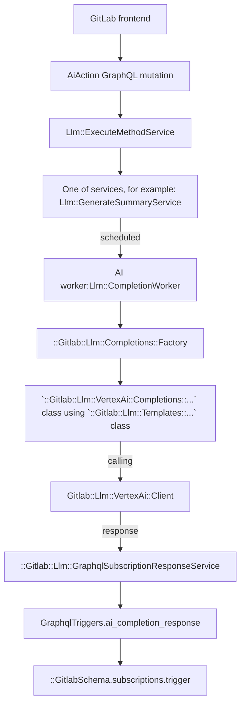

# AI features based on 3rd-party integrations

[Introduced](https://gitlab.com/gitlab-org/gitlab/-/merge_requests/117296) in GitLab 15.11.

## Get started

### Access 

#### GCP Vertex

In order to obtain a GCP service key for local development, follow the steps below:

- Create a sandbox GCP project by visiting [this page](https://handbook.gitlab.com/handbook/infrastructure-standards/#individual-environment) and following the instructions, or by requesting access to our existing group GCP project by using [this template](https://gitlab.com/gitlab-com/it/infra/issue-tracker/-/issues/new?issuable_template=gcp_group_account_iam_update_request).
- If you are using an individual GCP project, you may also need to enable the Vertex AI API:
  1. Visit [welcome page](https://console.cloud.google.com/welcome), choose your project (e.g. jdoe-5d23dpe).
  1. Go to **APIs & Services > Enabled APIs & services**.
  1. Select **+ Enable APIs and Services**.
  1. Search for `Vertex AI API`.
  1. Select **Vertex AI API**, then select **Enable**.
- Install the [`gcloud` CLI](https://cloud.google.com/sdk/docs/install)
- Authenticate locally with GCP using the [`gcloud auth application-default login`](https://cloud.google.com/sdk/gcloud/reference/auth/application-default/login) command.
- Open the Rails console. Update the settings to:

```ruby
# PROJECT_ID = "your-gcp-project-name"

Gitlab::CurrentSettings.update(vertex_ai_project: PROJECT_ID)
```

#### Anthropic

[After filling out an access request](https://gitlab.com/gitlab-com/team-member-epics/access-requests/-/issues/new?issuable_template=AI_Access_Request), you can sign up for an Anthropic account and create an API key. You will then configure it:

```ruby
Gitlab::CurrentSettings.update!(anthropic_api_key: <insert API key>)
```

### Local setup

> - [Introduced](https://gitlab.com/groups/gitlab-org/-/epics/11251) in GitLab 16.8.

In order to develop an AI feature that is compatible with both SaaS and Self-managed GitLab instances,
the feature must request to the [AI Gateway](../../architecture/blueprints/ai_gateway/index.md) instead of directly requesting to the 3rd party model providers.

1. Setup CustomersDot (optional, not required for Chat feature):
   1. Install CustomersDot: [internal video tutorial](https://youtu.be/_8wOMa_yGSw)
      - This video loosely follows [official installation steps](https://gitlab.com/gitlab-org/customers-gitlab-com/-/blob/main/doc/setup/installation_steps.md)
      - It also offers guidance on how to create a self-managed subscription. You will receive a *cloud activation code* in return.
        - Bookmark [this link](http://localhost:5000/subscriptions/new?plan_id=2c92c0f976d721ed0176db74d74f4fd4&test=capabilities) for creating Ultimate Self-Managed Subscription locally.
        - A list of other subscription plan ids are available [here](https://gitlab.com/gitlab-org/customers-gitlab-com/-/blob/main/doc/flows/buy_subscription.md).
1. Setup GitLab Development Kit (GDK): [internal video tutorial](https://youtu.be/rudS6KeQHcA)
   1. [Install it](https://gitlab.com/gitlab-org/gitlab-development-kit#installation) as a separate GDK instance.
   1. Run `gdk config set license.customer_portal_url 'http://localhost:5000'`
   1. [Set up `gdk.test` hostname](https://gitlab.com/gitlab-org/gitlab-development-kit/-/blob/main/doc/howto/local_network.md#local-interface).
   1. Follow [Instruct your local CustomersDot instance to use the GitLab application](https://gitlab.com/gitlab-org/customers-gitlab-com/-/blob/main/doc/setup/installation_steps.md#instruct-your-local-customersdot-instance-to-use-the-gitlab-application) if you installed CustomersDot.
   1. Activate GitLab Enterprise license
       - To test Self Managed instances, follow [Cloud Activation steps](../../administration/license.md#activate-gitlab-ee) using the cloud activation code you received earlier.
       - To test SaaS, follow [Activate GitLab Enterprise license](https://gitlab.com/gitlab-org/gitlab-development-kit/-/blob/main/doc/index.md#use-gitlab-enterprise-features) with your license file.
   1. Export these environment variables in the same terminal session with `gdk start`:
      - Note that you can also configure your terminal always export the environment variables (e.g. adding the exports to `~/.bash_profile` or `~/.zshrc`).

      ```shell
      export AI_GATEWAY_URL=http://0.0.0.0:5052 # URL to the local AI Gateway instance
      export LLM_DEBUG=1                        # Enable debug logging
      ```

      Alternatively, you can create an `env.runit` file in the root of your GDK with the above snippet.
   1. Enable all AI feature flags:

     ```shell
     rake gitlab:duo:enable_feature_flags
     ```

1. Set up AI Gateway: [internal video tutorial](https://youtu.be/ePoHqvw78oQ)
    1. [Install it](https://gitlab.com/gitlab-org/modelops/applied-ml/code-suggestions/ai-assist/-/blob/main/README.md#how-to-run-the-server-locally).
    1. Verify AI feature by calling the following in the rails console:

```ruby
Gitlab::Llm::AiGateway::Client.new(User.first).stream(prompt: "\n\nHuman: Hi, how are you?\n\nAssistant:")
```

#### Verify the setup with GraphQL

1. Visit [GraphQL explorer](../../api/graphql/index.md#interactive-graphql-explorer).
1. Execute the `aiAction` mutation. Here is an example:

   ```graphql
   mutation {
     aiAction(
       input: {
         chat: {
           resourceId: "gid://gitlab/User/1",
           content: "Hello"
         }
       }
     ){
       requestId
       errors
     }
   }
   ```

1. (GitLab Duo Chat only) Execute the following query to fetch the response:

   ```graphql
   query {
     aiMessages {
       nodes {
         requestId
         content
         role
         timestamp
         chunkId
         errors
       }
     }
   }
   ```

   If you can't fetch the response, check `graphql_json.log`, `sidekiq_json.log`, `llm.log` or `modelgateway_debug.log` if it contains error information.

### SaaS-only features

These features do not use the AI Gateway and instead reach out to the LLM provider directly because they are not yet following the [architecture blueprint](../../architecture/blueprints/ai_gateway/index.md). [We are planning on](https://gitlab.com/groups/gitlab-org/-/epics/13024) moving these features to our self managed offering, so any features developed under this setup will be migrated over time.

**Automated setup**

Replace`<test-group-name>` with the group name you want to enable GitLab Duo features.
If the group doesn't exist, it creates a new one.
You might need to re-run the script multiple times,
it will print useful error messages with links to the docs on how to resolve the error.

```shell
GITLAB_SIMULATE_SAAS=1 RAILS_ENV=development bundle exec rake 'gitlab:duo:setup[<test-group-name>]'
```

**Manual way**

1. Ensure you have followed [the process to obtain an EE license](https://handbook.gitlab.com/handbook/developer-onboarding/#working-on-gitlab-ee-developer-licenses) for your local instance and you applied Ultimate license.
   1. To verify that the license is applied go to **Admin Area** > **Subscription** and check the subscription plan.
1. Allow use of EE features for your instance.
   1. Go to **Admin Area > Settings > General**.
   1. Expand the **Account and limit** section.
   1. Enable **Allow use of licensed EE features**.
1. Simulate the GDK to [simulate SaaS](../ee_features.md#simulate-a-saas-instance).
1. Ensure the group you want to test has an Ultimate license.
   1. Go to **Admin Area > Overview > Groups**.
   1. Select **Edit** for your chosen group.
   1. Go to **Permissions and group features**.
   1. Choose *Ultimate* from the **Plan** list.
1. Enable `Experiment & Beta features` for your group.
   1. Go to the group with the Ultimate license.
   1. Select **Settings > General**.
   1. Expand the **Permissions and group features** section.
   1. Enable **Experiment & Beta features**.
1. Enable the specific feature flag for the feature you want to test.
1. You can use Rake task `rake gitlab:duo:enable_feature_flags` to enable all feature flags that are assigned to group AI Framework.
1. Setup [AI Gateway](#local-setup).

### Bypass AI Gateway

NOTE:
You need to set up AI Gateway since GitLab 16.8.
It's a recommended way to test AI features. Sending requests directly to LLMs could lead to unnoticed bugs.
Use this workaround with caution. 

To set up direct requests to LLMs you have to:

1. Disable the feature flag.

     ```shell
     echo "Feature.disable(:gitlab_duo_chat_requests_to_ai_gateway)" | rails c
     ```

### Help

- [Here's how to reach us!](https://handbook.gitlab.com/handbook/engineering/development/data-science/ai-powered/ai-framework/#-how-to-reach-us)

## Feature development (Abstraction Layer)

### Feature flags

Apply the following feature flags to any AI feature work:

- A general flag (`ai_duo_chat_switch`) that applies to all GitLab Duo Chat features. It's enabled by default.
- A general flag (`ai_global_switch`) that applies to all other AI features. It's enabled by default.
- A flag specific to that feature. The feature flag name [must be different](../feature_flags/index.md#feature-flags-for-licensed-features) than the licensed feature name.

See the [feature flag tracker epic](https://gitlab.com/groups/gitlab-org/-/epics/10524) for the list of all feature flags and how to use them.

### Experimental REST API

Use the [experimental REST API endpoints](https://gitlab.com/gitlab-org/gitlab/-/blob/master/ee/lib/api/ai/experimentation) to quickly experiment and prototype AI features.

The endpoints are:

- `https://gitlab.example.com/api/v4/ai/experimentation/anthropic/complete`
- `https://gitlab.example.com/api/v4/ai/experimentation/vertex/chat`

These endpoints are only for prototyping, not for rolling features out to customers.

In your local development environment, you can experiment with these endpoints locally with the feature flag enabled:

```ruby
Feature.enable(:ai_experimentation_api)
```

On production, the experimental endpoints are only available to GitLab team members. Use a
[GitLab API token](../../user/profile/personal_access_tokens.md) to authenticate.

### GraphQL API

To connect to the AI provider API using the Abstraction Layer, use an extendable GraphQL API called
[`aiAction`](https://gitlab.com/gitlab-org/gitlab/blob/master/ee/app/graphql/mutations/ai/action.rb).
The `input` accepts key/value pairs, where the `key` is the action that needs to be performed.
We only allow one AI action per mutation request.

Example of a mutation:

```graphql
mutation {
  aiAction(input: {summarizeComments: {resourceId: "gid://gitlab/Issue/52"}}) {
    clientMutationId
  }
}
```

As an example, assume we want to build an "explain code" action. To do this, we extend the `input` with a new key,
`explainCode`. The mutation would look like this:

```graphql
mutation {
  aiAction(input: {explainCode: {resourceId: "gid://gitlab/MergeRequest/52", code: "foo() { console.log() }" }}) {
    clientMutationId
  }
}
```

The GraphQL API then uses the [Anthropic Client](https://gitlab.com/gitlab-org/gitlab/-/blob/master/ee/lib/gitlab/llm/anthropic/client.rb)
to send the response.

#### How to receive a response

The API requests to AI providers are handled in a background job. We therefore do not keep the request alive and the Frontend needs to match the request to the response from the subscription.

WARNING:
Determining the right response to a request can cause problems when only `userId` and `resourceId` are used. For example, when two AI features use the same `userId` and `resourceId` both subscriptions will receive the response from each other. To prevent this interference, we introduced the `clientSubscriptionId`.

To match a response on the `aiCompletionResponse` subscription, you can provide a `clientSubscriptionId` to the `aiAction` mutation.

- The `clientSubscriptionId` should be unique per feature and within a page to not interfere with other AI features. We recommend to use a `UUID`.
- Only when the `clientSubscriptionId` is provided as part of the `aiAction` mutation, it will be used for broadcasting the `aiCompletionResponse`.
- If the `clientSubscriptionId` is not provided, only `userId` and `resourceId` are used for the `aiCompletionResponse`.

As an example mutation for summarizing comments, we provide a `randomId` as part of the mutation:

```graphql
mutation {
  aiAction(input: {summarizeComments: {resourceId: "gid://gitlab/Issue/52"}, clientSubscriptionId: "randomId"}) {
    clientMutationId
  }
}
```

In our component, we then listen on the `aiCompletionResponse` using the `userId`, `resourceId` and `clientSubscriptionId` (`"randomId"`):

```graphql
subscription aiCompletionResponse($userId: UserID, $resourceId: AiModelID, $clientSubscriptionId: String) {
  aiCompletionResponse(userId: $userId, resourceId: $resourceId, clientSubscriptionId: $clientSubscriptionId) {
    content
    errors
  }
}
```

Note that the [subscription for chat](duo_chat.md#graphql-subscription) behaves differently.

To not have many concurrent subscriptions, you should also only subscribe to the subscription once the mutation is sent by using [`skip()`](https://apollo.vuejs.org/guide-option/subscriptions.html#skipping-the-subscription).

#### Current abstraction layer flow

The following graph uses VertexAI as an example. You can use different providers.



## How to implement a new action

### Register a new method

Go to the `Llm::ExecuteMethodService` and add a new method with the new service class you will create.

```ruby
class ExecuteMethodService < BaseService
  METHODS = {
    # ...
    amazing_new_ai_feature: Llm::AmazingNewAiFeatureService
  }.freeze
```

### Create a Service

1. Create a new service under `ee/app/services/llm/` and inherit it from the `BaseService`.
1. The `resource` is the object we want to act on. It can be any object that includes the `Ai::Model` concern. For example it could be a `Project`, `MergeRequest`, or `Issue`.

```ruby
# ee/app/services/llm/amazing_new_ai_feature_service.rb

module Llm
  class AmazingNewAiFeatureService < BaseService
    private

    def perform
      ::Llm::CompletionWorker.perform_async(user.id, resource.id, resource.class.name, :amazing_new_ai_feature)
      success
    end

    def valid?
      super && Ability.allowed?(user, :amazing_new_ai_feature, resource)
    end
  end
end
```

### Authorization

We recommend to use [policies](../policies.md) to deal with authorization for a feature. Currently we need to make sure to cover the following checks:

1. For GitLab Duo Chat feature, `ai_duo_chat_switch` is enabled
1. For other general AI features, `ai_global_switch` is enabled
1. Feature specific feature flag is enabled
1. The namespace has the required license for the feature
1. User is a member of the group/project
1. `experiment_features_enabled` settings are set on the `Namespace`

For our example, we need to implement the `allowed?(:amazing_new_ai_feature)` call. As an example, you can look at the [Issue Policy for the summarize comments feature](https://gitlab.com/gitlab-org/gitlab/-/blob/master/ee/app/policies/ee/issue_policy.rb). In our example case, we want to implement the feature for Issues as well:

```ruby
# ee/app/policies/ee/issue_policy.rb

module EE
  module IssuePolicy
    extend ActiveSupport::Concern
    prepended do
      with_scope :global
      condition(:ai_available) do
        ::Feature.enabled?(:ai_global_switch, type: :ops)
      end

      with_scope :subject
      condition(:amazing_new_ai_feature_enabled) do
        ::Feature.enabled?(:amazing_new_ai_feature, subject_container) &&
          subject_container.licensed_feature_available?(:amazing_new_ai_feature)
      end

      rule do
        ai_available & amazing_new_ai_feature_enabled & is_project_member
      end.enable :amazing_new_ai_feature
    end
  end
end
```

### Pairing requests with responses

Because multiple users' requests can be processed in parallel, when receiving responses,
it can be difficult to pair a response with its original request. The `requestId`
field can be used for this purpose, because both the request and response are assured
to have the same `requestId` UUID.

### Caching

AI requests and responses can be cached. Cached conversation is being used to
display user interaction with AI features. In the current implementation, this cache
is not used to skip consecutive calls to the AI service when a user repeats
their requests.

```graphql
query {
  aiMessages {
    nodes {
      id
      requestId
      content
      role
      errors
      timestamp
    }
  }
}
```

This cache is especially useful for chat functionality. For other services,
caching is disabled. (It can be enabled for a service by using `cache_response: true`
option.)

Caching has following limitations:

- Messages are stored in Redis stream.
- There is a single stream of messages per user. This means that all services
  currently share the same cache. If needed, this could be extended to multiple
  streams per user (after checking with the infrastructure team that Redis can handle
  the estimated amount of messages).
- Only the last 50 messages (requests + responses) are kept.
- Expiration time of the stream is 3 days since adding last message.
- User can access only their own messages. There is no authorization on the caching
  level, and any authorization (if accessed by not current user) is expected on
  the service layer.

### Check if feature is allowed for this resource based on namespace settings

There is one setting allowed on root namespace level that restrict the use of AI features:

- `experiment_features_enabled`

To check if that feature is allowed for a given namespace, call:

```ruby
Gitlab::Llm::StageCheck.available?(namespace, :name_of_the_feature)
```

Add the name of the feature to the `Gitlab::Llm::StageCheck` class. There are
arrays there that differentiate between experimental and beta features.

This way we are ready for the following different cases:

- If the feature is not in any array, the check will return `true`. For example, the feature was moved to GA.

To move the feature from the experimental phase to the beta phase, move the name of the feature from the `EXPERIMENTAL_FEATURES` array to the `BETA_FEATURES` array.

### Implement calls to AI APIs and the prompts

The `CompletionWorker` will call the `Completions::Factory` which will initialize the Service and execute the actual call to the API.
In our example, we will use VertexAI and implement two new classes:

```ruby
# /ee/lib/gitlab/llm/vertex_ai/completions/amazing_new_ai_feature.rb

module Gitlab
  module Llm
    module VertexAi
      module Completions
        class AmazingNewAiFeature < Gitlab::Llm::Completions::Base
          def execute
            prompt = ai_prompt_class.new(options[:user_input]).to_prompt

            response = Gitlab::Llm::VertexAi::Client.new(user).text(content: prompt)

            response_modifier = ::Gitlab::Llm::VertexAi::ResponseModifiers::Predictions.new(response)

            ::Gitlab::Llm::GraphqlSubscriptionResponseService.new(
              user, nil, response_modifier, options: response_options
            ).execute
          end
        end
      end
    end
  end
end
```

```ruby
# /ee/lib/gitlab/llm/vertex_ai/templates/amazing_new_ai_feature.rb

module Gitlab
  module Llm
    module VertexAi
      module Templates
        class AmazingNewAiFeature
          def initialize(user_input)
            @user_input = user_input
          end

          def to_prompt
            <<~PROMPT
            You are an assistant that writes code for the following context:

            context: #{user_input}
            PROMPT
          end
        end
      end
    end
  end
end
```

Because we support multiple AI providers, you may also use those providers for the same example:

```ruby
Gitlab::Llm::VertexAi::Client.new(user)
Gitlab::Llm::Anthropic::Client.new(user)
```

### Add AI Action to GraphQL

TODO

## Embeddings database

Embeddings are required to be generated for chat documentation tool to work. Documentation tool works on Saas only at this point. 

Embeddings are generated through the [VertexAI text embeddings API](https://cloud.google.com/vertex-ai/generative-ai/docs/embeddings/get-text-embeddings).

Embeddings for GitLab documentation are updated based on the latest changes
Monday through Friday at 05:00 UTC when the
[embeddings cron job](https://gitlab.com/gitlab-org/gitlab/-/blob/6742f6bd3970c56a9d5bcd31e3d3dff180c97088/config/initializers/1_settings.rb#L817) runs.

The sections below explain how to populate embeddings in the DB or extract
embeddings to be used in specs.

### Set up

1. Enable [`pgvector`](https://gitlab.com/gitlab-org/gitlab-development-kit/-/blob/main/doc/howto/pgvector.md#enable-pgvector-in-the-gdk) in GDK
1. Enable the embedding database in GDK

   ```shell
     gdk config set gitlab.rails.databases.embedding.enabled true
   ```

1. Run `gdk reconfigure`
1. Run database migrations to create the embedding database in the `gitlab` folder of the GDK

   ```shell
     RAILS_ENV=development bin/rails db:migrate
   ```

### Populate

Seed your development database with the embeddings for GitLab Documentation
using this Rake task:

```shell
RAILS_ENV=development bundle exec rake gitlab:llm:embeddings:vertex:seed
```

This Rake Task populates the embeddings database with a vectorized
representation of all GitLab Documentation. The file the Rake Task uses as a
source is a snapshot of GitLab Documentation at some point in the past and is
not updated regularly. As a result, it is helpful to know that this seed task
creates embeddings based on GitLab Documentation that is out of date. Slightly
outdated documentation embeddings are sufficient for the development
environment, which is the use-case for the seed task.

When writing or updating tests related to embeddings, you may want to update the
embeddings fixture file:

```shell
RAILS_ENV=development bundle exec rake gitlab:llm:embeddings:vertex:extract_embeddings
```

### Using in specs

The `seed` Rake Task populates the development database with embeddings for all GitLab
Documentation. The `extract_embeddings` Rake Task populates a fixture file with a subset
of embeddings.

The set of questions listed in the Rake Task itself determines
which embeddings are pulled into the fixture file. For example, one of the
questions is "How can I reset my password?" The `extract_embeddings` Task
pulls the most relevant embeddings for this question from the development
database (which has data from the `seed` Rake Task) and saves those embeddings
in `ee/spec/fixtures/vertex_embeddings`. This fixture is used in tests related
to embeddings.

If you would like to change any of the questions supported in embeddings specs,
update and re-run the `extract_embeddings` Rake Task.

In the specs where you need to use the embeddings,
use the RSpec `:ai_embedding_fixtures` metadata.

```ruby
context 'when asking about how to use GitLab', :ai_embedding_fixtures do
  # ...examples
end
```

## Monitoring 

- Error ratio and response latency apdex for each Ai action can be found on [Sidekiq Service dashboard](https://dashboards.gitlab.net/d/sidekiq-main/sidekiq-overview?orgId=1) under **SLI Detail: `llm_completion`**.
- Spent tokens, usage of each Ai feature and other statistics can be found on [periscope dashboard](https://app.periscopedata.com/app/gitlab/1137231/Ai-Features).

## Security

Refer to the [secure coding guidelines for Artificial Intelligence (AI) features](../secure_coding_guidelines.md#artificial-intelligence-ai-features).

## Tips for local development

1. When responses are taking too long to appear in the user interface, consider restarting Sidekiq by running `gdk restart rails-background-jobs`. If that doesn't work, try `gdk kill` and then `gdk start`.
1. Alternatively, bypass Sidekiq entirely and run the service synchronously. This can help with debugging errors as GraphQL errors are now available in the network inspector instead of the Sidekiq logs. To do that temporary alter `perform_for` method in `Llm::CompletionWorker` class by changing `perform_async` to `perform_inline`.
