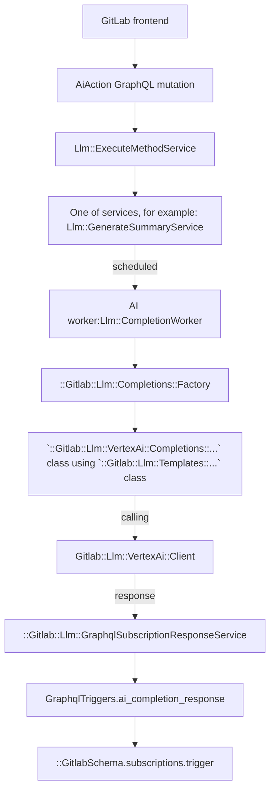

# AI features based on 3rd-party integrations

## Instructions for setting up GitLab Duo features in the local development environment

### Required: Install AI Gateway

**Why:** All Duo features route LLM requests through the AI Gateway.

**How:**
Follow [these instructions](https://gitlab.com/gitlab-org/gitlab-development-kit/-/blob/main/doc/howto/gitlab_ai_gateway.md#install)
to install the AI Gateway with GDK. We recommend this route for most users.

You can also install AI Gateway by:

1. [Cloning the repository directly](https://gitlab.com/gitlab-org/modelops/applied-ml/code-suggestions/ai-assist).
1. [Running the server locally](https://gitlab.com/gitlab-org/modelops/applied-ml/code-suggestions/ai-assist#how-to-run-the-server-locally).

We only recommend this for users who have a specific reason for *not* running
the AI Gateway through GDK.

### Required: Setup Licenses in GitLab-Rails

**Why:** GitLab Duo is available to Premium and Ultimate customers only. You
likely want an Ultimate license for your GDK. Ultimate gets you access to
all GitLab Duo features.

**How:**

Follow [the process to obtain an EE license](https://handbook.gitlab.com/handbook/developer-onboarding/#working-on-gitlab-ee-developer-licenses)
for your local instance and [upload the license](../../administration/license_file.md).

To verify that the license is applied, go to **Admin area** > **Subscription**
and check the subscription plan.

### Set up and run GDK

#### Option A: in SaaS (GitLab.com) Mode

**Why:** Most Duo features are available on GitLab.com first, so running in SaaS
mode will ensure that you can access most features.

**How:**

Run the Rake task to set up Duo features for a group:

```shell
GITLAB_SIMULATE_SAAS=1 bundle exec 'rake gitlab:duo:setup[test-group-name]'
```

```shell
gdk restart
```

Replace `test-group-name` with the name of any top-level group. Duo will
be configured for that group. If the group doesn't exist, it creates a new
one.

Make sure the script succeeds. It prints error messages with links on how
to resolve any errors. You can re-run the script until it succeeds.

In SaaS mode, membership to a group with Duo features enabled is what enables
many AI features. Make sure that your test user is a member of the group with
Duo features enabled (`test-group-name`).

#### Option B: in Self-managed Mode

**Why:** If you want to test something specific to self-managed, such as Custom
Models.

**How:**

Run the Rake task to set up Duo features for the instance:

```shell
GITLAB_SIMULATE_SAAS=0 bundle exec 'rake gitlab:duo:setup'
```

```shell
gdk restart
```

### Recommended: Set `CLOUD_CONNECTOR_SELF_SIGN_TOKENS` environment variable

**Why:** Setting this environment variable will allow the local GitLab instance to
issue tokens itself, without syncing with CustomersDot first.
With this set, you can skip the
[CustomersDot setup](https://gitlab.com/gitlab-org/gitlab-development-kit/-/blob/main/doc/howto/gitlab_ai_gateway.md#option-2-use-your-customersdot-instance-as-a-provider).

**How:** The following should be set in the `env.runit` file in your GDK root:

```shell
# <GDK-root>/env.runit

export CLOUD_CONNECTOR_SELF_SIGN_TOKENS=1
```

You need to restart GDK to apply the change.

If you use `CLOUD_CONNECTOR_SELF_SIGN_TOKENS=1`, th `root`/`admin` user must
have a [seat assigned](../../subscriptions/subscription-add-ons.md#for-gitlabcom)
to receive a "Code completion test was successful" notification from the health check
on the `http://localhost:3000/admin/code_suggestions` page.

Our customers (production environment) do not need to do that to run a Code
Suggestions health check.

### Recommended: Test clients in Rails console

**Why:** you've completed all of the setup steps, now it's time to confirm that
GitLab Duo is actually working.

**How:**

After the setup is complete, you can test clients in GitLab-Rails to see if it can
correctly reach to AI Gateway:

1. Run `gdk start`.
1. Login to Rails console with `gdk rails console`.
1. Talk to a model:

   ```ruby
   # Talk to Anthropic model
   Gitlab::Llm::Anthropic::Client.new(User.first, unit_primitive: 'duo_chat').complete(prompt: "\n\nHuman: Hi, How are you?\n\nAssistant:")

   # Talk to Vertex AI model
   Gitlab::Llm::VertexAi::Client.new(User.first, unit_primitive: 'documentation_search').text_embeddings(content: "How can I create an issue?")

   # Test `/v1/chat/agent` endpoint
   Gitlab::Llm::Chain::Requests::AiGateway.new(User.first).request(prompt: [{role: "user", content: "Hi, how are you?"}])
   ```

NOTE:
See [this doc](../cloud_connector/index.md) for registering unit primitives in Cloud Connector.

### Optional: Enable authentication and authorization in AI Gateway

**Why:** The AI Gateway has [authentication and authorization](https://gitlab.com/gitlab-org/modelops/applied-ml/code-suggestions/ai-assist/-/blob/main/docs/auth.md)
flow to verify if clients have permission to access the features. Auth is
enforced in any live environments hosted by GitLab infra team. You may want to
test this flow in your local development environment.

NOTE:
In development environments (for example: GDK), this process is disabled by default.

To enable authorization checks, set `AIGW_AUTH__BYPASS_EXTERNAL` to `false` in the
[application setting file](https://gitlab.com/gitlab-org/modelops/applied-ml/code-suggestions/ai-assist/-/blob/main/docs/application_settings.md)
(`<GDK-root>/gitlab-ai-gateway/.env`) in AI Gateway.

#### Option 1: Use your GitLab instance as a provider

**Why:** this is the simplest method of testing authentication and reflects our setup on GitLab.com.

**How:**
Assuming that you are running the [AI Gateway with GDK](#required-install-ai-gateway),
apply the following configuration to GDK:

```shell
# <GDK-root>/env.runit

export GITLAB_SIMULATE_SAAS=1
```

Update the [application settings file](https://gitlab.com/gitlab-org/modelops/applied-ml/code-suggestions/ai-assist/-/blob/main/docs/application_settings.md) in AI Gateway:

```shell
# <GDK-root>/gitlab-ai-gateway/.env

AIGW_AUTH__BYPASS_EXTERNAL=false
AIGW_GITLAB_URL=<your-gdk-url>
```

and `gdk restart`.

#### Option 2: Use your customersDot instance as a provider

**Why**: CustomersDot setup is required when you want to test or update functionality
related to [cloud licensing](https://about.gitlab.com/pricing/licensing-faq/cloud-licensing/)
or if you are running GDK in non-SaaS mode.

NOTE:
This setup is challenging. There is [an issue](https://gitlab.com/gitlab-org/gitlab/-/issues/463341)
for discussing how to make it easier to test the customersDot integration locally.
Until that is addressed, this setup process is time consuming and should be
avoided if possible.

If you need to get customersDot working for your local GitLab Rails instance for
any reason, reach out to `#s_fulfillment_engineering` in Slack. For questions around the integration of CDot with other systems to deliver AI use cases, reach out to `#g_cloud_connector`.
assistance.

### Help

- [Here's how to reach us!](https://handbook.gitlab.com/handbook/engineering/development/data-science/ai-powered/ai-framework/#-how-to-reach-us)
- View [guidelines](duo_chat.md) for working with GitLab Duo Chat.

## Tips for local development

1. When responses are taking too long to appear in the user interface, consider
   restarting Sidekiq by running `gdk restart rails-background-jobs`. If that
   doesn't work, try `gdk kill` and then `gdk start`.
1. Alternatively, bypass Sidekiq entirely and run the service synchronously.
   This can help with debugging errors as GraphQL errors are now available in
  the network inspector instead of the Sidekiq logs. To do that, temporarily alter
  the `perform_for` method in `Llm::CompletionWorker` class by changing
  `perform_async` to `perform_inline`.

## Feature development (Abstraction Layer)

### Feature flags

Apply the following feature flags to any AI feature work:

- A general flag (`ai_duo_chat_switch`) that applies to all GitLab Duo Chat features. It's enabled by default.
- A general flag (`ai_global_switch`) that applies to all other AI features. It's enabled by default.
- A flag specific to that feature. The feature flag name [must be different](../feature_flags/index.md#feature-flags-for-licensed-features) than the licensed feature name.

See the [feature flag tracker epic](https://gitlab.com/groups/gitlab-org/-/epics/10524) for the list of all feature flags and how to use them.

### Push feature flags to AI Gateway

You can push [feature flags](../feature_flags/index.md) to AI Gateway. This is helpful to gradually rollout user-facing changes even if the feature resides in AI Gateway.
See the following example:

```ruby
# Push a feature flag state to AI Gateway.
Gitlab::AiGateway.push_feature_flag(:new_prompt_template, user)
```

Later, you can use the feature flag state in AI Gateway in the following way:

```python
from ai_gateway.feature_flags import is_feature_enabled

# Check if the feature flag "new_prompt_template" is enabled.
if is_feature_enabled('new_prompt_template'):
  # Build a prompt from the new prompt template
else:
  # Build a prompt from the old prompt template
```

**IMPORTANT:** At the [cleaning up](../feature_flags/controls.md#cleaning-up) step, remove the feature flag in AI Gateway repository **before** removing the flag in GitLab-Rails repository.
If you clean up the flag in GitLab-Rails repository at first, the feature flag in AI Gateway will be disabled immediately as it's the default state, hence you might encounter a surprising behavior.

**IMPORTANT:** Cleaning up the feature flag in AI Gateway will immediately distribute the change to all GitLab instances, including GitLab.com, Self-managed GitLab, and Dedicated.

Technical details: When `push_feature_flag` runs on an enabled feature flag, the name of flag is cached in the current context,
which is later attached to `x-gitlab-enabled-feature-flags` HTTP header when GitLab-Sidekiq/Rails requests to AI Gateway.

As a simialr concept, we also have [`push_frontend_feature_flag`](../feature_flags/index.md) to push feature flags to frontend.

### GraphQL API

To connect to the AI provider API using the Abstraction Layer, use an extendable
GraphQL API called [`aiAction`](https://gitlab.com/gitlab-org/gitlab/blob/master/ee/app/graphql/mutations/ai/action.rb).
The `input` accepts key/value pairs, where the `key` is the action that needs to
be performed. We only allow one AI action per mutation request.

Example of a mutation:

```graphql
mutation {
  aiAction(input: {summarizeComments: {resourceId: "gid://gitlab/Issue/52"}}) {
    clientMutationId
  }
}
```

As an example, assume we want to build an "explain code" action. To do this, we extend the `input` with a new key,
`explainCode`. The mutation would look like this:

```graphql
mutation {
  aiAction(
    input: {
      explainCode: { resourceId: "gid://gitlab/MergeRequest/52", code: "foo() { console.log() }" }
    }
  ) {
    clientMutationId
  }
}
```

The GraphQL API then uses the [Anthropic Client](https://gitlab.com/gitlab-org/gitlab/-/blob/master/ee/lib/gitlab/llm/anthropic/client.rb)
to send the response.

#### How to receive a response

The API requests to AI providers are handled in a background job. We therefore do not keep the request alive and the Frontend needs to match the request to the response from the subscription.

WARNING:
Determining the right response to a request can cause problems when only `userId` and `resourceId` are used. For example, when two AI features use the same `userId` and `resourceId` both subscriptions will receive the response from each other. To prevent this interference, we introduced the `clientSubscriptionId`.

To match a response on the `aiCompletionResponse` subscription, you can provide a `clientSubscriptionId` to the `aiAction` mutation.

- The `clientSubscriptionId` should be unique per feature and within a page to not interfere with other AI features. We recommend to use a `UUID`.
- Only when the `clientSubscriptionId` is provided as part of the `aiAction` mutation, it will be used for broadcasting the `aiCompletionResponse`.
- If the `clientSubscriptionId` is not provided, only `userId` and `resourceId` are used for the `aiCompletionResponse`.

As an example mutation for summarizing comments, we provide a `randomId` as part of the mutation:

```graphql
mutation {
  aiAction(
    input: {
      summarizeComments: { resourceId: "gid://gitlab/Issue/52" }
      clientSubscriptionId: "randomId"
    }
  ) {
    clientMutationId
  }
}
```

In our component, we then listen on the `aiCompletionResponse` using the `userId`, `resourceId` and `clientSubscriptionId` (`"randomId"`):

```graphql
subscription aiCompletionResponse(
  $userId: UserID
  $resourceId: AiModelID
  $clientSubscriptionId: String
) {
  aiCompletionResponse(
    userId: $userId
    resourceId: $resourceId
    clientSubscriptionId: $clientSubscriptionId
  ) {
    content
    errors
  }
}
```

The [subscription for Chat](duo_chat.md#graphql-subscription) behaves differently.

To not have many concurrent subscriptions, you should also only subscribe to the subscription once the mutation is sent by using [`skip()`](https://apollo.vuejs.org/guide-option/subscriptions.html#skipping-the-subscription).

#### Current abstraction layer flow

The following graph uses VertexAI as an example. You can use different providers.



## How to implement a new action

Implementing a new AI action will require changes in the GitLab monolith as well as in the AI Gateway.
We'll use the example of wanting to implement an action that allows users to rewrite issue descriptions according to
a given prompt.

### 1. Add your action to the Cloud Connector feature list

The Cloud Connector configuration stores the permissions needed to access your service, as well as additional metadata.
For more information, see [Cloud Connector: Configuration](../cloud_connector/configuration.md).

```yaml
# ee/config/cloud_connector/access_data.yml

services:
  # ...
  rewrite_description:
    backend: 'gitlab-ai-gateway'
    bundled_with:
      duo_enterprise:
        unit_primitives:
          - rewrite_issue_description
```

### 2. Create an Agent definition in the AI Gateway

In [the AI Gateway project](https://gitlab.com/gitlab-org/modelops/applied-ml/code-suggestions/ai-assist), create a
new agent definition under `ai_gateway/agents/definitions`. Create a new subfolder corresponding to the name of your
AI action, and a new YAML file for your agent. Specify the model and provider you wish to use, and the prompts that
will be fed to the model. You can specify inputs to be plugged into the prompt by using `{}`.

```yaml
# ai_gateway/agents/definitions/rewrite_description/base.yml

name: Description rewriter
model:
  name: claude-3-sonnet-20240229
  params:
    model_class_provider: anthropic
prompt_template:
  system: |
    You are a helpful assistant that rewrites the description of resources. You'll be given the current description, and a prompt on how you should rewrite it. Reply only with your rewritten description.

    <description>{description}</description>

    <prompt>{prompt}</prompt>
```

If your AI action is part of a broader feature, the definitions can be organized in a tree structure:

```yaml
# ai_gateway/agents/definitions/code_suggestions/generations/base.yml

name: Code generations
model:
  name: claude-3-sonnet-20240229
  params:
    model_class_provider: anthropic
...
```

To specify prompts for multiple models, use the name of the model as the filename for the definition:

```yaml
# ai_gateway/agents/definitions/code_suggestions/generations/mistral.yml

name: Code generations
model:
  name: mistral
  params:
    model_class_provider: litellm
...
```

### 3. Create a Completion class

1. Create a new completion under `ee/lib/gitlab/llm/ai_gateway/completions/` and inherit it from the `Base`
AI Gateway Completion.

```ruby
# ee/lib/gitlab/llm/ai_gateway/completions/rewrite_description.rb

module Gitlab
  module Llm
    module AiGateway
      module Completions
        class RewriteDescription < Base
          def agent_name
            'base' # Must match the name of the agent you defined on the AI Gateway
          end

          def inputs
            { description: resource.description, prompt: prompt_message.content }
          end
        end
      end
    end
  end
end
```

### 4. Create a Service

1. Create a new service under `ee/app/services/llm/` and inherit it from the `BaseService`.
1. The `resource` is the object we want to act on. It can be any object that includes the `Ai::Model` concern. For example it could be a `Project`, `MergeRequest`, or `Issue`.

```ruby
# ee/app/services/llm/rewrite_description_service.rb

module Llm
  class RewriteDescriptionService < BaseService
    extend ::Gitlab::Utils::Override

    override :valid
    def valid?
      super &&
        # You can restrict which type of resources your service applies to
        resource.to_ability_name == "issue" &&
        # Always check that the user is allowed to perform this action on the resource
        Ability.allowed?(user, :rewrite_description, resource)
    end

    private

    def perform
      schedule_completion_worker
    end
  end
end
```

### 5. Register the feature in the catalogue

Go to `Gitlab::Llm::Utils::AiFeaturesCatalogue` and add a new entry for your AI action.

```ruby
class AiFeaturesCatalogue
  LIST = {
    # ...
    rewrite_description: {
      service_class: ::Gitlab::Llm::AiGateway::Completions::RewriteDescription,
      feature_category: :ai_abstraction_layer,
      execute_method: ::Llm::RewriteDescriptionService,
      maturity: :experimental,
      self_managed: false,
      internal: false
    }
  }.freeze
```

## How to migrate an existing action to the AI Gateway

AI actions were initially implemented inside the GitLab monolith. As part of our
[AI Gateway as the Sole Access Point for Monolith to Access Models Epic](https://gitlab.com/groups/gitlab-org/-/epics/13024)
we're migrating prompts, model selection and model parameters into the AI Gateway. This will increase the speed at which
we can deliver improvements to self-managed users, by decoupling prompt and model changes from monolith releases. To
migrate an existing action:

1. Follow steps 1 through 3 on [How to implement a new action](#how-to-implement-a-new-action).
1. Modify the entry for your AI action in the catalogue to list the new completion class as the `aigw_service_class`.

```ruby
class AiFeaturesCatalogue
  LIST = {
    # ...
    generate_description: {
      service_class: ::Gitlab::Llm::Anthropic::Completions::GenerateDescription,
      aigw_service_class: ::Gitlab::Llm::AiGateway::Completions::GenerateDescription,
      prompt_class: ::Gitlab::Llm::Templates::GenerateDescription,
      feature_category: :ai_abstraction_layer,
      execute_method: ::Llm::GenerateDescriptionService,
      maturity: :experimental,
      self_managed: false,
      internal: false
    },
    # ...
  }.freeze
```

When the feature flag `ai_gateway_agents` is enabled, the `aigw_service_class` will be used to process the AI action.
Once you've validated the correct functioning of your action, you can remove the `aigw_service_class` key and replace
the `service_class` with the new `AiGateway::Completions` class to make it the permanent provider.

For a complete example of the changes needed to migrate an AI action, see the following MRs:

- [Changes to the GitLab Rails monolith](https://gitlab.com/gitlab-org/gitlab/-/merge_requests/152429)
- [Changes to the AI Gateway](https://gitlab.com/gitlab-org/modelops/applied-ml/code-suggestions/ai-assist/-/merge_requests/921)

### Authorization in GitLab-Rails

We recommend to use [policies](../policies.md) to deal with authorization for a feature. Currently we need to make sure to cover the following checks:

Some basic authorization is included in the Abstraction Layer classes that are base classes for more specialized classes.

What needs to be included in the code:

1. Check for feature flag compatibility: `Gitlab::Llm::Utils::FlagChecker.flag_enabled_for_feature?(ai_action)` - included in the `Llm::BaseService` class.
1. Check if resource is authorized: `Gitlab::Llm::Utils::Authorizer.resource(resource: resource, user: user).allowed?` - also included in the `Llm::BaseService` class.
1. Both of those checks are included in the `::Gitlab::Llm::FeatureAuthorizer.new(container: subject_container, feature_name: action_name).allowed?`
1. Access to AI features depend on several factors, such as: their maturity, if they are enabled on self-managed, if they are bundled within an add-on etc.
   - [Example](https://gitlab.com/gitlab-org/gitlab/-/blob/master/ee/app/policies/ee/global_policy.rb#L222-222) of policy not connected to the particular resource.
   - [Example](https://gitlab.com/gitlab-org/gitlab/-/blob/master/ee/app/policies/ee/issue_policy.rb#L25-25) of policy connected to the particular resource.

NOTE:
For more information, see [the GitLab AI Gateway documentation](https://gitlab.com/gitlab-org/gitlab-development-kit/-/blob/main/doc/howto/gitlab_ai_gateway.md#optional-enable-authentication-and-authorization-in-ai-gateway) about authentication and authorization in AI Gateway.

### Pairing requests with responses

Because multiple users' requests can be processed in parallel, when receiving responses,
it can be difficult to pair a response with its original request. The `requestId`
field can be used for this purpose, because both the request and response are assured
to have the same `requestId` UUID.

### Caching

AI requests and responses can be cached. Cached conversation is being used to
display user interaction with AI features. In the current implementation, this cache
is not used to skip consecutive calls to the AI service when a user repeats
their requests.

```graphql
query {
  aiMessages {
    nodes {
      id
      requestId
      content
      role
      errors
      timestamp
    }
  }
}
```

This cache is used for chat functionality. For other services, caching is
disabled. You can enable this for a service by using the `cache_response: true`
option.

Caching has following limitations:

- Messages are stored in Redis stream.
- There is a single stream of messages per user. This means that all services
  currently share the same cache. If needed, this could be extended to multiple
  streams per user (after checking with the infrastructure team that Redis can handle
  the estimated amount of messages).
- Only the last 50 messages (requests + responses) are kept.
- Expiration time of the stream is 3 days since adding last message.
- User can access only their own messages. There is no authorization on the caching
  level, and any authorization (if accessed by not current user) is expected on
  the service layer.

### Check if feature is allowed for this resource based on namespace settings

There is one setting allowed on root namespace level that restrict the use of AI features:

- `experiment_features_enabled`

To check if that feature is allowed for a given namespace, call:

```ruby
Gitlab::Llm::StageCheck.available?(namespace, :name_of_the_feature)
```

Add the name of the feature to the `Gitlab::Llm::StageCheck` class. There are
arrays there that differentiate between experimental and beta features.

This way we are ready for the following different cases:

- If the feature is not in any array, the check will return `true`. For example, the feature was moved to GA.

To move the feature from the experimental phase to the beta phase, move the name of the feature from the `EXPERIMENTAL_FEATURES` array to the `BETA_FEATURES` array.

### Implement calls to AI APIs and the prompts

The `CompletionWorker` will call the `Completions::Factory` which will initialize the Service and execute the actual call to the API.
In our example, we will use VertexAI and implement two new classes:

```ruby
# /ee/lib/gitlab/llm/vertex_ai/completions/rewrite_description.rb

module Gitlab
  module Llm
    module VertexAi
      module Completions
        class AmazingNewAiFeature < Gitlab::Llm::Completions::Base
          def execute
            prompt = ai_prompt_class.new(options[:user_input]).to_prompt

            response = Gitlab::Llm::VertexAi::Client.new(user, unit_primitive: 'amazing_feature').text(content: prompt)

            response_modifier = ::Gitlab::Llm::VertexAi::ResponseModifiers::Predictions.new(response)

            ::Gitlab::Llm::GraphqlSubscriptionResponseService.new(
              user, nil, response_modifier, options: response_options
            ).execute
          end
        end
      end
    end
  end
end
```

```ruby
# /ee/lib/gitlab/llm/vertex_ai/templates/rewrite_description.rb

module Gitlab
  module Llm
    module VertexAi
      module Templates
        class AmazingNewAiFeature
          def initialize(user_input)
            @user_input = user_input
          end

          def to_prompt
            <<~PROMPT
            You are an assistant that writes code for the following context:

            context: #{user_input}
            PROMPT
          end
        end
      end
    end
  end
end
```

Because we support multiple AI providers, you may also use those providers for
the same example:

```ruby
Gitlab::Llm::VertexAi::Client.new(user, unit_primitive: 'your_feature')
Gitlab::Llm::Anthropic::Client.new(user, unit_primitive: 'your_feature')
```

## Monitoring

- Error ratio and response latency apdex for each Ai action can be found on [Sidekiq Service dashboard](https://dashboards.gitlab.net/d/sidekiq-main/sidekiq-overview?orgId=1) under **SLI Detail: `llm_completion`**.
- Spent tokens, usage of each Ai feature and other statistics can be found on [periscope dashboard](https://app.periscopedata.com/app/gitlab/1137231/Ai-Features).
- [AI Gateway logs](https://log.gprd.gitlab.net/app/r/s/zKEel).
- [AI Gateway metrics](https://dashboards.gitlab.net/d/ai-gateway-main/ai-gateway3a-overview?orgId=1).
- [Feature usage dashboard via proxy](https://log.gprd.gitlab.net/app/r/s/egybF).

## Logs

### Overview

In addition to standard logging in the GitLab Rails Monolith instance, specialized logging is available for features based on large language models (LLMs).

### Implementation

#### Logger Class

To implement LLM-specific logging, use the `Gitlab::Llm::Logger` class.

#### Privacy Considerations

**Important**: User inputs and complete prompts containing user data must not be logged unless explicitly permitted.

### Feature Flag

A feature flag named `expanded_ai_logging` controls the logging of sensitive data.
Use the `info_or_debug` helper method for conditional logging based on the feature flag status:

- If the feature flag is enabled for the current user, it logs the information on `info` level (logs are accessible in Kibana).
- If the feature flag is disabled for the current user, it logs the information on `debug` level (logs are not accessible in Kibana).

### Best Practices

When implementing logging for LLM features, consider the following:

- Identify critical information for debugging purposes.
- Ensure compliance with privacy requirements by not logging sensitive user data without proper authorization.
- Use the `info_or_debug` helper method to respect the `expanded_ai_logging` feature flag.
- Structure your logs to provide meaningful insights for troubleshooting and analysis.

### Example Usage

```ruby
# Logging non-sensitive information
Gitlab::Llm::Logger.build.info("LLM feature initialized")

# Logging potentially sensitive information
Gitlab::Llm::Logger.build.info_or_debug(user, message:"User prompt processed: #{sanitized_prompt}")

# Logging application error information
Gitlab::Llm::Logger.build.error(user, message: "System application error: #{sanitized_error_message}")
```

**Important**: Please familiarize yourself with our [Data Retention Policy](../../user/gitlab_duo/data_usage.md#data-retention) and remember
to make sure we are not logging user input and LLM-generated output.

## Security

Refer to the [secure coding guidelines for Artificial Intelligence (AI) features](../secure_coding_guidelines.md#artificial-intelligence-ai-features).
