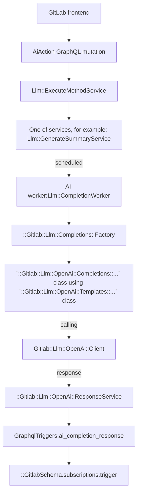

# AI features based on 3rd-party integrations

[Introduced](https://gitlab.com/gitlab-org/gitlab/-/merge_requests/117296) in GitLab 15.11.

## Features

- Async execution of the long running API requests
  - GraphQL Action starts the request
  - Background workers execute
  - GraphQL subscriptions deliver results back in real time
- Abstraction for
  - OpenAI
  - Google Vertex AI
  - Anthropic
- Rate Limiting
- Circuit Breaker
- Multi-Level feature flags
- License checks on group level
- Snowplow execution tracking
- Tracking of Token Spent on Prometheus
- Configuration for Moderation check of inputs
- Automatic Markdown Rendering of responses
- Centralised Group Level settings for experiment and 3rd party
- Experimental API endpoints for exploration of AI APIs by GitLab team members without the need for credentials
  - OpenAI
  - Google Vertex AI
  - Anthropic

## Feature flags

Apply the following two feature flags to any AI feature work:

- A general that applies to all AI features.
- A flag specific to that feature. The feature flag name [must be different](../feature_flags/index.md#feature-flags-for-licensed-features) than the licensed feature name.

See the [feature flag tracker](https://gitlab.com/gitlab-org/gitlab/-/issues/405161) for the list of all feature flags and how to use them.

## Implement a new AI action

To implement a new AI action, connect to the preferred AI provider. You can connect to this API using either the:

- Experimental REST API.
- Abstraction layer.

All AI features are experimental.

## Test AI features locally

NOTE:
Use [this snippet](https://gitlab.com/gitlab-org/gitlab/-/snippets/2554994) for help automating the following section.

1. Enable the required general feature flags:

   ```ruby
   Feature.enable(:ai_related_settings)
   Feature.enable(:openai_experimentation)
   Feature.enable(:tofa_experimentation_main_flag)
   Feature.enable(:anthropic_experimentation)
   ```

1. Simulate the GDK to [simulate SaaS](../ee_features.md#simulate-a-saas-instance) and ensure the group you want to test has an Ultimate license
1. Enable `Experimental features` and `Third-party AI services`
   1. Go to the group with the Ultimate license
   1. **Group Settings** > **General** -> **Permissions and group features**
   1. Enable **Experiment features**
   1. Enable **Third-party AI services**
1. Enable the specific feature flag for the feature you want to test
1. Set the required access token. To receive an access token:
   1. For Vertex, follow the [instructions below](#configure-gcp-vertex-access).
   1. For all other providers, like Anthropic or OpenAI, create an access request where `@m_gill`, `@wayne`, and `@timzallmann` are the tech stack owners.

### Set up the embedding database

NOTE:
Use [this snippet](https://gitlab.com/gitlab-org/gitlab/-/snippets/2554994) for help automating the following section.

For features that use the embedding database, additional setup is needed.

1. Enable [pgvector](https://gitlab.com/gitlab-org/gitlab-development-kit/-/blob/main/doc/howto/pgvector.md#enable-pgvector-in-the-gdk) in GDK
1. Enable the embedding database in GDK

   ```shell
     gdk config set gitlab.rails.databases.embedding.enabled true
   ```

1. Run `gdk reconfigure`
1. Run database migrations to create the embedding database

### Setup for GitLab documentation chat (legacy chat)

To populate the embedding database for GitLab chat:

1. Open a rails console
1. Run [this script](https://gitlab.com/gitlab-com/gl-infra/production/-/issues/10588#note_1373586079) to populate the embedding database

### Configure GCP Vertex access

In order to obtain a GCP service key for local development, please follow the steps below:

- Create a sandbox GCP environment by visiting [this page](https://about.gitlab.com/handbook/infrastructure-standards/#individual-environment) and following the instructions, or by requesting access to our existing group environment by using [this template](https://gitlab.com/gitlab-com/it/infra/issue-tracker/-/issues/new?issuable_template=gcp_group_account_iam_update_request).
- In the GCP console, go to `IAM & Admin` > `Service Accounts` and click on the "Create new service account" button
- Name the service account something specific to what you're using it for. Select Create and Continue. Under `Grant this service account access to project`, select the role `Vertex AI User`. Select `Continue` then `Done`
- Select your new service account and `Manage keys` > `Add Key` > `Create new key`. This will download the **private** JSON credentials for your service account.
- Open the Rails console. Update the settings to:

```ruby
Gitlab::CurrentSettings.update(vertex_ai_credentials: File.read('/YOUR_FILE.json'))

# Note: These credential examples will not work locally for all models
Gitlab::CurrentSettings.update(vertex_ai_host: "<root-domain>") # Example: us-central1-aiplatform.googleapis.com
Gitlab::CurrentSettings.update(vertex_ai_project: "<project-id>") # Example: cloud-large-language-models
```

Internal team members can [use this snippet](https://gitlab.com/gitlab-com/gl-infra/production/-/snippets/2541742) for help configuring these endpoints.

### Configure OpenAI access

```ruby
Gitlab::CurrentSettings.update(openai_api_key: "<open-ai-key>")
```

### Configure Anthropic access

```ruby
Feature.enable(:anthropic_experimentation)
Gitlab::CurrentSettings.update!(anthropic_api_key: <insert API key>)
```

#### Populating embeddings and using embeddings fixture

To seed your development database with the embeddings for GitLab Documentation,
you may use the pre-generated embeddings and a Rake test.

```shell
RAILS_ENV=development bundle exec rake gitlab:llm:embeddings:seed_pre_generated
```

The DBCleaner gem we use clear the database tables before each test runs.
Instead of fully populating the table `tanuki_bot_mvc` where we store embeddings for the documentations,
we can add a few selected embeddings to the table from a pre-generated fixture.

For instance, to test that the question "How can I reset my password" is correctly
retrieving the relevant embeddings and answered, we can extract the top N closet embeddings
to the question into a fixture and only restore a small number of embeddings quickly.
To faciliate an extraction process, a Rake task been written.
You can add or remove the questions needed to be tested in the Rake task and run the task to generate a new fixture.

```shell
RAILS_ENV=development bundle exec rake gitlab:llm:embeddings:extract_embeddings
```

In the specs where you need to use the embeddings,
use the RSpec config hook `:ai_embedding_fixtures` on a context.

```ruby
context 'when asking about how to use GitLab', :ai_embedding_fixtures do
  # ...examples
end
```

### Working with GitLab Duo Chat

View [guidelines](duo_chat.md) for working with GitLab Duo Chat.

## Experimental REST API

Use the [experimental REST API endpoints](https://gitlab.com/gitlab-org/gitlab/-/blob/master/ee/lib/api/ai/experimentation) to quickly experiment and prototype AI features.

The endpoints are:

- `https://gitlab.example.com/api/v4/ai/experimentation/openai/completions`
- `https://gitlab.example.com/api/v4/ai/experimentation/openai/embeddings`
- `https://gitlab.example.com/api/v4/ai/experimentation/openai/chat/completions`
- `https://gitlab.example.com/api/v4/ai/experimentation/anthropic/complete`
- `https://gitlab.example.com/api/v4/ai/experimentation/tofa/chat`

These endpoints are only for prototyping, not for rolling features out to customers.
The experimental endpoint is only available to GitLab team members on production. Use the
[GitLab API token](../../user/profile/personal_access_tokens.md) to authenticate.

## Abstraction layer

### GraphQL API

To connect to the AI provider API using the Abstraction Layer, use an extendable GraphQL API called
[`aiAction`](https://gitlab.com/gitlab-org/gitlab/blob/master/ee/app/graphql/mutations/ai/action.rb).
The `input` accepts key/value pairs, where the `key` is the action that needs to be performed.
We only allow one AI action per mutation request.

Example of a mutation:

```graphql
mutation {
  aiAction(input: {summarizeComments: {resourceId: "gid://gitlab/Issue/52"}}) {
    clientMutationId
  }
}
```

As an example, assume we want to build an "explain code" action. To do this, we extend the `input` with a new key,
`explainCode`. The mutation would look like this:

```graphql
mutation {
  aiAction(input: {explainCode: {resourceId: "gid://gitlab/MergeRequest/52", code: "foo() { console.log()" }}) {
    clientMutationId
  }
}
```

The GraphQL API then uses the [OpenAI Client](https://gitlab.com/gitlab-org/gitlab/blob/master/ee/lib/gitlab/llm/open_ai/client.rb)
to send the response.

Remember that other clients are available and you should not use OpenAI.

#### How to receive a response

As the OpenAI API requests are handled in a background job, we do not keep the request alive and
the response is sent through the `aiCompletionResponse` subscription:

```mutation
subscription aiCompletionResponse($userId: UserID, $resourceId: AiModelID!) {
  aiCompletionResponse(userId: $userId, resourceId: $resourceId) {
    responseBody
    errors
  }
}
```

WARNING:
You should only subscribe to the subscription once the mutation is sent. If multiple subscriptions are active on the same page, they currently all receive updates as our identifier is the user and the resource. To mitigate this, you should only subscribe when the mutation is sent. You can use [`skip()`](You can use [`skip()`](https://apollo.vuejs.org/guide/apollo/subscriptions.html#skipping-the-subscription)) for this case. To prevent this problem in the future, we implement a [request identifier](https://gitlab.com/gitlab-org/gitlab/-/issues/408196).

#### Current abstraction layer flow

The following graph uses OpenAI as an example. You can use different providers.



## CircuitBreaker

The CircuitBreaker concern is a reusable module that you can include in any class that needs to run code with circuit breaker protection. The concern provides a `run_with_circuit` method that wraps a code block with circuit breaker functionality, which helps prevent cascading failures and improves system resilience. For more information about the circuit breaker pattern, see:

- [What is Circuit breaker](https://martinfowler.com/bliki/CircuitBreaker.html).
- [The Hystrix documentation on CircuitBreaker](https://github.com/Netflix/Hystrix/wiki/How-it-Works#circuit-breaker).

### Use CircuitBreaker

To use the CircuitBreaker concern, you need to include it in a class. For example:

```ruby
class MyService
  include Gitlab::Llm::Concerns::CircuitBreaker

  def call_external_service
    run_with_circuit do
      # Code that interacts with external service goes here

      raise InternalServerError
    end
  end
end
```

The `call_external_service` method is an example method that interacts with an external service.
By wrapping the code that interacts with the external service with `run_with_circuit`, the method is executed within the circuit breaker.
The circuit breaker is created and configured by the `circuit` method, which is called automatically when the `CircuitBreaker` module is included.
The method should raise `InternalServerError` error which will be counted towards the error threshold if raised during the execution of the code block.

The circuit breaker tracks the number of errors and the rate of requests,
and opens the circuit if it reaches the configured error threshold or volume threshold.
If the circuit is open, subsequent requests fail fast without executing the code block, and the circuit breaker periodically allows a small number of requests through to test the service's availability before closing the circuit again.

### Configuration

The circuit breaker is configured with two constants which control the number of errors and requests at which the circuit will open:

- `ERROR_THRESHOLD`
- `VOLUME_THRESHOLD`

You can adjust these values as needed for the specific service and usage pattern.
The `InternalServerError` is the exception class counted towards the error threshold if raised during the execution of the code block.
This is the exception class that triggers the circuit breaker when raised by the code that interacts with the external service.

NOTE:
The `CircuitBreaker` module depends on the `Circuitbox` gem to provide the circuit breaker implementation. By default, the service name is inferred from the class name where the concern module is included. Override the `service_name` method if the name needs to be different.

### Testing

To test code that uses the `CircuitBreaker` concern, you can use `RSpec` shared examples and pass the `service` and `subject` variables:

```ruby
it_behaves_like 'has circuit breaker' do
  let(:service) { dummy_class.new }
  let(:subject) { service.dummy_method }
end
```

## How to implement a new action

### Register a new method

Go to the `Llm::ExecuteMethodService` and add a new method with the new service class you will create.

```ruby
class ExecuteMethodService < BaseService
  METHODS = {
    # ...
    amazing_new_ai_feature: Llm::AmazingNewAiFeatureService
  }.freeze
```

### Create a Service

1. Create a new service under `ee/app/services/llm/` and inherit it from the `BaseService`.
1. The `resource` is the object we want to act on. It can be any object that includes the `Ai::Model` concern. For example it could be a `Project`, `MergeRequest`, or `Issue`.

```ruby
# ee/app/services/llm/amazing_new_ai_feature_service.rb

module Llm
  class AmazingNewAiFeatureService < BaseService
    private

    def perform
      ::Llm::CompletionWorker.perform_async(user.id, resource.id, resource.class.name, :amazing_new_ai_feature)
      success
    end

    def valid?
      super && Ability.allowed?(user, :amazing_new_ai_feature, resource)
    end
  end
end
```

### Authorization

We recommend to use [policies](../policies.md) to deal with authorization for a feature. Currently we need to make sure to cover the following checks:

1. General AI feature flag is enabled
1. Feature specific feature flag is enabled
1. The namespace has the required license for the feature
1. User is a member of the group/project
1. `experiment_features_enabled` and `third_party_ai_features_enabled` flags are set on the `Namespace`

For our example, we need to implement the `allowed?(:amazing_new_ai_feature)` call. As an example, you can look at the [Issue Policy for the summarize comments feature](https://gitlab.com/gitlab-org/gitlab/-/blob/master/ee/app/policies/ee/issue_policy.rb). In our example case, we want to implement the feature for Issues as well:

```ruby
# ee/app/policies/ee/issue_policy.rb

module EE
  module IssuePolicy
    extend ActiveSupport::Concern
    prepended do
      with_scope :subject
      condition(:ai_available) do
        ::Feature.enabled?(:openai_experimentation)
      end

      with_scope :subject
      condition(:amazing_new_ai_feature_enabled) do
        ::Feature.enabled?(:amazing_new_ai_feature, subject_container) &&
          subject_container.licensed_feature_available?(:amazing_new_ai_feature)
      end

      rule do
        ai_available & amazing_new_ai_feature_enabled & is_project_member
      end.enable :amazing_new_ai_feature
    end
  end
end
```

### Pairing requests with responses

Because multiple users' requests can be processed in parallel, when receiving responses,
it can be difficult to pair a response with its original request. The `requestId`
field can be used for this purpose, because both the request and response are assured
to have the same `requestId` UUID.

### Caching

AI requests and responses can be cached. Cached conversation is being used to
display user interaction with AI features. In the current implementation, this cache
is not used to skip consecutive calls to the AI service when a user repeats
their requests.

```graphql
query {
  aiMessages {
    nodes {
      id
      requestId
      content
      role
      errors
      timestamp
    }
  }
}
```

This cache is especially useful for chat functionality. For other services,
caching is disabled. (It can be enabled for a service by using `cache_response: true`
option.)

Caching has following limitations:

- Messages are stored in Redis stream.
- There is a single stream of messages per user. This means that all services
  currently share the same cache. If needed, this could be extended to multiple
  streams per user (after checking with the infrastructure team that Redis can handle
  the estimated amount of messages).
- Only the last 50 messages (requests + responses) are kept.
- Expiration time of the stream is 3 days since adding last message.
- User can access only their own messages. There is no authorization on the caching
  level, and any authorization (if accessed by not current user) is expected on
  the service layer.

### Check if feature is allowed for this resource based on namespace settings

There are two settings allowed on root namespace level that restrict the use of AI features:

- `experiment_features_enabled`
- `third_party_ai_features_enabled`.

To check if that feature is allowed for a given namespace, call:

```ruby
Gitlab::Llm::StageCheck.available?(namespace, :name_of_the_feature)
```

Add the name of the feature to the `Gitlab::Llm::StageCheck` class. There are arrays there that differentiate
between experimental and beta features.

This way we are ready for the following different cases:

- If the feature is not in any array, the check will return `true`. For example, the feature was moved to GA and does not use a third-party setting.
- If feature is in GA, but uses a third-party setting, the class will return a proper answer based on the namespace third-party setting.

To move the feature from the experimental phase to the beta phase, move the name of the feature from the `EXPERIMENTAL_FEATURES` array to the `BETA_FEATURES` array.

### Implement calls to AI APIs and the prompts

The `CompletionWorker` will call the `Completions::Factory` which will initialize the Service and execute the actual call to the API.
In our example, we will use OpenAI and implement two new classes:

```ruby
# /ee/lib/gitlab/llm/open_ai/completions/amazing_new_ai_feature.rb

module Gitlab
  module Llm
    module OpenAi
      module Completions
        class AmazingNewAiFeature
          def initialize(ai_prompt_class)
            @ai_prompt_class = ai_prompt_class
          end

          def execute(user, issue, options)
            options = ai_prompt_class.get_options(options[:messages])

            ai_response = Gitlab::Llm::OpenAi::Client.new(user).chat(content: nil, **options)

            ::Gitlab::Llm::OpenAi::ResponseService.new(user, issue, ai_response, options: {}).execute(
              Gitlab::Llm::OpenAi::ResponseModifiers::Chat.new
            )
          end

          private

          attr_reader :ai_prompt_class
        end
      end
    end
  end
end
```

```ruby
# /ee/lib/gitlab/llm/open_ai/templates/amazing_new_ai_feature.rb

module Gitlab
  module Llm
    module OpenAi
      module Templates
        class AmazingNewAiFeature
          TEMPERATURE = 0.3

          def self.get_options(messages)
            system_content = <<-TEMPLATE
              You are an assistant that writes code for the following input:
              """
            TEMPLATE

            {
              messages: [
                { role: "system", content: system_content },
                { role: "user", content: messages },
              ],
              temperature: TEMPERATURE
            }
          end
        end
      end
    end
  end
end
```

Because we support multiple AI providers, you may also use those providers for the same example:

```ruby
Gitlab::Llm::VertexAi::Client.new(user)
Gitlab::Llm::Anthropic::Client.new(user)
```

### Add Ai Action to GraphQL

TODO

## Security

Refer to the [secure coding guidelines for Artificial Intelligence (AI) features](../secure_coding_guidelines.md#artificial-intelligence-ai-features).
