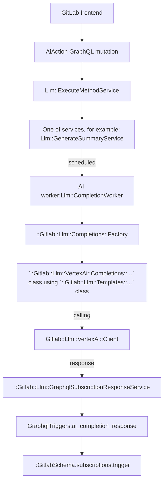

# AI features based on 3rd-party integrations

[Introduced](https://gitlab.com/gitlab-org/gitlab/-/merge_requests/117296) in GitLab 15.11.

## Features

- Async execution of the long running API requests
  - GraphQL Action starts the request
  - Background workers execute
  - GraphQL subscriptions deliver results back in real time
- Abstraction for
  - Google Vertex AI
  - Anthropic
- Rate Limiting
- Circuit Breaker
- Multi-Level feature flags
- License checks on group level
- Snowplow execution tracking
- Tracking of Token Spent on Prometheus
- Configuration for Moderation check of inputs
- Automatic Markdown Rendering of responses
- Centralised Group Level settings for experiment and 3rd party
- Experimental API endpoints for exploration of AI APIs by GitLab team members without the need for credentials
  - Google Vertex AI
  - Anthropic

## Feature flags

Apply the following two feature flags to any AI feature work:

- A general flag (`ai_global_switch`) that applies to all AI features.
- A flag specific to that feature. The feature flag name [must be different](../feature_flags/index.md#feature-flags-for-licensed-features) than the licensed feature name.

See the [feature flag tracker epic](https://gitlab.com/groups/gitlab-org/-/epics/10524) for the list of all feature flags and how to use them.

## Implement a new AI action

To implement a new AI action, connect to the preferred AI provider. You can connect to this API using either the:

- Experimental REST API.
- Abstraction layer.

All AI features are experimental.

## Test AI features locally

**One-line setup**

```shell
# Replace the <test-group-name> by the group name you want to enable GitLab Duo features. If the group doesn't exist, it creates a new one.
RAILS_ENV=development bundle exec rake gitlab:duo:setup['<test-group-name>']
```

**Manual way**

1. Enable the required general feature flags:

   ```ruby
   Feature.enable(:ai_global_switch, type: :ops)
   ```

1. Ensure you have followed [the process to obtain an EE license](https://about.gitlab.com/handbook/developer-onboarding/#working-on-gitlab-ee-developer-licenses) for your local instance
1. Simulate the GDK to [simulate SaaS](../ee_features.md#simulate-a-saas-instance) and ensure the group you want to test has an Ultimate license
1. Enable `Experiment & Beta features`
   1. Go to the group with the Ultimate license
   1. **Group Settings** > **General** -> **Permissions and group features**
   1. Enable **Experiment & Beta features**
1. Enable the specific feature flag for the feature you want to test
1. You can use Rake task `rake gitlab:duo:enable_feature_flags` to enable all feature flags that are assigned to group AI Framework
1. Set the required access token. To receive an access token:
   1. For Vertex, follow the [instructions below](#configure-gcp-vertex-access).
   1. For all other providers, like Anthropic, create an access request where `@m_gill`, `@wayne`, and `@timzallmann` are the tech stack owners.

### Set up the embedding database

For features that use the embedding database, additional setup is needed.

1. Enable [`pgvector`](https://gitlab.com/gitlab-org/gitlab-development-kit/-/blob/main/doc/howto/pgvector.md#enable-pgvector-in-the-gdk) in GDK
1. Enable the embedding database in GDK

   ```shell
     gdk config set gitlab.rails.databases.embedding.enabled true
   ```

1. Run `gdk reconfigure`
1. Run database migrations to create the embedding database

### Configure GCP Vertex access

In order to obtain a GCP service key for local development, please follow the steps below:

- Create a sandbox GCP project by visiting [this page](https://about.gitlab.com/handbook/infrastructure-standards/#individual-environment) and following the instructions, or by requesting access to our existing group GCP project by using [this template](https://gitlab.com/gitlab-com/it/infra/issue-tracker/-/issues/new?issuable_template=gcp_group_account_iam_update_request).
- If you are using an individual GCP project, you may also need to enable the Vertex AI API:
    1. Visit [welcome page](https://console.cloud.google.com/welcome), choose your project (e.g. jdoe-5d23dpe).
    1. Go to **APIs & Services > Enabled APIs & services**.
    1. Select **+ Enable APIs and Services**.
    1. Search for `Vertex AI API`.
    1. Select **Vertex AI API**, then select **Enable**.
- Install the [`gcloud` CLI](https://cloud.google.com/sdk/docs/install)
- Authenticate locally with GCP using the [`gcloud auth application-default login`](https://cloud.google.com/sdk/gcloud/reference/auth/application-default/login) command.
- Open the Rails console. Update the settings to:

```ruby
# PROJECT_ID = "your-gcp-project-name"

Gitlab::CurrentSettings.update(vertex_ai_project: PROJECT_ID)
```

### Configure Anthropic access

```ruby
Gitlab::CurrentSettings.update!(anthropic_api_key: <insert API key>)
```

### Populating embeddings and using embeddings fixture

Embeddings are generated through VertexAI text embeddings endpoint. The sections below explain how to populate
embeddings in the DB or extract embeddings to be used in specs.

#### VertexAI embeddings

To seed your development database with the embeddings for GitLab Documentation,
you may use the pre-generated embeddings and a Rake task.

```shell
RAILS_ENV=development bundle exec rake gitlab:llm:embeddings:vertex:seed
```

The DBCleaner gem we use clear the database tables before each test runs.
Instead of fully populating the table `vertex_gitlab_docs` where we store VertexAI embeddings for the documentations,
we can add a few selected embeddings to the table from a pre-generated fixture.

For instance, to test that the question "How can I reset my password" is correctly
retrieving the relevant embeddings and answered, we can extract the top N closet embeddings
to the question into a fixture and only restore a small number of embeddings quickly.
To facilitate an extraction process, a Rake task has been written.
You can add or remove the questions needed to be tested in the Rake task and run the task to generate a new fixture.

```shell
RAILS_ENV=development bundle exec rake gitlab:llm:embeddings:vertex:extract_embeddings
```

#### Using embeddings in specs

In the specs where you need to use the embeddings,
use the RSpec config hook `:ai_embedding_fixtures` on a context.

```ruby
context 'when asking about how to use GitLab', :ai_embedding_fixtures do
  # ...examples
end
```

### Tips for local development

1. When responses are taking too long to appear in the user interface, consider restarting Sidekiq by running `gdk restart rails-background-jobs`. If that doesn't work, try `gdk kill` and then `gdk start`.
1. Alternatively, bypass Sidekiq entirely and run the chat service synchronously. This can help with debugging errors as GraphQL errors are now available in the network inspector instead of the Sidekiq logs. To do that temporary alter `Llm::CompletionWorker.perform_async` statements with `Llm::CompletionWorker.perform_inline`

### Working with GitLab Duo Chat

View [guidelines](duo_chat.md) for working with GitLab Duo Chat.

## Experimental REST API

Use the [experimental REST API endpoints](https://gitlab.com/gitlab-org/gitlab/-/blob/master/ee/lib/api/ai/experimentation) to quickly experiment and prototype AI features.

The endpoints are:

- `https://gitlab.example.com/api/v4/ai/experimentation/anthropic/complete`
- `https://gitlab.example.com/api/v4/ai/experimentation/vertex/chat`

These endpoints are only for prototyping, not for rolling features out to customers.

In your local development environment, you can experiment with these endpoints locally with the feature flag enabled:

```ruby
Feature.enable(:ai_experimentation_api)
```

On production, the experimental endpoints are only available to GitLab team members. Use a
[GitLab API token](../../user/profile/personal_access_tokens.md) to authenticate.

## Abstraction layer

### GraphQL API

To connect to the AI provider API using the Abstraction Layer, use an extendable GraphQL API called
[`aiAction`](https://gitlab.com/gitlab-org/gitlab/blob/master/ee/app/graphql/mutations/ai/action.rb).
The `input` accepts key/value pairs, where the `key` is the action that needs to be performed.
We only allow one AI action per mutation request.

Example of a mutation:

```graphql
mutation {
  aiAction(input: {summarizeComments: {resourceId: "gid://gitlab/Issue/52"}}) {
    clientMutationId
  }
}
```

As an example, assume we want to build an "explain code" action. To do this, we extend the `input` with a new key,
`explainCode`. The mutation would look like this:

```graphql
mutation {
  aiAction(input: {explainCode: {resourceId: "gid://gitlab/MergeRequest/52", code: "foo() { console.log()" }}) {
    clientMutationId
  }
}
```

The GraphQL API then uses the [Anthropic Client](https://gitlab.com/gitlab-org/gitlab/-/blob/master/ee/lib/gitlab/llm/anthropic/client.rb)
to send the response.

#### How to receive a response

The API requests to AI providers are handled in a background job. We therefore do not keep the request alive and the Frontend needs to match the request to the response from the subscription.

WARNING:
Determining the right response to a request can cause problems when only `userId` and `resourceId` are used. For example, when two AI features use the same `userId` and `resourceId` both subscriptions will receive the response from each other. To prevent this intereference, we introduced the `clientSubscriptionId`.

To match a response on the `aiCompletionResponse` subscription, you can provide a `clientSubscriptionId` to the `aiAction` mutation.

- The `clientSubscriptionId` should be unique per feature and within a page to not interfere with other AI features. We recommend to use a `UUID`.
- Only when the `clientSubscriptionId` is provided as part of the `aiAction` mutation, it will be used for broadcasting the `aiCompletionResponse`.
- If the `clientSubscriptionId` is not provided, only `userId` and `resourceId` are used for the `aiCompletionResponse`.

As an example mutation for summarizing comments, we provide a `randomId` as part of the mutation:

```graphql
mutation {
  aiAction(input: {summarizeComments: {resourceId: "gid://gitlab/Issue/52"}, clientSubscriptionId: "randomId"}) {
    clientMutationId
  }
}
```

In our component, we then listen on the `aiCompletionResponse` using the `userId`, `resourceId` and `clientSubscriptionId` (`"randomId"`):

```graphql
subscription aiCompletionResponse($userId: UserID, $resourceId: AiModelID, $clientSubscriptionId: String) {
  aiCompletionResponse(userId: $userId, resourceId: $resourceId, clientSubscriptionId: $clientSubscriptionId) {
    content
    errors
  }
}
```

Note that the [subscription for chat](duo_chat.md#graphql-subscription) behaves differently.

To not have many concurrent subscriptions, you should also only subscribe to the subscription once the mutation is sent by using [`skip()`](https://apollo.vuejs.org/guide/apollo/subscriptions.html#skipping-the-subscription).

#### Current abstraction layer flow

The following graph uses VertexAI as an example. You can use different providers.



## How to implement a new action

### Register a new method

Go to the `Llm::ExecuteMethodService` and add a new method with the new service class you will create.

```ruby
class ExecuteMethodService < BaseService
  METHODS = {
    # ...
    amazing_new_ai_feature: Llm::AmazingNewAiFeatureService
  }.freeze
```

### Create a Service

1. Create a new service under `ee/app/services/llm/` and inherit it from the `BaseService`.
1. The `resource` is the object we want to act on. It can be any object that includes the `Ai::Model` concern. For example it could be a `Project`, `MergeRequest`, or `Issue`.

```ruby
# ee/app/services/llm/amazing_new_ai_feature_service.rb

module Llm
  class AmazingNewAiFeatureService < BaseService
    private

    def perform
      ::Llm::CompletionWorker.perform_async(user.id, resource.id, resource.class.name, :amazing_new_ai_feature)
      success
    end

    def valid?
      super && Ability.allowed?(user, :amazing_new_ai_feature, resource)
    end
  end
end
```

### Authorization

We recommend to use [policies](../policies.md) to deal with authorization for a feature. Currently we need to make sure to cover the following checks:

1. General AI feature flag (`ai_global_switch`) is enabled
1. Feature specific feature flag is enabled
1. The namespace has the required license for the feature
1. User is a member of the group/project
1. `experiment_features_enabled` settings are set on the `Namespace`

For our example, we need to implement the `allowed?(:amazing_new_ai_feature)` call. As an example, you can look at the [Issue Policy for the summarize comments feature](https://gitlab.com/gitlab-org/gitlab/-/blob/master/ee/app/policies/ee/issue_policy.rb). In our example case, we want to implement the feature for Issues as well:

```ruby
# ee/app/policies/ee/issue_policy.rb

module EE
  module IssuePolicy
    extend ActiveSupport::Concern
    prepended do
      with_scope :subject
      condition(:ai_available) do
        ::Feature.enabled?(:ai_global_switch, type: :ops)
      end

      with_scope :subject
      condition(:amazing_new_ai_feature_enabled) do
        ::Feature.enabled?(:amazing_new_ai_feature, subject_container) &&
          subject_container.licensed_feature_available?(:amazing_new_ai_feature)
      end

      rule do
        ai_available & amazing_new_ai_feature_enabled & is_project_member
      end.enable :amazing_new_ai_feature
    end
  end
end
```

### Pairing requests with responses

Because multiple users' requests can be processed in parallel, when receiving responses,
it can be difficult to pair a response with its original request. The `requestId`
field can be used for this purpose, because both the request and response are assured
to have the same `requestId` UUID.

### Caching

AI requests and responses can be cached. Cached conversation is being used to
display user interaction with AI features. In the current implementation, this cache
is not used to skip consecutive calls to the AI service when a user repeats
their requests.

```graphql
query {
  aiMessages {
    nodes {
      id
      requestId
      content
      role
      errors
      timestamp
    }
  }
}
```

This cache is especially useful for chat functionality. For other services,
caching is disabled. (It can be enabled for a service by using `cache_response: true`
option.)

Caching has following limitations:

- Messages are stored in Redis stream.
- There is a single stream of messages per user. This means that all services
  currently share the same cache. If needed, this could be extended to multiple
  streams per user (after checking with the infrastructure team that Redis can handle
  the estimated amount of messages).
- Only the last 50 messages (requests + responses) are kept.
- Expiration time of the stream is 3 days since adding last message.
- User can access only their own messages. There is no authorization on the caching
  level, and any authorization (if accessed by not current user) is expected on
  the service layer.

### Check if feature is allowed for this resource based on namespace settings

There is one setting allowed on root namespace level that restrict the use of AI features:

- `experiment_features_enabled`

To check if that feature is allowed for a given namespace, call:

```ruby
Gitlab::Llm::StageCheck.available?(namespace, :name_of_the_feature)
```

Add the name of the feature to the `Gitlab::Llm::StageCheck` class. There are
arrays there that differentiate between experimental and beta features.

This way we are ready for the following different cases:

- If the feature is not in any array, the check will return `true`. For example, the feature was moved to GA.

To move the feature from the experimental phase to the beta phase, move the name of the feature from the `EXPERIMENTAL_FEATURES` array to the `BETA_FEATURES` array.

### Implement calls to AI APIs and the prompts

The `CompletionWorker` will call the `Completions::Factory` which will initialize the Service and execute the actual call to the API.
In our example, we will use VertexAI and implement two new classes:

```ruby
# /ee/lib/gitlab/llm/vertex_ai/completions/amazing_new_ai_feature.rb

module Gitlab
  module Llm
    module VertexAi
      module Completions
        class AmazingNewAiFeature < Gitlab::Llm::Completions::Base
          def execute
            prompt = ai_prompt_class.new(options[:user_input]).to_prompt

            response = Gitlab::Llm::VertexAi::Client.new(user).text(content: prompt)

            response_modifier = ::Gitlab::Llm::VertexAi::ResponseModifiers::Predictions.new(response)

            ::Gitlab::Llm::GraphqlSubscriptionResponseService.new(
              user, nil, response_modifier, options: response_options
            ).execute
          end
        end
      end
    end
  end
end
```

```ruby
# /ee/lib/gitlab/llm/vertex_ai/templates/amazing_new_ai_feature.rb

module Gitlab
  module Llm
    module VertexAi
      module Templates
        class AmazingNewAiFeature
          def initialize(user_input)
            @user_input = user_input
          end

          def to_prompt
            <<~PROMPT
            You are an assistant that writes code for the following context:

            context: #{user_input}
            PROMPT
          end
        end
      end
    end
  end
end
```

Because we support multiple AI providers, you may also use those providers for the same example:

```ruby
Gitlab::Llm::VertexAi::Client.new(user)
Gitlab::Llm::Anthropic::Client.new(user)
```

### Monitoring Ai Actions

- Error ratio and response latency apdex for each Ai action can be found on [Sidekiq Service dashboard](https://dashboards.gitlab.net/d/sidekiq-main/sidekiq-overview?orgId=1) under **SLI Detail: `llm_completion`**.
- Spent tokens, usage of each Ai feature and other statistics can be found on [periscope dashboard](https://app.periscopedata.com/app/gitlab/1137231/Ai-Features).

### Add Ai Action to GraphQL

TODO

## Security

Refer to the [secure coding guidelines for Artificial Intelligence (AI) features](../secure_coding_guidelines.md#artificial-intelligence-ai-features).
