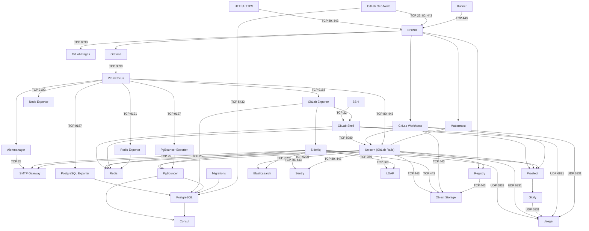
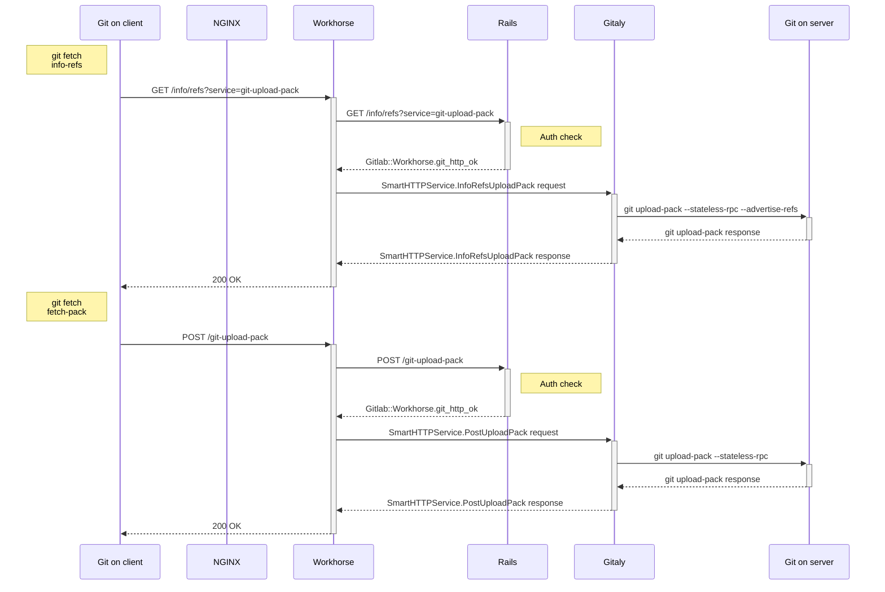
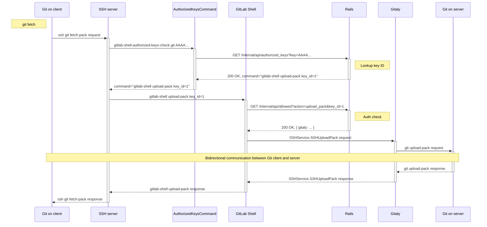

# GitLab Architecture Overview

## Software delivery

There are two software distributions of GitLab: the open source [Community Edition](https://gitlab.com/gitlab-org/gitlab-foss/) (CE), and the open core [Enterprise Edition](https://gitlab.com/gitlab-org/gitlab/) (EE). GitLab is available under [different subscriptions](https://about.gitlab.com/pricing/).

New versions of GitLab are released in stable branches and the master branch is for bleeding edge development.

For information, see the [GitLab Release Process](https://gitlab.com/gitlab-org/release/docs/-/tree/master#gitlab-release-process).

Both EE and CE require some add-on components called GitLab Shell and Gitaly. These components are available from the [GitLab Shell](https://gitlab.com/gitlab-org/gitlab-shell/-/tree/master) and [Gitaly](https://gitlab.com/gitlab-org/gitaly/-/tree/master) repositories respectively. New versions are usually tags but staying on the master branch will give you the latest stable version. New releases are generally around the same time as GitLab CE releases with the exception of informal security updates deemed critical.

## Components

A typical install of GitLab will be on GNU/Linux. It uses NGINX or Apache as a web front end to proxypass the Unicorn web server. By default, communication between Unicorn and the front end is via a Unix domain socket but forwarding requests via TCP is also supported. The web front end accesses `/home/git/gitlab/public` bypassing the Unicorn server to serve static pages, uploads (e.g. avatar images or attachments), and pre-compiled assets. GitLab serves web pages and the [GitLab API](../api/README.md) using the Unicorn web server. It uses Sidekiq as a job queue which, in turn, uses Redis as a non-persistent database backend for job information, meta data, and incoming jobs.

We also support deploying GitLab on Kubernetes using our [GitLab Helm chart](https://docs.gitlab.com/charts/).

The GitLab web app uses PostgreSQL for persistent database information (e.g. users, permissions, issues, other meta data). GitLab stores the bare Git repositories it serves in `/home/git/repositories` by default. It also keeps default branch and hook information with the bare repository.

When serving repositories over HTTP/HTTPS GitLab utilizes the GitLab API to resolve authorization and access as well as serving Git objects.

The add-on component GitLab Shell serves repositories over SSH. It manages the SSH keys within `/home/git/.ssh/authorized_keys` which should not be manually edited. GitLab Shell accesses the bare repositories through Gitaly to serve Git objects and communicates with Redis to submit jobs to Sidekiq for GitLab to process. GitLab Shell queries the GitLab API to determine authorization and access.

Gitaly executes Git operations from GitLab Shell and the GitLab web app, and provides an API to the GitLab web app to get attributes from Git (e.g. title, branches, tags, other meta data), and to get blobs (e.g. diffs, commits, files).

You may also be interested in the [production architecture of GitLab.com](https://about.gitlab.com/handbook/engineering/infrastructure/production/architecture/).

### Simplified Component Overview

This is a simplified architecture diagram that can be used to
understand GitLab's architecture.

A complete architecture diagram is available in our
[component diagram](#component-diagram) below.


<!--
To update this diagram, GitLab team members can edit this source file:
https://docs.google.com/drawings/d/1fBzAyklyveF-i-2q-OHUIqDkYfjjxC4mq5shwKSZHLs/edit.
 -->

### Component diagram



### Component legend

- ✅ - Installed by default
- ⚙ - Requires additional configuration, or GitLab Managed Apps
- ⤓ - Manual installation required
- ❌ - Not supported or no instructions available
- N/A - Not applicable

Component statuses are linked to configuration documentation for each component.

### Component list

Table description links:

- [Omnibus GitLab](https://docs.gitlab.com/omnibus/)
- [GitLab chart](https://docs.gitlab.com/charts/)
- [Minikube Minimal](https://docs.gitlab.com/charts/development/minikube/#deploying-gitlab-with-minimal-settings)
- [GitLab.com](https://gitlab.com)
- [Source](../install/installation.md)
- [GDK](https://gitlab.com/gitlab-org/gitlab-development-kit)

| Component                                             | Description                                                          | Omnibus GitLab | GitLab chart | Minikube Minimal | GitLab.com | Source | GDK |  CE/EE  |
|-------------------------------------------------------|----------------------------------------------------------------------|:--------------:|:------------:|:----------------:|:----------:|:------:|:---:|:-------:|
| [Certificate Management](#certificate-management)     | TLS Settings, Let's Encrypt                                          |       ✅        |      ✅       |        ⚙         |     ✅      |   ⚙    |  ⚙  | CE & EE |
| [Consul](#consul)                                     | Database node discovery, failover                                    |       ⚙        |      ❌       |        ❌         |     ✅      |   ❌    |  ❌  | EE Only |
| [Database Migrations](#database-migrations)           | Database migrations                                                  |       ✅        |      ✅       |        ✅         |     ✅      |   ⚙    |  ✅  | CE & EE |
| [Elasticsearch](#elasticsearch)                       | Improved search within GitLab                                        |       ⤓        |      ⤓       |        ⤓         |     ❌      |   ⤓    |  ⤓  | EE Only |
| [Gitaly](#gitaly)                                     | Git RPC service for handling all Git calls made by GitLab            |       ✅        |      ✅       |        ✅         |     ✅      |   ⚙    |  ✅  | CE & EE |
| [GitLab Exporter](#gitlab-exporter)                   | Generates a variety of GitLab metrics                                |       ✅        |      ✅       |        ✅         |     ✅      |   ❌    |  ❌  | CE & EE |
| [GitLab Geo Node](#gitlab-geo)                        | Geographically distributed GitLab nodes                              |       ⚙        |      ❌       |        ❌         |     ✅      |   ❌    |  ⚙  | EE Only |
| [GitLab Managed Apps](#gitlab-managed-apps)           | Deploy Helm, Ingress, Cert-Manager, Prometheus, a Runner, JupyterHub, or Knative to a cluster |  ⤓  |  ⤓  |      ⤓       |     ⤓      |   ⤓    |  ⤓  | CE & EE |
| [GitLab Pages](#gitlab-pages)                         | Hosts static websites                                                |       ⚙        |      ❌       |        ❌         |     ✅      |   ⚙    |  ⚙  | CE & EE |
| [GitLab self-monitoring: Alertmanager](#alertmanager) | Deduplicates, groups, and routes alerts from Prometheus              |       ⚙        |      ✅       |        ⚙         |     ✅      |   ❌    |  ❌  | CE & EE |
| [GitLab self-monitoring: Grafana](#grafana)           | Metrics dashboard                                                    |       ✅        |      ⤓       |        ⤓         |     ✅      |   ❌    |  ❌  | CE & EE |
| [GitLab self-monitoring: Jaeger](#jaeger)             | View traces generated by the GitLab instance                         |       ❌        |      ❌       |        ❌         |     ❌      |   ⤓    |  ⚙  | CE & EE |
| [GitLab self-monitoring: Prometheus](#prometheus)     | Time-series database, metrics collection, and query service          |       ✅        |      ✅       |        ⚙         |     ✅      |   ❌    |  ❌  | CE & EE |
| [GitLab self-monitoring: Sentry](#sentry)             | Track errors generated by the GitLab instance                        |       ⤓        |      ❌       |        ❌         |     ✅      |   ⤓    |  ⤓  | CE & EE |
| [GitLab Shell](#gitlab-shell)                         | Handles `git` over SSH sessions                                      |       ✅        |      ✅       |        ✅         |     ✅      |   ⚙    |  ✅  | CE & EE |
| [GitLab Workhorse](#gitlab-workhorse)                 | Smart reverse proxy, handles large HTTP requests                     |       ✅        |      ✅       |        ✅         |     ✅      |   ⚙    |  ✅  | CE & EE |
| [Inbound email (SMTP)](#inbound-email)                | Receive messages to update issues                                    |       ⤓        |      ⤓       |        ⤓         |     ✅      |   ⤓    |  ⤓  | CE & EE |
| [Jaeger integration](#jaeger)                         | Distributed tracing for deployed apps                                |       ⤓        |      ⤓       |        ⤓         |     ⤓      |   ⤓    |  ⤓  | EE Only |
| [LDAP Authentication](#ldap-authentication)           | Authenticate users against centralized LDAP directory                |       ⤓        |      ⤓       |        ⤓         |     ❌      |   ⤓    |  ⤓  | CE & EE |
| [Mattermost](#mattermost)                             | Open-source Slack alternative                                        |       ⚙        |      ⤓       |        ⤓         |     ⤓      |   ❌    |  ❌  | CE & EE |
| [MinIO](#minio)                                       | Object storage service                                               |       ⤓        |      ✅       |        ✅         |     ✅      |   ❌    |  ⚙  | CE & EE |
| [NGINX](#nginx)                                       | Routes requests to appropriate components, terminates SSL            |       ✅        |      ✅       |        ⚙         |     ✅      |   ⤓    |  ❌  | CE & EE |
| [Node Exporter](#node-exporter)                       | Prometheus endpoint with system metrics                              |       ✅        |     N/A      |       N/A        |     ✅      |   ❌    |  ❌  | CE & EE |
| [Outbound email (SMTP)](#outbound-email)              | Send email messages to users                                         |       ⤓        |      ⤓       |        ⤓         |     ✅      |   ⤓    |  ⤓  | CE & EE |
| [PgBouncer Exporter](#pgbouncer-exporter)             | Prometheus endpoint with PgBouncer metrics                           |       ⚙        |      ❌       |        ❌         |     ✅      |   ❌    |  ❌  | CE & EE |
| [PgBouncer](#pgbouncer)                               | Database connection pooling, failover                                |       ⚙        |      ❌       |        ❌         |     ✅      |   ❌    |  ❌  | EE Only |
| [PostgreSQL Exporter](#postgresql-exporter)           | Prometheus endpoint with PostgreSQL metrics                          |       ✅        |      ✅       |        ✅         |     ✅      |   ❌    |  ❌  | CE & EE |
| [PostgreSQL](#postgresql)                             | Database                                                             |       ✅        |      ✅       |        ✅         |     ✅      |   ⤓    |  ✅  | CE & EE |
| [Praefect](#praefect)                                 | A transparent proxy between any Git client and Gitaly storage nodes. |       ✅        |      ❌       |        ❌         |     ✅      |   ⚙    |  ✅  | CE & EE |
| [Redis Exporter](#redis-exporter)                     | Prometheus endpoint with Redis metrics                               |       ✅        |      ✅       |        ✅         |     ✅      |   ❌    |  ❌  | CE & EE |
| [Redis](#redis)                                       | Caching service                                                      |       ✅        |      ✅       |        ✅         |     ✅      |   ⤓    |  ✅  | CE & EE |
| [Registry](#registry)                                 | Container registry, allows pushing and pulling of images             |       ⚙        |      ✅       |        ✅         |     ✅      |   ⤓    |  ⚙  | CE & EE |
| [Runner](#gitlab-runner)                              | Executes GitLab CI/CD jobs                                           |       ⤓        |      ✅       |        ⚙         |     ✅      |   ⚙    |  ⚙  | CE & EE |
| [Sentry integration](#sentry)                         | Error tracking for deployed apps                                     |       ⤓        |      ⤓       |        ⤓         |     ⤓      |   ⤓    |  ⤓  | CE & EE |
| [Sidekiq](#sidekiq)                                   | Background jobs processor                                            |       ✅        |      ✅       |        ✅         |     ✅      |   ✅    |  ✅  | CE & EE |
| [Unicorn (GitLab Rails)](#unicorn)                    | Handles requests for the web interface and API                       |       ✅        |      ✅       |        ✅         |     ✅      |   ⚙    |  ✅  | CE & EE |

### Component details

This document is designed to be consumed by systems administrators and GitLab Support Engineers who want to understand more about the internals of GitLab and how they work together.

When deployed, GitLab should be considered the amalgamation of the below processes. When troubleshooting or debugging, be as specific as possible as to which component you are referencing. That should increase clarity and reduce confusion.

**Layers**

GitLab can be considered to have two layers from a process perspective:

- **Monitoring**: Anything from this layer is not required to deliver GitLab the application, but will allow administrators more insight into their infrastructure and what the service as a whole is doing.
- **Core**: Any process that is vital for the delivery of GitLab as a platform. If any of these processes halt there will be a GitLab outage. For the Core layer, you can further divide into:
  - **Processors**: These processes are responsible for actually performing operations and presenting the service.
  - **Data**: These services store/expose structured data for the GitLab service.

#### Alertmanager

- [Project page](https://github.com/prometheus/alertmanager/blob/master/README.md)
- Configuration:
  - [Omnibus](https://gitlab.com/gitlab-org/omnibus-gitlab/blob/master/files/gitlab-config-template/gitlab.rb.template)
  - [Charts](https://github.com/helm/charts/tree/master/stable/prometheus)
- Layer: Monitoring
- Process: `alertmanager`
- GitLab.com: [Monitoring of GitLab.com](https://about.gitlab.com/handbook/engineering/monitoring/)

[Alert manager](https://prometheus.io/docs/alerting/alertmanager/) is a tool provided by Prometheus that _"handles alerts sent by client applications such as the Prometheus server. It takes care of deduplicating, grouping, and routing them to the correct receiver integration such as email, PagerDuty, or OpsGenie. It also takes care of silencing and inhibition of alerts."_ You can read more in [issue #45740](https://gitlab.com/gitlab-org/gitlab-foss/-/issues/45740) about what we will be alerting on.

#### Certificate management

- Project page:
  - [Omnibus](https://github.com/certbot/certbot/blob/master/README.rst)
  - [Charts](https://github.com/jetstack/cert-manager/blob/master/README.md)
- Configuration:
  - [Omnibus](https://docs.gitlab.com/omnibus/settings/ssl.html)
  - [Charts](https://docs.gitlab.com/charts/installation/tls.html)
  - [Source](../install/installation.md#using-https)
  - [GDK](https://gitlab.com/gitlab-org/gitlab-development-kit/blob/master/doc/howto/https.md)
- Layer: Core Service (Processor)
- GitLab.com: [Secrets Management](https://about.gitlab.com/handbook/engineering/infrastructure/production/architecture/#secrets-management)

#### Consul

- [Project page](https://github.com/hashicorp/consul/blob/master/README.md)
- Configuration:
  - [Omnibus](../administration/high_availability/consul.md)
  - [Charts](https://docs.gitlab.com/charts/installation/deployment.html#postgresql)
- Layer: Core Service (Data)
- GitLab.com: [Consul](../user/gitlab_com/index.md#consul)

Consul is a tool for service discovery and configuration. Consul is distributed, highly available, and extremely scalable.

#### Database migrations

- Configuration:
  - [Omnibus](https://docs.gitlab.com/omnibus/settings/database.html#disabling-automatic-database-migration)
  - [Charts](https://docs.gitlab.com/charts/charts/gitlab/migrations/)
  - [Source](../update/upgrading_from_source.md#13-install-libraries-migrations-etc)
- Layer: Core Service (Data)

#### Elasticsearch

- [Project page](https://github.com/elastic/elasticsearch/)
- Configuration:
  - [Omnibus](../integration/elasticsearch.md)
  - [Charts](../integration/elasticsearch.md)
  - [Source](../integration/elasticsearch.md)
  - [GDK](https://gitlab.com/gitlab-org/gitlab-development-kit/blob/master/doc/howto/elasticsearch.md)
- Layer: Core Service (Data)
- GitLab.com: [Get Advanced Global Search working on GitLab.com](https://gitlab.com/groups/gitlab-org/-/epics/153) epic.

Elasticsearch is a distributed RESTful search engine built for the cloud.

#### Gitaly

- [Project page](https://gitlab.com/gitlab-org/gitaly/blob/master/README.md)
- Configuration:
  - [Omnibus](../administration/gitaly/index.md)
  - [Charts](https://docs.gitlab.com/charts/charts/gitlab/gitaly/)
  - [Source](../install/installation.md#install-gitaly)
- Layer: Core Service (Data)
- Process: `gitaly`
- GitLab.com: [Service Architecture](https://about.gitlab.com/handbook/engineering/infrastructure/production/architecture/#service-architecture)

Gitaly is a service designed by GitLab to remove our need for NFS for Git storage in distributed deployments of GitLab (think GitLab.com or High Availability Deployments). As of 11.3.0, this service handles all Git level access in GitLab. You can read more about the project [in the project's README](https://gitlab.com/gitlab-org/gitaly).

#### Praefect

- [Project page](https://gitlab.com/gitlab-org/gitaly/blob/master/README.md)
- Configuration:
  - [Omnibus](../administration/gitaly/index.md)
  - [Source](../install/installation.md#install-gitaly)
- Layer: Core Service (Data)
- Process: `praefect`
- GitLab.com: [Service Architecture](https://about.gitlab.com/handbook/engineering/infrastructure/production/architecture/#service-architecture)

Praefect is a transparent proxy between each Git client and the Gitaly coordinating the replication of
repository updates to secondary nodes.

#### GitLab Geo

- Configuration:
  - [Omnibus](../administration/geo/replication/index.md#setup-instructions)
  - [Charts](https://gitlab.com/gitlab-org/charts/gitlab/-/issues/8)
  - [GDK](https://gitlab.com/gitlab-org/gitlab-development-kit/blob/master/doc/howto/geo.md)
- Layer: Core Service (Processor)

#### GitLab Exporter

- [Project page](https://gitlab.com/gitlab-org/gitlab-exporter)
- Configuration:
  - [Omnibus](../administration/monitoring/prometheus/gitlab_exporter.md)
  - [Charts](https://docs.gitlab.com/charts/charts/gitlab/gitlab-exporter/index.html)
- Layer: Monitoring
- Process: `gitlab-exporter`
- GitLab.com: [Monitoring of GitLab.com](https://about.gitlab.com/handbook/engineering/monitoring/)

GitLab Exporter is a process designed in house that allows us to export metrics about GitLab application internals to Prometheus. You can read more [in the project's README](https://gitlab.com/gitlab-org/gitlab-exporter).

#### GitLab Pages

- Configuration:
  - [Omnibus](../administration/pages/index.md)
  - [Charts](https://gitlab.com/gitlab-org/charts/gitlab/-/issues/37)
  - [Source](../install/installation.md#install-gitlab-pages)
  - [GDK](https://gitlab.com/gitlab-org/gitlab-development-kit/blob/master/doc/howto/pages.md)
- Layer: Core Service (Processor)
- GitLab.com: [GitLab Pages](../user/gitlab_com/index.md#gitlab-pages)

GitLab Pages is a feature that allows you to publish static websites directly from a repository in GitLab.

You can use it either for personal or business websites, such as portfolios, documentation, manifestos, and business presentations. You can also attribute any license to your content.

#### GitLab Runner

- [Project page](https://gitlab.com/gitlab-org/gitlab-runner/blob/master/README.md)
- Configuration:
  - [Omnibus](https://docs.gitlab.com/runner/)
  - [Charts](https://docs.gitlab.com/runner/install/kubernetes.html)
  - [Source](https://docs.gitlab.com/runner/)
  - [GDK](https://gitlab.com/gitlab-org/gitlab-development-kit/blob/master/doc/howto/runner.md)
- Layer: Core Service (Processor)
- GitLab.com: [Runner](../user/gitlab_com/index.md#shared-runners)

GitLab Runner runs jobs and sends the results to GitLab.

GitLab CI/CD is the open-source continuous integration service included with GitLab that coordinates the testing. The old name of this project was `GitLab CI Multi Runner` but please use `GitLab Runner` (without CI) from now on.

#### GitLab Shell

- [Project page](https://gitlab.com/gitlab-org/gitlab-shell/blob/master/README.md)
- Configuration:
  - [Omnibus](https://gitlab.com/gitlab-org/omnibus-gitlab/blob/master/files/gitlab-config-template/gitlab.rb.template)
  - [Charts](https://docs.gitlab.com/charts/charts/gitlab/gitlab-shell/)
  - [Source](../install/installation.md#install-gitlab-shell)
  - [GDK](https://gitlab.com/gitlab-org/gitlab/blob/master/config/gitlab.yml.example)
- Layer: Core Service (Processor)
- GitLab.com: [Service Architecture](https://about.gitlab.com/handbook/engineering/infrastructure/production/architecture/#service-architecture)

[GitLab Shell](https://gitlab.com/gitlab-org/gitlab-shell) is a program designed at GitLab to handle SSH-based `git` sessions, and modifies the list of authorized keys. GitLab Shell is not a Unix shell nor a replacement for Bash or Zsh.

#### GitLab Workhorse

- [Project page](https://gitlab.com/gitlab-org/gitlab-workhorse/blob/master/README.md)
- Configuration:
  - [Omnibus](https://gitlab.com/gitlab-org/omnibus-gitlab/blob/master/files/gitlab-config-template/gitlab.rb.template)
  - [Charts](https://docs.gitlab.com/charts/charts/gitlab/unicorn/)
  - [Source](../install/installation.md#install-gitlab-workhorse)
- Layer: Core Service (Processor)
- Process: `gitlab-workhorse`
- GitLab.com: [Service Architecture](https://about.gitlab.com/handbook/engineering/infrastructure/production/architecture/#service-architecture)

[GitLab Workhorse](https://gitlab.com/gitlab-org/gitlab-workhorse) is a program designed at GitLab to help alleviate pressure from Unicorn. You can read more about the [historical reasons for developing](https://about.gitlab.com/blog/2016/04/12/a-brief-history-of-gitlab-workhorse/). It's designed to act as a smart reverse proxy to help speed up GitLab as a whole.

#### Grafana

- [Project page](https://github.com/grafana/grafana/blob/master/README.md)
- Configuration:
  - [Omnibus](../administration/monitoring/performance/grafana_configuration.md)
  - [Charts](https://github.com/helm/charts/tree/master/stable/grafana)
- Layer: Monitoring
- GitLab.com: [GitLab triage Grafana dashboard](https://dashboards.gitlab.com/d/RZmbBr7mk/gitlab-triage?refresh=30s)

Grafana is an open source, feature rich metrics dashboard and graph editor for Graphite, Elasticsearch, OpenTSDB, Prometheus, and InfluxDB.

#### Jaeger

- [Project page](https://github.com/jaegertracing/jaeger/blob/master/README.md)
- Configuration:
  - [Omnibus](https://gitlab.com/gitlab-org/omnibus-gitlab/-/issues/4104)
  - [Charts](https://gitlab.com/gitlab-org/charts/gitlab/-/issues/1320)
  - [Source](../development/distributed_tracing.md#enabling-distributed-tracing)
  - [GDK](../development/distributed_tracing.md#using-jaeger-in-the-gitlab-development-kit)
- Layer: Monitoring
- GitLab.com: [Configuration to enable Tracing for a GitLab instance](https://gitlab.com/gitlab-org/omnibus-gitlab/-/issues/4104) issue.

Jaeger, inspired by Dapper and OpenZipkin, is a distributed tracing system.
It can be used for monitoring microservices-based distributed systems.

For monitoring deployed apps, see [Jaeger tracing documentation](../user/project/operations/tracing.md)

#### Logrotate

- [Project page](https://github.com/logrotate/logrotate/blob/master/README.md)
- Configuration:
  - [Omnibus](https://docs.gitlab.com/omnibus/settings/logs.html#logrotate)
- Layer: Core Service
- Process: `logrotate`

GitLab is comprised of a large number of services that all log. We started bundling our own logrotate as of 7.4 to make sure we were logging responsibly. This is just a packaged version of the common open source offering.

#### Mattermost

- [Project page](https://github.com/mattermost/mattermost-server/blob/master/README.md)
- Configuration:
  - [Omnibus](https://docs.gitlab.com/omnibus/gitlab-mattermost/)
  - [Charts](https://docs.mattermost.com/install/install-mmte-helm-gitlab-helm.html)
- Layer: Core Service (Processor)
- GitLab.com: [Mattermost](../user/project/integrations/mattermost.md)

Mattermost is an open source, private cloud, Slack-alternative from <https://mattermost.com>.

#### MinIO

- [Project page](https://github.com/minio/minio/blob/master/README.md)
- Configuration:
  - [Omnibus](https://min.io/download)
  - [Charts](https://docs.gitlab.com/charts/charts/minio/)
  - [GDK](https://gitlab.com/gitlab-org/gitlab-development-kit/blob/master/doc/howto/object_storage.md)
- Layer: Core Service (Data)
- GitLab.com: [Storage Architecture](https://about.gitlab.com/handbook/engineering/infrastructure/production/architecture/#storage-architecture)

MinIO is an object storage server released under Apache License v2.0. It is compatible with Amazon S3 cloud storage service. It is best suited for storing unstructured data such as photos, videos, log files, backups, and container / VM images. Size of an object can range from a few KBs to a maximum of 5TB.

#### NGINX

- Project page:
  - [Omnibus](https://github.com/nginx/nginx)
  - [Charts](https://github.com/kubernetes/ingress-nginx/blob/master/README.md)
- Configuration:
  - [Omnibus](https://docs.gitlab.com/omnibus/settings/)
  - [Charts](https://docs.gitlab.com/charts/charts/nginx/)
  - [Source](../install/installation.md#9-nginx)
- Layer: Core Service (Processor)
- Process: `nginx`
- GitLab.com: [Service Architecture](https://about.gitlab.com/handbook/engineering/infrastructure/production/architecture/#service-architecture)

NGINX has an Ingress port for all HTTP requests and routes them to the appropriate sub-systems within GitLab. We are bundling an unmodified version of the popular open source webserver.

#### Node Exporter

- [Project page](https://github.com/prometheus/node_exporter/blob/master/README.md)
- Configuration:
  - [Omnibus](../administration/monitoring/prometheus/node_exporter.md)
  - [Charts](https://gitlab.com/gitlab-org/charts/gitlab/-/issues/1332)
- Layer: Monitoring
- Process: `node-exporter`
- GitLab.com: [Monitoring of GitLab.com](https://about.gitlab.com/handbook/engineering/monitoring/)

[Node Exporter](https://github.com/prometheus/node_exporter) is a Prometheus tool that gives us metrics on the underlying machine (think CPU/Disk/Load). It's just a packaged version of the common open source offering from the Prometheus project.

#### PgBouncer

- [Project page](https://github.com/pgbouncer/pgbouncer/blob/master/README.md)
- Configuration:
  - [Omnibus](../administration/high_availability/pgbouncer.md)
  - [Charts](https://docs.gitlab.com/charts/installation/deployment.html#postgresql)
- Layer: Core Service (Data)
- GitLab.com: [Database Architecture](https://about.gitlab.com/handbook/engineering/infrastructure/production/architecture/#database-architecture)

Lightweight connection pooler for PostgreSQL.

#### PgBouncer Exporter

- [Project page](https://github.com/prometheus-community/pgbouncer_exporter/blob/master/README.md)
- Configuration:
  - [Omnibus](../administration/monitoring/prometheus/pgbouncer_exporter.md)
  - [Charts](https://docs.gitlab.com/charts/installation/deployment.html#postgresql)
- Layer: Monitoring
- GitLab.com: [Monitoring of GitLab.com](https://about.gitlab.com/handbook/engineering/monitoring/)

Prometheus exporter for PgBouncer. Exports metrics at 9127/metrics.

#### PostgreSQL

- [Project page](https://github.com/postgres/postgres/blob/master/README)
- Configuration:
  - [Omnibus](https://docs.gitlab.com/omnibus/settings/database.html)
  - [Charts](https://github.com/helm/charts/tree/master/stable/postgresql)
  - [Source](../install/installation.md#6-database)
- Layer: Core Service (Data)
- Process: `postgresql`
- GitLab.com: [PostgreSQL](../user/gitlab_com/index.md#postgresql)

GitLab packages the popular Database to provide storage for Application meta data and user information.

#### PostgreSQL Exporter

- [Project page](https://github.com/wrouesnel/postgres_exporter/blob/master/README.md)
- Configuration:
  - [Omnibus](../administration/monitoring/prometheus/postgres_exporter.md)
  - [Charts](https://github.com/helm/charts/tree/master/stable/postgresql)
- Layer: Monitoring
- Process: `postgres-exporter`
- GitLab.com: [Monitoring of GitLab.com](https://about.gitlab.com/handbook/engineering/monitoring/)

[`postgres_exporter`](https://github.com/wrouesnel/postgres_exporter) is the community provided Prometheus exporter that will deliver data about PostgreSQL to Prometheus for use in Grafana Dashboards.

#### Prometheus

- [Project page](https://github.com/prometheus/prometheus/blob/master/README.md)
- Configuration:
  - [Omnibus](../administration/monitoring/prometheus/index.md)
  - [Charts](https://github.com/helm/charts/tree/master/stable/prometheus)
- Layer: Monitoring
- Process: `prometheus`
- GitLab.com: [Prometheus](../user/gitlab_com/index.md#prometheus)

Prometheus is a time-series tool that helps GitLab administrators expose metrics about the individual processes used to provide GitLab the service.

#### Redis

- [Project page](https://github.com/antirez/redis/blob/unstable/README.md)
- Configuration:
  - [Omnibus](https://docs.gitlab.com/omnibus/settings/redis.html)
  - [Charts](https://docs.gitlab.com/charts/charts/redis/)
  - [Source](../install/installation.md#7-redis)
- Layer: Core Service (Data)
- Process: `redis`
- GitLab.com: [Service Architecture](https://about.gitlab.com/handbook/engineering/infrastructure/production/architecture/#service-architecture)

Redis is packaged to provide a place to store:

- session data
- temporary cache information
- background job queues

#### Redis Exporter

- [Project page](https://github.com/oliver006/redis_exporter/blob/master/README.md)
- Configuration:
  - [Omnibus](../administration/monitoring/prometheus/redis_exporter.md)
  - [Charts](https://docs.gitlab.com/charts/charts/redis/)
- Layer: Monitoring
- Process: `redis-exporter`
- GitLab.com: [Monitoring of GitLab.com](https://about.gitlab.com/handbook/engineering/monitoring/)

[Redis Exporter](https://github.com/oliver006/redis_exporter) is designed to give specific metrics about the Redis process to Prometheus so that we can graph these metrics in Grafana.

#### Registry

- [Project page](https://github.com/docker/distribution/blob/master/README.md)
- Configuration:
  - [Omnibus](../update/upgrading_from_source.md#13-install-libraries-migrations-etc)
  - [Charts](https://docs.gitlab.com/charts/charts/registry/)
  - [Source](../administration/packages/container_registry.md#enable-the-container-registry)
  - [GDK](https://gitlab.com/gitlab-org/gitlab-development-kit/blob/master/doc/howto/registry.md)
- Layer: Core Service (Processor)
- GitLab.com: [GitLab Container Registry](../user/packages/container_registry/index.md#build-and-push-images-using-gitlab-cicd)

The registry is what users use to store their own Docker images. The bundled
registry uses NGINX as a load balancer and GitLab as an authentication manager.
Whenever a client requests to pull or push an image from the registry, it will
return a `401` response along with a header detailing where to get an
authentication token, in this case the GitLab instance. The client will then
request a pull or push auth token from GitLab and retry the original request
to the registry. Learn more about [token authentication](https://docs.docker.com/registry/spec/auth/token/).

An external registry can also be configured to use GitLab as an auth endpoint.

#### Sentry

- [Project page](https://github.com/getsentry/sentry/)
- Configuration:
  - [Omnibus](https://docs.gitlab.com/omnibus/settings/configuration.html#error-reporting-and-logging-with-sentry)
  - [Charts](https://gitlab.com/gitlab-org/charts/gitlab/-/issues/1319)
  - [Source](https://gitlab.com/gitlab-org/gitlab/blob/master/config/gitlab.yml.example)
  - [GDK](https://gitlab.com/gitlab-org/gitlab/blob/master/config/gitlab.yml.example)
- Layer: Monitoring
- GitLab.com: [Searching Sentry](https://about.gitlab.com/handbook/support/workflows/500_errors.html#searching-sentry)

Sentry fundamentally is a service that helps you monitor and fix crashes in real time.
The server is in Python, but it contains a full API for sending events from any language, in any application.

For monitoring deployed apps, see the [Sentry integration docs](../user/project/operations/error_tracking.md)

#### Sidekiq

- [Project page](https://github.com/mperham/sidekiq/blob/master/README.md)
- Configuration:
  - [Omnibus](https://gitlab.com/gitlab-org/omnibus-gitlab/blob/master/files/gitlab-config-template/gitlab.rb.template)
  - [Charts](https://docs.gitlab.com/charts/charts/gitlab/sidekiq/)
  - [Minikube Minimal](https://docs.gitlab.com/charts/charts/gitlab/sidekiq/index.html)
  - [Source](https://gitlab.com/gitlab-org/gitlab/blob/master/config/gitlab.yml.example)
  - [GDK](https://gitlab.com/gitlab-org/gitlab/blob/master/config/gitlab.yml.example)
- Layer: Core Service (Processor)
- Process: `sidekiq`
- GitLab.com: [Sidekiq](../user/gitlab_com/index.md#Sidekiq)

Sidekiq is a Ruby background job processor that pulls jobs from the Redis queue and processes them. Background jobs allow GitLab to provide a faster request/response cycle by moving work into the background.

#### Unicorn

- [Project page](https://gitlab.com/gitlab-org/gitlab/blob/master/README.md)
- Configuration:
  - [Omnibus](https://docs.gitlab.com/omnibus/settings/unicorn.html)
  - [Charts](https://docs.gitlab.com/charts/charts/gitlab/unicorn/)
  - [Source](../install/installation.md#configure-it)
  - [GDK](https://gitlab.com/gitlab-org/gitlab/blob/master/config/gitlab.yml.example)
- Layer: Core Service (Processor)
- Process: `unicorn`
- GitLab.com: [Unicorn](../user/gitlab_com/index.md#unicorn)

[Unicorn](https://yhbt.net/unicorn/) is a Ruby application server that is used to run the core Rails Application that provides the user facing features in GitLab. Often process output you will see this as `bundle` or `config.ru` depending on the GitLab version.

#### LDAP Authentication

- Configuration:
  - [Omnibus](../administration/auth/ldap/index.md)
  - [Charts](https://docs.gitlab.com/charts/charts/globals.html#ldap)
  - [Source](https://gitlab.com/gitlab-org/gitlab/blob/master/config/gitlab.yml.example)
  - [GDK](https://gitlab.com/gitlab-org/gitlab-development-kit/blob/master/doc/howto/ldap.md)
- Layer: Core Service (Processor)
- GitLab.com: [Product Tiers](https://about.gitlab.com/pricing/#gitlab-com)

#### Outbound Email

- Configuration:
  - [Omnibus](https://docs.gitlab.com/omnibus/settings/smtp.html)
  - [Charts](https://docs.gitlab.com/charts/installation/command-line-options.html#outgoing-email-configuration)
  - [Source](https://gitlab.com/gitlab-org/gitlab/blob/master/config/gitlab.yml.example)
  - [GDK](https://gitlab.com/gitlab-org/gitlab/blob/master/config/gitlab.yml.example)
- Layer: Core Service (Processor)
- GitLab.com: [Mail configuration](../user/gitlab_com/index.md#mail-configuration)

#### Inbound Email

- Configuration:
  - [Omnibus](../administration/incoming_email.md)
  - [Charts](https://docs.gitlab.com/charts/installation/command-line-options.html#incoming-email-configuration)
  - [Source](https://gitlab.com/gitlab-org/gitlab/blob/master/config/gitlab.yml.example)
  - [GDK](https://gitlab.com/gitlab-org/gitlab/blob/master/config/gitlab.yml.example)
- Layer: Core Service (Processor)
- GitLab.com: [Mail configuration](../user/gitlab_com/index.md#mail-configuration)

#### GitLab Managed Apps

- Configuration:
  - [Omnibus](../user/project/clusters/index.md#installing-applications)
  - [Charts](../user/project/clusters/index.md#installing-applications)
  - [Source](../user/project/clusters/index.md#installing-applications)
  - [GDK](../user/project/clusters/index.md#installing-applications)
- Layer: Core Service (Processor)

GitLab provides [GitLab Managed Apps](../user/project/clusters/index.md#installing-applications),
a one-click install for various applications which can be added directly to your configured cluster.
These applications are needed for Review Apps and deployments when using Auto DevOps.
You can install them after you create a cluster. This includes:

- [Helm](https://helm.sh/docs/)
- [Ingress](https://kubernetes.io/docs/concepts/services-networking/ingress/)
- [Cert-Manager](https://cert-manager.io/docs/)
- [Prometheus](https://prometheus.io/docs/introduction/overview/)
- a [Runner](https://docs.gitlab.com/runner/)
- [JupyterHub](https://jupyter.org)
- [Knative](https://cloud.google.com/knative/)

## GitLab by Request Type

GitLab provides two "interfaces" for end users to access the service:

- Web HTTP Requests (Viewing the UI/API)
- Git HTTP/SSH Requests (Pushing/Pulling Git Data)

It's important to understand the distinction as some processes are used in both and others are exclusive to a specific request type.

### GitLab Web HTTP Request Cycle

When making a request to an HTTP Endpoint (think `/users/sign_in`) the request will take the following path through the GitLab Service:

- NGINX - Acts as our first line reverse proxy.
- GitLab Workhorse - This determines if it needs to go to the Rails application or somewhere else to reduce load on Unicorn.
- Unicorn - Since this is a web request, and it needs to access the application it will go to Unicorn.
- PostgreSQL/Gitaly/Redis - Depending on the type of request, it may hit these services to store or retrieve data.

### GitLab Git Request Cycle

Below we describe the different paths that HTTP vs. SSH Git requests will take. There is some overlap with the Web Request Cycle but also some differences.

### Web Request (80/443)

Git operations over HTTP use the stateless "smart" protocol described in the
[Git documentation](https://git-scm.com/docs/http-protocol), but responsibility
for handling these operations is split across several GitLab components.

Here is a sequence diagram for `git fetch`. Note that all requests pass through
NGINX as well as any other HTTP load balancers, but are not transformed in any
way by them. All paths are presented relative to a `/namespace/project.git` URL.



The sequence is similar for `git push`, except `git-receive-pack` is used
instead of `git-upload-pack`.

### SSH Request (22)

Git operations over SSH can use the stateful protocol described in the
[Git documentation](https://git-scm.com/docs/pack-protocol#_ssh_transport), but
responsibility for handling them is split across several GitLab components.

No GitLab components speak SSH directly - all SSH connections are made between
Git on the client machine and the SSH server, which terminates the connection.
To the SSH server, all connections are authenticated as the `git` user; GitLab
users are differentiated by the SSH key presented by the client.

Here is a sequence diagram for `git fetch`, assuming [Fast SSH key lookup](../administration/operations/fast_ssh_key_lookup.md)
is enabled. Note that `AuthorizedKeysCommand` is an executable provided by
[GitLab Shell](#gitlab-shell):



The `git push` operation is very similar, except `git receive-pack` is used
instead of `git upload-pack`.

If fast SSH key lookups are not enabled, the SSH server reads from the
`~git/.ssh/authorized_keys` file to determine what command to run for a given
SSH session. This is kept up to date by an [`AuthorizedKeysWorker`](https://gitlab.com/gitlab-org/gitlab/blob/master/app/workers/authorized_keys_worker.rb)
in Rails, scheduled to run whenever an SSH key is modified by a user.

[SSH certificates](../administration/operations/ssh_certificates.md) may be used
instead of keys. In this case, `AuthorizedKeysCommand` is replaced with an
`AuthorizedPrincipalsCommand`. This extracts a username from the certificate
without using the Rails internal API, which is used instead of `key_id` in the
`/api/internal/allowed` call later.

GitLab Shell also has a few operations that do not involve Gitaly, such as
resetting two-factor authentication codes. These are handled in the same way,
except there is no round-trip into Gitaly - Rails performs the action as part
of the [internal API](internal_api.md) call, and GitLab Shell streams the
response back to the user directly.

## System Layout

When referring to `~git` in the pictures it means the home directory of the Git user which is typically `/home/git`.

GitLab is primarily installed within the `/home/git` user home directory as `git` user. Within the home directory is where the gitlabhq server software resides as well as the repositories (though the repository location is configurable).

The bare repositories are located in `/home/git/repositories`. GitLab is a Ruby on rails application so the particulars of the inner workings can be learned by studying how a Ruby on rails application works.

To serve repositories over SSH there's an add-on application called GitLab Shell which is installed in `/home/git/gitlab-shell`.

### Installation Folder Summary

To summarize here's the [directory structure of the `git` user home directory](../install/structure.md).

### Processes

```shell
ps aux | grep '^git'
```

GitLab has several components to operate. It requires a persistent database
(PostgreSQL) and Redis database, and uses Apache `httpd` or NGINX to proxypass
Unicorn. All these components should run as different system users to GitLab
(e.g., `postgres`, `redis` and `www-data`, instead of `git`).

As the `git` user it starts Sidekiq and Unicorn (a simple Ruby HTTP server
running on port `8080` by default). Under the GitLab user there are normally 4
processes: `unicorn_rails master` (1 process), `unicorn_rails worker`
(2 processes), `sidekiq` (1 process).

### Repository access

Repositories get accessed via HTTP or SSH. HTTP cloning/push/pull utilizes the GitLab API and SSH cloning is handled by GitLab Shell (previously explained).

## Troubleshooting

See the README for more information.

### Init scripts of the services

The GitLab init script starts and stops Unicorn and Sidekiq:

```plaintext
/etc/init.d/gitlab
Usage: service gitlab {start|stop|restart|reload|status}
```

Redis (key-value store/non-persistent database):

```plaintext
/etc/init.d/redis
Usage: /etc/init.d/redis {start|stop|status|restart|condrestart|try-restart}
```

SSH daemon:

```plaintext
/etc/init.d/sshd
Usage: /etc/init.d/sshd {start|stop|restart|reload|force-reload|condrestart|try-restart|status}
```

Web server (one of the following):

```plaintext
/etc/init.d/httpd
Usage: httpd {start|stop|restart|condrestart|try-restart|force-reload|reload|status|fullstatus|graceful|help|configtest}

$ /etc/init.d/nginx
Usage: nginx {start|stop|restart|reload|force-reload|status|configtest}
```

Persistent database:

```plaintext
$ /etc/init.d/postgresql
Usage: /etc/init.d/postgresql {start|stop|restart|reload|force-reload|status} [version ..]
```

### Log locations of the services

gitlabhq (includes Unicorn and Sidekiq logs):

- `/home/git/gitlab/log/` contains `application.log`, `production.log`, `sidekiq.log`, `unicorn.stdout.log`, `git_json.log` and `unicorn.stderr.log` normally.

GitLab Shell:

- `/home/git/gitlab-shell/gitlab-shell.log`

SSH:

- `/var/log/auth.log` auth log (on Ubuntu).
- `/var/log/secure` auth log (on RHEL).

NGINX:

- `/var/log/nginx/` contains error and access logs.

Apache `httpd`:

- [Explanation of Apache logs](https://httpd.apache.org/docs/2.2/logs.html).
- `/var/log/apache2/` contains error and output logs (on Ubuntu).
- `/var/log/httpd/` contains error and output logs (on RHEL).

Redis:

- `/var/log/redis/redis.log` there are also log-rotated logs there.

PostgreSQL:

- `/var/log/postgresql/*`

### GitLab specific configuration files

GitLab has configuration files located in `/home/git/gitlab/config/*`. Commonly referenced config files include:

- `gitlab.yml` - GitLab configuration.
- `unicorn.rb` - Unicorn web server settings.
- `database.yml` - Database connection settings.

GitLab Shell has a configuration file at `/home/git/gitlab-shell/config.yml`.

### Maintenance Tasks

[GitLab](https://gitlab.com/gitlab-org/gitlab/tree/master) provides Rake tasks with which you see version information and run a quick check on your configuration to ensure it is configured properly within the application. See [maintenance Rake tasks](../raketasks/maintenance.md).
In a nutshell, do the following:

```shell
sudo -i -u git
cd gitlab
bundle exec rake gitlab:env:info RAILS_ENV=production
bundle exec rake gitlab:check RAILS_ENV=production
```

Note: It is recommended to log into the `git` user using `sudo -i -u git` or `sudo su - git`. While the sudo commands provided by GitLab work in Ubuntu they do not always work in RHEL.

## GitLab.com

We've also detailed [our architecture of GitLab.com](https://about.gitlab.com/handbook/engineering/infrastructure/production/architecture/) but this is probably over the top unless you have millions of users.
