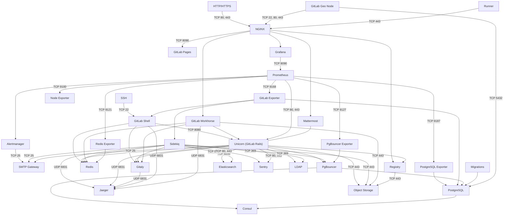

# GitLab Architecture Overview

## Software delivery

There are two software distributions of GitLab: the open source [Community Edition](https://gitlab.com/gitlab-org/gitlab-foss/) (CE), and the open core [Enterprise Edition](https://gitlab.com/gitlab-org/gitlab/) (EE). GitLab is available under [different subscriptions](https://about.gitlab.com/pricing/).

New versions of GitLab are released in stable branches and the master branch is for bleeding edge development.

For information, see the [GitLab Release Process](https://gitlab.com/gitlab-org/release/docs/tree/master#gitlab-release-process).

Both EE and CE require some add-on components called GitLab Shell and Gitaly. These components are available from the [GitLab Shell](https://gitlab.com/gitlab-org/gitlab-shell/tree/master) and [Gitaly](https://gitlab.com/gitlab-org/gitaly/tree/master) repositories respectively. New versions are usually tags but staying on the master branch will give you the latest stable version. New releases are generally around the same time as GitLab CE releases with exception for informal security updates deemed critical.

## Components

A typical install of GitLab will be on GNU/Linux. It uses NGINX or Apache as a web front end to proxypass the Unicorn web server. By default, communication between Unicorn and the front end is via a Unix domain socket but forwarding requests via TCP is also supported. The web front end accesses `/home/git/gitlab/public` bypassing the Unicorn server to serve static pages, uploads (e.g. avatar images or attachments), and precompiled assets. GitLab serves web pages and the [GitLab API](../api/README.md) using the Unicorn web server. It uses Sidekiq as a job queue which, in turn, uses Redis as a non-persistent database backend for job information, meta data, and incoming jobs.

We also support deploying GitLab on Kubernetes using our [GitLab Helm chart](https://docs.gitlab.com/charts/).

The GitLab web app uses PostgreSQL for persistent database information (e.g. users, permissions, issues, other meta data). GitLab stores the bare Git repositories it serves in `/home/git/repositories` by default. It also keeps default branch and hook information with the bare repository.

When serving repositories over HTTP/HTTPS GitLab utilizes the GitLab API to resolve authorization and access as well as serving Git objects.

The add-on component GitLab Shell serves repositories over SSH. It manages the SSH keys within `/home/git/.ssh/authorized_keys` which should not be manually edited. GitLab Shell accesses the bare repositories through Gitaly to serve Git objects and communicates with Redis to submit jobs to Sidekiq for GitLab to process. GitLab Shell queries the GitLab API to determine authorization and access.

Gitaly executes Git operations from GitLab Shell and the GitLab web app, and provides an API to the GitLab web app to get attributes from Git (e.g. title, branches, tags, other meta data), and to get blobs (e.g. diffs, commits, files).

You may also be interested in the [production architecture of GitLab.com](https://about.gitlab.com/handbook/engineering/infrastructure/production-architecture/).

### Simplified Component Overview

This is a simplified architecture diagram that can be used to
understand GitLab's architecture.

A complete architecture diagram is available in our
[component diagram](#component-diagram) below.


<!--
To update this diagram, GitLab team members can edit this source file:
https://docs.google.com/drawings/d/1fBzAyklyveF-i-2q-OHUIqDkYfjjxC4mq5shwKSZHLs/edit.
 -->

### Component diagram



### Component legend

- ✅ - Installed by default
- ⚙ - Requires additional configuration, or GitLab Managed Apps
- ⤓ - Manual installation required
- ❌ - Not supported or no instructions available
- N/A - Not applicable

Component statuses are linked to configuration documentation for each component.

### Component list

| Component | Description | [Omnibus GitLab](https://docs.gitlab.com/omnibus/) | [GitLab chart](https://docs.gitlab.com/charts/) | [Minikube Minimal](https://docs.gitlab.com/charts/development/minikube/#deploying-gitlab-with-minimal-settings) | [GitLab.com](https://gitlab.com) | [Source](../install/installation.md) | [GDK](https://gitlab.com/gitlab-org/gitlab-development-kit) | CE/EE |
| --------- | ----------- |:--------------------:|:------------------:|:-----:|:--------:|:--------:|:-------:|:-------:|
| [NGINX](#nginx) | Routes requests to appropriate components, terminates SSL | [✅][nginx-omnibus] | [✅][nginx-charts] | [⚙][nginx-charts] | [✅](https://about.gitlab.com/handbook/engineering/infrastructure/production-architecture/#service-architecture) | [⤓][nginx-source] | ❌ | CE & EE |
| [Unicorn (GitLab Rails)](#unicorn) | Handles requests for the web interface and API | [✅][unicorn-omnibus] | [✅][unicorn-charts] | [✅][unicorn-charts] | [✅](../user/gitlab_com/index.md#unicorn) | [⚙][unicorn-source] | [✅][gitlab-yml] | CE & EE |
| [Sidekiq](#sidekiq) | Background jobs processor | [✅][sidekiq-omnibus] | [✅][sidekiq-charts] | [✅](https://docs.gitlab.com/charts/charts/gitlab/sidekiq/index.html) | [✅](../user/gitlab_com/index.md#sidekiq) | [✅][gitlab-yml] | [✅][gitlab-yml] | CE & EE |
| [Gitaly](#gitaly) | Git RPC service for handling all Git calls made by GitLab | [✅][gitaly-omnibus] | [✅][gitaly-charts] | [✅][gitaly-charts] | [✅](https://about.gitlab.com/handbook/engineering/infrastructure/production-architecture/#service-architecture) | [⚙][gitaly-source] | ✅ | CE & EE |
| [GitLab Workhorse](#gitlab-workhorse) | Smart reverse proxy, handles large HTTP requests | [✅][workhorse-omnibus] | [✅][workhorse-charts] | [✅][workhorse-charts] | [✅](https://about.gitlab.com/handbook/engineering/infrastructure/production-architecture/#service-architecture) | [⚙][workhorse-source] | ✅ | CE & EE |
| [GitLab Shell](#gitlab-shell) | Handles `git` over SSH sessions | [✅][shell-omnibus] | [✅][shell-charts] | [✅][shell-charts] | [✅](https://about.gitlab.com/handbook/engineering/infrastructure/production-architecture/#service-architecture) | [⚙][shell-source] | [✅][gitlab-yml] | CE & EE |
| [GitLab Pages](#gitlab-pages) | Hosts static websites | [⚙][pages-omnibus] | [❌][pages-charts] | [❌][pages-charts] | [✅](../user/gitlab_com/index.md#gitlab-pages) | [⚙][pages-source] | [⚙][pages-gdk] | CE & EE  |
| [Registry](#registry) | Container registry, allows pushing and pulling of images | [⚙][registry-omnibus] | [✅][registry-charts] | [✅][registry-charts] | [✅](../user/packages/container_registry/index.md#build-and-push-images) | [⤓][registry-source] | [⚙][registry-gdk] | CE & EE  |
| [Redis](#redis) | Caching service | [✅][redis-omnibus] | [✅][redis-omnibus] | [✅][redis-charts] | [✅](https://about.gitlab.com/handbook/engineering/infrastructure/production-architecture/#service-architecture) | [⤓][redis-source] | ✅ | CE & EE |
| [PostgreSQL](#postgresql) | Database | [✅][postgres-omnibus] | [✅][postgres-charts] | [✅][postgres-charts] | [✅](../user/gitlab_com/index.md#postgresql) | [⤓][postgres-source] | ✅ | CE & EE |
| [PgBouncer](#pgbouncer) | Database connection pooling, failover | [⚙][pgbouncer-omnibus] | [❌][pgbouncer-charts] | [❌][pgbouncer-charts] | [✅](https://about.gitlab.com/handbook/engineering/infrastructure/production-architecture/#database-architecture) | ❌ | ❌ | EE Only |
| [Consul](#consul) | Database node discovery, failover | [⚙][consul-omnibus] | [❌][consul-charts] | [❌][consul-charts] | [✅](../user/gitlab_com/index.md#consul) | ❌ | ❌ | EE Only |
| [GitLab self-monitoring: Prometheus](#prometheus) | Time-series database, metrics collection, and query service | [✅][prometheus-omnibus] | [✅][prometheus-charts] | [⚙][prometheus-charts] | [✅](../user/gitlab_com/index.md#prometheus) | ❌ | ❌ | CE & EE |
| [GitLab self-monitoring: Alertmanager](#alertmanager) | Deduplicates, groups, and routes alerts from Prometheus | [⚙][alertmanager-omnibus] | [✅][alertmanager-charts] |  [⚙][alertmanager-charts] | [✅](https://about.gitlab.com/handbook/engineering/monitoring/) | ❌ | ❌ | CE & EE |
| [GitLab self-monitoring: Grafana](#grafana) | Metrics dashboard | [✅][grafana-omnibus] | [⤓][grafana-charts] |  [⤓][grafana-charts] | [✅](https://dashboards.gitlab.com/d/RZmbBr7mk/gitlab-triage?refresh=30s) | ❌ | ❌ | CE & EE |
| [GitLab self-monitoring: Sentry](#sentry) | Track errors generated by the GitLab instance | [⤓][sentry-omnibus] | [❌][sentry-charts] | [❌][sentry-charts] | [✅](https://about.gitlab.com/handbook/support/workflows/500_errors.html#searching-sentry) | [⤓][gitlab-yml] | [⤓][gitlab-yml] | CE & EE |
| [GitLab self-monitoring: Jaeger](#jaeger) | View traces generated by the GitLab instance | [❌][jaeger-omnibus] | [❌][jaeger-charts] | [❌][jaeger-charts] | [❌](https://gitlab.com/gitlab-org/omnibus-gitlab/issues/4104) | [⤓][jaeger-source] | [⚙][jaeger-gdk] | CE & EE |
| [Redis Exporter](#redis-exporter) | Prometheus endpoint with Redis metrics | [✅][redis-exporter-omnibus] | [✅][redis-exporter-charts] | [✅][redis-exporter-charts] | [✅](https://about.gitlab.com/handbook/engineering/monitoring/) | ❌ | ❌ | CE & EE |
| [Postgres Exporter](#postgres-exporter) | Prometheus endpoint with PostgreSQL metrics | [✅][postgres-exporter-omnibus] | [✅][postgres-exporter-charts] | [✅][postgres-exporter-charts] | [✅](https://about.gitlab.com/handbook/engineering/monitoring/) | ❌ | ❌ | CE & EE |
| [PgBouncer Exporter](#pgbouncer-exporter) | Prometheus endpoint with PgBouncer metrics | [⚙][pgbouncer-exporter-omnibus] | [❌][pgbouncer-exporter-charts] | [❌][pgbouncer-exporter-charts] | [✅](https://about.gitlab.com/handbook/engineering/monitoring/) | ❌ | ❌ | CE & EE |
| [GitLab Exporter](#gitlab-exporter) | Generates a variety of GitLab metrics | [✅][gitlab-exporter-omnibus] | [✅][gitlab-exporter-charts] | [✅][gitlab-exporter-charts] | [✅](https://about.gitlab.com/handbook/engineering/monitoring/) | ❌ | ❌ | CE & EE |
| [Node Exporter](#node-exporter) | Prometheus endpoint with system metrics | [✅][node-exporter-omnibus] | [N/A][node-exporter-charts] | [N/A][node-exporter-charts] | [✅](https://about.gitlab.com/handbook/engineering/monitoring/) | ❌ | ❌ | CE & EE |
| [Mattermost](#mattermost) | Open-source Slack alternative | [⚙][mattermost-omnibus] | [⤓][mattermost-charts] | [⤓][mattermost-charts] | [⤓](../user/project/integrations/mattermost.md) | ❌ | ❌ | CE & EE |
| [MinIO](#minio) | Object storage service | [⤓][minio-omnibus] | [✅][minio-charts] | [✅][minio-charts] | [✅](https://about.gitlab.com/handbook/engineering/infrastructure/production-architecture/#storage-architecture) | ❌ | [⚙][minio-gdk] | CE & EE |
| [Runner](#gitlab-runner) | Executes GitLab CI jobs | [⤓][runner-omnibus] | [✅][runner-charts] | [⚙][runner-charts] | [✅](../user/gitlab_com/index.md#shared-runners) | [⚙][runner-source] | [⚙][runner-gdk] | CE & EE |
| [Database Migrations](#database-migrations) | Database migrations | [✅][database-migrations-omnibus] | [✅][database-migrations-charts] | [✅][database-migrations-charts] | ✅ | [⚙][database-migrations-source] | ✅ | CE & EE |
| [Certificate Management](#certificate-management) | TLS Settings, Let's Encrypt | [✅][certificate-management-omnibus] | [✅][certificate-management-charts] | [⚙][certificate-management-charts] | [✅](https://about.gitlab.com/handbook/engineering/infrastructure/production-architecture/#secrets-management) | [⚙][certificate-management-source] | [⚙][certificate-management-gdk] | CE & EE |
| [GitLab Geo Node](#gitlab-geo) | Geographically distributed GitLab nodes | [⚙][geo-omnibus] | [❌][geo-charts] | [❌][geo-charts] | ✅ | ❌ | [⚙][geo-gdk] | EE Only |
| [LDAP Authentication](#ldap-authentication) | Authenticate users against centralized LDAP directory | [⤓][ldap-omnibus] | [⤓][ldap-charts] | [⤓][ldap-charts] | [❌](https://about.gitlab.com/pricing/#gitlab-com) | [⤓][gitlab-yml] | [⤓][ldap-gdk] | CE & EE |
| [Outbound email (SMTP)](#outbound-email) | Send email messages to users | [⤓][outbound-email-omnibus] | [⤓][outbound-email-charts] | [⤓][outbound-email-charts] | [✅](../user/gitlab_com/index.md#mail-configuration) | [⤓][gitlab-yml] | [⤓][gitlab-yml] | CE & EE |
| [Inbound email (SMTP)](#inbound-email) | Receive messages to update issues | [⤓][inbound-email-omnibus] | [⤓][inbound-email-charts] | [⤓][inbound-email-charts] | [✅](../user/gitlab_com/index.md#mail-configuration) | [⤓][gitlab-yml] | [⤓][gitlab-yml] |  CE & EE |
| [Elasticsearch](#elasticsearch) | Improved search within GitLab | [⤓][elasticsearch-omnibus] | [⤓][elasticsearch-charts] | [⤓][elasticsearch-charts] | [❌](https://gitlab.com/groups/gitlab-org/-/epics/153) | [⤓][elasticsearch-source] | [⤓][elasticsearch-gdk] | EE Only |
| [Sentry integration](#sentry) | Error tracking for deployed apps | [⤓][sentry-integration] | [⤓][sentry-integration] | [⤓][sentry-integration] | [⤓][sentry-integration] | [⤓][sentry-integration] | [⤓][sentry-integration] | CE & EE |
| [Jaeger integration](#jaeger) | Distributed tracing for deployed apps | [⤓][jaeger-integration] | [⤓][jaeger-integration] | [⤓][jaeger-integration] | [⤓][jaeger-integration] | [⤓][jaeger-integration] | [⤓][jaeger-integration] | EE Only |
| [GitLab Managed Apps](#gitlab-managed-apps) | Deploy [Helm](https://helm.sh/docs/), [Ingress](https://kubernetes.io/docs/concepts/services-networking/ingress/), [Cert-Manager](https://docs.cert-manager.io/en/latest/), [Prometheus](https://prometheus.io/docs/introduction/overview/), a [Runner](https://docs.gitlab.com/runner/), [JupyterHub](https://jupyter.org), [Knative](https://cloud.google.com/knative/) to a cluster | [⤓][managed-k8s-apps] | [⤓][managed-k8s-apps] | [⤓][managed-k8s-apps] | [⤓][managed-k8s-apps] | [⤓][managed-k8s-apps] | [⤓][managed-k8s-apps] | CE & EE |

### Component details

This document is designed to be consumed by systems administrators and GitLab Support Engineers who want to understand more about the internals of GitLab and how they work together.

When deployed, GitLab should be considered the amalgamation of the below processes. When troubleshooting or debugging, be as specific as possible as to which component you are referencing. That should increase clarity and reduce confusion.

**Layers**

GitLab can be considered to have two layers from a process perspective:

- **Monitoring**: Anything from this layer is not required to deliver GitLab the application, but will allow administrators more insight into their infrastructure and what the service as a whole is doing.
- **Core**: Any process that is vital for the delivery of GitLab as a platform. If any of these processes halt there will be a GitLab outage. For the Core layer, you can further divide into:
  - **Processors**: These processes are responsible for actually performing operations and presenting the service.
  - **Data**: These services store/expose structured data for the GitLab service.

#### Alertmanager

- [Project page](https://github.com/prometheus/alertmanager/blob/master/README.md)
- Configuration: [Omnibus][alertmanager-omnibus], [Charts][alertmanager-charts]
- Layer: Monitoring
- Process: `alertmanager`

[Alert manager](https://prometheus.io/docs/alerting/alertmanager/) is a tool provided by Prometheus that _"handles alerts sent by client applications such as the Prometheus server. It takes care of deduplicating, grouping, and routing them to the correct receiver integration such as email, PagerDuty, or OpsGenie. It also takes care of silencing and inhibition of alerts."_ You can read more in [issue #45740](https://gitlab.com/gitlab-org/gitlab-foss/issues/45740) about what we will be alerting on.

#### Certificate management

- Project page: [Omnibus](https://github.com/certbot/certbot/blob/master/README.rst), [Charts](https://github.com/jetstack/cert-manager/blob/master/README.md)
- Configuration: [Omnibus][certificate-management-omnibus], [Charts][certificate-management-charts], [Source][certificate-management-source], [GDK][certificate-management-gdk]
- Layer: Core Service (Processor)

#### Consul

- [Project page](https://github.com/hashicorp/consul/blob/master/README.md)
- Configuration: [Omnibus][consul-omnibus], [Charts][consul-charts]
- Layer: Core Service (Data)

Consul is a tool for service discovery and configuration. Consul is distributed, highly available, and extremely scalable.

#### Database migrations

- Configuration: [Omnibus][registry-omnibus], [Charts][registry-charts], [Source][database-migrations-source]
- Layer: Core Service (Data)

#### Elasticsearch

- [Project page](https://github.com/elastic/elasticsearch/blob/master/README.textile)
- Configuration: [Omnibus][elasticsearch-omnibus], [Charts][elasticsearch-charts], [Source][elasticsearch-source], [GDK][elasticsearch-gdk]
- Layer: Core Service (Data)

Elasticsearch is a distributed RESTful search engine built for the cloud.

#### Gitaly

- [Project page](https://gitlab.com/gitlab-org/gitaly/blob/master/README.md)
- Configuration: [Omnibus][gitaly-omnibus], [Charts][gitaly-charts], [Source][gitaly-source]
- Layer: Core Service (Data)
- Process: `gitaly`

Gitaly is a service designed by GitLab to remove our need for NFS for Git storage in distributed deployments of GitLab (think GitLab.com or High Availability Deployments). As of 11.3.0, this service handles all Git level access in GitLab. You can read more about the project [in the project's readme](https://gitlab.com/gitlab-org/gitaly).

#### GitLab Geo

- Configuration: [Omnibus][geo-omnibus], [Charts][geo-charts], [GDK][geo-gdk]
- Layer: Core Service (Processor)

#### GitLab Exporter

- [Project page](https://gitlab.com/gitlab-org/gitlab-exporter)
- Configuration: [Omnibus][gitlab-exporter-omnibus], [Charts][gitlab-exporter-charts]
- Layer: Monitoring
- Process: `gitlab-exporter`

GitLab Exporter is a process designed in house that allows us to export metrics about GitLab application internals to Prometheus. You can read more [in the project's readme](https://gitlab.com/gitlab-org/gitlab-exporter).

#### GitLab Pages

- Configuration: [Omnibus][pages-omnibus], [Charts][pages-charts], [Source][pages-source], [GDK][pages-gdk]
- Layer: Core Service (Processor)

GitLab Pages is a feature that allows you to publish static websites directly from a repository in GitLab.

You can use it either for personal or business websites, such as portfolios, documentation, manifestos, and business presentations. You can also attribute any license to your content.

#### GitLab Runner

- [Project page](https://gitlab.com/gitlab-org/gitlab-runner/blob/master/README.md)
- Configuration: [Omnibus][runner-omnibus], [Charts][runner-charts], [Source][runner-source], [GDK][runner-gdk]
- Layer: Core Service (Processor)

GitLab Runner runs tests and sends the results to GitLab.

GitLab CI is the open-source continuous integration service included with GitLab that coordinates the testing. The old name of this project was GitLab CI Multi Runner but please use "GitLab Runner" (without CI) from now on.

#### GitLab Shell

- [Project page](https://gitlab.com/gitlab-org/gitlab-shell/blob/master/README.md)
- Configuration: [Omnibus][shell-omnibus], [Charts][shell-charts], [Source][shell-source], [GDK][gitlab-yml]
- Layer: Core Service (Processor)

[GitLab Shell](https://gitlab.com/gitlab-org/gitlab-shell) is a program designed at GitLab to handle SSH-based `git` sessions, and modifies the list of authorized keys. GitLab Shell is not a Unix shell nor a replacement for Bash or Zsh.

#### GitLab Workhorse

- [Project page](https://gitlab.com/gitlab-org/gitlab-workhorse/blob/master/README.md)
- Configuration: [Omnibus][workhorse-omnibus], [Charts][workhorse-charts], [Source][workhorse-source]
- Layer: Core Service (Processor)
- Process: `gitlab-workhorse`

[GitLab Workhorse](https://gitlab.com/gitlab-org/gitlab-workhorse) is a program designed at GitLab to help alleviate pressure from Unicorn. You can read more about the [historical reasons for developing](https://about.gitlab.com/blog/2016/04/12/a-brief-history-of-gitlab-workhorse/). It's designed to act as a smart reverse proxy to help speed up GitLab as a whole.

#### Grafana

- [Project page](https://github.com/grafana/grafana/blob/master/README.md)
- Configuration: [Omnibus][grafana-omnibus], [Charts][grafana-charts]
- Layer: Monitoring

Grafana is an open source, feature rich metrics dashboard and graph editor for Graphite, Elasticsearch, OpenTSDB, Prometheus and InfluxDB.

#### Jaeger

- [Project page](https://github.com/jaegertracing/jaeger/blob/master/README.md)
- Configuration: [Omnibus][jaeger-omnibus], [Charts][jaeger-charts], [Source][jaeger-source], [GDK][jaeger-gdk]
- Layer: Monitoring

Jaeger, inspired by Dapper and OpenZipkin, is a distributed tracing system. It can be used for monitoring microservices-based distributed systems.

#### Logrotate

- [Project page](https://github.com/logrotate/logrotate/blob/master/README.md)
- Configuration: [Omnibus](https://docs.gitlab.com/omnibus/settings/logs.html#logrotate)
- Layer: Core Service
- Process: `logrotate`

GitLab is comprised of a large number of services that all log. We started bundling our own logrotate as of 7.4 to make sure we were logging responsibly. This is just a packaged version of the common open source offering.

#### Mattermost

- [Project page](https://github.com/mattermost/mattermost-server/blob/master/README.md)
- Configuration: [Omnibus][mattermost-omnibus], [Charts][mattermost-charts]
- Layer: Core Service (Processor)

Mattermost is an open source, private cloud, Slack-alternative from <https://mattermost.com>.

#### MinIO

- [Project page](https://github.com/minio/minio/blob/master/README.md)
- Configuration: [Omnibus][minio-omnibus], [Charts][minio-charts], [GDK][minio-gdk]
- Layer: Core Service (Data)

MinIO is an object storage server released under Apache License v2.0. It is compatible with Amazon S3 cloud storage service. It is best suited for storing unstructured data such as photos, videos, log files, backups and container / VM images. Size of an object can range from a few KBs to a maximum of 5TB.

#### NGINX

- Project page: [Omnibus](https://github.com/nginx/nginx), [Charts](https://github.com/kubernetes/ingress-nginx/blob/master/README.md)
- Configuration: [Omnibus][nginx-omnibus], [Charts][nginx-charts], [Source][nginx-source]
- Layer: Core Service (Processor)
- Process: `nginx`

NGINX has an Ingress port for all HTTP requests and routes them to the appropriate sub-systems within GitLab. We are bundling an unmodified version of the popular open source webserver.

#### Node Exporter

- [Project page](https://github.com/prometheus/node_exporter/blob/master/README.md)
- Configuration: [Omnibus][node-exporter-omnibus], [Charts][node-exporter-charts]
- Layer: Monitoring
- Process: `node-exporter`

[Node Exporter](https://github.com/prometheus/node_exporter) is a Prometheus tool that gives us metrics on the underlying machine (think CPU/Disk/Load). It's just a packaged version of the common open source offering from the Prometheus project.

#### PgBouncer

- [Project page](https://github.com/pgbouncer/pgbouncer/blob/master/README.md)
- Configuration: [Omnibus][pgbouncer-omnibus], [Charts][pgbouncer-charts]
- Layer: Core Service (Data)

Lightweight connection pooler for PostgreSQL.

#### PgBouncer Exporter

- [Project page](https://github.com/stanhu/pgbouncer_exporter/blob/master/README.md)
- Configuration: [Omnibus][pgbouncer-exporter-omnibus], [Charts][pgbouncer-exporter-charts]
- Layer: Monitoring

Prometheus exporter for PgBouncer. Exports metrics at 9127/metrics.

#### PostgreSQL

- [Project page](https://github.com/postgres/postgres/blob/master/README)
- Configuration: [Omnibus][postgres-omnibus], [Charts][postgres-charts], [Source][postgres-source]
- Layer: Core Service (Data)
- Process: `postgresql`

GitLab packages the popular Database to provide storage for Application meta data and user information.

#### Postgres Exporter

- [Project page](https://github.com/wrouesnel/postgres_exporter/blob/master/README.md)
- Configuration: [Omnibus][postgres-exporter-omnibus], [Charts][postgres-exporter-charts]
- Layer: Monitoring
- Process: `postgres-exporter`

[Postgres-exporter](https://github.com/wrouesnel/postgres_exporter) is the community provided Prometheus exporter that will deliver data about Postgres to Prometheus for use in Grafana Dashboards.

#### Prometheus

- [Project page](https://github.com/prometheus/prometheus/blob/master/README.md)
- Configuration: [Omnibus][prometheus-omnibus], [Charts][prometheus-charts]
- Layer: Monitoring
- Process: `prometheus`

Prometheus is a time-series tool that helps GitLab administrators expose metrics about the individual processes used to provide GitLab the service.

#### Redis

- [Project page](https://github.com/antirez/redis/blob/unstable/README.md)
- Configuration: [Omnibus][redis-omnibus], [Charts][redis-charts], [Source][redis-source]
- Layer: Core Service (Data)
- Process: `redis`

Redis is packaged to provide a place to store:

- session data
- temporary cache information
- background job queues

#### Redis Exporter

- [Project page](https://github.com/oliver006/redis_exporter/blob/master/README.md)
- Configuration: [Omnibus][redis-exporter-omnibus], [Charts][redis-exporter-charts]
- Layer: Monitoring
- Process: `redis-exporter`

[Redis Exporter](https://github.com/oliver006/redis_exporter) is designed to give specific metrics about the Redis process to Prometheus so that we can graph these metrics in Grafana.

#### Registry

- [Project page](https://github.com/docker/distribution/blob/master/README.md)
- Configuration: [Omnibus][registry-omnibus], [Charts][registry-charts], [Source][registry-source], [GDK][registry-gdk]
- Layer: Core Service (Processor)

The registry is what users use to store their own Docker images. The bundled
registry uses NGINX as a load balancer and GitLab as an authentication manager.
Whenever a client requests to pull or push an image from the registry, it will
return a `401` response along with a header detailing where to get an
authentication token, in this case the GitLab instance. The client will then
request a pull or push auth token from GitLab and retry the original request
to the registry. Learn more about [token authentication](https://docs.docker.com/registry/spec/auth/token/).

An external registry can also be configured to use GitLab as an auth endpoint.

#### Sentry

- [Project page](https://github.com/getsentry/sentry/blob/master/README.rst)
- Configuration: [Omnibus][sentry-omnibus], [Charts][sentry-charts], [Source][gitlab-yml], [GDK][gitlab-yml]
- Layer: Monitoring

Sentry fundamentally is a service that helps you monitor and fix crashes in realtime. The server is in Python, but it contains a full API for sending events from any language, in any application.

#### Sidekiq

- [Project page](https://github.com/mperham/sidekiq/blob/master/README.md)
- Configuration: [Omnibus][sidekiq-omnibus], [Charts][sidekiq-charts], [Source][gitlab-yml], [GDK][gitlab-yml]
- Layer: Core Service (Processor)
- Process: `sidekiq`

Sidekiq is a Ruby background job processor that pulls jobs from the Redis queue and processes them. Background jobs allow GitLab to provide a faster request/response cycle by moving work into the background.

#### Unicorn

- [Project page](https://gitlab.com/gitlab-org/gitlab/blob/master/README.md)
- Configuration: [Omnibus][unicorn-omnibus], [Charts][unicorn-charts], [Source][unicorn-source], [GDK][gitlab-yml]
- Layer: Core Service (Processor)
- Process: `unicorn`

[Unicorn](https://bogomips.org/unicorn/) is a Ruby application server that is used to run the core Rails Application that provides the user facing features in GitLab. Often process output you will see this as `bundle` or `config.ru` depending on the GitLab version.

#### LDAP Authentication

- Configuration: [Omnibus][ldap-omnibus], [Charts][ldap-charts], [Source][gitlab-yml], [GDK][ldap-gdk]
- Layer: Core Service (Processor)

#### Outbound Email

- Configuration: [Omnibus][outbound-email-omnibus], [Charts][outbound-email-charts], [Source][gitlab-yml], [GDK][gitlab-yml]
- Layer: Core Service (Processor)

#### Inbound Email

- Configuration: [Omnibus][inbound-email-omnibus], [Charts][inbound-email-charts], [Source][gitlab-yml], [GDK][gitlab-yml]
- Layer: Core Service (Processor)

#### GitLab Managed Apps

- Configuration: [Omnibus][managed-k8s-apps], [Charts][managed-k8s-apps], [Source][managed-k8s-apps], [GDK][managed-k8s-apps]
- Layer: Core Service (Processor)

GitLab provides [GitLab Managed Apps](../user/project/clusters/index.md#installing-applications), a one-click install for various applications which can be added directly to your configured cluster. These applications are needed for Review Apps and deployments when using Auto DevOps. You can install them after you create a cluster.

## GitLab by Request Type

GitLab provides two "interfaces" for end users to access the service:

- Web HTTP Requests (Viewing the UI/API)
- Git HTTP/SSH Requests (Pushing/Pulling Git Data)

It's important to understand the distinction as some processes are used in both and others are exclusive to a specific request type.

### GitLab Web HTTP Request Cycle

When making a request to an HTTP Endpoint (think `/users/sign_in`) the request will take the following path through the GitLab Service:

- NGINX - Acts as our first line reverse proxy.
- GitLab Workhorse - This determines if it needs to go to the Rails application or somewhere else to reduce load on Unicorn.
- Unicorn - Since this is a web request, and it needs to access the application it will go to Unicorn.
- Postgres/Gitaly/Redis - Depending on the type of request, it may hit these services to store or retrieve data.

### GitLab Git Request Cycle

Below we describe the different pathing that HTTP vs. SSH Git requests will take. There is some overlap with the Web Request Cycle but also some differences.

### Web Request (80/443)

TODO

### SSH Request (22)

TODO

## System Layout

When referring to `~git` in the pictures it means the home directory of the Git user which is typically `/home/git`.

GitLab is primarily installed within the `/home/git` user home directory as `git` user. Within the home directory is where the gitlabhq server software resides as well as the repositories (though the repository location is configurable).

The bare repositories are located in `/home/git/repositories`. GitLab is a ruby on rails application so the particulars of the inner workings can be learned by studying how a ruby on rails application works.

To serve repositories over SSH there's an add-on application called GitLab Shell which is installed in `/home/git/gitlab-shell`.

### Installation Folder Summary

To summarize here's the [directory structure of the `git` user home directory](../install/structure.md).

### Processes

```sh
ps aux | grep '^git'
```

GitLab has several components to operate. It requires a persistent database
(PostgreSQL) and Redis database, and uses Apache httpd or NGINX to proxypass
Unicorn. All these components should run as different system users to GitLab
(e.g., `postgres`, `redis` and `www-data`, instead of `git`).

As the `git` user it starts Sidekiq and Unicorn (a simple ruby HTTP server
running on port `8080` by default). Under the GitLab user there are normally 4
processes: `unicorn_rails master` (1 process), `unicorn_rails worker`
(2 processes), `sidekiq` (1 process).

### Repository access

Repositories get accessed via HTTP or SSH. HTTP cloning/push/pull utilizes the GitLab API and SSH cloning is handled by GitLab Shell (previously explained).

## Troubleshooting

See the README for more information.

### Init scripts of the services

The GitLab init script starts and stops Unicorn and Sidekiq:

```
/etc/init.d/gitlab
Usage: service gitlab {start|stop|restart|reload|status}
```

Redis (key-value store/non-persistent database):

```
/etc/init.d/redis
Usage: /etc/init.d/redis {start|stop|status|restart|condrestart|try-restart}
```

SSH daemon:

```
/etc/init.d/sshd
Usage: /etc/init.d/sshd {start|stop|restart|reload|force-reload|condrestart|try-restart|status}
```

Web server (one of the following):

```
/etc/init.d/httpd
Usage: httpd {start|stop|restart|condrestart|try-restart|force-reload|reload|status|fullstatus|graceful|help|configtest}

$ /etc/init.d/nginx
Usage: nginx {start|stop|restart|reload|force-reload|status|configtest}
```

Persistent database:

```
$ /etc/init.d/postgresql
Usage: /etc/init.d/postgresql {start|stop|restart|reload|force-reload|status} [version ..]
```

### Log locations of the services

gitlabhq (includes Unicorn and Sidekiq logs):

- `/home/git/gitlab/log/` contains `application.log`, `production.log`, `sidekiq.log`, `unicorn.stdout.log`, `git_json.log` and `unicorn.stderr.log` normally.

GitLab Shell:

- `/home/git/gitlab-shell/gitlab-shell.log`

SSH:

- `/var/log/auth.log` auth log (on Ubuntu).
- `/var/log/secure` auth log (on RHEL).

NGINX:

- `/var/log/nginx/` contains error and access logs.

Apache httpd:

- [Explanation of Apache logs](https://httpd.apache.org/docs/2.2/logs.html).
- `/var/log/apache2/` contains error and output logs (on Ubuntu).
- `/var/log/httpd/` contains error and output logs (on RHEL).

Redis:

- `/var/log/redis/redis.log` there are also log-rotated logs there.

PostgreSQL:

- `/var/log/postgresql/*`

### GitLab specific config files

GitLab has configuration files located in `/home/git/gitlab/config/*`. Commonly referenced config files include:

- `gitlab.yml` - GitLab configuration.
- `unicorn.rb` - Unicorn web server settings.
- `database.yml` - Database connection settings.

GitLab Shell has a configuration file at `/home/git/gitlab-shell/config.yml`.

### Maintenance Tasks

[GitLab](https://gitlab.com/gitlab-org/gitlab/tree/master) provides rake tasks with which you see version information and run a quick check on your configuration to ensure it is configured properly within the application. See [maintenance rake tasks](https://gitlab.com/gitlab-org/gitlab/blob/master/doc/raketasks/maintenance.md).
In a nutshell, do the following:

```
sudo -i -u git
cd gitlab
bundle exec rake gitlab:env:info RAILS_ENV=production
bundle exec rake gitlab:check RAILS_ENV=production
```

Note: It is recommended to log into the `git` user using `sudo -i -u git` or `sudo su - git`. While the sudo commands provided by gitlabhq work in Ubuntu they do not always work in RHEL.

## GitLab.com

We've also detailed [our architecture of GitLab.com](https://about.gitlab.com/handbook/engineering/infrastructure/production/architecture/) but this is probably over the top unless you have millions of users.

[alertmanager-omnibus]: https://gitlab.com/gitlab-org/omnibus-gitlab/blob/master/files/gitlab-config-template/gitlab.rb.template
[alertmanager-charts]: https://github.com/helm/charts/tree/master/stable/prometheus
[nginx-omnibus]: https://docs.gitlab.com/omnibus/settings/
[nginx-charts]: https://docs.gitlab.com/charts/charts/nginx/
[nginx-source]: ../install/installation.md#9-nginx
[unicorn-omnibus]: https://docs.gitlab.com/omnibus/settings/unicorn.html
[unicorn-charts]: https://docs.gitlab.com/charts/charts/gitlab/unicorn/
[unicorn-source]: ../install/installation.md#configure-it
[gitlab-yml]: https://gitlab.com/gitlab-org/gitlab/blob/master/config/gitlab.yml.example
[sidekiq-omnibus]: https://gitlab.com/gitlab-org/omnibus-gitlab/blob/master/files/gitlab-config-template/gitlab.rb.template
[sidekiq-charts]: https://docs.gitlab.com/charts/charts/gitlab/sidekiq/
[gitaly-omnibus]: ../administration/gitaly/index.md
[gitaly-charts]: https://docs.gitlab.com/charts/charts/gitlab/gitaly/
[gitaly-source]: ../install/installation.md#install-gitaly
[workhorse-omnibus]: https://gitlab.com/gitlab-org/omnibus-gitlab/blob/master/files/gitlab-config-template/gitlab.rb.template
[workhorse-charts]: https://docs.gitlab.com/charts/charts/gitlab/unicorn/
[workhorse-source]: ../install/installation.md#install-gitlab-workhorse
[shell-omnibus]: https://gitlab.com/gitlab-org/omnibus-gitlab/blob/master/files/gitlab-config-template/gitlab.rb.template
[shell-charts]: https://docs.gitlab.com/charts/charts/gitlab/gitlab-shell/
[shell-source]: ../install/installation.md#install-gitlab-shell
[pages-omnibus]: ../administration/pages/index.md
[pages-charts]: https://gitlab.com/gitlab-org/charts/gitlab/issues/37
[pages-source]: ../install/installation.md#install-gitlab-pages
[pages-gdk]: https://gitlab.com/gitlab-org/gitlab-development-kit/blob/master/doc/howto/pages.md
[registry-omnibus]: ../administration/packages/container_registry.md#container-registry-domain-configuration
[registry-charts]: https://docs.gitlab.com/charts/charts/registry/
[registry-source]: ../administration/packages/container_registry.md#enable-the-container-registry
[registry-gdk]: https://gitlab.com/gitlab-org/gitlab-development-kit/blob/master/doc/howto/registry.md
[redis-omnibus]: https://docs.gitlab.com/omnibus/settings/redis.html
[redis-charts]: https://docs.gitlab.com/charts/charts/redis/
[redis-source]: ../install/installation.md#7-redis
[postgres-omnibus]: https://docs.gitlab.com/omnibus/settings/database.html
[postgres-charts]: https://github.com/helm/charts/tree/master/stable/postgresql
[postgres-source]: ../install/installation.md#6-database
[pgbouncer-omnibus]: ../administration/high_availability/pgbouncer.md
[pgbouncer-charts]: https://docs.gitlab.com/charts/installation/deployment.html#postgresql
[consul-omnibus]: ../administration/high_availability/consul.md
[consul-charts]: https://docs.gitlab.com/charts/installation/deployment.html#postgresql
[prometheus-omnibus]: ../administration/monitoring/prometheus/index.md
[prometheus-charts]: https://github.com/helm/charts/tree/master/stable/prometheus
[grafana-omnibus]: ../administration/monitoring/performance/grafana_configuration.md
[grafana-charts]: https://github.com/helm/charts/tree/master/stable/grafana
[sentry-omnibus]: https://docs.gitlab.com/omnibus/settings/configuration.html#error-reporting-and-logging-with-sentry
[sentry-charts]: https://gitlab.com/gitlab-org/charts/gitlab/issues/1319
[jaeger-omnibus]: https://gitlab.com/gitlab-org/omnibus-gitlab/issues/4104
[jaeger-charts]: https://gitlab.com/gitlab-org/charts/gitlab/issues/1320
[jaeger-source]: ../development/distributed_tracing.md#enabling-distributed-tracing
[jaeger-gdk]: ../development/distributed_tracing.html#using-jaeger-in-the-gitlab-development-kit
[redis-exporter-omnibus]: ../administration/monitoring/prometheus/redis_exporter.md
[redis-exporter-charts]: https://docs.gitlab.com/charts/charts/redis/
[postgres-exporter-omnibus]: ../administration/monitoring/prometheus/postgres_exporter.md
[postgres-exporter-charts]: https://github.com/helm/charts/tree/master/stable/postgresql
[pgbouncer-exporter-omnibus]: ../administration/monitoring/prometheus/pgbouncer_exporter.md
[pgbouncer-exporter-charts]: https://docs.gitlab.com/charts/installation/deployment.html#postgresql
[gitlab-exporter-omnibus]: ../administration/monitoring/prometheus/gitlab_exporter.md
[gitlab-exporter-charts]: https://docs.gitlab.com/charts/charts/gitlab/gitlab-exporter/index.html
[node-exporter-omnibus]: ../administration/monitoring/prometheus/node_exporter.md
[node-exporter-charts]: https://gitlab.com/gitlab-org/charts/gitlab/issues/1332
[mattermost-omnibus]: https://docs.gitlab.com/omnibus/gitlab-mattermost/
[mattermost-charts]: https://docs.mattermost.com/install/install-mmte-helm-gitlab-helm.html
[minio-omnibus]: https://min.io/download
[minio-charts]: https://docs.gitlab.com/charts/charts/minio/
[minio-gdk]: https://gitlab.com/gitlab-org/gitlab-development-kit/blob/master/doc/howto/object_storage.md
[runner-omnibus]: https://docs.gitlab.com/runner/
[runner-charts]: https://docs.gitlab.com/runner/install/kubernetes.html
[runner-source]: https://docs.gitlab.com/runner/
[runner-gdk]: https://gitlab.com/gitlab-org/gitlab-development-kit/blob/master/doc/howto/runner.md
[database-migrations-omnibus]: https://docs.gitlab.com/omnibus/settings/database.html#disabling-automatic-database-migration
[database-migrations-charts]: https://docs.gitlab.com/charts/charts/gitlab/migrations/
[database-migrations-source]: ../update/upgrading_from_source.md#13-install-libs-migrations-etc
[certificate-management-omnibus]: https://docs.gitlab.com/omnibus/settings/ssl.html
[certificate-management-charts]: https://docs.gitlab.com/charts/installation/tls.html
[certificate-management-source]: ../install/installation.md#using-https
[certificate-management-gdk]: https://gitlab.com/gitlab-org/gitlab-development-kit/blob/master/doc/howto/https.md
[geo-omnibus]: ../administration/geo/replication/index.md#setup-instructions
[geo-charts]: https://gitlab.com/gitlab-org/charts/gitlab/issues/8
[geo-gdk]: https://gitlab.com/gitlab-org/gitlab-development-kit/blob/master/doc/howto/geo.md
[ldap-omnibus]: ../administration/auth/ldap.md
[ldap-charts]: https://docs.gitlab.com/charts/charts/globals.html#ldap
[ldap-gdk]: https://gitlab.com/gitlab-org/gitlab-development-kit/blob/master/doc/howto/ldap.md
[outbound-email-omnibus]: https://docs.gitlab.com/omnibus/settings/smtp.html
[outbound-email-charts]: https://docs.gitlab.com/charts/installation/command-line-options.html#outgoing-email-configuration
[inbound-email-omnibus]: ../administration/incoming_email.md
[inbound-email-charts]: https://docs.gitlab.com/charts/installation/command-line-options.html#incoming-email-configuration
[elasticsearch-omnibus]: ../integration/elasticsearch.md
[elasticsearch-charts]: ../integration/elasticsearch.md
[elasticsearch-source]: ../integration/elasticsearch.md
[elasticsearch-gdk]: https://gitlab.com/gitlab-org/gitlab-development-kit/blob/master/doc/howto/elasticsearch.md
[sentry-integration]: ../user/project/operations/error_tracking.md
[jaeger-integration]: ../user/project/operations/tracing.md
[managed-k8s-apps]: ../user/project/clusters/index.md#installing-applications
