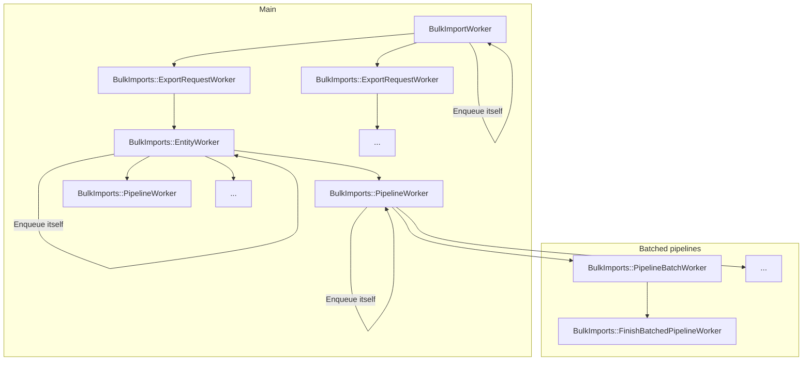
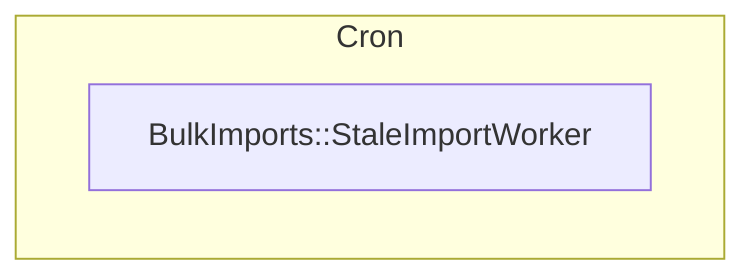
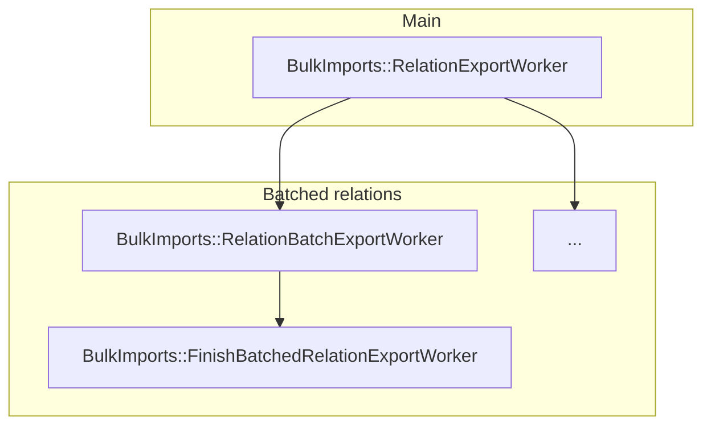

> [!note]
> To use direct transfer, ensure your GitLab installation is accessible from
> [GitLab IP addresses](../user/gitlab_com/_index.md#ip-range) and has a public DNS entry.

[Group migration by direct transfer](../user/group/import/_index.md) is the
evolution of migrating groups and projects using file exports. The goal is to have an easier way for the user to migrate a whole group,
including projects, from one GitLab instance to another.

## Design decisions

The following architectural diagram illustrates how the Group Migration
works with a set of [ETL](#etl) Pipelines leveraging from the current [GitLab APIs](#api).

### ETL

<!-- Direct quote from the IBM URL link -->

> ETL, for extract, transform and load, is a data integration process that
> combines data from multiple data sources into a single, consistent data store
> that is loaded into a data warehouse or other target system.

Using [ETL](https://www.ibm.com/think/topics/etl) architecture makes the code more explicit and easier to follow, test and extend. The
idea is to have one ETL pipeline for each relation to be imported.

### API

The current [project](../user/project/settings/import_export.md#migrate-projects-by-uploading-an-export-file) and
[group](../user/project/settings/import_export.md#migrate-groups-by-uploading-an-export-file-deprecated) imports are file based, so
they require an export step to generate the file to be imported.

Group migration by direct transfer leverages the [GitLab API](../api/rest/_index.md) to speed the migration.

And, because we're on the road to [GraphQL](../api/graphql/_index.md),
Group migration by direct transfer can contribute to expanding GraphQL API coverage, which benefits both GitLab
and its users.

### Namespace

The migration process starts with the creation of a [`BulkImport`](https://gitlab.com/gitlab-org/gitlab/-/blob/master/app/models/bulk_import.rb)
record to keep track of the migration. From there all the code related to the
GitLab Group Migration can be found under the new `BulkImports` namespace in all the application layers.

### Idempotency

To ensure we don't get duplicate entries when re-running the same Sidekiq job, we cache each entry as it's processed and skip entries if they're present in the cache.

There are two different strategies:

- `BulkImports::Pipeline::HexdigestCacheStrategy`, which caches a hexdigest representation of the data.
- `BulkImports::Pipeline::IndexCacheStrategy`, which caches the last processed index of an entry in a pipeline.

### Sidekiq jobs execution hierarchy

On destination instance:

On source instance:

## User contribution mapping

Direct transfer supports [user contribution mapping](user_contribution_mapping.md), which allows imported records to be attributed to placeholder users until a real user can be assigned after the import completes.

### Central components

- `BulkImports::Common::Pipelines::MembersPipeline` is the pipeline responsible for creating most source user and placeholder records because user contributions typically come from group and project members. Its transformer, `BulkImports::Common::Transformers::SourceUserMemberAttributesTransformer` calls `Import::SourceUserMapper` to map source members attributes to users on the destination. However, because users don't have to be members to make contributions, and imported relation data may not include identifying user data like names and usernames, source users may get created by other relation pipelines without them.
- `BulkImports::SourceUsersAttributesWorker` backfills source user information for non-member contributors. It's initially called at the beginning of a migration, just before `BulkImportWorker` in `BulkImports::CreateService`. `BulkImports::SourceUsersAttributesWorker` calls `BulkImports::UpdateSourceUsersService` for each entity's top-level namespace and continuously re-enqueues itself every 5 minutes until the bulk import is completed.
- `BulkImports::UpdateSourceUsersService` queries for `Import::SourceUser` records missing a `source_name` or `source_username` associated with the current migration, then makes a GraphQL to the source instance to fetch the missing names and usernames and finally updates the source users missing information.

### Key classes

| Class | Purpose |
|-------|---------|
| [`BulkImports::Pipeline::Context`](https://gitlab.com/gitlab-org/gitlab/-/blob/master/lib/bulk_imports/pipeline/context.rb) | Provides `source_user_mapper` and `source_ghost_user_id` to pipelines. |
| [`BulkImports::CreateService`](https://gitlab.com/gitlab-org/gitlab/-/blob/master/app/services/bulk_imports/create_service.rb) | Entry point that enables user mapping. |
| [`BulkImports::NdjsonPipeline`](https://gitlab.com/gitlab-org/gitlab/-/blob/master/lib/bulk_imports/ndjson_pipeline.rb) | Creates `Import::SourceUser` records before persisting relations using `ImportExport::Base::RelationFactory` and caches placeholder references during relation import for the relations that require them. |
| [`BulkImports::Common::Pipelines::MembersPipeline`](https://gitlab.com/gitlab-org/gitlab/-/blob/master/lib/bulk_imports/common/pipelines/members_pipeline.rb) | Responsible for creating most source user and placeholder records as user contributions typically come from group and project members |
| [`BulkImports::Common::Transformers::SourceUserMemberAttributesTransformer`](https://gitlab.com/gitlab-org/gitlab/-/blob/master/lib/bulk_imports/common/transformers/source_user_member_attributes_transformer.rb) | Calls `Import::SourceUserMapper` to map source members attributes to users on the destination. However, because users don't have to be members to make contributions, and imported relation data may not include identifying user data like names and usernames, source users may get created by other relation pipelines without them |
| [`Import::BulkImports::SourceUsersMapper`](https://gitlab.com/gitlab-org/gitlab/-/blob/master/lib/import/bulk_imports/source_users_mapper.rb) | Provides a hash-like interface for`ImportExport::Base::RelationFactory` to map source user IDs to destination user IDs, allowing both direct transfer and file-based import to use `ImportExport::Base::RelationFactory` even though file-based imports do not support placeholder user mapping. |
| [`BulkImports::SourceUsersAttributesWorker`](https://gitlab.com/gitlab-org/gitlab/-/blob/master/app/workers/import/bulk_imports/source_user_attributes_worker.rb) | backfills source user information for non-member contributors. It's initially called at the beginning of a migration, just before`BulkImportWorker` in `BulkImports::CreateService`. Calls `BulkImports::UpdateSourceUsersService`for each entity's top-level namespace and continuously re-enqueues itself every 5 minutes until the bulk import is completed.|
| [`BulkImports::UpdateSourceUsersService`](https://gitlab.com/gitlab-org/gitlab/-/blob/master/app/services/import/bulk_imports/update_source_user_service.rb) | Queries for`Import::SourceUser` records missing a `source_name` or `source_username` associated with the current migration, then makes a GraphQL to the source instance to fetch the missing names and usernames and finally updates the source users missing information. |

### Ghost user handling

Direct transfer has special handling for the source instance's ghost user. The `BulkImports::SourceInternalUserFinder` makes a GraphQL request to the source instance to query for non-human users with GitLab ghost usernames (at the time of implementation, there was no explicit API request for ghost users) and caches the source ghost user ID.

When a source ghost user is encountered:

- Contributions are assigned directly to the destination instance's ghost user
- No placeholder user is created

### Skipped placeholder user creation

Certain relations (e.g. approvals, builds, ci_pipelines, events) skip placeholder user creation because they may reference users that no longer exist on the source instance (lacking foreign key constraints). See [`BulkImports::NdjsonPipeline::IGNORE_PLACEHOLDER_USER_CREATION`](https://gitlab.com/gitlab-org/gitlab/-/blob/master/lib/bulk_imports/ndjson_pipeline.rb#L10)
