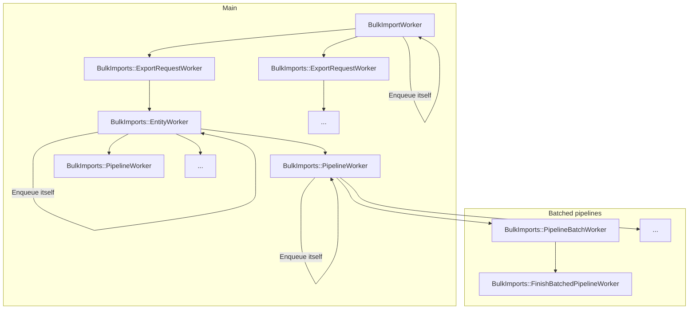
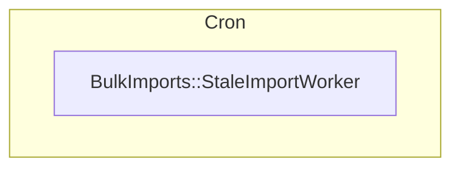
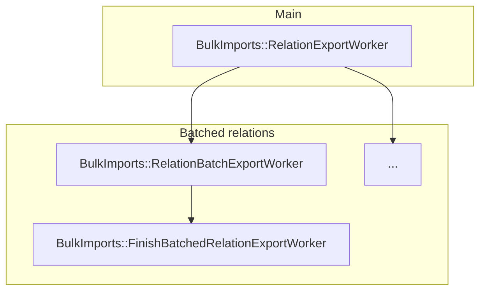



To use direct transfer, ensure your GitLab installation is accessible from
[GitLab IP addresses](../user/gitlab_com/_index.md#ip-range) and has a public DNS entry.



[Group migration by direct transfer](../user/group/import/_index.md) is the
evolution of migrating groups and projects using file exports. The goal is to have an easier way for the user to migrate a whole group,
including projects, from one GitLab instance to another.

## Design decisions

The following architectural diagram illustrates how the Group Migration
works with a set of [ETL](#etl) Pipelines leveraging from the current [GitLab APIs](#api).

### ETL

<!-- Direct quote from the IBM URL link -->

> ETL, for extract, transform and load, is a data integration process that
> combines data from multiple data sources into a single, consistent data store
> that is loaded into a data warehouse or other target system.

Using [ETL](https://www.ibm.com/think/topics/etl) architecture makes the code more explicit and easier to follow, test and extend. The
idea is to have one ETL pipeline for each relation to be imported.

### API

The current [project](../user/project/settings/import_export.md#migrate-projects-by-uploading-an-export-file) and
[group](../user/project/settings/import_export.md#migrate-groups-by-uploading-an-export-file-deprecated) imports are file based, so
they require an export step to generate the file to be imported.

Group migration by direct transfer leverages the [GitLab API](../api/rest/_index.md) to speed the migration.

And, because we're on the road to [GraphQL](../api/graphql/_index.md),
Group migration by direct transfer can contribute to expanding GraphQL API coverage, which benefits both GitLab
and its users.

### Namespace

The migration process starts with the creation of a [`BulkImport`](https://gitlab.com/gitlab-org/gitlab/-/blob/master/app/models/bulk_import.rb)
record to keep track of the migration. From there all the code related to the
GitLab Group Migration can be found under the new `BulkImports` namespace in all the application layers.

### Idempotency

To ensure we don't get duplicate entries when re-running the same Sidekiq job, we cache each entry as it's processed and skip entries if they're present in the cache.

There are two different strategies:

- `BulkImports::Pipeline::HexdigestCacheStrategy`, which caches a hexdigest representation of the data.
- `BulkImports::Pipeline::IndexCacheStrategy`, which caches the last processed index of an entry in a pipeline.

### Sidekiq jobs execution hierarchy

**On destination instance**

**On source instance**

