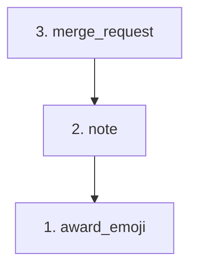
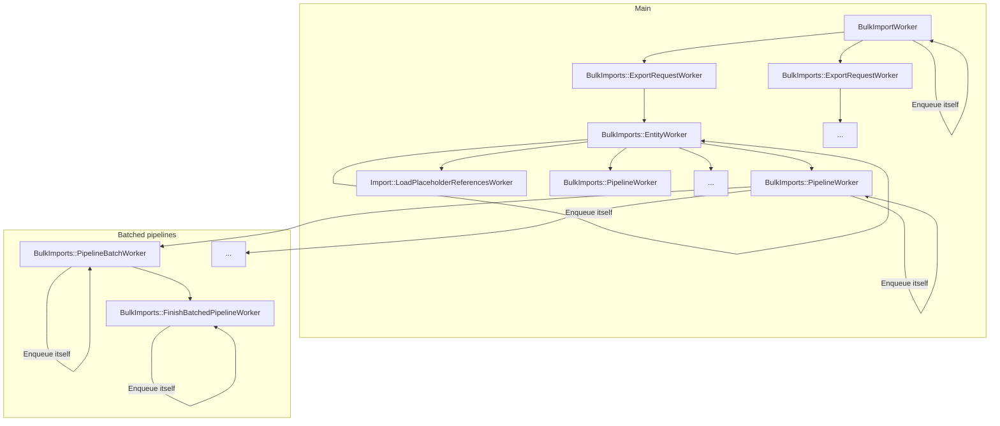
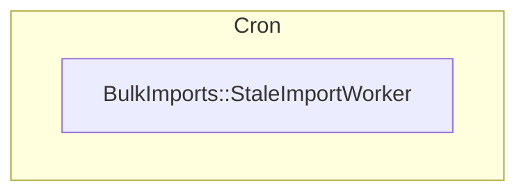
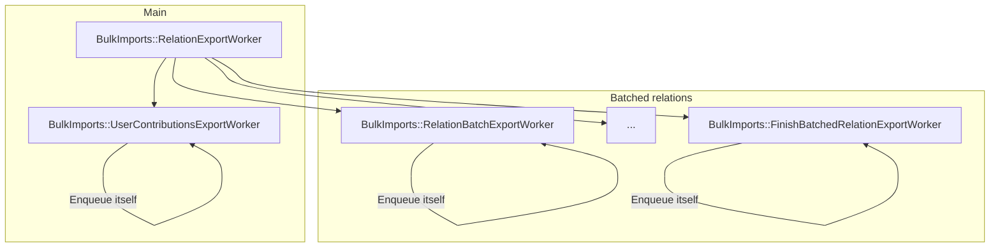

> [!note]
> To use direct transfer, ensure your GitLab installation is accessible from
> [GitLab IP addresses](../user/gitlab_com/_index.md#ip-range) and has a public DNS entry.

[Direct transfer](../user/group/import/_index.md) is the
evolution of migrating groups and projects using file exports. The goal is to have an easier way for the user to migrate a whole group,
including projects, from one GitLab instance to another.

To add a new relation or pipeline to direct transfer, see
[Add new relations to the direct transfer importer](bulk_imports/contributing.md).

[Offline transfer](offline_transfer.md) is a variant of direct transfer for when the source and
destination instances can't reach each other over the network.

## Terminology

The following terms recur throughout this page:

| Term | Description |
|------|-------------|
| Source instance | The GitLab instance that owns the group or project being migrated. |
| Destination instance | The GitLab instance the group or project migrates to. |
| BulkImport | One migration request, tracked by a `BulkImport` record. A single request can cover several top-level groups or projects. |
| Entity | A single group or project scheduled for migration, tracked by a `BulkImports::Entity` record. |
| Portable | The destination group or project record that owns the relations a pipeline imports (`entity.group` or `entity.project`). |
| Relation | One type of data being migrated, for example issues or labels, defined in `import_export.yml` and usually handled by one pipeline. |
| Tracker | A `BulkImports::Tracker` record that tracks one pipeline's progress for one entity. |

Most direct transfer code lives in the `BulkImports` module and is gradually getting migrated to the `Import` module.
Direct transfer also depends on the `Gitlab::ImportExport` module.

## Design decisions

Direct transfer runs one pipeline per relation, extracting each from the
[source instance](#source-api-usage) and loading it into the destination database. Pipelines run as separate Sidekiq
jobs, so independent pipelines run in parallel. Some pipelines depend on another one having already imported, though,
so pipelines are organized into [stages](#pipelines) and a pipeline only starts once every pipeline in an earlier
stage has finished. See [Sidekiq jobs execution hierarchy](#sidekiq-jobs-execution-hierarchy) for how the Sidekiq
workers that drive a migration, from the initial request down to running each pipeline, call each other.

### Pipelines

Pipelines use the [ETL](https://www.ibm.com/think/topics/etl) (extract, transform, load) architecture, which makes the
code more explicit and easier to follow, test, and extend.

A pipeline class only declares which extractor, transformer, and loader it uses. It doesn't implement the
extract-transform-load loop itself, so that loop only has to exist once: it lives in the shared
`BulkImports::Pipeline::Runner` concern.

A pipeline sets its extractor and loader with the `extractor`
and `loader` class methods, or by implementing instance methods `extract` and `load`, and can chain multiple
`transformer` classes that run in declaration order on every extracted entry. If the pipeline also implements an
instance `transform` method, that method runs first, before the declared `transformer` classes. `Runner#run` calls
`extract` for one page of entries, then runs the transformers and the loader on each entry in turn, before
requesting the next page.

Some relations depend on another one already being imported so pipelines are grouped into numbered
stages, and a stage only starts once every pipeline in the previous stage finishes.
[`BulkImports::Groups::Stage`](https://gitlab.com/gitlab-org/gitlab/-/blob/master/lib/bulk_imports/groups/stage.rb)
and
[`BulkImports::Projects::Stage`](https://gitlab.com/gitlab-org/gitlab/-/blob/master/lib/bulk_imports/projects/stage.rb)
list which pipeline runs at which stage for a group or project entity, and
[`BulkImports::EntityWorker`](https://gitlab.com/gitlab-org/gitlab/-/blob/master/app/workers/bulk_imports/entity_worker.rb)
enqueues every pipeline tracker in a stage before moving on to the next.

### Source API usage

Direct transfer was initially designed to migrate every resource through the
[GraphQL API](../api/graphql/_index.md) or the [REST API](../api/rest/_index.md). That approach ran into a few
problems, like API rate limits, endpoints that didn't expose all the required information, and overloading the
source instance with API requests. So the approach was abandoned: instead, most resources transfer through relation
exports, where the destination instance asks the source instance to export a relation, most often to an NDJSON
(newline-delimited JSON) file, then downloads and imports that file, similar to the file-based importer.

As a result, only a few pipelines still fetch data by querying the API directly.

Most relations are exported as NDJSON and imported using the [NDJSON pipeline](#ndjson-pipeline). Other relations like
`uploads` and `lfs_objects` are exported as tar.gz files.

### Endpoints used to fetch data from the source instance

Direct transfer fetches source data through REST or GraphQL, depending on the relation.

REST endpoints on the source instance handle entity discovery and small pieces of metadata:

| Endpoint | Purpose |
|----------|---------|
| `GET /metadata` (falls back to `GET /version`) | Checks the source GitLab version, called from [`BulkImports::Clients::HTTP`](https://gitlab.com/gitlab-org/gitlab/-/blob/master/lib/bulk_imports/clients/http.rb). |
| `GET /personal_access_tokens/self` | Validates the personal access token scopes. |
| `GET /groups` | Lists the top-level groups the user can migrate, called from [`BulkImports::GetImportableDataService`](https://gitlab.com/gitlab-org/gitlab/-/blob/master/app/services/bulk_imports/get_importable_data_service.rb). |
| `GET /groups/:id/subgroups` | Discovers subgroups, called from [`BulkImports::Groups::Extractors::SubgroupsExtractor`](https://gitlab.com/gitlab-org/gitlab/-/blob/master/lib/bulk_imports/groups/extractors/subgroups_extractor.rb). |
| `GET /groups/:id/badges` and `GET /projects/:id/badges` | Fetches badges, called from [`BulkImports::Common::Extractors::RestExtractor`](https://gitlab.com/gitlab-org/gitlab/-/blob/master/lib/bulk_imports/common/extractors/rest_extractor.rb). |
| `POST /groups/:id/export_relations` or `POST /projects/:id/export_relations` | Triggers the export on the source instance, called from [`BulkImports::ExportRequestWorker`](https://gitlab.com/gitlab-org/gitlab/-/blob/master/app/workers/bulk_imports/export_request_worker.rb). |
| `GET /groups/:id/export_relations/status` or `GET /projects/:id/export_relations/status`  | Polls the export progress, wrapped by [`BulkImports::ExportStatus`](https://gitlab.com/gitlab-org/gitlab/-/blob/master/app/models/bulk_imports/export_status.rb). |
| `GET /groups/:id/export_relations/download` or `GET /projects/:id/export_relations/download` | Downloads the exported file, or a single batch when the `batched` and `batch_number` parameters are present, called from [`Import::BulkImports::HttpFileDownloadStrategy`](https://gitlab.com/gitlab-org/gitlab/-/blob/master/app/services/import/bulk_imports/http_file_download_strategy.rb). |

GraphQL queries against `/api/graphql` on the source instance fetch entity-level attributes and small collections
that are cheap to request directly, instead of exporting them to an NDJSON file:

| Query | Purpose |
|-------|---------|
| [`GetGroupQuery`](https://gitlab.com/gitlab-org/gitlab/-/blob/master/lib/bulk_imports/groups/graphql/get_group_query.rb) and [`GetProjectQuery`](https://gitlab.com/gitlab-org/gitlab/-/blob/master/lib/bulk_imports/projects/graphql/get_project_query.rb) | Fetches group and project basic attributes. |
| [`GetProjectsQuery`](https://gitlab.com/gitlab-org/gitlab/-/blob/master/lib/bulk_imports/groups/graphql/get_projects_query.rb) | Lists a group's projects. |
| [`GetRepositoryQuery`](https://gitlab.com/gitlab-org/gitlab/-/blob/master/lib/bulk_imports/projects/graphql/get_repository_query.rb) and [`GetSnippetRepositoryQuery`](https://gitlab.com/gitlab-org/gitlab/-/blob/master/lib/bulk_imports/projects/graphql/get_snippet_repository_query.rb) | Fetches repository and snippet repository metadata used to transfer the Git data. |
| [`GetMembersQuery`](https://gitlab.com/gitlab-org/gitlab/-/blob/master/lib/bulk_imports/common/graphql/get_members_query.rb) | Fetches group and project members. |

## Relation migration

### Idempotency

Direct transfer pipeline jobs can take a long time to finish, since they import many records, so a job can get
interrupted partway through and Sidekiq retries it. To avoid creating duplicate entries when a job re-runs, each
entry is cached as it's processed, and skipped if it's already in the cache.

There are two different caching strategies:

| Strategy | Description |
|----------|-------------|
| `BulkImports::Pipeline::HexdigestCacheStrategy` | Caches a hexdigest representation of the data. |
| `BulkImports::Pipeline::IndexCacheStrategy` | Caches the last processed index of an entry in a pipeline. |

### NDJSON pipeline

Most relation data (issues, merge requests, labels, milestones, CI resources, and so on) transfers through the
[`BulkImports::NdjsonPipeline`](https://gitlab.com/gitlab-org/gitlab/-/blob/master/lib/bulk_imports/ndjson_pipeline.rb)
concern, included by the pipeline classes under `BulkImports::Common::Pipelines` and the group and project-specific
pipeline namespaces. Each pipeline follows the extract, transform, load steps of the [ETL](#pipelines) design:

- Extract: [`NdjsonExtractor`](https://gitlab.com/gitlab-org/gitlab/-/blob/master/lib/bulk_imports/common/extractors/ndjson_extractor.rb)
  downloads the relation's `.ndjson.gz` file with
  [`FileDownloadService`](https://gitlab.com/gitlab-org/gitlab/-/blob/master/app/services/bulk_imports/file_download_service.rb),
  decompresses it with
  [`FileDecompressionService`](https://gitlab.com/gitlab-org/gitlab/-/blob/master/app/services/bulk_imports/file_decompression_service.rb),
  and reads each line with
  [`Gitlab::ImportExport::Json::NdjsonReader`](https://gitlab.com/gitlab-org/gitlab/-/blob/master/lib/gitlab/import_export/json/ndjson_reader.rb).
- Transform: `NdjsonPipeline#transform` walks the parsed hash and, for every relation and sub-relation, builds an
  ActiveRecord object with `relation_factory.create`. `relation_factory` resolves to
  [`Gitlab::ImportExport::Project::RelationFactory`](https://gitlab.com/gitlab-org/gitlab/-/blob/master/lib/gitlab/import_export/project/relation_factory.rb)
  or
  [`Gitlab::ImportExport::Group::RelationFactory`](https://gitlab.com/gitlab-org/gitlab/-/blob/master/lib/gitlab/import_export/group/relation_factory.rb)
  depending on the portable, the same classes the legacy file-based importer uses to restore a `tar.gz` export.
- Load: `NdjsonPipeline#load` persists the object through
  [`Gitlab::ImportExport::Base::RelationObjectSaver`](https://gitlab.com/gitlab-org/gitlab/-/blob/master/lib/gitlab/import_export/base/relation_object_saver.rb),
  which saves the top-level record first and then its collection associations in batches of 100 records, instead of a
  single large nested `save!`.

So that a relation only has to be defined once, direct transfer doesn't keep a separate relation tree of its own.
[`BulkImports::FileTransfer::BaseConfig`](https://gitlab.com/gitlab-org/gitlab/-/blob/master/app/models/bulk_imports/file_transfer/base_config.rb),
and its
[`ProjectConfig`](https://gitlab.com/gitlab-org/gitlab/-/blob/master/app/models/bulk_imports/file_transfer/project_config.rb)
and
[`GroupConfig`](https://gitlab.com/gitlab-org/gitlab/-/blob/master/app/models/bulk_imports/file_transfer/group_config.rb)
subclasses, load the same `import_export.yml` file the legacy
[project](https://gitlab.com/gitlab-org/gitlab/-/blob/master/lib/gitlab/import_export/project/import_export.yml) and
[group](https://gitlab.com/gitlab-org/gitlab/-/blob/master/lib/gitlab/import_export/group/import_export.yml) file-based
importer uses, through
[`Gitlab::ImportExport::Config`](https://gitlab.com/gitlab-org/gitlab/-/blob/master/lib/gitlab/import_export/config.rb)
and
[`Gitlab::ImportExport::AttributesFinder`](https://gitlab.com/gitlab-org/gitlab/-/blob/master/lib/gitlab/import_export/attributes_finder.rb).
A relation added to `import_export.yml` becomes available to both the file-based importer and direct transfer for this
reason, and `NdjsonPipeline#relation_definition` (`import_export_config.top_relation_tree(relation)`) and the excluded
and included attribute lists come from the same YAML tree. Attribute sanitization, such as stripping IDs, HTML caches,
and other excluded keys, goes through the shared
[`Gitlab::ImportExport::AttributeCleaner`](https://gitlab.com/gitlab-org/gitlab/-/blob/master/lib/gitlab/import_export/attribute_cleaner.rb),
used by `Gitlab::ImportExport::Base::RelationFactory#parsed_relation_hash` for both importers.

#### Nested relations

An NDJSON line for a relation can contain nested associations, for example a merge request line with nested notes and
approvals.
[`Gitlab::ImportExport::Base::RelationFactory`](https://gitlab.com/gitlab-org/gitlab/-/blob/master/lib/gitlab/import_export/base/relation_factory.rb)
only builds one object from one flat hash, so the recursion happens in `NdjsonPipeline#deep_transform_relation!`,
which walks the relation tree from `import_export.yml` bottom-up: for each sub-relation key in the tree, it recurses
into the nested hash or array first, replaces it with the built ActiveRecord object or objects, and only then yields
the parent hash to be built. Because the children are already real ActiveRecord instances by the time the parent is
built, `RelationFactory#existing_or_new_object` assigns them directly to the parent's association writers, without an
explicit association-setting step.

For example, `import_export.yml` nests `award_emoji` under `notes`, which nests under `merge_requests`. A single
NDJSON line for one merge request arrives as one flat, deeply nested hash:

```json
{
  "title": "Fix flaky spec",
  "notes": [
    {
      "note": "Nice catch!",
      "award_emoji": [
        { "name": "thumbsup" }
      ]
    }
  ]
}
```

`deep_transform_relation!` walks that hash bottom-up, so the innermost relation builds first and the outermost
builds last:


```mermaid
flowchart TD
    accTitle: Bottom-up build order for a nested relation
    accDescr: award_emoji builds first from its flat hash, then note builds from a hash whose award_emoji key already holds the built AwardEmoji objects, then merge_request builds last from a hash whose notes key already holds the built Note objects.

    mr["3. merge_request"] --> note["2. note"]
    note --> emoji["1. award_emoji"]
```

By the time `note` builds, its `award_emoji` key already holds `AwardEmoji` objects instead of hashes, and by the
time `merge_request` builds, its `notes` key already holds `Note` objects instead of hashes. That's what lets
`RelationFactory#existing_or_new_object` assign each child directly to its parent's association writer.

Nested user references, for example a note's `author_id`, resolve the same way: `deep_transform_relation!` calls
`create_import_source_users` for every node so a placeholder `Import::SourceUser` exists for each identifier, and
after `load` persists the whole tree, `push_placeholder_references` walks every nested object to register the
reassignment through `Import::PlaceholderReferences::PushService`. See
[user contribution mapping](#user-contribution-mapping).

#### Exception handling

A single bad record, like an issue with an invalid attribute, doesn't fail the import of every other issue in a
project. So
[`BulkImports::Pipeline::Runner`](https://gitlab.com/gitlab-org/gitlab/-/blob/master/lib/bulk_imports/pipeline/runner.rb)
processes NDJSON entries one at a time and isolates failures per entry rather than per pipeline:

- A `BulkImports::NetworkError` for which `retriable?` returns true, or a `SourceUserMapper` locking or
  duplicated-user error, becomes a `BulkImports::RetryPipelineError`. `BulkImports::PipelineWorker` catches this and
  re-enqueues the pipeline job after the exception's retry delay, up to
  [`BulkImports::NetworkError::MAX_RETRIABLE_COUNT`](https://gitlab.com/gitlab-org/gitlab/-/blob/master/lib/bulk_imports/network_error.rb)
  retries.
- Any other exception raised while extracting, transforming, or loading a single entry is caught, recorded as a
  `BulkImports::Failure`, and processing continues with the next entry. The whole entity migration stops only when the
  pipeline class is marked `abort_on_failure!`.
- `RelationObjectSaver` saves the top-level record first, so an invalid or failed nested sub-relation, for example one
  collection record that fails validation, doesn't fail the parent record. `NdjsonPipeline#load` then records each
  sub-relation `RelationObjectSaver` collected as invalid or failed as its own `BulkImports::Failure`, without failing
  the pipeline.

`BulkImports::Failure` records are what surface in the migration's details in the UI.

### Batches

Earlier versions of direct transfer exported the relation in a single NDJSON file. Batches
were introduced later so each job only has to handle a smaller slice of a relation, and most relations that export as
NDJSON are batched today. Because of that, the same pipeline class can now run multiple times for one relation,
once per batch, instead of running once end to end.

## Sidekiq jobs execution hierarchy

The workers described in the previous sections enqueue each other in a fairly deep chain, so when a migration stalls,
it helps to know which worker enqueues which. The following diagrams show that chain on each instance.

On destination instance:


```mermaid
flowchart TD
    subgraph s1["Main"]
        BulkImportWorker -- Enqueue itself --> BulkImportWorker
        BulkImportWorker --> BulkImports::ExportRequestWorker
        BulkImports::ExportRequestWorker --> BulkImports::EntityWorker
        BulkImports::EntityWorker -- Enqueue itself --> BulkImports::EntityWorker
        BulkImports::EntityWorker --> BulkImports::PipelineWorker
        BulkImports::EntityWorker --> Import::LoadPlaceholderReferencesWorker
        BulkImports::PipelineWorker -- Enqueue itself --> BulkImports::PipelineWorker
        BulkImports::EntityWorker --> BulkImports::PipelineWorkerA["BulkImports::PipelineWorker"]
        BulkImports::EntityWorker --> BulkImports::PipelineWorkerA1["..."]

        BulkImportWorker --> BulkImports::ExportRequestWorkerB["BulkImports::ExportRequestWorker"]
        BulkImports::ExportRequestWorkerB --> BulkImports::PipelineWorkerBB["..."]
    end

    subgraph s2["Batched pipelines"]
        BulkImports::PipelineWorker --> BulkImports::PipelineBatchWorker
        BulkImports::PipelineWorker --> BulkImports::PipelineBatchWorkerA["..."]
        BulkImports::PipelineBatchWorker -- Enqueue itself --> BulkImports::PipelineBatchWorker
        BulkImports::PipelineBatchWorker --> BulkImports::FinishBatchedPipelineWorker
        BulkImports::FinishBatchedPipelineWorker -- Enqueue itself --> BulkImports::FinishBatchedPipelineWorker
    end
```


```mermaid
flowchart TD
  subgraph s1["Cron"]
    BulkImports::StaleImportWorker
  end
```

On source instance:


```mermaid
flowchart TD
    subgraph s1["Main"]
        BulkImports::RelationExportWorker
        BulkImports::RelationExportWorker --> BulkImports::UserContributionsExportWorker
        BulkImports::UserContributionsExportWorker -- Enqueue itself --> BulkImports::UserContributionsExportWorker
    end

    subgraph s2["Batched relations"]
        BulkImports::RelationExportWorker --> BulkImports::RelationBatchExportWorker
        BulkImports::RelationExportWorker --> BulkImports::RelationBatchExportWorkerA["..."]
        BulkImports::RelationBatchExportWorker -- Enqueue itself --> BulkImports::RelationBatchExportWorker
        BulkImports::RelationExportWorker --> BulkImports::FinishBatchedRelationExportWorker
        BulkImports::FinishBatchedRelationExportWorker -- Enqueue itself --> BulkImports::FinishBatchedRelationExportWorker
    end
```

## User contribution mapping

Direct transfer supports [user contribution mapping](user_contribution_mapping.md), which allows imported records to be attributed to placeholder users until a real user can be assigned after the import completes.

### Central components

- `BulkImports::Common::Pipelines::MembersPipeline` is the pipeline responsible for creating most source user and placeholder records because user contributions typically come from group and project members. Its transformer, `BulkImports::Common::Transformers::SourceUserMemberAttributesTransformer` calls `Import::SourceUserMapper` to map source members attributes to users on the destination. However, because users don't have to be members to make contributions, and imported relation data may not include identifying user data like names and usernames, source users may get created by other relation pipelines without them.
- `Import::BulkImports::SourceUsersAttributesWorker` backfills source user information for non-member contributors. It's initially called at the beginning of a migration, just before `BulkImportWorker` in `BulkImports::CreateService`. `Import::BulkImports::SourceUsersAttributesWorker` calls `Import::BulkImports::UpdateSourceUsersService` for each entity's top-level namespace and continuously re-enqueues itself every 5 minutes until the bulk import is completed.
- `Import::BulkImports::UpdateSourceUsersService` queries for `Import::SourceUser` records missing a `source_name` or `source_username` associated with the current migration, then makes a GraphQL to the source instance to fetch the missing names and usernames and finally updates the source users missing information.

### Key classes

| Class | Purpose |
|-------|---------|
| [`BulkImports::Pipeline::Context`](https://gitlab.com/gitlab-org/gitlab/-/blob/master/lib/bulk_imports/pipeline/context.rb) | Provides `source_user_mapper` and `source_ghost_user_id` to pipelines. |
| [`BulkImports::CreateService`](https://gitlab.com/gitlab-org/gitlab/-/blob/master/app/services/bulk_imports/create_service.rb) | Entry point that enables user mapping. |
| [`BulkImports::NdjsonPipeline`](https://gitlab.com/gitlab-org/gitlab/-/blob/master/lib/bulk_imports/ndjson_pipeline.rb) | Creates `Import::SourceUser` records before persisting relations using `ImportExport::Base::RelationFactory` and caches placeholder references during relation import for the relations that require them. |
| [`BulkImports::Common::Pipelines::MembersPipeline`](https://gitlab.com/gitlab-org/gitlab/-/blob/master/lib/bulk_imports/common/pipelines/members_pipeline.rb) | Responsible for creating most source user and placeholder records as user contributions typically come from group and project members |
| [`BulkImports::Common::Transformers::SourceUserMemberAttributesTransformer`](https://gitlab.com/gitlab-org/gitlab/-/blob/master/lib/bulk_imports/common/transformers/source_user_member_attributes_transformer.rb) | Calls `Import::SourceUserMapper` to map source members attributes to users on the destination. However, because users don't have to be members to make contributions, and imported relation data may not include identifying user data like names and usernames, source users may get created by other relation pipelines without them |
| [`Import::BulkImports::SourceUsersMapper`](https://gitlab.com/gitlab-org/gitlab/-/blob/master/lib/import/bulk_imports/source_users_mapper.rb) | Provides a hash-like interface for`ImportExport::Base::RelationFactory` to map source user IDs to destination user IDs, allowing both direct transfer and file-based import to use `ImportExport::Base::RelationFactory` even though file-based imports do not support placeholder user mapping. |
| [`Import::BulkImports::SourceUsersAttributesWorker`](https://gitlab.com/gitlab-org/gitlab/-/blob/master/app/workers/import/bulk_imports/source_users_attributes_worker.rb) | backfills source user information for non-member contributors. It's initially called at the beginning of a migration, just before`BulkImportWorker` in `BulkImports::CreateService`. Calls `Import::BulkImports::UpdateSourceUsersService`for each entity's top-level namespace and continuously re-enqueues itself every 5 minutes until the bulk import is completed.|
| [`Import::BulkImports::UpdateSourceUsersService`](https://gitlab.com/gitlab-org/gitlab/-/blob/master/app/services/import/bulk_imports/update_source_users_service.rb) | Queries for`Import::SourceUser` records missing a `source_name` or `source_username` associated with the current migration, then makes a GraphQL to the source instance to fetch the missing names and usernames and finally updates the source users missing information. |

### Ghost user handling

The ghost user isn't a real contributor to map to a placeholder: both instances use it the same way, as a stand-in
for content whose original author no longer exists. So direct transfer has special handling for the source
instance's ghost user. The `BulkImports::SourceInternalUserFinder` makes a GraphQL request to the source instance to
query for non-human users with GitLab ghost usernames (at the time of implementation, there was no explicit API
request for ghost users) and caches the source ghost user ID.

When a source ghost user is encountered:

- Contributions are assigned directly to the destination instance's ghost user
- No placeholder user is created

### Skipped placeholder user creation

Certain relations, for example approvals, builds, ci_pipelines, and events, skip placeholder user creation because
they may reference users that no longer exist on the source instance and lack a foreign key constraint to catch that.
See [`BulkImports::NdjsonPipeline::IGNORE_PLACEHOLDER_USER_CREATION`](https://gitlab.com/gitlab-org/gitlab/-/blob/master/lib/bulk_imports/ndjson_pipeline.rb#L10).
