For background of GitLab Cells, refer to the [design document](https://handbook.gitlab.com/handbook/engineering/architecture/design-documents/cells/).

## Available Cells / Organization schemas

Below are available schemas related to Cells and Organizations:

| Schema | Description |
| ------ | ----------- |
| `gitlab_main` (deprecated) | This is being replaced with `gitlab_main_org`, for the purpose of building the [Cells](https://handbook.gitlab.com/handbook/engineering/architecture/design-documents/cells/) architecture. |
| `gitlab_main_cell` (deprecated) | All `gitlab_main_cell` tables are being moved to `gitlab_main_org`. `gitlab_main_org` is a better name for `gitlab_main_cell` - there is no functional difference between the two. |
| `gitlab_main_org`| Use for all tables in the `main:` database that are for an Organization. For example, `projects` and `groups` |
| `gitlab_main_cell_setting` | All tables in the `main:` database related to cell settings. For example, `application_settings`. These cell-local tables should not have any foreign key references from/to organization tables. |
| `gitlab_main_clusterwide` (deprecated) | All tables in the `main:` database where all rows, or a subset of rows needs to be present across the cluster, in the [Cells](https://handbook.gitlab.com/handbook/engineering/architecture/design-documents/cells/) architecture. For example, `plans`. For the [Cells 1.0 architecture](https://handbook.gitlab.com/handbook/engineering/architecture/design-documents/cells/iterations/cells-1.0/), there are no real clusterwide tables as each cell will have its own database. In effect, these tables will still be stored locally in each cell. |
| `gitlab_main_cell_local` | For tables in the `main:` database that are related to features that is distinct for each cell. For example, `zoekt_nodes`, or `shards`. These cell-local tables should not have any foreign key references from/to organization tables. |
| `gitlab_ci` | Use for all tables in the `ci:` database that are for an Organization. For example, `ci_pipelines` and `ci_builds` |
| `gitlab_ci_cell_local` | For tables in the `ci:` database that are related to features that is distinct for each cell. For example, `instance_type_ci_runners`, or `ci_cost_settings`. These cell-local tables should not have any foreign key references from/to organization tables. |
| `gitlab_main_user` | Schema for all User-related tables, ex. `users`, `emails`, etc. Most user functionality is organizational level so should use `gitlab_main_org` instead (e.g. commenting on an issue). For user functionality that is not organizational level, use this schema. Tables on this schema must strictly belong to a user. |
| `gitlab_shared_org` | Schema for tables with data across multiple databases and has `organization_id` for sharding. These tables inherit from `Gitlab::Database::SharedModel`. |
| `gitlab_shared_cell_local` | Schema for cell local shared tables that do not require sharding and exist across multiple databases. For example, `loose_foreign_keys_deleted_records`. These tables also inherit from `Gitlab::Database::SharedModel`. |

Most tables will require a [sharding key](../organization/_index.md#defining-a-sharding-key-for-all-organizational-tables) to be defined.

To understand how existing tables are classified, you can use [this dashboard](https://cells-progress-tracker-gitlab-org-tenant-scale-g-f4ad96bf01d25f.gitlab.io/schema_migration).

After a schema has been assigned, the merge request pipeline might fail due to one or more of the following reasons, which can be rectified by following the linked guidelines:

- [Cross-database joins](../database/multiple_databases.md#suggestions-for-removing-cross-database-joins)
- [Cross-database transactions](../database/multiple_databases.md#fixing-cross-database-transactions)
- [Cross-database foreign keys](../database/multiple_databases.md#foreign-keys-that-cross-databases)

## What schema to choose if the feature can be cluster-wide?

The `gitlab_main_clusterwide` schema is now deprecated.
We will ask teams to update tables from `gitlab_main_clusterwide` to `gitlab_main_org` as required.
This requires adding sharding keys to these tables, and may require
additional changes to related features to scope them to the Organizational level.

Clusterwide features are
[heavily discouraged](https://handbook.gitlab.com/handbook/engineering/architecture/design-documents/cells/#how-do-i-decide-whether-to-move-my-feature-to-the-cluster-cell-or-organization-level),
and there are [no plans to perform any cluster-wide synchronization](https://handbook.gitlab.com/handbook/engineering/architecture/design-documents/cells/decisions/014_clusterwide_syncing_in_cells_1_0/).

Choose a different schema from the list of available GitLab [schemas](#available-cells--organization-schemas) instead.
We expect most tables to use the `gitlab_main_org` schema, especially if the
table in the table is related to `projects`, or `namespaces`.
Another alternative is the `gitlab_main_cell_local` schema.

Consult with the [Tenant Scale group](https://handbook.gitlab.com/handbook/engineering/infrastructure-platforms/tenant-scale/):
If you believe you require a clusterwide feature, seek design input from the
Tenant Scale group.
Here are some considerations to think about:

- Can the feature to be scoped per Organization (or lower) instead ?
- The related feature must work on multiple cells, not just the legacy cell.
- How would the related feature scale across many Organizations and Cells ?
- How will data be stored ?
- How will organizations reference the data consistently ?
  Can you use globally unique identifiers ?
- Does the data need to be consistent across different cells ?
- Do not use database tables to store [static data](#static-data).

## Creating a new schema

Schemas should default to require a sharding key, as features should be scoped to an Organization by default.

```yaml
# db/gitlab_schemas/gitlab_ci.yaml
require_sharding_key: true
sharding_root_tables:
  - projects
  - namespaces
  - organizations
```

Setting `require_sharding_key` to `true` means that tables assigned to that
schema will require a `sharding_key` to be set.
You will also need to configure the list of allowed `sharding_root_tables` that can be used as sharding keys for tables in this schema.

## Database sequences

We ensure uniqueness of database sequences, across all cells.
This means the `id` columns of most tables will be unique.

For technical implementation and architecture decisions, refer to:

- [Cells: Cluster wide unique database sequences](https://handbook.gitlab.com/handbook/engineering/architecture/design-documents/cells/decisions/008_database_sequences)
- [Topology Service: Sequence Service](https://handbook.gitlab.com/handbook/engineering/architecture/design-documents/cells/topology_service/#sequence-service)

## Unique constraints

If you require data to be unique, it should be scoped to be unique per
Organization, Group, Project, or User.
With the existence of multiple cells which each has its own independent
database, you can no longer rely on `UNIQUE` constraints.

You have two options:

1. Ensure the index is scoped to include their `sharding_key` as one of
   the columns present in the index.
1. For the rare case where an attribute must be unique globally, across all
   organizations, use the upcoming
   [Claim service](https://handbook.gitlab.com/handbook/engineering/architecture/design-documents/cells/topology_service/#claim-service).

## Static data

Problem: A database table is used to store static data.
However, the primary key is not static because it uses an auto-incrementing sequence.
This means the primary key is not globally consistent.

References to this inconsistent primary key will create problems because the
reference clashes across cells / organizations.

Example: The `plans` table on a given Cell has the following data:

```shell
 id |             name             |              title
----+------------------------------+----------------------------------
  1 | default                      | Default
  2 | bronze                       | Bronze
  3 | silver                       | Silver
  5 | gold                         | Gold
  7 | ultimate_trial               | Ultimate Trial
  8 | premium_trial                | Premium Trial
  9 | opensource                   | Opensource
  4 | premium                      | Premium
  6 | ultimate                     | Ultimate
 10 | ultimate_trial_paid_customer | Ultimate Trial for Paid Customer
(10 rows)
```

On another cell, the `plans` table has differing ids for the same `name`:

```shell
 id |             name             |            title
----+------------------------------+------------------------------
  1 | default                      | Default
  2 | bronze                       | Bronze
  3 | silver                       | Silver
  4 | premium                      | Premium
  5 | gold                         | Gold
  6 | ultimate                     | Ultimate
  7 | ultimate_trial               | Ultimate Trial
  8 | ultimate_trial_paid_customer | Ultimate Trial Paid Customer
  9 | premium_trial                | Premium Trial
 10 | opensource                   | Opensource
 ```

This `plans.id` column is then used as a reference in the `hosted_plan_id`
column of `gitlab_subscriptions` table.

Solution: Use globally unique references, not a database sequence.
If possible, hard-code static data in application code, instead of using the
database.

In this case, the `plans` table can be dropped, and replaced with a fixed model
(details can be found in the [configurable status design doc](https://handbook.gitlab.com/handbook/engineering/architecture/design-documents/work_items_custom_status/#fixed-items-models-and-associations)):

```ruby
class Plan
  include ActiveRecord::FixedItemsModel::Model

  ITEMS = [
    {:id=>1, :name=>"default", :title=>"Default"},
    {:id=>2, :name=>"bronze", :title=>"Bronze"},
    {:id=>3, :name=>"silver", :title=>"Silver"},
    {:id=>4, :name=>"premium", :title=>"Premium"},
    {:id=>5, :name=>"gold", :title=>"Gold"},
    {:id=>6, :name=>"ultimate", :title=>"Ultimate"},
    {:id=>7, :name=>"ultimate_trial", :title=>"Ultimate Trial"},
    {:id=>8, :name=>"ultimate_trial_paid_customer", :title=>"Ultimate Trial Paid Customer"},
    {:id=>9, :name=>"premium_trial", :title=>"Premium Trial"},
    {:id=>10, :name=>"opensource", :title=>"Opensource"}
  ]

  attribute :name, :string
  attribute :title, :string
end
```

You can use model validations and use ActiveRecord-like methods like `all`, `where`, `find_by` and `find`:

```ruby
Plan.find(4)
Plan.find_by(name: 'premium')
Plan.where(name: 'gold').first
```

The `hosted_plan_id` column will also be updated to refer to the fixed model's
`id` value.

You can also store associations with other models. For example:

```ruby
class CurrentStatus < ApplicationRecord
  belongs_to_fixed_items :system_defined_status, fixed_items_class: WorkItems::Statuses::SystemDefined::Status
end
```

Examples of hard-coding static data include:

- [VisibilityLevel](https://gitlab.com/gitlab-org/gitlab/-/blob/5ae43dface737373c50798ccd909174bcdd9b664/lib/gitlab/visibility_level.rb#L25-27)
- [Static defaults for work item statuses](https://gitlab.com/gitlab-org/gitlab/-/merge_requests/178180)
- [`Ai::Catalog::BuiltInTool`](https://gitlab.com/gitlab-org/gitlab/-/merge_requests/197300)
- [`WorkItems::SystemDefined::RelatedLinkRestriction`](https://gitlab.com/gitlab-org/gitlab/-/merge_requests/199664)

## Define a sharding key

### 1: Add column, triggers, indexes, and foreign keys

This is the step where we add the sharding key column, indexes, foreign keys and necessary triggers.

**1. Steps to set up:**

- Set up the keys required by Housekeeper: `export HOUSEKEEPER_TARGET_PROJECT_ID=278964` (project ID of GitLab project)
- Create a new PAT for yourself: `export HOUSEKEEPER_GITLAB_API_TOKEN=<your-pat>`
- Update the local master branch: `git checkout master && git pull origin master --rebase`
- Switch to the `sharding-key-backfill-keeps` branch with the following command:

  ```shell
  git checkout sharding-key-backfill-keeps
  ```

  - You can also find the branch in the [MR](https://gitlab.com/gitlab-org/gitlab/-/merge_requests/143774).
- Rebase this branch on top of master and push the changes back to origin. This makes sure that this branch is aware of changes in master:

  ```shell
  git pull origin master --rebase
  ```

- Run the following command to push back rebased changes to the branch, and omit `LEFTHOOK=0` (otherwise, RuboCop fails):

  ```shell
  LEFTHOOK=0 git push --force-with-lease -o ci.skip
  ```

- Run `bundle install` and migrations.

> Do not push any changes to this branch, just keep rebasing.

**2. Steps to create automated MR:**

We store sharding key keeps for the small table and large table inside the [keeps directory](https://gitlab.com/gitlab-org/gitlab/-/tree/sharding-key-backfill-keeps/keeps). The file name starts with `backfill_desired_sharding_key_*.rb`.

Let’s understand the [small table keep](https://gitlab.com/gitlab-org/gitlab/-/blob/sharding-key-backfill-keeps/keeps/backfill_desired_sharding_key_small_table.rb):


- Open the keep file and add `next unless entry.table_name = 'table name'`. Here, the table name will be the name of the table we want to create migrations for.

- Perform a quick check based on the `desired_sharding_key` configuration of the table. Is the configuration correct? Does the sharding key of the parent table include a `NOT NULL` constraint as expected? If not, skip that table and go for another one. If the table is OK, we can proceed.

- Let's check the table's primary key. Run the following commands in your terminal:
  - `gdk psql`
  - `\d <table_name>`

- Running the above command will give you useful information about the tables, such as indexes, pk, etc. For example, the `security_scans` table looks like:


- This is important because we have many cases where the primary key is composite, non unique, etc., and requires some manual changes in the keep.

- Do a dry run of the execution as it will show you the generated changes and won't commit anything:
  - `bundle exec gitlab-housekeeper -k Keeps::BackfillDesiredShardingKeySmallTable -d`

- If dry run looks good then run the same command without -d flag:
  - `bundle exec gitlab-housekeeper -k Keeps::BackfillDesiredShardingKeySmallTable`

- Running the above command will create a MR with the changes 🎉

> Follow the same methods for large tables and use the large table keep. The only difference is that the table won't have a FK for performance reasons.

**Some useful hacks:**

**1. Tables containing non :id primary key**

- Replace :id with non-ID primary key [in the first diff](https://gitlab.com/gitlab-org/gitlab/-/merge_requests/143774/diffs#0d5f33d9793cf940dfdaca2d13dc36ffba642547_0_16), [in the second diff](https://gitlab.com/gitlab-org/gitlab/-/merge_requests/143774/diffs#0d5f33d9793cf940dfdaca2d13dc36ffba642547_0_31) and [in the third diff](https://gitlab.com/gitlab-org/gitlab/-/merge_requests/143774/diffs#a43ac76c906b5de1a49f01a1b9d3df52db53d824_0_18).
- Comment this line [in this diff](https://gitlab.com/gitlab-org/gitlab/-/merge_requests/143774/diffs#9e60f08042851b8f971e69edf1b7ecf0c3650bad_0_121).
- Add a line in [this file](https://gitlab.com/gitlab-org/gitlab/-/blob/sharding-key-backfill-keeps/lib/generators/desired_sharding_key/templates/batched_background_migration_job_spec.template?ref_type=heads#L10) `let(:batch_column) { :non-id-pk }` like we did [in this example](https://gitlab.com/gitlab-org/gitlab/-/merge_requests/165940/diffs#13b28b3d4235b2108dee9bad7345da521f72fb09_0_12).

Example MR: [!165940 (merged)](https://gitlab.com/gitlab-org/gitlab/-/merge_requests/165940) if the table uses `gitlab_ci` db then we need to specify `migration: :gitlab_ci` in migration files.

**2. Tables containing composite primary keys (more than one)**

- Get the table information and check if either of the primary key columns has UNIQUE indexes defined, if YES then use that as primary key and batch column like we did above.
- If none of the columns are unique, then we need to manually add changes.
- Let's take an example of the `deployment_merge_requests` table. This is a table with non-unique composite primary keys `"deployment_merge_requests_pkey" PRIMARY KEY, btree (deployment_id, merge_request_id)`.
- We have used [cursor based batching](https://gitlab.com/gitlab-org/gitlab/-/merge_requests/169557).
- First, generate the changes using keep, then edit the changes.
- Open the queue backfill post migrate file and remove all the changes and add new. For example:

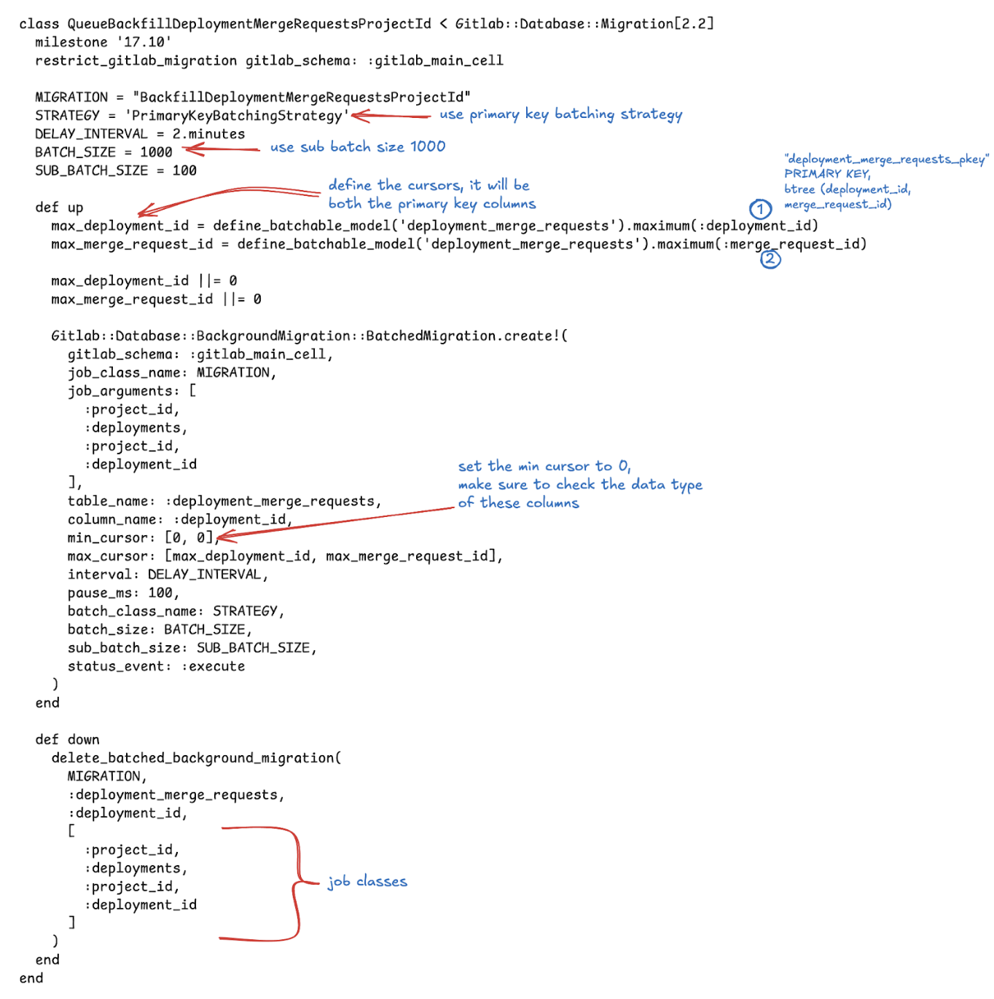

Example MR: [!183738 (merged)](https://gitlab.com/gitlab-org/gitlab/-/merge_requests/183738)

- The above changes style can be used for other tables with such specifications too.
- Open the `lib/gitlab/background_migration/backfill_*.rb` and remove all the changes generated by keep and add:

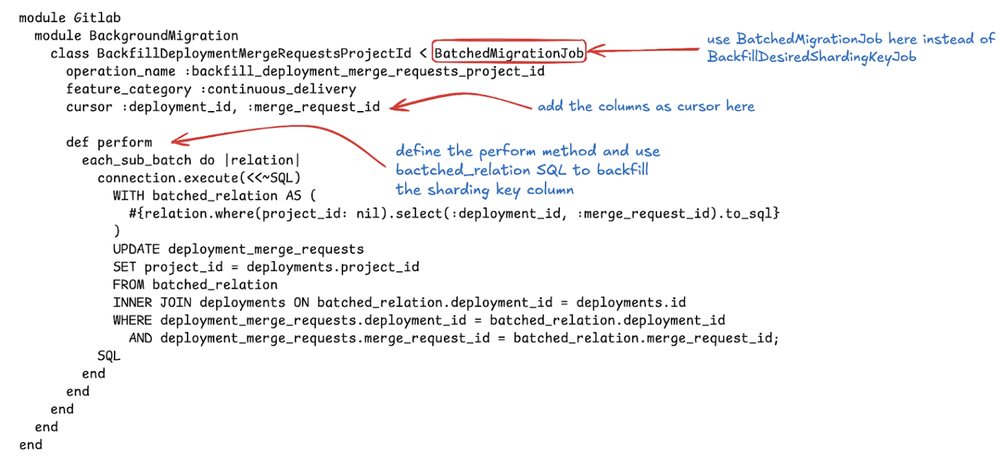

See [!183738](https://gitlab.com/gitlab-org/gitlab/-/merge_requests/183738/diffs#diff-content-c2163b12dc5e47a609975eef6d8ee2674c6e1846).

- If the table is large, add the sharding key to ignored FK list `:ignored_fk_columns_map` in [schema_spec.rb](https://gitlab.com/gitlab-org/gitlab/-/blob/master/spec/db/schema_spec.rb?ref_type=heads#L30).
- Make sure to also update the [specs](https://gitlab.com/gitlab-org/gitlab/-/merge_requests/183738/diffs#diff-content-82b15af453642aa441801a31b12e5b3c22b009b7).

More examples: [!183047 (merged)](https://gitlab.com/gitlab-org/gitlab/-/merge_requests/183047), [!176714 (merged)](https://gitlab.com/gitlab-org/gitlab/-/merge_requests/176714).

**3. Tables in different database**

- It might be the case that the table is in `ci` db and the sharding key is in `main` db
- For example, `dast_site_profiles_builds` is in `sec` db and the sharding key table `projects` is in main db
- For this you may need to add a LFK - loose foreign key, example: [MR created by housekeep](https://gitlab.com/gitlab-org/gitlab/-/merge_requests/167768) and later we added [LFK](https://gitlab.com/gitlab-org/gitlab/-/blob/master/config/gitlab_loose_foreign_keys.yml?ref_type=heads#L286)
- Make sure to add  `migration: :gitlab_sec` in the [backfill spec](https://gitlab.com/gitlab-org/gitlab/-/merge_requests/167768/diffs#04d2561fe8663e64037400b6c44818d373a32b13_0_8) and [queue spec](https://gitlab.com/gitlab-org/gitlab/-/merge_requests/167768/diffs#5c58df6768de80184fd5871af10b1ddb7f52ba82_0_6)
- Normal FK won't work as they are in different db
- For the parent table `dast_site_profiles` we have [LFK to projects](https://gitlab.com/gitlab-org/gitlab/-/blob/master/config/gitlab_loose_foreign_keys.yml?ref_type=heads#L278)
- If table `dast_site_profiles_builds` has FK relation to its parent table `dast_site_profiles` with CASCADE delete then records will get deleted when the associated `dast_site_profiles` records are deleted
- But it's also good to add a LFK entry for `dast_site_profiles_builds`

```yaml
dast_site_profiles_builds:
  - table: projects
    column: project_id
    on_delete: async_delete
```

### 2: Finalization Migration

Once the column has been added and the backfill is finished we need to finalize the migration. We can check the status of queued migration in `#chat-ops-test` Slack channel.

- `/chatops run batched_background_migrations list --job-class-name=<desired_sharding_key_migration_job_name>` to check the status of a particular job

- Output will look something like:

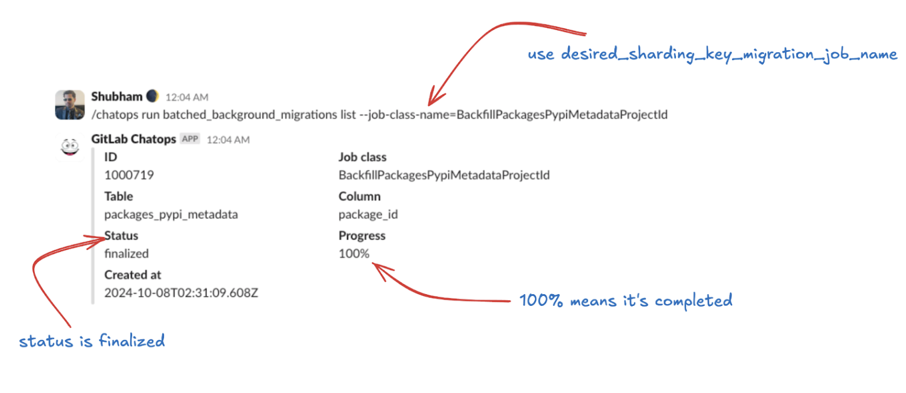

- Once it’s 100% create a new branch from master and run: `bundle exec rails g post_deployment_migration finalize_<table><sharding_key>`

This will create a post deployment migration file, edit it. For example, table `subscription_user_add_on_assignments` it will look like:

```ruby
class FinalizeBackfillSubscriptionUserAddOnAssignmentsOrganizationId < Gitlab::Database::Migration[2.2]
  milestone '17.6'
  disable_ddl_transaction!

  restrict_gitlab_migration gitlab_schema: :gitlab_main_cell

  def up
    ensure_batched_background_migration_is_finished(
      job_class_name: 'BackfillSubscriptionUserAddOnAssignmentsOrganizationId',
      table_name: :subscription_user_add_on_assignments,
      column_name: :id,
      job_arguments: [:organization_id, :subscription_add_on_purchases, :organization_id, :add_on_purchase_id],
      finalize: true
    )
  end

  def down; end
end
```

- It will be similar for every other table except the `job_class_name`, `table_name`, `column_name`, and `job_arguments`. Make sure the job arguments are correct. You can check the add sharding key & backfill MR to match the job arguments
- Once it’s done, run `bin/rails db:migrate` and update key `finalized_by` in db/docs. Example MR: [!169834](https://gitlab.com/gitlab-org/gitlab/-/merge_requests/169834)
- You are all set. Git commit and create MR 🎉

### 3. Add a NOT NULL constraint

The last step is to make sure the sharding key has a `NOT NULL` constraint.

**1. Small tables**

- Create a post deployment migration using `bundle exec rails g post_deployment_migration <table_name>_not_null`

For example, table subscription_user_add_on_assignments:

```ruby
class AddSubscriptionUserAddOnAssignmentsOrganizationIdNotNull < Gitlab::Database::Migration[2.2]
  milestone '17.6'
  disable_ddl_transaction!

  def up
    add_not_null_constraint :subscription_user_add_on_assignments, :organization_id
  end

  def down
    remove_not_null_constraint :subscription_user_add_on_assignments, :organization_id
  end
end
```

- Run `bin/rails db:migrate`
- Open the corresponding `db/docs.*.yml` file, in this case `db/docs/subscription_user_add_on_assignments.yml` and remove `desired_sharding_key` and `desired_sharding_key_migration_job_name`  configuration and add the `sharding_key`

```yaml
sharding_key:
  organization_id: organizations
```

- Example MR: [Add NOT NULL for sharding key on subscription_user_add_on_assignments](https://gitlab.com/gitlab-org/gitlab/-/merge_requests/170136/diffs)

**2. Large tables or tables that exceed runtime**

In this case we have to add async validation before we can add the sharding key. It will be a 2 MR process. Let’s take an example of table `packages_package_files`.

*(Step 1 (MR 1): [Add NOT NULL for sharding key on packages_package_files](https://gitlab.com/gitlab-org/gitlab/-/merge_requests/184630/diffs)*

- Create a [post deployment migration](https://gitlab.com/gitlab-org/gitlab/-/merge_requests/184630/diffs#cf4ce3e2d6f2d05856d6d51ccd69955154aab90e_0_8) to add not null constraint with `validate: false`.


- Create another post deployment migration to [prepare async constraint validation](https://gitlab.com/gitlab-org/gitlab/-/merge_requests/184630/diffs#5e57a29e756749835c6a45c151ad673a54230058_0_10).

```ruby
class PreparePackagesPackageFilesProjectIdNotNullValidation < Gitlab::Database::Migration[2.2]
  disable_ddl_transaction!
  milestone '17.11'

  CONSTRAINT_NAME = :check_43773f06dc

  def up
    prepare_async_check_constraint_validation :packages_package_files, name: CONSTRAINT_NAME
  end

  def down
    unprepare_async_check_constraint_validation :packages_package_files, name: CONSTRAINT_NAME
  end
end
```

- Run `bin/rails db:migrate` and create the MR with changes

*Step 2 (MR 2): [Validate project_id NOT NULL on packages_package_files](https://gitlab.com/gitlab-org/gitlab/-/merge_requests/185064/diffs)*

- Once the MR in Step 1 is merged, wait for a couple of days to prepare, you can check the status on <https://console.postgres.ai/>, just ask the joe instance bot for the table information. Look for `Check constraints`.

Sharding key `project_id` will appear NOT VALID.

```shell
Check constraints:
  "check_43773f06dc" CHECK (project_id IS NOT NULL) NOT VALID
```

- Once it’s there we can create a new post deployment migration to [validate the not null constraint](https://gitlab.com/gitlab-org/gitlab/-/merge_requests/185064/diffs#6bc3faf674b76d8c4c2766b7e174e99e54bf185e_0_7). It will be a no-op down migration.
- Run `bin/rails db:migrate` and remove the following add constraint from `structure.sql` and add it to table definition:

- Remove:

```sql
ALTER TABLE packages_package_files
    ADD CONSTRAINT check_43773f06dc CHECK ((project_id IS NOT NULL)) NOT VALID;
```

- Add:

```sql
CREATE TABLE packages_package_files (
    .
    .
    CONSTRAINT check_43773f06dc CHECK ((project_id IS NOT NULL)),
);
```

- Open the corresponding `db/docs.*.yml` file, in this case `db/docs/packages_package_files.yml`, and remove `desired_sharding_key` and `desired_sharding_key_migration_job_name` configuration and add the `sharding_key`.

- Create the MR with label `pipeline:skip-check-migrations` as reverting this migration is intended to be `#no-op`.


Pipelines might complain about a missing FK. You must add the FK to `allowed_to_be_missing_foreign_key` in [sharding_key_spec.rb](https://gitlab.com/gitlab-org/gitlab/-/blob/master/spec/lib/gitlab/database/sharding_key_spec.rb?ref_type=heads#L81).


### 4. Debug Failures

#### 1. Using Kibana

There will be certain cases where you can get failure notification after queuing the backfill job. One way is to use the [kibana logs](https://log.gprd.gitlab.net/).

> Note: We only store kibana logs for 7 days

Let’s take the recent `BackfillPushEventPayloadsProjectId` BBM failure as an example.

- Failures are also reported as a comment on backfilled original MR. Example: MR [!183123](https://gitlab.com/gitlab-org/gitlab/-/merge_requests/183123#note_2482744925)


- We can also check the status of the job in `#chat-ops-test` Slack channel, using `/chatops run batched_background_migrations list --job-class-name=<desired_sharding_key_migration_job_name>`.

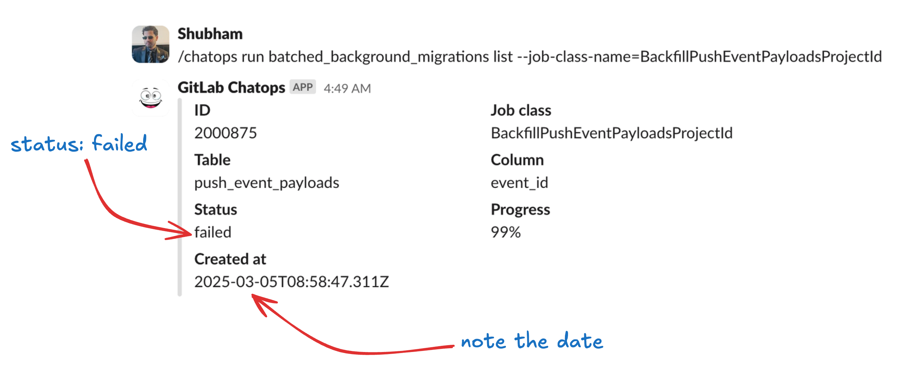

- Let’s figure out the reason for failure using [kibana dashboard](https://log.gprd.gitlab.net/app/discover)
- Make sure the data view is set to `pubsub-sidekiq-inf-gprd*`


- On the left side, you can see all the available fields. We only need `json.job_class_name` i.e. desired sharding key migration job name and the `json.new_state: failed`.


- Let’s add those filters to get the desired logs

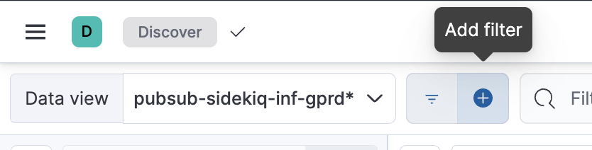

- Set `json.job_class_name` to `BackfillPushEventPayloadsProjectId` in this case and `json.new_state` to `failed` and apply the filter.

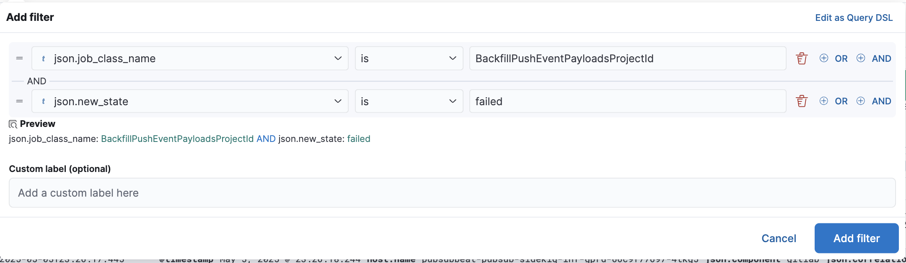

- Make sure to select the right timeline, since this migration was reported as a failure a few days ago I will filter it to show only the last 7 days.

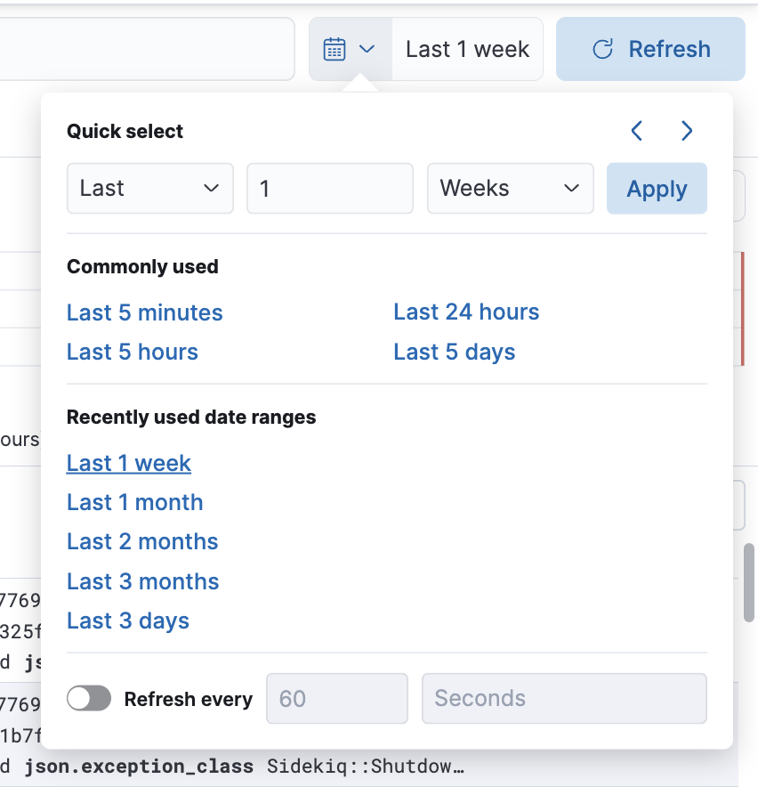

- After that you will see the desired logs with added filters


- Let’s expand the logs and find `json.exception_message`

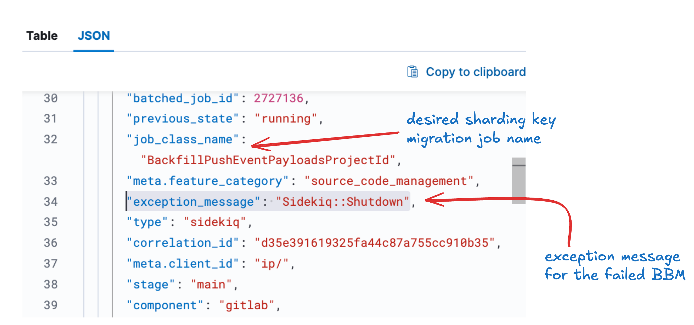

- As you can see this BBM was failed due to `Sidekiq::Shutdown` 😡

- To fix it, just requeue the migration

#### 2. Using Grafana

Sometimes you won't find anything on kibana since we only store logs up to 7 days. For this, we can use the [Grafana dashboard](https://dashboards.gitlab.net/).

Let’s take the recent `BackfillApprovalMergeRequestRulesUsersProjectId` BBM failure as an example.

- You’ll be tagged on the original MR

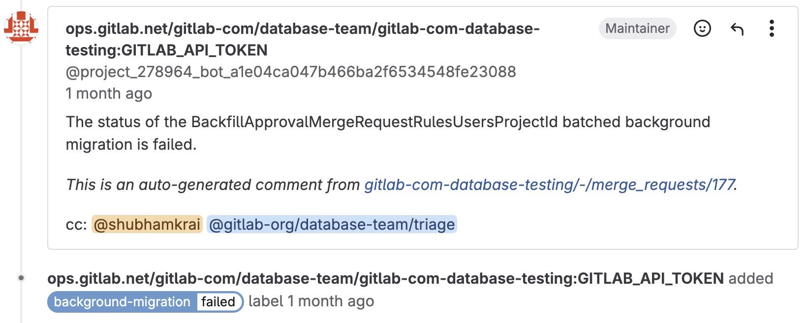

- We can also check the status of the job in `#chat-ops-test` Slack channel, using `/chatops run batched_background_migrations list --job-class-name=<desired_sharding_key_migration_job_name>`


- Let's check the kibana dashboard. There are [no logs](https://log.gprd.gitlab.net/app/discover#/view/07cd7a8b-10bb-457c-8d25-3c6d6269e614?_g=h@9751b81&_a=h@ff28b71) for this job
- Let's go to the [Grafana dashboard](https://dashboards.gitlab.net/explore)


- Click on `Explore` and add a new query


- The easiest way to debug sharding key failures is to check the table size anomaly


- Metric: `gitlab_component_utilization:pg_table_size_bytes:1h`
- Label filters:
  - `env: gprd`
  - `type: patroni`
  - `relname: approval_merge_request_rules_users`
- Timeline: select at least a few days prior to the date of job creation. You can see in the MR that failure was reported on [2025-03-31](https://gitlab.com/gitlab-org/gitlab/-/merge_requests/183354#note_2425371444) and the job was created on **2025-03-11**. I have selected the time range from **2025-03-01** to **2025-04-02**. You can adjust it accordingly
- After running the query a graph will be generated within the selected timeframe

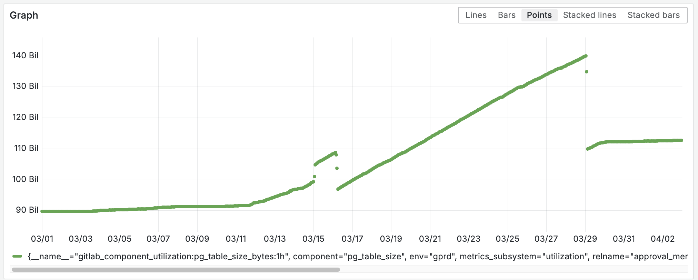

- Let’s make sense of this graph. Backfill job started on **2025-03-11**, you can see a slight increase in table size starting at this date

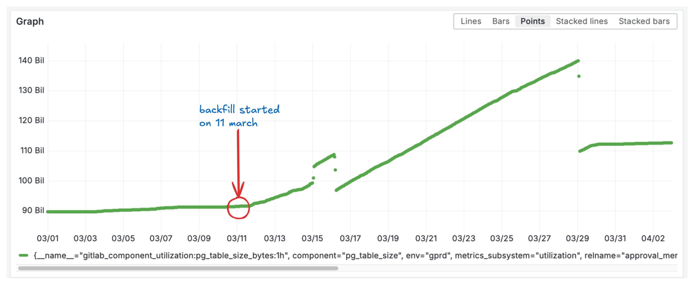

> This is very normal

- Let’s see the changes we have added in the [post migration](https://gitlab.com/gitlab-org/gitlab/-/merge_requests/183354/diffs#396732f8126545e4961d048dbb6e81c4746b5557_0_11). First we added the `prepare_async` index. Let’s check the size on [postgres.ai](https://console.postgres.ai/gitlab/gitlab-production-main/sessions/39129/commands/120292) it’s size is 10 GB. It was created on **2025-03-15** at 00:00, as we can see in the spike in the graph

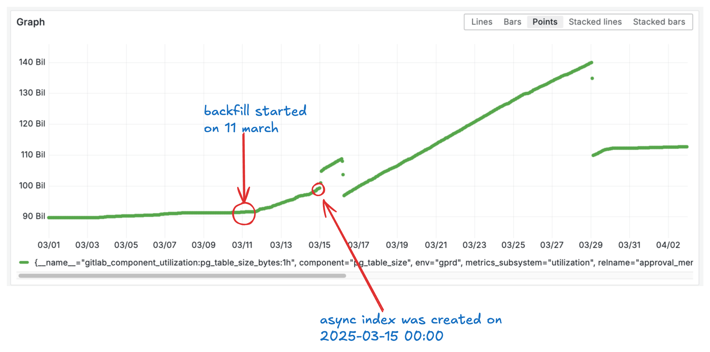

- Once the index is created, backfill starts

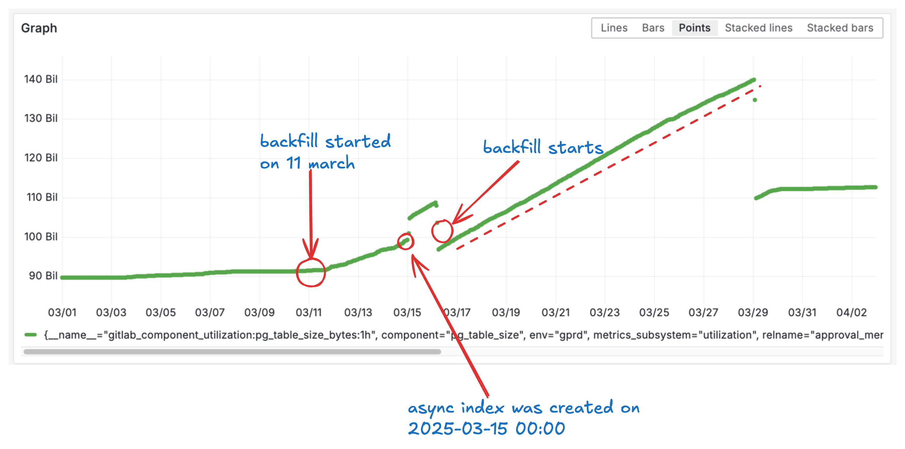

- The BBM fails on **2025-03-29**, you can see in the graph that at this point, table size dropped


- The index + the column backfill increased the table size to approx ~20 GB compared to before the backfill, an increase of ~22% in table size, from ~90 GB to ~110 GB 🫨

- We have a goal to keep all tables [under 100 GB](../database/large_tables_limitations.md)

## Cells Routing

Coming soon, guide on how to route your request to your organization's cell.
