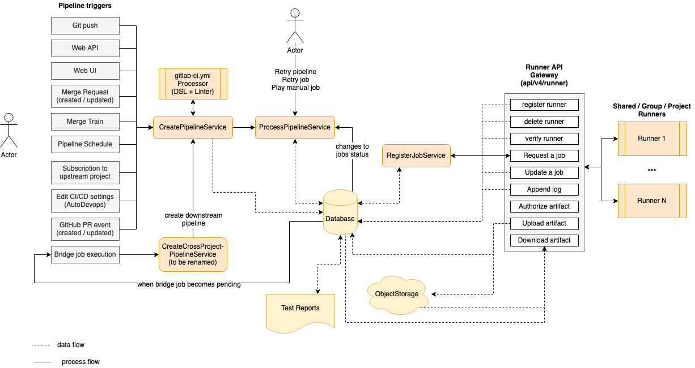

CI/CD pipelines are a fundamental part of GitLab development and deployment processes, automating tasks like building,
testing, and deploying code changes.
When developing features that interact with or trigger pipelines, it's essential to consider the broader implications
these actions have on the system's security and operational integrity.

This document provides guidelines to help you develop features that use CI/CD pipelines securely and effectively.
It emphasizes the importance of understanding the implications of running pipelines, managing authentication tokens
responsibly, and integrating security considerations from the beginning of the development process.

## General guidelines

- **Recognize pipelines as write operations:** Triggering a pipeline is a write operation that changes the system's
  state. The write operation can initiate deployments, run tests, or alter configurations. Treat pipeline triggers with the same caution
  as other critical write operations to prevent unauthorized changes or misuse of the system.
- **Running a pipeline should be an explicit action**: Actions that create a pipeline in the user's context
  should be designed so that it is clear to the user that a pipeline (or single job) is started when performing the action.
  The user should be aware of the changes executed in the pipeline **before** they are executed.
- **Remote execution and isolation:** The CI/CD pipeline functions as a remote execution environment where jobs can
  execute scripts performing a wide range of actions. Ensure that jobs are adequately isolated and do not unintentionally
  expose sensitive data or systems.
- **Collaborate with AppSec and Verify teams:** Include [Application Security (AppSec)](https://handbook.gitlab.com/handbook/security/product-security/application-security/)
  and [Verify](https://handbook.gitlab.com/handbook/engineering/development/ops/verify/) team members early in
  the design process and when drafting proposals. Their expertise can help identify potential security risks and ensure
  that security considerations are integrated into the feature from the outset. Additionally, involve them in the code
  review process to benefit from their specialized knowledge in identifying vulnerabilities and ensuring compliance with
  security standards.
- **Determine the pipeline actor:** When building features that trigger pipelines, it's crucial to consider which user
  initiates the pipeline. You need to determine who should be the actor of the event. Is it an intentional pipeline
  run where a user directly triggers the pipeline (for example by pushing changes to the repository or clicking the "Run pipeline"
  button), or is it a pipeline run initiated by the GitLab system or a policy?
  Avoid scenarios in which the user creating the pipeline is not the author of the changes. If the users are not the same,
  there is a risk that the author of the changes can run code in the context of the pipeline user.
  Understanding the actor helps in managing permissions and ensuring that the pipeline runs in the correct execution context.
- **Variability of job execution users:** The user running a specific job might not be the same user who created the pipeline.
  While in the majority of cases the user is the same, there are scenarios where the user of the job changes, for example when
  running a manual job or retrying a job. This variability can affect permissions and access levels in the job's execution
  context. Always account for this possibility when developing features that use the CI/CD job token (`CI_JOB_TOKEN`). Consider whether the job
  user should change and who the actor of the action is.
- **Restrict scope of the operation:** When enabling a new endpoint for use with the CI/CD job token, strongly consider limiting
  operations to the same job, pipeline, or project to enhance security. Strongly prefer the smaller scope (job) over larger
  scope (project). For example, if allowing access to pipeline data, restrict it to the current pipeline to prevent
  cross-project or cross-pipeline data exposure. Evaluate whether cross-project or cross-pipeline access is truly necessary
  for the feature; limiting the scope reduces security risks.
- **Monitor and audit activities:** Ensure that the feature is auditable and monitorable. Introduce detailed logs of events
  that would trigger a pipeline, including the pipeline user, the actor initiating the action, and event details.

## Other guides

Development guides that are specific to CI/CD are listed here:

- If you are creating new CI/CD templates, read [the development guide for GitLab CI/CD templates](templates.md).
- If you are adding a new keyword or changing the CI schema, refer to the following guides:
  - [The CI configuration guide](configuration.md)
  - [The CI schema guide](schema.md)

See the [CI/CD YAML reference documentation guide](cicd_reference_documentation_guide.md)
to learn how to update the [CI/CD YAML syntax reference page](../../ci/yaml/_index.md).

## Examples of CI/CD usage

We maintain a [`ci-sample-projects`](https://gitlab.com/gitlab-org/ci-sample-projects) group, with projects that showcase
examples of `.gitlab-ci.yml` for different use cases of GitLab CI/CD. They also cover specific syntax that could
be used for different scenarios.

## CI Architecture overview

The following is a simplified diagram of the CI architecture. Some details are left out to focus on
the main components.

<!-- Editable diagram available at https://app.diagrams.net/#G1LFl-KW4fgpBPzz8VIH9rsOlAH4t0xwKj -->

On the left side we have the events that can trigger a pipeline based on various events (triggered by a user or automation):

- A `git push` is the most common event that triggers a pipeline.
- The [Web API](../../api/pipelines.md#create-a-new-pipeline).
- A user selecting the "Run pipeline" button in the UI.
- When a [merge request is created or updated](../../ci/pipelines/merge_request_pipelines.md).
- When an MR is added to a [Merge Train](../../ci/pipelines/merge_trains.md).
- A [scheduled pipeline](../../ci/pipelines/schedules.md).
- When project is [subscribed to an upstream project](../../ci/pipelines/_index.md#trigger-a-pipeline-when-an-upstream-project-is-rebuilt-deprecated).
- When [Auto DevOps](../../topics/autodevops/_index.md) is enabled.
- When GitHub integration is used with [external pull requests](../../ci/ci_cd_for_external_repos/_index.md#pipelines-for-external-pull-requests).
- When an upstream pipeline contains a [bridge job](../../ci/yaml/_index.md#trigger) which triggers a downstream pipeline.

Triggering any of these events invokes the [`CreatePipelineService`](https://gitlab.com/gitlab-org/gitlab/-/blob/master/app/services/ci/create_pipeline_service.rb)
which takes as input event data and the user triggering it, then attempts to create a pipeline.

The `CreatePipelineService` relies heavily on the [`YAML Processor`](https://gitlab.com/gitlab-org/gitlab/-/blob/master/lib/gitlab/ci/yaml_processor.rb)
component, which is responsible for taking in a YAML blob as input and returns the abstract data structure of a
pipeline (including stages and all jobs). This component also validates the structure of the YAML while
processing it, and returns any syntax or semantic errors. The `YAML Processor` component is where we define
[all the keywords](../../ci/yaml/_index.md) available to structure a pipeline.

The `CreatePipelineService` receives the abstract data structure returned by the `YAML Processor`,
which then converts it to persisted models (like pipeline, stages, and jobs). After that, the pipeline is ready
to be processed. Processing a pipeline means running the jobs in order of execution (stage or `needs`)
until either one of the following:

- All expected jobs have been executed.
- Failures interrupt the pipeline execution.

The component that processes a pipeline is [`ProcessPipelineService`](https://gitlab.com/gitlab-org/gitlab/-/blob/master/app/services/ci/process_pipeline_service.rb),
which is responsible for moving all the pipeline's jobs to a completed state. When a pipeline is created, all its
jobs are initially in `created` state. This services looks at what jobs in `created` stage are eligible
to be processed based on the pipeline structure. Then it moves them into the `pending` state, which means
they can now [be picked up by a runner](#job-scheduling). After a job has been executed it can complete
successfully or fail. Each status transition for job within a pipeline triggers this service again, which
looks for the next jobs to be transitioned towards completion. While doing that, `ProcessPipelineService`
updates the status of jobs, stages and the overall pipeline.

On the right side of the diagram we have a list of [runners](../../ci/runners/_index.md)
connected to the GitLab instance. These can be instance runners, group runners, or project runners.
The communication between runners and the Rails server occurs through a set of API endpoints, grouped as
the `Runner API Gateway`.

We can register, delete, and verify runners, which also causes read/write queries to the database. After a runner is connected,
it keeps asking for the next job to execute. This invokes the [`RegisterJobService`](https://gitlab.com/gitlab-org/gitlab/-/blob/master/app/services/ci/register_job_service.rb)
which picks the next job and assigns it to the runner. At this point the job transitions to a
`running` state, which again triggers `ProcessPipelineService` due to the status change.
For more details read [Job scheduling](#job-scheduling)).

While a job is being executed, the runner sends logs back to the server as well any possible artifacts
that must be stored. Also, a job may depend on artifacts from previous jobs to run. In this
case the runner downloads them using a dedicated API endpoint.

Artifacts are stored in object storage, while metadata is kept in the database. An important example of artifacts
are reports (like JUnit, SAST, and DAST) which are parsed and rendered in the merge request.

Job status transitions are not all automated. A user may run [manual jobs](../../ci/jobs/job_control.md#create-a-job-that-must-be-run-manually), cancel a pipeline, retry
specific failed jobs or the entire pipeline. Anything that
causes a job to change status triggers `ProcessPipelineService`, as it's responsible for
tracking the status of the entire pipeline.

A special type of job is the [bridge job](../../ci/yaml/_index.md#trigger) which is executed server-side
when transitioning to the `pending` state. This job is responsible for creating a downstream pipeline, such as
a multi-project or child pipeline. The workflow loop starts again
from the `CreatePipelineService` every time a downstream pipeline is triggered.

<i class="fa fa-youtube-play youtube" aria-hidden="true"></i>
You can watch a walkthrough of the architecture in [CI Backend Architectural Walkthrough](https://www.youtube.com/watch?v=ew4BwohS5OY).

## Job scheduling

When a Pipeline is created all its jobs are created at once for all stages, with an initial state of `created`. This makes it possible to visualize the full content of a pipeline.

A job with the `created` state isn't seen by the runner yet. To make it possible to assign a job to a runner, the job must transition first into the `pending` state, which can happen if:

1. The job is created in the very first stage of the pipeline.
1. The job required a manual start and it has been triggered.
1. All jobs from the previous stage have completed successfully. In this case we transition all jobs from the next stage to `pending`.
1. The job specifies needs dependencies using `needs:` and all the dependent jobs are completed.
1. The job has not been [dropped](#dropping-stuck-builds) because of its not-runnable state by [`Ci::PipelineCreation::DropNotRunnableBuildsService`](https://gitlab.com/gitlab-org/gitlab/-/blob/v16.0.4-ee/ee/app/services/ci/pipeline_creation/drop_not_runnable_builds_service.rb).

When the runner is connected, it requests the next `pending` job to run by polling the server continuously.

NOTE:
API endpoints used by the runner to interact with GitLab are defined in [`lib/api/ci/runner.rb`](https://gitlab.com/gitlab-org/gitlab/-/blob/master/lib/api/ci/runner.rb)

After the server receives the request it selects a `pending` job based on the [`Ci::RegisterJobService` algorithm](#ciregisterjobservice), then assigns and sends the job to the runner.

Once all jobs are completed for the current stage, the server "unlocks" all the jobs from the next stage by changing their state to `pending`. These can now be picked by the scheduling algorithm when the runner requests new jobs, and continues like this until all stages are completed.

### Communication between runner and GitLab server

After the runner is [registered](https://docs.gitlab.com/runner/register/) using the registration token, the server knows what type of jobs it can execute. This depends on:

- The type of runner it is registered as:
  - an instance runner
  - a group runner
  - a project runner
- Any associated tags.

The runner initiates the communication by requesting jobs to execute with `POST /api/v4/jobs/request`. Although polling happens every few seconds, we leverage caching through HTTP headers to reduce the server-side work load if the job queue doesn't change.

This API endpoint runs [`Ci::RegisterJobService`](https://gitlab.com/gitlab-org/gitlab/-/blob/master/app/services/ci/register_job_service.rb), which:

1. Picks the next job to run from the pool of `pending` jobs
1. Assigns it to the runner
1. Presents it to the runner via the API response

### `Ci::RegisterJobService`

There are 3 top level queries that this service uses to gather the majority of the jobs and they are selected based on the level where the runner is registered to:

- Select jobs for instance runner (instance-wide)
  - Uses a fair scheduling algorithm which prioritizes projects with fewer running builds
- Select jobs for group runner
- Select jobs for project runner

This list of jobs is then filtered further by matching tags between job and runner tags.

NOTE:
If a job contains tags, the runner doesn't pick the job if it does not match **all** the tags.
The runner may have more tags than defined for the job, but not vice-versa.

Finally if the runner can only pick jobs that are tagged, all untagged jobs are filtered out.

At this point we loop through remaining `pending` jobs and we try to assign the first job that the runner "can pick" based on additional policies. For example, runners marked as `protected` can only pick jobs that run against protected branches (such as production deployments).

As we increase the number of runners in the pool we also increase the chances of conflicts which would arise if assigning the same job to different runners. To prevent that we gracefully rescue conflict errors and assign the next job in the list.

### Dropping stuck builds

There are two ways of marking builds as "stuck" and drop them.

1. When a build is created, [`Ci::PipelineCreation::DropNotRunnableBuildsService`](https://gitlab.com/gitlab-org/gitlab/-/blob/v16.0.4-ee/ee/app/services/ci/pipeline_creation/drop_not_runnable_builds_service.rb) checks for upfront known conditions that would make jobs not executable:
   - If there is not enough [CI/CD Minutes](#compute-quota) to run the build, then the build is immediately dropped with `ci_quota_exceeded`.
   - [In the future](https://gitlab.com/gitlab-org/gitlab/-/merge_requests/121761), if the project is not on the plan that available runners for the build require via `allowed_plans`, then the build is immediately dropped with `no_matching_runner`.
1. If there is no available Runner to pick up a build, it is dropped after 1 hour by [`Ci::StuckBuilds::DropPendingService`](https://gitlab.com/gitlab-org/gitlab/-/blob/v16.0.4-ee/app/services/ci/stuck_builds/drop_pending_service.rb).
   - If a job is not picked up by a runner in 24 hours it is automatically removed from
     the processing queue after that time.
   - If a pending job is **stuck**, when there is no
     runner available that can process it, it is removed from the queue after 1 hour.
   - In both cases the job's status is changed to `failed` with an appropriate failure reason.

#### The reason behind this difference

Compute minutes quota mechanism is handled early when the job is created because it is a constant decision for most of the time.
Once a project exceeds the limit, every next job matching it will be applicable for it until next month starts.
Of course, the project owner can buy additional minutes, but that is a manual action that the project need to take.

The same mechanism will be used for `allowed_plans` [soon](https://gitlab.com/gitlab-org/gitlab/-/merge_requests/121761).
If the project is not on the required plan and a job is targeting such runner,
it will be failing constantly until the project owner changes the configuration or upgrades the namespace to the required plan.

These two mechanisms are also very SaaS specific and at the same time are quite compute expensive when we consider SaaS' scale.
Doing the check before the job is even transitioned to pending and failing early makes a lot of sense here.

Why we don't handle other cases for pending and drop jobs early?
In some cases, a job is in pending only because the runner is slow on taking up jobs.
This is not something that you can know at GitLab level.
Depending on the runner's configuration and capacity and the size of the queue in GitLab, a job may be taken immediately, or may need to wait.

There may be also other reasons:

- you are handling runner maintenance and it's not available for a while at all,
- you are updating configuration and by mistake, you've messed up the tagging and/or protected flag (or in the case of our SaaS instance runners; you've assigned a wrong cost factor or `allowed_plans` configuration).

All of that are problems that may be temporary and mostly are not expected to happen and are expected to be detected and fixed early.
We definitely don't want to drop jobs immediately when one of these conditions is happening.
Dropping a job only because a runner is at capacity or because there is a temporary unavailability/configuration mistake would be very harmful to users.

## The definition of "Job" in GitLab CI/CD

"Job" in GitLab CI context refers a task to drive Continuous Integration, Delivery and Deployment.
Typically, a pipeline contains multiple stages, and a stage contains multiple jobs.

In Active Record modeling, Job is defined as `CommitStatus` class.
On top of that, we have the following types of jobs:

- `Ci::Build` ... The job to be executed by runners.
- `Ci::Bridge` ... The job to trigger a downstream pipeline.
- `GenericCommitStatus` ... The job to be executed in an external CI/CD system, for example Jenkins.

When you use the "Job" terminology in codebase, readers would
assume that the class/object is any type of above.
If you specifically refer `Ci::Build` class, you should not name the object/class
as "job" as this could cause some confusions. In documentation,
we should use "Job" in general, instead of "Build".

We have a few inconsistencies in our codebase that should be refactored.
For example, `CommitStatus` should be `Ci::Job` and `Ci::JobArtifact` should be `Ci::BuildArtifact`.
See [this issue](https://gitlab.com/gitlab-org/gitlab/-/issues/16111) for the full refactoring plan.

## Compute quota

> - [Renamed](https://gitlab.com/groups/gitlab-com/-/epics/2150) from "CI/CD minutes" to "compute quota" and "compute minutes" in GitLab 16.1.

This diagram shows how the [Compute quota](../../ci/pipelines/compute_minutes.md)
feature and its components work.

<!-- Editable diagram available at https://app.diagrams.net/?libs=general;flowchart#G1XjLPvJXbzMofrC3eKRyDEk95clV6ypOb -->

Watch a walkthrough of this feature in details in the video below.

  See the video: <a href="https://www.youtube.com/watch?v=NmdWRGT8kZg">CI/CD minutes - architectural overview</a>.

<figure class="video-container">
  <iframe src="https://www.youtube-nocookie.com/embed/NmdWRGT8kZg" frameborder="0" allowfullscreen> </iframe>
</figure>
