## .com Overview

### Minute Quotas and Purchasing Minutes

Minutes are purchased in the Customers Portal for use on .com.

Each plan type comes with a per root namespace "monthly compute quota" allocation. At the start of each month, the monthly quota for the namespace is reset and allocated back to the "monthly compute quota". Usage is also reset to 0 for the month.

[Additional packs](../../subscriptions/gitlab_com/compute_minutes.md) are also available for purchase at any time. These packs start being consumed if the usage goes above the monthly compute quota.

## Instance Runner Quota Enforcement

When a job finishes on an instance type runner, we store two metrics aggregated at the namespace level for the current month:

- `CI compute minute usage`
- `duration` in seconds

We also store this aggregated usage at the project level for the current month.

[`CI compute minute usage`](../../ci/pipelines/compute_minutes.md#compute-minute-usage) is calculated using the formula: `Job duration / 60 * Cost factor`, where duration is the `running` time for the job in seconds. Some discounts are applied based on the project type on GitLab.com, which would not apply to Dedicated instances.

When the monthly quota is consumed and no additional packs are available, GitLab drops the running build after providing a grace period of n minutes. Once the quota is exceeded, new builds from the namespace can no longer be picked up by instance runners.

In the GitLab Rails application, we render notifications and send out emails when the namespace is close to running out of minutes.

This diagram shows how the [Compute minute quota](../../ci/pipelines/compute_minutes.md) feature and its components work.

<!-- Editable diagram available at https://app.diagrams.net/?libs=general;flowchart#G1XjLPvJXbzMofrC3eKRyDEk95clV6ypOb -->

Watch a walkthrough of this feature in detail in the video below.

  See the video: <a href="https://www.youtube.com/watch?v=NmdWRGT8kZg">CI/CD minutes - architectural overview</a>.

<figure class="video-container">
  <iframe src="https://www.youtube-nocookie.com/embed/NmdWRGT8kZg" frameborder="0" allowfullscreen> </iframe>
</figure>

## Technical Architecture for Usage Tracking

```mermaid
sequenceDiagram
    participant Runner
    participant GitLab API
    participant Redis
    participant Database

    Note over Runner,GitLab API: Job Request Phase
    Runner->>GitLab API: POST /api/v4/jobs/request
    GitLab API-->>Runner: Returns pending job
    Note over GitLab API: Job status: pending → running<br/>started_at timestamp set

    Note over Runner,Database: Job Running Phase
    loop Periodic Updates
        Runner->>GitLab API: PUT /api/v4/jobs/{id}<br/>(update job status)
        GitLab API->>Redis: Get current running builds usage
        GitLab API->>Database: Get finished builds usage
        Note over GitLab API: Calculate remaining quota
        alt Over quota + threshold
            GitLab API-->>Runner: Job-Status header: failure
        else Within quota
            GitLab API-->>Runner: Job-Status header: running
        end
        
        Runner->>GitLab API: PATCH /api/v4/jobs/{id}/trace<br/>(append build log)
        GitLab API->>Redis: Get current running builds usage
        GitLab API->>Database: Get finished builds usage
        Note over GitLab API: Calculate remaining quota
        alt Over quota + threshold
            GitLab API-->>Runner: Job-Status header: failure
        else Within quota
            GitLab API-->>Runner: Job-Status header: running
        end
    end

    Note over Runner,Database: Job Completion Phase
    Runner->>GitLab API: Send job status (success/failure/canceled)
    Note over GitLab API: Job moves to completed status
    GitLab API->>Database: Aggregate usage data
    Note over Database: Update Tables<br/>---<br/>ci_namespace_monthly_usages<br/>(one record per month per namespace)<br/>---<br/>ci_project_monthly_usages<br/>(one record per month per project)
```

### Runner Communication

The runner communicates with GitLab through several phases:

**1. Job Request Phase**

A runner polls `POST /api/v4/jobs/request` to find `pending` jobs to execute. When a job is assigned:

- The job status changes to `running` in GitLab
- The `started_at` timestamp is set
- The job begins execution on the runner

Note: If a job has exceeded the quota, it will not be assigned to a runner. This logic is handled in `BuildQueueService`, which is called from `RegisterJobService`.

**2. Job Running Phase**

Once the job is `running`, the runner periodically updates two GitLab endpoints:

- `PUT /api/v4/jobs/{id}` - updates the job's status
- `PATCH /api/v4/jobs/{id}/trace` - appends to the build log

**3. Quota Enforcement During Job Execution**

Real-time quota enforcement serves as an anti-abuse measure to prevent long-running jobs from bypassing 
quota restrictions. For example, a crypto-miner on a free plan namespace has 10 minutes remaining in 
their monthly allocated quota and starts several jobs that run for 120 minutes.

Each time the runner contacts GitLab via the above endpoints, the system checks quota limits:

- `Ci::Minutes::TrackLiveConsumptionService` runs and combines:
  - Redis-backed usage from currently running builds
  - Database-backed usage from finished builds
- The remaining quota is calculated via `Gitlab::Ci::Minutes::CachedQuota`
- If the namespace is over quota plus a grace period threshold, the build is dropped by sending a failure status to the runner in the `PUT/PATCH` response via the `Job-Status` header

**4. Job Completion and Database Storage**

When a build finishes:

- The runner sends the final job status (`success`, `failure`, or `canceled`)
- Rails sets the `finished_at` timestamp
- Usage aggregation is triggered by `::Ci::Minutes::UpdateBuildMinutesService`, which records:
  - Duration in seconds (calculated from `started_at` and `finished_at` timestamps)
  - CI compute minute usage (with cost factor applied: `Job duration / 60 * Cost factor`)
- The `Gitlab::Ci::Minutes::Consumption` class retrieves the appropriate cost factor based on the build's runner and any project-based discounts

### Database Storage

We maintain two tables to track GitLab.com usage:

- `ci_namespace_monthly_usages` - one record per month per namespace
- `ci_project_monthly_usages` - one record per month per project

These tables are backed by the `Ci::Minutes::NamespaceMonthlyUsage` and `Ci::Minutes::ProjectMonthlyUsage` classes.

Pre-aggregating data at the namespace and project level provides several benefits:

- Enables performant real-time queries for quota enforcement and build dropping
- Powers visualizations showing minute usage by project and namespace
- Avoids the performance issues of aggregating across individual build-level data at query time

## Hosted Runners on Dedicated Visualization

In 2024, we developed a purpose-specific visualization for dedicated hosted runners. This visualization was created as a temporary solution to estimate usage across all root namespaces on a Dedicated instance, which was needed to unblock a GA requirement.

The existing GitLab visualizations were insufficient because:

1. **Single namespace limitation**: Existing visualizations only show usage for a single root namespace, but Dedicated customers need visibility across all namespaces on their instance

1. **No runner type distinction**: Admin-managed instance runners can run alongside GitLab Hosted Instance Runners. Since we track all instance runner usage together, existing visualizations would incorrectly include self-managed instance runners in the hosted runner metrics

### How It Works

This visualization works similarly to the standard tracking system, with one key difference: it tracks data into a Dedicated-specific table (`ci_gitlab_hosted_runner_monthly_usages`) based on whether the `instrumentor` has sent `hosted_runner=true` when provisioning the runner. Instance quotas and build dropping do not apply to data in this table.

### Current Implementation

Cost factors must be set through one of these methods:

- Rails console
- Instrumentor (when provisioning the runner)
- Database migration

These cost factors must match the billing system's cost factors for the visualization to remain a close estimate.

The visualization currently provides:

- Breakdown of usage by runner
- Breakdown of usage by namespace

### Future Vision

The long-term goal is to back this visualization directly with data from the Customers Portal, either by:

- Replicating Customers Portal data to GitLab
- Directly querying a Customers Portal API

## Current Limitations on GitLab.com

**1. Limited Auditability**

We only store usage data at the project and namespace level, meaning we lack build-level compute minute data. While this aggregation is necessary for performance (querying across all individual builds would be too slow for real-time quota checks), it limits our ability to audit usage at a granular level.

**2. Charges Continue When GitLab Endpoints Are Unresponsive**

When a runner receives a 500 error from GitLab it retries several times before giving up, then the job remains in a non-completed status. Eventually, a worker on the GitLab.com side clears out stuck jobs, marking them as finished and triggering minute storage. This results in additional GitLab duration and compute minute usage that represents a larger amount of usage than was actually consumed by the runner.

This has caused issues during incidents where we had to manually reset minutes for customers or provide additional packs at company cost. For example, when log/trace storage in Redis ran out of space, it caused failures on the update/append endpoints. Allowing runners to directly record duration would improve resiliency compared to the current approach of billing customers until we receive confirmation from the runner.

**3. SOX Compliance Gap**

The GitLab Rails repository is not under SOX controls. As we transition to consumption-based billing with overages, we need strict SOX controls on repositories handling financial data.

**4. Database Contention**

We've had to disable the tracking mechanism for some customers on Dedicated instances due to database contention when many builds run simultaneously for the same namespace. See: <https://gitlab.com/gitlab-org/gitlab/-/issues/490968>

**5. Platform-Specific Design**

The current system was designed specifically for GitLab.com as a platform, where all instance runners are hosted runners. This is how we determine runner hosting status. However, on other platforms, instance runners can be self-managed. To move hosted runners to other platforms, we need a way to distinguish between hosted and self-managed runners.

## Future Vision for .com

All hosted runner usage should be tracked and managed using a unified system based on the runner single source of truth (SSoT) and Customers Portal tracking.

### Migration Path for .com

We should migrate .com hosted instance runners to use this new tracking system. This migration introduces an additional requirement: quota enforcement, which needs real-time data aggregated at the root namespace level.

Note that quota enforcement is only required for .com, not for other platforms using consumption billing. Even if we adopt consumption billing on .com for established customers, we still need quota enforcement and build dropping for free plans to prevent abuse.

### Expanded Capabilities

This unified approach will enable us to:

- Sell GitLab hosted instance runners on Dedicated instances
- Sell GitLab hosted group or project runners on all platforms
- Sell GitLab hosted runners on self-managed
- Break the current paradigm that a hosted runner must be an instance runner on .com

### Maintaining Backwards Compatibility

When we migrate .com hosted instance runners to the Customers Portal and runner tracking system, we must maintain the existing instance runner tracking to avoid breaking workflows for self-managed customers. We've received support tickets from self-managed customers who use instance runner tracking to monitor their self-hosted instance runners.

It's possible we'll need two distinct tracking systems running side-by-side:

1. Self-managed instance runners - usage tracked and enforced in Rails, managed by instance admins
1. GitLab Hosted runners - usage tracked and enforced in Customers Portal, managed by GitLab

Once .com is no longer the primary customer for instance runner tracking, we should gather usage data from self-managed instances to understand their needs. This will help us work with product to determine whether instance runner minute tracking and quota enforcement should be maintained for self-managed instances long-term.
