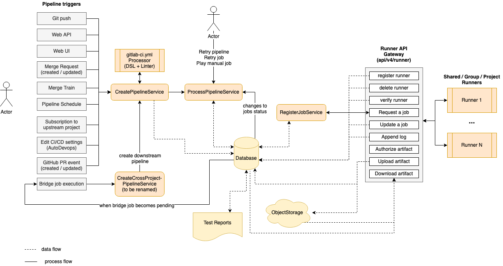
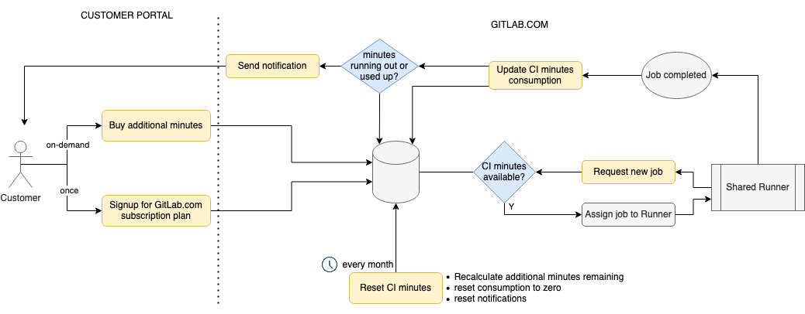

# CI/CD development documentation **(FREE)**

Development guides that are specific to CI/CD are listed here.

If you are creating new CI/CD templates, please read [the development guide for GitLab CI/CD templates](templates.md).

See the [CI/CD YAML reference documentation guide](cicd_reference_documentation_guide.md)
to learn how to update the [reference page](../../ci/yaml/index.md).

## CI Architecture overview

The following is a simplified diagram of the CI architecture. Some details are left out in order to focus on
the main components.

<!-- Editable diagram available at https://app.diagrams.net/#G1LFl-KW4fgpBPzz8VIH9rsOlAH4t0xwKj -->

On the left side we have the events that can trigger a pipeline based on various events (triggered by a user or automation):

- A `git push` is the most common event that triggers a pipeline.
- The [Web API](../../api/pipelines.md#create-a-new-pipeline).
- A user clicking the "Run pipeline" button in the UI.
- When a [merge request is created or updated](../../ci/pipelines/merge_request_pipelines.md#pipelines-for-merge-requests).
- When an MR is added to a [Merge Train](../../ci/pipelines/merge_trains.md#merge-trains).
- A [scheduled pipeline](../../ci/pipelines/schedules.md#pipeline-schedules).
- When project is [subscribed to an upstream project](../../ci/pipelines/multi_project_pipelines.md#trigger-a-pipeline-when-an-upstream-project-is-rebuilt).
- When [Auto DevOps](../../topics/autodevops/index.md) is enabled.
- When GitHub integration is used with [external pull requests](../../ci/ci_cd_for_external_repos/index.md#pipelines-for-external-pull-requests).
- When an upstream pipeline contains a [bridge job](../../ci/yaml/index.md#trigger) which triggers a downstream pipeline.

Triggering any of these events invokes the [`CreatePipelineService`](https://gitlab.com/gitlab-org/gitlab/-/blob/master/app/services/ci/create_pipeline_service.rb)
which takes as input event data and the user triggering it, then attempts to create a pipeline.

The `CreatePipelineService` relies heavily on the [`YAML Processor`](https://gitlab.com/gitlab-org/gitlab/-/blob/master/lib/gitlab/ci/yaml_processor.rb)
component, which is responsible for taking in a YAML blob as input and returns the abstract data structure of a
pipeline (including stages and all jobs). This component also validates the structure of the YAML while
processing it, and returns any syntax or semantic errors. The `YAML Processor` component is where we define
[all the keywords](../../ci/yaml/index.md) available to structure a pipeline.

The `CreatePipelineService` receives the abstract data structure returned by the `YAML Processor`,
which then converts it to persisted models (pipeline, stages, jobs, etc.). After that, the pipeline is ready
to be processed. Processing a pipeline means running the jobs in order of execution (stage or DAG)
until either one of the following:

- All expected jobs have been executed.
- Failures interrupt the pipeline execution.

The component that processes a pipeline is [`ProcessPipelineService`](https://gitlab.com/gitlab-org/gitlab/-/blob/master/app/services/ci/process_pipeline_service.rb),
which is responsible for moving all the pipeline's jobs to a completed state. When a pipeline is created, all its
jobs are initially in `created` state. This services looks at what jobs in `created` stage are eligible
to be processed based on the pipeline structure. Then it moves them into the `pending` state, which means
they can now [be picked up by a runner](#job-scheduling). After a job has been executed it can complete
successfully or fail. Each status transition for job within a pipeline triggers this service again, which
looks for the next jobs to be transitioned towards completion. While doing that, `ProcessPipelineService`
updates the status of jobs, stages and the overall pipeline.

On the right side of the diagram we have a list of [runners](../../ci/runners/index.md)
connected to the GitLab instance. These can be shared runners, group runners, or project-specific runners.
The communication between runners and the Rails server occurs through a set of API endpoints, grouped as
the `Runner API Gateway`.

We can register, delete, and verify runners, which also causes read/write queries to the database. After a runner is connected,
it keeps asking for the next job to execute. This invokes the [`RegisterJobService`](https://gitlab.com/gitlab-org/gitlab/-/blob/master/app/services/ci/register_job_service.rb)
which picks the next job and assigns it to the runner. At this point the job transitions to a
`running` state, which again triggers `ProcessPipelineService` due to the status change.
For more details read [Job scheduling](#job-scheduling)).

While a job is being executed, the runner sends logs back to the server as well any possible artifacts
that need to be stored. Also, a job may depend on artifacts from previous jobs in order to run. In this
case the runner downloads them using a dedicated API endpoint.

Artifacts are stored in object storage, while metadata is kept in the database. An important example of artifacts
are reports (JUnit, SAST, DAST, etc.) which are parsed and rendered in the merge request.

Job status transitions are not all automated. A user may run [manual jobs](../../ci/yaml/index.md#whenmanual), cancel a pipeline, retry
specific failed jobs or the entire pipeline. Anything that
causes a job to change status triggers `ProcessPipelineService`, as it's responsible for
tracking the status of the entire pipeline.

A special type of job is the [bridge job](../../ci/yaml/index.md#trigger) which is executed server-side
when transitioning to the `pending` state. This job is responsible for creating a downstream pipeline, such as
a multi-project or child pipeline. The workflow loop starts again
from the `CreatePipelineService` every time a downstream pipeline is triggered.

## Job scheduling

When a Pipeline is created all its jobs are created at once for all stages, with an initial state of `created`. This makes it possible to visualize the full content of a pipeline.

A job with the `created` state isn't seen by the runner yet. To make it possible to assign a job to a runner, the job must transition first into the `pending` state, which can happen if:

1. The job is created in the very first stage of the pipeline.
1. The job required a manual start and it has been triggered.
1. All jobs from the previous stage have completed successfully. In this case we transition all jobs from the next stage to `pending`.
1. The job specifies DAG dependencies using `needs:` and all the dependent jobs are completed.

When the runner is connected, it requests the next `pending` job to run by polling the server continuously.

NOTE:
API endpoints used by the runner to interact with GitLab are defined in [`lib/api/ci/runner.rb`](https://gitlab.com/gitlab-org/gitlab/-/blob/master/lib/api/ci/runner.rb)

After the server receives the request it selects a `pending` job based on the [`Ci::RegisterJobService` algorithm](#ciregisterjobservice), then assigns and sends the job to the runner.

Once all jobs are completed for the current stage, the server "unlocks" all the jobs from the next stage by changing their state to `pending`. These can now be picked by the scheduling algorithm when the runner requests new jobs, and continues like this until all stages are completed.

### Communication between runner and GitLab server

Once the runner is [registered](https://docs.gitlab.com/runner/register/) using the registration token, the server knows what type of jobs it can execute. This depends on:

- The type of runner it is registered as:
  - a shared runner
  - a group runner
  - a project specific runner
- Any associated tags.

The runner initiates the communication by requesting jobs to execute with `POST /api/v4/jobs/request`. Although this polling generally happens every few seconds we leverage caching via HTTP headers to reduce the server-side work load if the job queue doesn't change.

This API endpoint runs [`Ci::RegisterJobService`](https://gitlab.com/gitlab-org/gitlab/-/blob/master/app/services/ci/register_job_service.rb), which:

1. Picks the next job to run from the pool of `pending` jobs
1. Assigns it to the runner
1. Presents it to the runner via the API response

### `Ci::RegisterJobService`

There are 3 top level queries that this service uses to gather the majority of the jobs and they are selected based on the level where the runner is registered to:

- Select jobs for shared runner (instance level)
- Select jobs for group runner
- Select jobs for project runner

This list of jobs is then filtered further by matching tags between job and runner tags.

NOTE:
If a job contains tags, the runner doesn't pick the job if it does not match **all** the tags.
The runner may have more tags than defined for the job, but not vice-versa.

Finally if the runner can only pick jobs that are tagged, all untagged jobs are filtered out.

At this point we loop through remaining `pending` jobs and we try to assign the first job that the runner "can pick" based on additional policies. For example, runners marked as `protected` can only pick jobs that run against protected branches (such as production deployments).

As we increase the number of runners in the pool we also increase the chances of conflicts which would arise if assigning the same job to different runners. To prevent that we gracefully rescue conflict errors and assign the next job in the list.

## The definition of "Job" in GitLab CI/CD

"Job" in GitLab CI context refers a task to drive Continuous Integration, Delivery and Deployment.
Typically, a pipeline contains multiple stages, and a stage contains multiple jobs.

In Active Record modeling, Job is defined as `CommitStatus` class.
On top of that, we have the following types of jobs:

- `Ci::Build` ... The job to be executed by runners.
- `Ci::Bridge` ... The job to trigger a downstream pipeline.
- `GenericCommitStatus` ... The job to be executed in an external CI/CD system e.g. Jenkins.

Please note that, when you use the "Job" terminology in codebase, readers would
assume that the class/object is any type of above.
If you specifically refer `Ci::Build` class, you should not name the object/class
as "job" as this could cause some confusions. In documentation,
we should use "Job" in general, instead of "Build".

We have a few inconsistencies in our codebase that should be refactored.
For example, `CommitStatus` should be `Ci::Job` and `Ci::JobArtifact` should be `Ci::BuildArtifact`.
See [this issue](https://gitlab.com/gitlab-org/gitlab/-/issues/16111) for the full refactoring plan.

## CI Minutes

This diagram shows how the [CI minutes](../../subscriptions/gitlab_com/index.md#ci-pipeline-minutes)
feature and its components work.

<!-- Editable diagram available at https://app.diagrams.net/?libs=general;flowchart#G1XjLPvJXbzMofrC3eKRyDEk95clV6ypOb -->

Watch a walkthrough of this feature in details in the video below.

  See the video: <a href="https://www.youtube.com/watch?v=NmdWRGT8kZg">CI Minutes - architectural overview</a>.

<figure class="video-container">
  <iframe src="https://www.youtube.com/embed/NmdWRGT8kZg" frameborder="0" allowfullscreen="true"> </iframe>
</figure>
