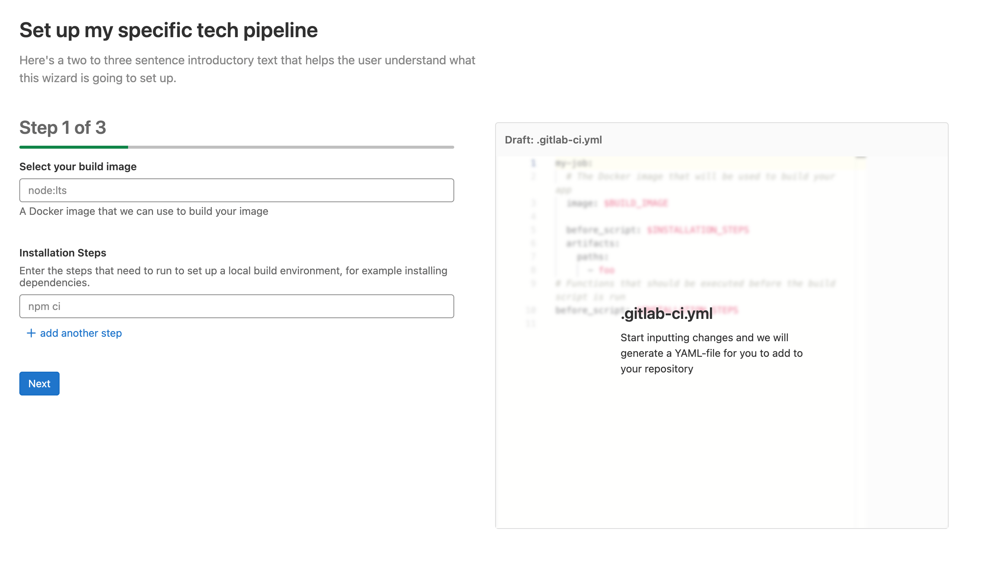
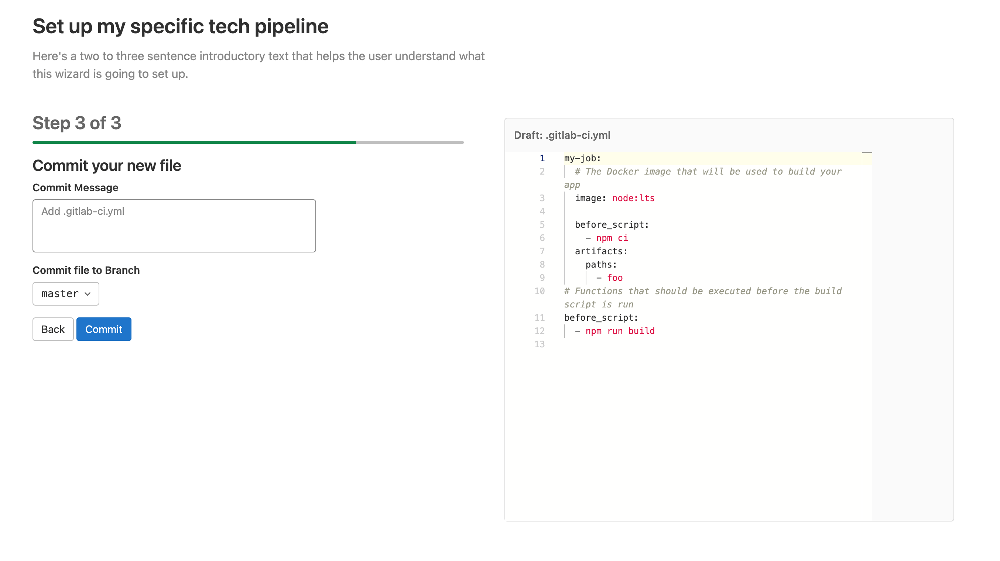

The Pipeline Wizard is a Vue frontend component that helps users create a
pipeline by using input fields. The type of input fields and the form of the final
pipeline is configured by a YAML template.

The Pipeline Wizard expects a single template file that configures the user
flow. The wizard is agnostic with regards to the contents of the file,
so you can use the wizard to display a range of different flows. For example, there
could be one template file for static sites,
one for Docker images, one for mobile apps, and so on. As a first iteration,
these templates are part of the GitLab source code.

The template file defines multiple steps. The last step shown to the user is always
the commit, and is not part of the template definition. An ideal user experience
consists of 2-3 steps, for a total of 3-4 steps visible to the user.

## Usage Example

### Vue Component

```vue
<!-- ~/my_feature/my_component.vue -->

<script>
  import PipelineWizard from '~/pipeline_wizard/pipeline_wizard.vue'
  import template from '~/pipeline_wizard/templates/my_template.yml';

  export default {
    name: "MyComponent",
    components: { PipelineWizard },
    data() {
      return { template }
    },
    methods: {
      onDone() {
        // redirect
      }
     }
  }
</script>

<template>
  <pipeline-wizard :template="template"
                   project-path="foo/bar"
                   default-branch="main"
                   @done="onDone" />
</template>
```

### Template

```yaml
# ~/pipeline_wizard/templates/my_template.yml
id: gitlab/my-template
title: Set up my specific tech pipeline
description: Here's two or three introductory sentences that help the user understand what this wizard is going to set up.
steps:
  # Step 1
  - inputs:
      # First input widget
      - label: Select your build image
        description: A Docker image that we can use to build your image
        placeholder: node:lts
        widget: text
        target: $BUILD_IMAGE
        required: true
        pattern: "^(?:(?=[^:\/]{1,253})(?!-)[a-zA-Z0-9-]{1,63}(?<!-)(?:\.(?!-)[a-zA-Z0-9-]{1,63}(?<!-))*(?::[0-9]{1,5})?\/)?((?![._-])(?:[a-z0-9._-]*)(?<![._-])(?:\/(?![._-])[a-z0-9._-]*(?<![._-]))*)(?::(?![.-])[a-zA-Z0-9_.-]{1,128})?$"
        invalid-feedback: Please enter a valid docker image

      # Second input widget
      - label: Installation Steps
        description: "Enter the steps that need to run to set up a local build
          environment, for example installing dependencies."
        placeholder: npm ci
        widget: list
        target: $INSTALLATION_STEPS

    # This is the template to copy to the final pipeline file and updated with
    # the values input by the user. Comments are copied as-is.
    template:
      my-job:
        # The Docker image that will be used to build your app
        image: $BUILD_IMAGE

        before_script: $INSTALLATION_STEPS

        artifacts:
          paths:
            - foo

  # Step 2
  - inputs:
      # This is the only input widget for this step
      - label: Installation Steps
        description: "Enter the steps that need to run to set up a local build
          environment, for example installing dependencies."
        placeholder: npm ci
        widget: list
        target: $INSTALLATION_STEPS

    template:
      # Functions that should be executed before the build script runs
      before_script: $INSTALLATION_STEPS
```

### The result

1. 
1. 
1. 

### The commit step

The last step of the wizard is always the commit step. Users can commit the
newly created file to the repository defined by the [wizard's props](#props).
The user has the option to change the branch to commit to. A future iteration
is planned to add the ability to create a MR from here.

## Component API Reference

### Props

- `template` (required): The template content as an un-parsed string. See
  [Template file location](#template-file-location) for more information.
- `project-path` (required): The full path of the project the final file
  should be committed to
- `default-branch` (required): The branch that will be pre-selected during
  the commit step. This can be changed by the user.
- `default-filename` (optional, default: `.gitlab-ci.yml`): The filename to be used for the file. This can be overridden in the template file.

### Events

- `done` - Emitted after the file has been committed. Use this to redirect the
  user to the pipeline, for example.

### Template file location

Template files are usually stored as YAML files in `~/pipeline_wizard/templates/`.

The `PipelineWizard` component expects the `template` property as an un-parsed `String`,
and Webpack is configured to load `.yml` files from the above folder as strings.
If you must load the file from a different place, make sure
Webpack does not parse it as an Object.

## Template Reference

### Template

In the root element of the template file, you can define the following properties:

| Name          | Required               | Type   | Description                                                                                                                                                                                                              |
|---------------|------------------------|--------|--------------------------------------------------------------------------------------------------------------------------------------------------------------------------------------------------------------------------|
| `id`          | **{check-circle}** Yes | string | A unique template ID. This ID should follow a namespacing pattern, with a forward slash `/` as separator. Templates committed to GitLab source code should always begin with `gitlab`. For example: `gitlab/my-template` |
| `title`       | **{check-circle}** Yes | string | The page title as displayed to the user. It becomes an `h1` heading above the wizard.                                                                                                                                    |
| `description` | **{check-circle}** Yes | string | The page description as displayed to the user.                                                                                                                                                                           |
| `filename`    | **{dotted-circle}** No | string | The name of the file that is being generated. Defaults to `.gitlab-ci.yml`.                                                                                                                                              |
| `steps`       | **{check-circle}** Yes | list   | A list of [step definitions](#step-reference).                                                                                                                                                                           |

### `step` Reference

A step makes up one page in a multi-step (or page) process. It consists of one or more
related input fields that build a part of the final `.gitlab-ci.yml`.

Steps include two properties:

| Name       | Required               | Type | Description                                                                                                                                                                           |
|------------|------------------------|------|---------------------------------------------------------------------------------------------------------------------------------------------------------------------------------------|
| `template` | **{check-circle}** Yes | map  | The raw YAML to deep-merge into the final `.gitlab-ci.yml`. This template section can contain variables denoted by a `$` sign that is replaced with the values from the input fields. |
| `inputs`   | **{check-circle}** Yes | list | A list of [input definitions](#input-reference).                                                                                                                                      |

### `input` Reference

Each step can contain one or more `inputs`. For an ideal user experience, it should not
contain more than three.

The look and feel of the input, as well as the YAML type it produces (string, list, and so on)
depends on the [`widget`](#widgets) used. [`widget: text`](#text) displays a
text input
and inserts the user's input as a string into the template. [`widget: list`](#list)
displays one or more input fields and inserts a list.

All `inputs` must have a `label`, `widget`, and optionally `target`, but
most properties
are dependent on the widget being used:

| Name     | Required               | Type   | Description                                                                                                                 |
|----------|------------------------|--------|-----------------------------------------------------------------------------------------------------------------------------|
| `label`  | **{check-circle}** Yes | string | The label for the input field.                                                                                              |
| `widget` | **{check-circle}** Yes | string | The [widget](#widgets) type to use for this input.                                                                          |
| `target` | **{dotted-circle}** No | string | The variable name inside the step's template that should be replaced with the value of the input field, for example `$FOO`. |

### Widgets

#### Text

Use as `widget: text`. This inserts a `string` in the YAML file.

| Name              | Required               | Type    | Description           |
|-------------------|------------------------|---------|-----------------------|
| `label`           | **{check-circle}** Yes | string  | The label for the input field. |
| `description`     | **{dotted-circle}** No | string  | Help text related to the input field. |
| `required`        | **{dotted-circle}** No | boolean | Whether or not the user must provide a value before proceeding to the next step. `false` if not defined. |
| `placeholder`     | **{dotted-circle}** No | string  | A placeholder for the input field. |
| `pattern`         | **{dotted-circle}** No | string  | A regular expression that the user's input must match before they can proceed to the next step. |
| `invalidFeedback` | **{dotted-circle}** No | string  | Help text displayed when the pattern validation fails. |
| `default`         | **{dotted-circle}** No | string  | The default value for the field. |
| `id`              | **{dotted-circle}** No | string  | The input field ID is usually autogenerated but can be overridden by providing this property. |

#### List

Use as `widget: list`. This inserts a `list` in the YAML file.

| Name              | Required               | Type    | Description           |
|-------------------|------------------------|---------|-----------------------|
| `label`           | **{check-circle}** Yes | string  | The label for the input field. |
| `description`     | **{dotted-circle}** No | string  | Help text related to the input field. |
| `required`        | **{dotted-circle}** No | boolean | Whether or not the user must provide a value before proceeding to the next step. `false` if not defined. |
| `placeholder`     | **{dotted-circle}** No | string  | A placeholder for the input field. |
| `pattern`         | **{dotted-circle}** No | string  | A regular expression that the user's input must match before they can proceed to the next step. |
| `invalidFeedback` | **{dotted-circle}** No | string  | Help text displayed when the pattern validation fails. |
| `default`         | **{dotted-circle}** No | list    | The default value for the list |
| `id`              | **{dotted-circle}** No | string  | The input field ID is usually autogenerated but can be overridden by providing this property. |

#### Checklist

Use as `widget: checklist`. This inserts a list of checkboxes that need to
be checked before proceeding to the next step.

| Name    | Required               | Type   | Description                                                                                                                                                                        |
|---------|------------------------|--------|------------------------------------------------------------------------------------------------------------------------------------------------------------------------------------|
| `title` | **{dotted-circle}** No | string | A title above the checklist items.                                                                                                                                                  |
| `items` | **{dotted-circle}** No | list   | A list of items that need to be checked. Each item corresponds to one checkbox, and can be a string or [checklist item](#checklist-item). |

##### Checklist Item

| Name   | Required               | Type    | Description                             |
|--------|------------------------|---------|-----------------------------------------|
| `text` | **{check-circle}** Yes | string  | A title above the checklist items.      |
| `help` | **{dotted-circle}** No | string  | Help text explaining the item.          |
| `id`   | **{dotted-circle}** No | string  | The input field ID is usually autogenerated but can be overridden by providing this property. |
