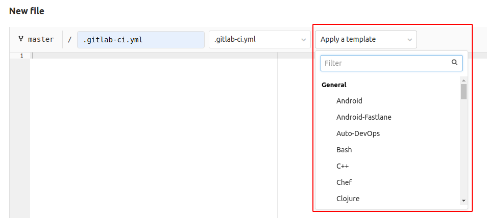

NOTE:
With the introduction of the [CI/CD Catalog](../../ci/components/_index.md#cicd-catalog),
GitLab is no longer accepting contributions of new CI/CD templates to the codebase. Instead,
we encourage team members to create [CI/CD components](../../ci/components/_index.md)
for the catalog. This transition enhances the modularity and maintainability of our
shared CI/CD resources, and avoids the complexities of contributing new CI/CD templates.
If you need to update an existing template, you must also update the matching CI/CD component.
If no component exists that matches the CI/CD template yet, consider [creating the matching component](components.md).
This ensures that template and component functionality remain in sync, aligning with
our new development practices.

This document explains how to develop [GitLab CI/CD templates](../../ci/examples/_index.md#cicd-templates).

## Requirements for CI/CD templates

Before submitting a merge request with a new or updated CI/CD template, you must:

- Place the template in the correct [directory](#template-directories).
- Follow the [CI/CD template authoring guidelines](#template-authoring-guidelines).
- Name the template following the `*.gitlab-ci.yml` format.
- Use valid [`.gitlab-ci.yml` syntax](../../ci/yaml/_index.md). Verify it's valid
  with the [CI/CD lint tool](../../ci/yaml/lint.md).
- [Add template metrics](#add-metrics).
- Include [a changelog](../changelog.md) if the merge request introduces a user-facing change.
- Follow the [template review process](#contribute-cicd-template-merge-requests).
- (Optional but highly recommended) Test the template in an example GitLab project
  that reviewers can access. Reviewers might not be able to create the data or configuration
  that the template requires, so an example project helps the reviewers ensure the
  template is correct. The example project pipeline should succeed before submitting
  the merge request for review.

## Template directories

All template files are saved in `lib/gitlab/ci/templates`. Save general templates
in this directory, but certain template types have a specific directory reserved for
them. The ability to [select a template in new file UI](#make-sure-the-new-template-can-be-selected-in-ui)
is determined by the directory it is in:

| Sub-directory  | Selectable in UI | Template type |
|----------------|------------------|---------------|
| `/*` (root)    | Yes              | General templates. |
| `/AWS/*`       | No               | Templates related to Cloud Deployment (AWS). |
| `/Jobs/*`      | No               | Templates related to Auto DevOps. |
| `/Pages/*`     | Yes              | Sample templates for using Static site generators with GitLab Pages. |
| `/Security/*`  | Yes              | Templates related to Security scanners. |
| `/Terraform/*` | No               | Templates related to infrastructure as Code (Terraform). |
| `/Verify/*`    | Yes              | Templates related to Testing features. |
| `/Workflows/*` | No               | Sample templates for using the `workflow:` keyword. |

## Template authoring guidelines

Use the following guidelines to ensure your template submission follows standards:

### Template types

Templates have two different types that impact the way the template should be written
and used. The style in a template should match one of these two types:

A **pipeline template** provides an end-to-end CI/CD workflow that matches a project's
structure, language, and so on. It usually should be used by itself in projects that
don't have any other `.gitlab-ci.yml` files.

When authoring pipeline templates:

- Place any [global keywords](../../ci/yaml/_index.md#global-keywords) like `image`
  or `before_script` in a [`default`](../../ci/yaml/_index.md#default)
  section at the top of the template.
- Note clearly in the [code comments](#explain-the-template-with-comments) if the
  template is designed to be used with the `includes` keyword in an existing
  `.gitlab-ci.yml` file or not.

A **job template** provides specific jobs that can be added to an existing CI/CD
workflow to accomplish specific tasks. It usually should be used by adding it to
an existing `.gitlab-ci.yml` file by using the [`includes`](../../ci/yaml/_index.md#global-keywords)
keyword. You can also copy and paste the contents into an existing `.gitlab-ci.yml` file.

Configure job templates so that users can add them to their current pipeline with very
few or no modifications. It must be configured to reduce the risk of conflicting with
other pipeline configuration.

When authoring job templates:

- Do not use [global](../../ci/yaml/_index.md#global-keywords) or [`default`](../../ci/yaml/_index.md#default)
  keywords. When a root `.gitlab-ci.yml` includes a template, global or default keywords
  might be overridden and cause unexpected behavior. If a job template requires a
  specific stage, explain in the code comments that users must manually add the stage
  to the main `.gitlab-ci.yml` configuration.
- Note clearly in [code comments](#explain-the-template-with-comments) that the template
  is designed to be used with the `includes` keyword or copied into an existing configuration.
- Consider [versioning](#versioning) the template with latest and stable versions
  to avoid [backward compatibility](#backward-compatibility) problems.
  Maintenance of this type of template is more complex, because changes to templates
  imported with `includes` can break pipelines for all projects using the template.

Additional points to keep in mind when authoring templates:

| Template design points                               | Pipeline templates | Job templates |
|------------------------------------------------------|--------------------|---------------|
| Can use global keywords, including `stages`.         | Yes                | No            |
| Can define jobs.                                     | Yes                | Yes           |
| Can be selected in the new file UI                   | Yes                | No            |
| Can include other job templates with `include`       | Yes                | No            |
| Can include other pipeline templates with `include`. | No                 | No            |

### Syntax guidelines

To make templates easier to follow, templates should all use clear syntax styles,
with a consistent format.

The `before_script`, `script`, and `after_script` keywords of every job are linted
using [ShellCheck](https://www.shellcheck.net/) and should follow the
[Shell scripting standards and style guidelines](../shell_scripting_guide/_index.md)
as much as possible.

ShellCheck assumes that the script is designed to run using [Bash](https://www.gnu.org/software/bash/).
Templates which use scripts for shells that aren't compatible with the Bash ShellCheck
rules can be excluded from ShellCheck linting. To exclude a script, add it to the
`EXCLUDED_TEMPLATES` list in [`scripts/lint_templates_bash.rb`](https://gitlab.com/gitlab-org/gitlab/-/tree/master/scripts/lint_templates_bash.rb).

#### Do not hardcode the default branch

Use [`$CI_COMMIT_BRANCH == $CI_DEFAULT_BRANCH`](../../ci/variables/predefined_variables.md)
instead of a hardcoded `main` branch, and never use `master`:

```yaml
job:
  rules:
    if: $CI_COMMIT_BRANCH == $CI_DEFAULT_BRANCH
  script:
    echo "example job"
```

#### Use `rules` instead of `only` or `except`

Avoid using [`only` or `except`](../../ci/yaml/_index.md#only--except) if possible.
Only and except is not being developed any more, and [`rules`](../../ci/yaml/_index.md#rules)
is now the preferred syntax:

```yaml
job2:
  script:
    - echo
  rules:
    - if: $CI_COMMIT_BRANCH
```

#### Break up long commands

If a command is very long, or has many command line flags, like `-o` or `--option`:

- Split these up into a multi-line command to make it easier to see every part of the command.
- Use the long name for the flags, when available.

For example, with a long command with short CLI flags like
`docker run --e SOURCE_CODE="$PWD" -v "$PWD":/code -v /var/run/docker.sock:/var/run/docker.sock "$CODE_QUALITY_IMAGE" /code`:

```yaml
job1:
  script:
    - docker run
        --env SOURCE_CODE="$PWD"
        --volume "$PWD":/code
        --volume /var/run/docker.sock:/var/run/docker.sock
        "$CODE_QUALITY_IMAGE" /code
```

You can also use the `|` and `>` YAML operators to [split up multi-line commands](../../ci/yaml/script.md#split-long-commands).

### Explain the template with comments

You can access template contents from the new file menu, and this might be the only
place users see information about the template. It's important to clearly document
the behavior of the template directly in the template itself.

The following guidelines cover the basic comments expected in all template submissions.
Add additional comments as needed if you think the comments can help users or
[template reviewers](#contribute-cicd-template-merge-requests).

#### Explain requirements and expectations

Give the details on how to use the template in `#` comments at the top of the file.
This includes:

- Repository/project requirements.
- Expected behavior.
- Any places that must be edited by users before using the template.
- If the template should be used by copy pasting it into a configuration file, or
  by using it with the `include` keyword in an existing pipeline.
- If any variables must be saved in the project's CI/CD settings.

```yaml
# Use this template to publish an application that uses the ABC server.
# You can copy and paste this template into a new `.gitlab-ci.yml` file.
# You should not add this template to an existing `.gitlab-ci.yml` file by using the `include:` keyword.
#
# Requirements:
# - An ABC project with content saved in /content and tests in /test
# - A CI/CD variable named ABC-PASSWORD saved in the project CI/CD settings. The value
#   should be the password used to deploy to your ABC server.
# - An ABC server configured to listen on port 12345.
#
# You must change the URL on line 123 to point to your ABC server and port.
#
# For more information, see https://gitlab.com/example/abcserver/README.md

job1:
  ...
```

#### Explain how variables affect template behavior

If the template uses variables, explain them in `#` comments where they are first
defined. You can skip the comment when the variable is trivially clear:

```yaml
variables:                        # Good to have a comment here, for example:
  TEST_CODE_PATH: <path/to/code>  # Update this variable with the relative path to your Ruby specs

job1:
  variables:
    ERROR_MESSAGE: "The $TEST_CODE_PATH path is invalid"  # (No need for a comment here, it's already clear)
  script:
    - echo ${ERROR_MESSAGE}
```

#### Use all-caps naming for non-local variables

If you are expecting a variable to be provided via the CI/CD settings, or via the
`variables` keyword, that variable must use all-caps naming with underscores (`_`)
separating words.

```yaml
.with_login:
  before_script:
    # SECRET_TOKEN should be provided via the project settings
    - echo "$SECRET_TOKEN" | docker login -u my-user --password-stdin my-registry
```

Lower-case naming can optionally be used for variables which are defined locally in
one of the `script` keywords:

```yaml
job1:
  script:
    - response="$(curl "https://example.com/json")"
    - message="$(echo "$response" | jq -r .message)"
    - 'echo "Server responded with: $message"'
```

### Backward compatibility

A template might be dynamically included with the `include:template:` keyword. If
you make a change to an *existing* template, you **must** make sure that it doesn't break
CI/CD in existing projects.

For example, changing a job name in a template could break pipelines in an existing project.
Let's say there is a template named `Performance.gitlab-ci.yml` with the following content:

```yaml
performance:
  image: registry.gitlab.com/gitlab-org/verify-tools/performance:v0.1.0
  script: ./performance-test $TARGET_URL
```

and users include this template with passing an argument to the `performance` job.
This can be done by specifying the CI/CD variable `TARGET_URL` in _their_ `.gitlab-ci.yml`:

```yaml
include:
  template: Performance.gitlab-ci.yml

performance:
  variables:
    TARGET_URL: https://awesome-app.com
```

If the job name `performance` in the template is renamed to `browser-performance`,
the user's `.gitlab-ci.yml` immediately causes a lint error because there
are no such jobs named `performance` in the included template anymore. Therefore,
users have to fix their `.gitlab-ci.yml` that could annoy their workflow.

Read [versioning](#versioning) section for introducing breaking change safely.

## Versioning

To introduce a breaking change without affecting the existing projects that depend on
the current template, use [stable](#stable-version) and [latest](#latest-version) versioning.

Stable templates usually only receive breaking changes in major version releases, while
latest templates can receive breaking changes in any release. In major release milestones,
the latest template is made the new stable template (and the latest template might be deleted).

Adding a latest template is safe, but comes with a maintenance burden:

- GitLab has to choose a DRI to overwrite the stable template with the contents of the
  latest template at the next major release of GitLab. The DRI is responsible for
  supporting users who have trouble with the change.
- When we make a new non-breaking change, both the stable and latest templates must be updated
  to match, as must as possible.
- A latest template could remain for longer than planned because many users could
  directly depend on it continuing to exist.

Before adding a new latest template, see if the change can be made to the stable
template instead, even if it's a breaking change. If the template is intended for copy-paste
usage only, it might be possible to directly change the stable version. Before changing
the stable template with a breaking change in a minor milestone, make sure:

- It's a [pipeline template](#template-types) and it has a [code comment](#explain-requirements-and-expectations)
  explaining that it's not designed to be used with the `includes`.
- The [CI/CD template usage metrics](#add-metrics) doesn't show any usage. If the metrics
  show zero usage for the template, the template is not actively being used with `include`.

### Stable version

A stable CI/CD template is a template that only introduces breaking changes in major
release milestones. Name the stable version of a template as `<template-name>.gitlab-ci.yml`,
for example `Jobs/Deploy.gitlab-ci.yml`.

You can make a new stable template by copying [the latest template](#latest-version)
available in a major milestone release of GitLab like `15.0`. All breaking changes must be announced
on the [Deprecations and removals by version](../../update/deprecations.md) page.

You can change a stable template version in a minor GitLab release like `15.1` if:

- The change is not a [breaking change](#backward-compatibility).
- The change is ported to [the latest template](#latest-version), if one exists.

### Latest version

Templates marked as `latest` can be updated in any release, even with
[breaking changes](#backward-compatibility). Add `.latest` to the template name if
it's considered the latest version, for example `Jobs/Deploy.latest.gitlab-ci.yml`.

When you introduce [a breaking change](#backward-compatibility),
you **must** test and document [the upgrade path](#verify-breaking-changes).
In general, we should not promote the latest template as the best option, as it could surprise users with unexpected problems.

If the `latest` template does not exist yet, you can copy [the stable template](#stable-version).

### How to include an older stable template

Users may want to use an older [stable template](#stable-version) that is not bundled
in the current GitLab package. For example, the stable templates in GitLab 15.0 and
GitLab 16.0 could be so different that a user wants to continue using the GitLab 15.0
template even after upgrading to GitLab 16.0.

You can add a note in the template or in documentation explaining how to use `include:remote`
to include older template versions. If other templates are included with `include: template`,
they can be combined with the `include: remote`:

```yaml
# To use the v13 stable template, which is not included in v14, fetch the specific
# template from the remote template repository with the `include:remote:` keyword.
# If you fetch from the GitLab canonical project, use the following URL format:
# https://gitlab.com/gitlab-org/gitlab/-/raw/<version>/lib/gitlab/ci/templates/<template-name>
include:
  - template: Auto-DevOps.gitlab-ci.yml
  - remote: https://gitlab.com/gitlab-org/gitlab/-/raw/v13.0.1-ee/lib/gitlab/ci/templates/Jobs/Deploy.gitlab-ci.yml
```

### Further reading

There is an [open issue](https://gitlab.com/gitlab-org/gitlab/-/issues/17716) about
introducing versioning concepts in GitLab CI/CD templates. You can check that issue to
follow the progress.

## Testing

Each CI/CD template must be tested to make sure that it's safe to be published.

### Manual QA

It's always good practice to test the template in a minimal demo project.
To do so, follow the following steps:

1. Create a public sample project on <https://gitlab.com>.
1. Add a `.gitlab-ci.yml` to the project with the proposed template.
1. Run pipelines and make sure that everything runs properly, in all possible cases
   (merge request pipelines, schedules, and so on).
1. Link to the project in the description of the merge request that is adding a new template.

This is useful information for reviewers to make sure the template is safe to be merged.

### Make sure the new template can be selected in UI

Templates located under some directories are also [selectable in the **New file** UI](#template-directories).
When you add a template into one of those directories, make sure that it correctly appears in the dropdown list:



### Write an RSpec test

You should write an RSpec test to make sure that pipeline jobs are generated correctly:

1. Add a test file at `spec/lib/gitlab/ci/templates/<template-category>/<template-name>_spec.rb`
1. Test that pipeline jobs are properly created via `Ci::CreatePipelineService`.

### Verify breaking changes

When you introduce a breaking change to [a `latest` template](#latest-version),
you must:

1. Test the upgrade path from [the stable template](#stable-version).
1. Verify what kind of errors users encounter.
1. Document it as a troubleshooting guide.

This information is important for users when [a stable template](#stable-version)
is updated in a major version GitLab release.

### Add metrics

Every CI/CD template must also have metrics defined to track their use. The CI/CD template monthly usage report
can be found in [Sisense (GitLab team members only)](https://app.periscopedata.com/app/gitlab/785953/Pipeline-Authoring-Dashboard?widget=13440051&udv=0).
Select a template to see the graph for that single template.

To add a metric definition for a new template:

1. Install and start the [GitLab GDK](https://gitlab.com/gitlab-org/gitlab-development-kit#installation).
1. In the `gitlab` directory in your GDK, check out the branch that contains the new template.
1. Add the new template event name to the weekly and monthly CI/CD template total count metrics:
   - [`config/metrics/counts_7d/20210216184557_ci_templates_total_unique_counts_weekly.yml`](https://gitlab.com/gitlab-org/gitlab/-/blob/master/config/metrics/counts_7d/20210216184557_ci_templates_total_unique_counts_weekly.yml)
   - [`config/metrics/counts_28d/20210216184559_ci_templates_total_unique_counts_monthly.yml`](https://gitlab.com/gitlab-org/gitlab/-/blob/master/config/metrics/counts_28d/20210216184559_ci_templates_total_unique_counts_monthly.yml)

1. Use the same event name as above as the last argument in the following command to
   [add new metric definitions](../internal_analytics/metrics/metrics_instrumentation.md#create-a-new-metric-instrumentation-class):

   ```shell
   bundle exec rails generate gitlab:usage_metric_definition:redis_hll ci_templates <template_metric_event_name>
   ```

   The output should look like:

   ```shell
   $ bundle exec rails generate gitlab:usage_metric_definition:redis_hll ci_templates p_ci_templates_my_template_name
         create  config/metrics/counts_7d/20220120073740_p_ci_templates_my_template_name_weekly.yml
         create  config/metrics/counts_28d/20220120073746_p_ci_templates_my_template_name_monthly.yml
   ```

1. Edit both newly generated files as follows:

   - `name:` and `performance_indicator_type:`: Delete (not needed).
   - `introduced_by_url:`: The URL of the MR adding the template.
   - `data_source:`: Set to `redis_hll`.
   - `description`: Add a short description of what this metric counts, for example: `Count of pipelines using the latest Auto Deploy template`
   - `product_*`: Set to [section, stage, group, and feature category](https://handbook.gitlab.com/handbook/product/categories/#devops-stages)
     as per the [metrics dictionary guide](../internal_analytics/metrics/metrics_dictionary.md#metrics-definition-and-validation).
     If you are unsure what to use for these keywords, you can ask for help in the merge request.
   - Add the following to the end of each file:

     ```yaml
     options:
       events:
         - p_ci_templates_my_template_name
     ```

1. Commit and push the changes.

For example, these are the metrics configuration files for the
[5 Minute Production App template](https://gitlab.com/gitlab-org/gitlab/-/blob/master/lib/gitlab/ci/templates/5-Minute-Production-App.gitlab-ci.yml):

- The weekly and monthly metrics definitions:
  - [`config/metrics/counts_7d/20210901223501_p_ci_templates_5_minute_production_app_weekly.yml`](https://gitlab.com/gitlab-org/gitlab/-/blob/1a6eceff3914f240864b2ca15ae2dc076ea67bf6/config/metrics/counts_7d/20210216184515_p_ci_templates_5_min_production_app_weekly.yml)
  - [`config/metrics/counts_28d/20210901223505_p_ci_templates_5_minute_production_app_monthly.yml`](https://gitlab.com/gitlab-org/gitlab/-/blob/master/config/metrics/counts_28d/20210216184517_p_ci_templates_5_min_production_app_monthly.yml)
- The metrics count totals:
  - [`config/metrics/counts_7d/20210216184557_ci_templates_total_unique_counts_weekly.yml#L19`](https://gitlab.com/gitlab-org/gitlab/-/blob/4e01ef2b094763943348655ef77008aba7a052ae/config/metrics/counts_7d/20210216184557_ci_templates_total_unique_counts_weekly.yml#L19)
  - [`config/metrics/counts_28d/20210216184559_ci_templates_total_unique_counts_monthly.yml#L19`](https://gitlab.com/gitlab-org/gitlab/-/blob/4e01ef2b094763943348655ef77008aba7a052ae/config/metrics/counts_28d/20210216184559_ci_templates_total_unique_counts_monthly.yml#L19)

## Security

A template could contain malicious code. For example, a template that contains the `export` shell command in a job
might accidentally expose secret project CI/CD variables in a job log.
If you're unsure if it's secure or not, you must ask security experts for cross-validation.

## Contribute CI/CD template merge requests

After your CI/CD template MR is created and labeled with `ci::templates`, DangerBot
suggests one reviewer and one maintainer that can review your code. When your merge
request is ready for review, [mention](../../user/discussions/_index.md#mentions)
the reviewer and ask them to review your CI/CD template changes. See details in the merge request that added
[a DangerBot task for CI/CD template MRs](https://gitlab.com/gitlab-org/gitlab/-/merge_requests/44688).
