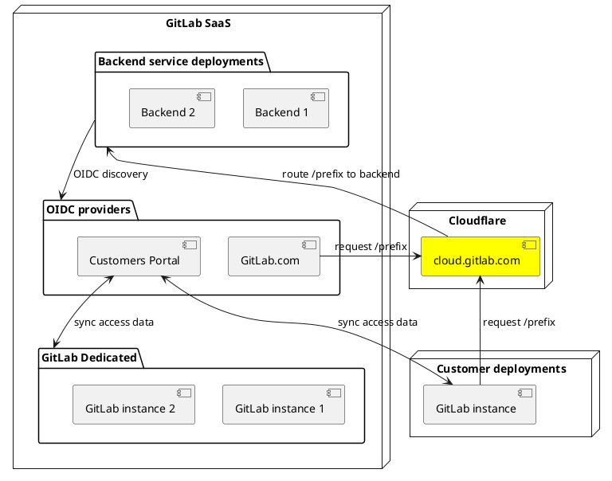
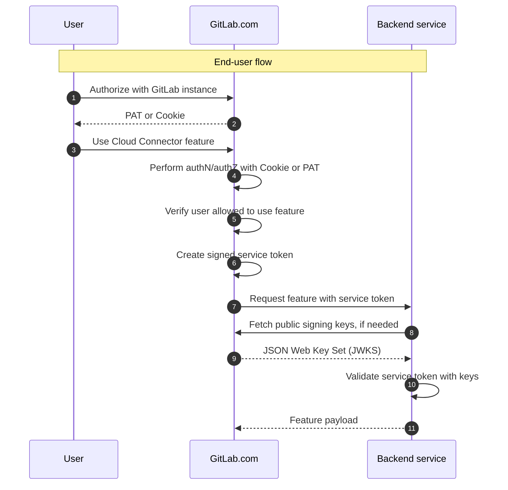
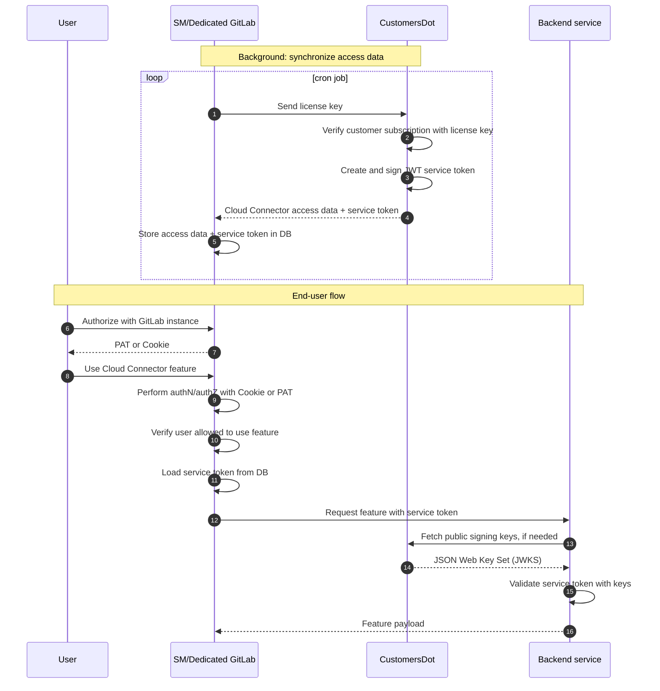

# Cloud Connector: Architecture

[GitLab Cloud Connector](https://about.gitlab.com/direction/cloud-connector/) is a way to access services common to
multiple GitLab deployments, instances, and cells. As of now, Cloud Connector is not a
dedicated service itself, but rather a collection of APIs and code that standardizes the approach to authentication and
other items when integrating Cloud based services with a GitLab instance.

This page covers the general architecture of Cloud Connector and is meant to be read as a supplemental
resource to the main developer documentation.

## Terms

When talking about Cloud Connector's constituents and mechanics, we use the following
terms:

- **GitLab Rails:** The main GitLab application.
- **GitLab.com:** The multi-tenant GitLab SaaS deployment operated by GitLab Inc.
- **Dedicated:** A single-tenant GitLab SaaS deployment operated by GitLab Inc.
- **Self-managed:** Any GitLab instance operated by a customer, potentially deployed to a private cloud.
- **GitLab instance:** Any of the above.
- **Backend service:** A GitLab-operated web service invoked by a GitLab instance to deliver functionality
  that's part of the Cloud Connector set of features. The AI gateway is one example.
- **CustomersDot:** The [GitLab Customers Portal](https://gitlab.com/gitlab-org/customers-gitlab-com),
  used by customers to manage their GitLab subscriptions.
- **Service token:** A cryptographically signed token used to authorize requests between a GitLab instance
  and a backend service.
- **Service token issuer:** A GitLab-operated web service providing endpoints to issue service tokens
  and/or endpoints to provide the public keys necessary to validate such a token.
  Both GitLab.com and CustomersDot are service token issuers.
- **Service token validator:** A backend service that validates GitLab instance requests carrying a service token
  using public keys obtained from a service token issuer. The AI Gateway is one example of a service token
  validator.
- **OIDC:** [OpenID Connect](https://auth0.com/docs/authenticate/protocols/openid-connect-protocol),
  an open standard for implementing identity providers and authN/authZ. Service token
  issuers provide OIDC compliant discovery endpoints to publish keys for service token validators.
- **JWT:** [JSON Web Token](https://auth0.com/docs/secure/tokens/json-web-tokens), an open standard to encode and transmit identity data.
- **JWKS:** [JSON Web Key Set](https://auth0.com/docs/secure/tokens/json-web-tokens/json-web-key-sets),
  an open standard to encode cryptographic keys to validate JWTs.

## Problem to solve

Most GitLab features can be delivered directly from a GitLab instance, regardless of where it is deployed.
Some features, however, require 3rd party vendor integration or are difficult to operate outside of the
GitLab.com. This presents self-managed and Dedicated customers with a problem since they are not easily
able to access those features.

Cloud Connector solves this problem by:

- Moving functionality out of GitLab Rails and into GitLab-operated services to save customers
  the hassle of manually configuring and operating them.
- Providing a single global entry point into Cloud Connector features at `cloud.gitlab.com` to
  access backend services.
- Connects instance license and billing data to access grants,
  enabling a GitLab instance to consume features hosted in backend services operated by GitLab Inc.

## Cloud Connector components

Technically, Cloud Connector consists of the following pieces:

1. **A global load-balancer.** Hosted at `cloud.gitlab.com` through Cloudflare, all traffic inbound
   to Cloud Connector features such as AI must go through this host. The load balancer makes
   routing decisions based on path prefixes. For example:
   1. Load balancer maps `/prefix` to a backend service.
   1. Client requests `cloud.gitlab.com/prefix/path`.
   1. Load balancer strips out `/prefix` and routes `/path` to the backend service.
1. **Electing GitLab.com and CustomersDot as service token issuers.** We configure these
   deployments with private keys only GitLab Inc. has access to. We use these keys to issue cryptographically
   signed service tokens a GitLab Rails instance can use to make requests upstream to a connected service
   backend. The public validation keys are published using OIDC discovery API endpoints.
1. **Electing backend services as service token validators.** Backend services synchronize regularly
   with GitLab.com or CustomersDot to obtain the public keys used to validate the signature of a service
   token attached to a request. The backend service can then decide whether to accept or reject the
   request, based on both signature validity and any claims the token may carry in its body.
1. **Programming APIs to integrate with the above.** We aim to provide the necessary interfaces in
   Ruby to make it easier to implement communication between the GitLab Rails application
   and a backend service. This is a moving target and we file issues into the
   [Cloud Connector abstractions epic](https://gitlab.com/groups/gitlab-org/-/epics/12376) to improve this.

The following diagram outlines how these components interact:

## Access control

There are two levels of access control when making requests into backend services:

1. **Instance access.** Granting a particular SM/Dedicated instance access is done by issuing a service token bound
   to a customer's cloud license billing status. This token is synced to a GitLab instance from CustomersDot
   daily and stored in the instance's local database. For GitLab.com, we do not require this step; instead,
   we issue short-lived tokens for each request. These tokens are implemented as JWTs and are
   cryptographically signed by the issuer.
1. **User access.** We currently expect all end-user requests to go through the respective GitLab instance
   first. Therefore, user-level authentication and authorization is handled as with any REST or GraphQL API request, that is, either
   using OAuth or Personal Access Tokens.

The JWT issued for instance access carries the following claims (not exhaustive, subject to change):

- `aud`: The audience. This is the name of the backend service (for example, `gitlab-ai-gateway`).
- `sub`: The subject. This is the UUID of the GitLab instance the token was issued for (e.g.: `8f6e4253-58ce-42b9-869c-97f5c2287ad2`).
- `iss`: The issuer URL. Either `https://gitlab.com` or `https://customers.gitlab.com`.
- `exp`: The expiration time of the token (UNIX timestamp). Currently 1 hour for GitLab.com and 3 days
  for SM/Dedicated.
- `scopes`: A list of access scopes that define which features this token is valid for. We obtain these
  based on decisions such as how paid features are bundled into GitLab tiers and add-ons.

A JSON Web Key Set (JWKS) contains the public keys used by token validators to verify a token's signature. All backend
services are currently required to:

- Regularly refresh the JWKS from GitLab.com and CustomersDot so key rotation can happen easily and regularly
  without service disruption.
- Perform signature verification of JWTs and access scope checks for each request.

The following flow charts should help to understand what happens when a user consumes a Cloud Connector feature,
such as talking to an AI chat bot, for both GitLab.com and Dedicated/self-managed deployments.

### GitLab.com

Because the GitLab.com deployment enjoys special trust, it has the advantage of being able to self-sign
and create service tokens for every request to a Cloud Connector feature, which greatly simplifies the
flow:

### GitLab Dedicated/Self-Managed

For Dedicated and self-managed instances the key problem is one of trust delegation:
we cannot trust any individual self-managed instance and let them issue tokens, but
we can delegate trust by letting an instance regularly authorize itself with CustomersDot,
which is controlled by GitLab Inc. While we do control GitLab Dedicated instances, for simplicity
we currently consider them "self-managed" from a Cloud Connector standpoint.

The main difference to GitLab.com is the addition of the CustomersDot actor, with which customer instances
synchronize regularly to fetch and persist data necessary to access GitLab backend services.

Cloud Connector access data is structured JSON data that is stored in the instance's local database.
On top of the service token, it contains additional information about the services made available
such as whether the service is considered fully launched or in beta stage. This information is particularly
useful for self-managed instances whose upgrade cadence we do not control, because it allows us to
sync in data that are subject to change and control access to some GitLab features remotely.

## References

- [Cloud Connector blueprints and ADRs](../../architecture/blueprints/cloud_connector/index.md)
