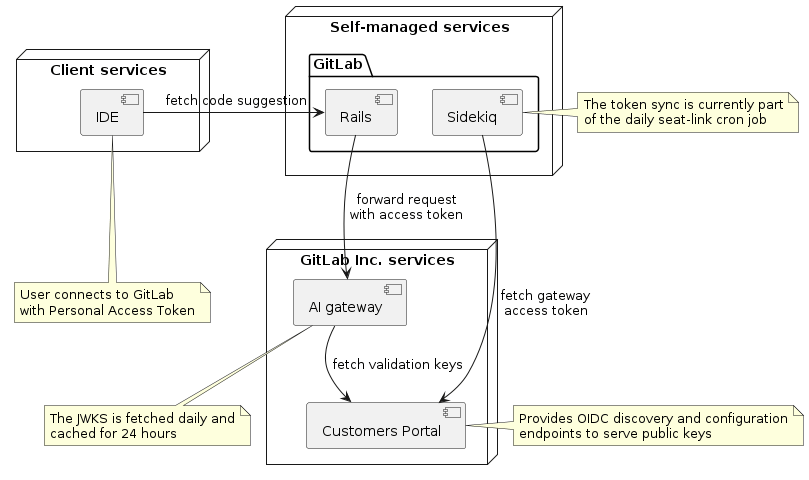
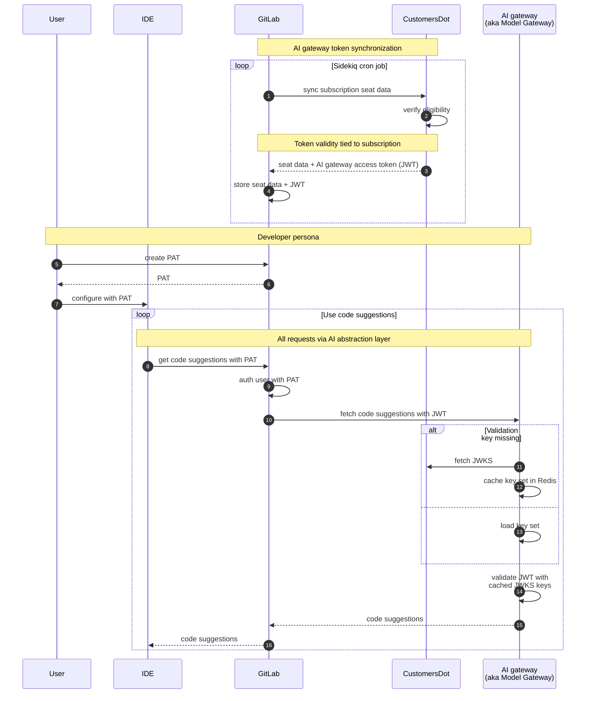

# Cloud Connector MVC: Code Suggestions for Self-Managed/GitLab Dedicated

This document presents the systems and their interactions involved in delivering
the [Code Suggestions AI feature](../../user/project/repository/code_suggestions/index.md)
to self-managed and GitLab Dedicated customers. It was considered the MVC
or initial iteration toward a more extensive vision called [GitLab Cloud Connector](https://gitlab.com/groups/gitlab-org/-/epics/308)
(formerly "GitLab Plus"), which will allow self-managed customers to benefit from
features operated by us.

In the context of this document, and any architectural discussions around Cloud Connector features,
it is important to understand that **Cloud Connector is not a system**. It is an umbrella term
for all the projects we engage in that make existing SaaS-only features available to
self-managed and GitLab Dedicated customers. Some of these may be sufficiently similar to share
solutions, including new systems that deliver these features, but this may not extend to all
features covered by the Cloud Connector umbrella project.

For the remainder of this document we do not distinguish between self-managed and GitLab Dedicated
use cases, as at the time of this writing, they are identical. We are exploring any necessary
deviations needed specifically for GitLab Dedicated in [issue 410394](https://gitlab.com/gitlab-org/gitlab/-/issues/410394).

## Problem statement

Code Suggestions for self-managed users work almost identically to GitLab SaaS:

1. The user:
   1. Connects their IDE to a GitLab instance.
   1. Requests a code suggestion through their IDE.
1. The GitLab instance:
   1. Authenticates the user and performs instance-local permission and configuration checks.
   1. Produces a [JSON Web Token](https://jwt.io/) to use with the [AI gateway](../../architecture/blueprints/ai_gateway/index.md).
   1. Forwards the request to the AI gateway with this access token.
   1. Returns the response back to the user's IDE.

The unique challenge we had to solve in the context of self-managed instances is step 2b:
For GitLab SaaS, we can make an instance-local decision about whether a user is allowed to use Code Suggestions
(or any other feature for that matter) and contact the AI gateway, but for self-managed users we cannot.
This is because we cannot trust a self-managed instance to produce such a token as we have no control over them.
In the context of Cloud Connector, this means providing a system for permission delegation that takes into account
self-managed instance billing and license data, so that once we establish that an instance is eligible
for this feature based on its payment history, we can issue an access token to this instance.

The architecture and data flow for this solution are outlined in the following section.

## Architecture

NOTE:
This section covers the architectural details relevant to Code Suggestions in the context of Cloud Connector.
A more high-level overview can be found in [AI Architecture](../ai_architecture.md).

The Code Suggestions architecture for Cloud Connector serves as a blueprint to implement
similar features in the future. As mentioned above, the primary problem to solve is verifying that a request
coming from a self-managed instance is eligible to obtain Code Suggestions from the AI gateway. This can
be broken down further into two smaller problems:

1. **Instance eligibility.** Code suggestions are a paid feature. The source of truth for subscription state is the
   customers portal (CustomersDot). A self-managed GitLab instance must therefore involve
   CustomersDot in the decision for whether an instance is allowed to request code suggestions
   on behalf of a user before it forwards this request to the AI gateway.
1. **AI gateway authentication.** Because the AI gateway has no concept of self-managed instance or user identity,
   the AI gateway must verify that the instance from which a request originates is legitimate.
   This is handled almost identically to GitLab SaaS. The relevant differences are covered in later sections.

Three systems are involved in the entire flow, with the following responsibilities:

1. **GitLab Rails application:**
   - Authenticates the current user requesting a code suggestion, as it would any other API request.
   - Manages and checks instance-level configuration related to Code Suggestions for self-managed installations.
   - [Runs a background cron job](#gitlabcustomersdot-token-synchronization) that regularly fetches an JWT access token for use with the AI gateway from CustomersDot.
   - Calls the AI gateway with the given JWT access token, potentially enriching the call
     with instance-local context.
1. **CustomersDot:**
   - Provides a user interface for customers to purchase Code Suggestions.
   - When a GitLab instance syncs with CustomersDot, checks whether it
     has an active Code Suggestions purchase, and issues a cryptographically signed JWT access token scoped
     to the Code Suggestions feature. This mechanism is extensible to other Cloud Connector features.
   - Acts as an [OIDC Provider](https://openid.net/developers/how-connect-works/) by offering discovery and configuration endpoints
     that serve the public keys required to validate a Code Suggestions JWT. The AI gateway
     calls these endpoints (see below.)
1. **AI gateway:**
   - Services Code Suggestions requests coming from the GitLab application.
   - Synchronizes with CustomersDot OIDC endpoints to obtain token validation keys.
   - Validates the JWT access token sent by a GitLab instance using these keys.
     This establishes the necessary trust relationship between any GitLab instance
     and the AI gateway, which is hosted by us.

It is important to highlight that from the perspective of the AI gateway, all requests are equal.
As long as the access token can be verified to be authentic, the request will succeed, be that
from a GitLab SaaS or self-managed user.

The following diagram shows how these systems interact at a high level:

<!--
  Component architecture sources for PlantUML diagram source code:
  https://gitlab.com/gitlab-org/gitlab/-/snippets/3597299

  The comments do not render correctly in various tested browser, so it is included as a binary image instead.
-->


## Implementation details and data flow

This section breaks down the three primary mechanisms used to deliver Code Suggestions
to self-managed instances:

1. GitLab/CustomersDot token synchronization.
1. Proxying AI gateway requests.
1. AI gateway access token validation.

The sequence diagram below shows how a typical flow might look like.



### GitLab/CustomersDot token synchronization

The first problem we had to solve was to determine whether any given self-managed GitLab is
allowed to use Code Suggestions. The mechanism described below was built for Code
Suggestions but could serve any other Cloud Connector feature tied to a Cloud License
subscription.

The source of truth for this from the perspective of the GitLab Rails application is CustomersDot,
which itself converses with Zuora (a third party subscription service) to determine which
subscriptions or add-ons are active for a given customer.

Unlike with GitLab SaaS, CustomersDot does not call back into self-managed GitLab instances when
subscriptions or add-ons are purchased. Instead, a daily synchronization job is scheduled in
Sidekiq that compares purchases against actual seat usage using the `/api/v1/seat_links`
REST endpoint on CustomersDot. An instance authenticates itself by posting
its license key as part of the request, which CustomersDot uses to look up subscription data
connected to this license, therefore using the license key as a form of authentication token.

If CustomersDot deems the instance eligible, it embeds a Code Suggestions token in the response
payload:

```json
"service_tokens": {
  "code_suggestions": {
    "token": "eyJ0eXAiOiJKV1QiLCJhbGciOiJSUzI1NiJ9.eyJqdGkiOiI0M2FlOWI4...qmvMVhRS01YRc6a5LaBbhU_m5tw",
    "expires_at": 1695121894
  }
}
```

- `token` is an [encoded JSON Web Token](https://jwt.io/) signed with RSA256, an asymmetric
  secure signing algorithm. This allows other services who hold the corresponding public key
  to validate the authenticity of this token. The token carries [claims](https://auth0.com/docs/secure/tokens/json-web-tokens/json-web-token-claims#registered-claims) that receivers
  can verify, most importantly the `aud` (audience) claim. We use the audience claim to scope
  access to particular features, such as Code Suggestions. Each paid feature requires a separate
  token to be issued with a corresponding claim.
- `expires_at`: UNIX epoch timestamp of the token's expiration time. Tokens currently have
  an expiration time of 3 days. This TTL was chosen to strike a balance between regularly
  rolling over access tokens and some leeway in case the token sync fails.

NOTE:
To sign tokens, CustomersDot maintains a private key.
For security reasons, we rotate this key on a regular basis. For more information, refer
to [the key rotation process for CustomersDot](https://gitlab.com/gitlab-org/customers-gitlab-com/-/blob/main/doc/architecture/add_ons/code_suggestions/authorization_for_self_managed.md#jwk-signing-key-rotation).

Upon receiving a response, GitLab Rails stores this token in Postgres and removes any
other tokens it may have previously stored. When users request a code suggestion, GitLab
can then load this token and attach it to AI gateway requests, which is described next.

### Proxying AI gateway requests

Given the JWT access token described above, a GitLab instance is ready to serve Code Suggestions
requests to users. Upon receiving a request to `/api/v4/code_suggestions/completions`, GitLab:

1. Authenticates this request with a user's Personal Access Token (PAT), as it would any REST API call.
   Users configure this token in their IDE settings.
1. Verifies that the administrator has the Code Suggestions feature enabled and the instance
   license tier includes this feature.
1. Loads the JWT access token from the database.
1. Forwards the request to the AI gateway with the token attached.

As with GitLab SaaS requests, the downstream call uses Workhorse's `senddata` feature. This
mechanism yields control to Workhorse by responding with a `send-url` header field. Workhorse
then intercepts this response and calls into the AI gateway given the request URL, headers
and payload provided through `send-url`. This relieves the Puma process from stalling on downstream I/O,
removing a scalability bottleneck.

This process is mostly identical to GitLab SaaS. The biggest difference is
how GitLab Rails resolves user permissions and loads the access token. GitLab SaaS can self-issue the access token
because billing is not handled by CustomersDot.

### AI gateway access token validation

The next problem we had to solve was authenticating the Code Suggestions requests that a self-managed GitLab sends
to the AI gateway on behalf of a user. The AI gateway does not and should not have any knowledge
of a customer's instance. Instead, the gateway verifies the request's authenticity by decoding the JWT
access token enclosed in the request using a public key it fetches from CustomersDot, which is
the original issuer of the token.

The AI gateway accomplishes this by first requesting a [JSON Web Key Set](https://auth0.com/docs/secure/tokens/json-web-tokens/json-web-key-sets)
from CustomersDot. The keyset obtained from the JWKS endpoint is then cached for 24 hours and used to decode any
JWTs attached to Code Suggestions requests. Note that token expiration is implicitly enforced
in that expired tokens fail to decode, in which case the AI gateway rejects this request.

The steps to obtain the JWKS and verify tokens are detailed in [the AI service verification sequence diagram](https://gitlab.com/gitlab-org/customers-gitlab-com/-/blob/main/doc/architecture/add_ons/code_suggestions/authorization_for_self_managed.md#gitlab-hosted-ai-service-flow-to-verify-jwt-token) for CustomersDot.

This process is mostly identical to GitLab SaaS. The only difference is that the AI gateway obtains validation keys
from CustomersDot instead of GitLab SaaS, which self-issues its own tokens.

## Gaps and outlook

Code Suggestions was the first Cloud Connector feature we looked at, but we expect many more
to be designed and built, some of which may require different technical approaches from what is
documented here.

Some areas that are not currently well-defined or understood include:

- Support for GitLab Dedicated and regional deployments. This is currently being investigated in
  [issue 410394](https://gitlab.com/gitlab-org/gitlab/-/issues/410394).
- The impact on end-user experience when a GitLab instance is deployed to a geographic region that
  has high latency overhead when connecting to a GitLab service in US-east.
- There are some known usability issues with relying solely on a daily Sidekiq job to fetch access
  tokens. We are exploring ways to improve this in [this epic](https://gitlab.com/groups/gitlab-org/-/epics/11289).
- Rate-limiting requests at the GitLab instance level was out of scope for the MVC. We are exploring
  this idea in [this issue](https://gitlab.com/gitlab-org/gitlab/-/issues/420123).
