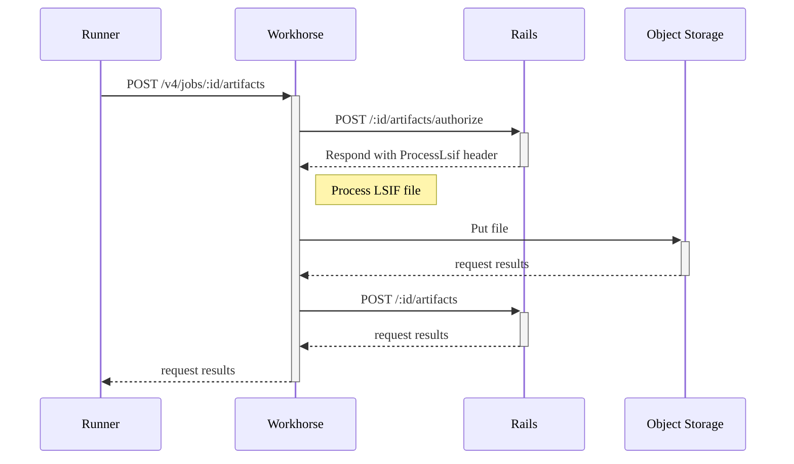

This document describes the design behind [Code Intelligence](../../user/project/code_intelligence.md).

The built-in Code Intelligence in GitLab is powered by
[LSIF](https://lsif.dev) and comes down to generating an LSIF document for a
project in a CI job, processing the data, uploading it as a CI artifact and
displaying this information for the files in the project.

Here is a sequence diagram for uploading an LSIF artifact:



1. The CI/CD job generates a document in an LSIF format (usually `dump.lsif`) using
   [an indexer](https://lsif.dev) for the language of a project. The format
   [describes](https://sourcegraph.com/docs/code-search/code-navigation/writing_an_indexer#writing-an-indexer)
   interactions between a method or function and its definitions or references. The
   document is marked to be stored as an LSIF report artifact.

1. After receiving a request for storing the artifact, Workhorse asks
   GitLab Rails to authorize the upload.

1. GitLab Rails validates whether the artifact can be uploaded and sends
   `ProcessLsif: true` header if the LSIF artifact can be processed.

1. Workhorse reads the LSIF document line by line and generates code intelligence
   data for each file in the project. The output is a zipped directory of JSON
   files which imitates the structure of the project:

   Project:

   ```code
   app
     controllers
       application_controller.rb
     models
       application.rb
   ```

   Generated data:

   ```code
   app
     controllers
       application_controller.rb.json
     models
       application.rb.json
   ```

1. The zipped directory is stored as a ZIP artifact. Workhorse replaces the
   original LSIF document with a set of JSON files in the ZIP artifact and
   generates metadata for it. The metadata makes it possible to view a single
   file in a ZIP file without unpacking or loading the whole file. That allows us
   to access code intelligence data for a single file.

1. When a file is viewed in the GitLab application, frontend fetches code
   intelligence data for the file directly from the object storage. The file
   contains information about code units in the file. For example:

   ```json
   [
       {
        "definition_path": "cmd/check/main.go#L4",
        "hover": [
            {
                "language": "go",
                "tokens": [
                    [
                        {
                            "class": "kn",
                            "value": "package"
                        },
                        {
                            "value": " "
                        },
                        {
                            "class": "s",
                            "value": "\"fmt\""
                        }
                    ]
                ]
            },
            {
                "value": "Package fmt implements formatted I/O with functions analogous to C's printf and scanf.  The format 'verbs' are derived from C's but are simpler. \n\n### hdr-PrintingPrinting\nThe verbs: \n\nGeneral: \n\n```\n%v\tthe value in a default format\n\twhen printing st..."
            }
        ],
        "start_char": 2,
        "start_line": 33
      }
      ...
    ]
   ```
