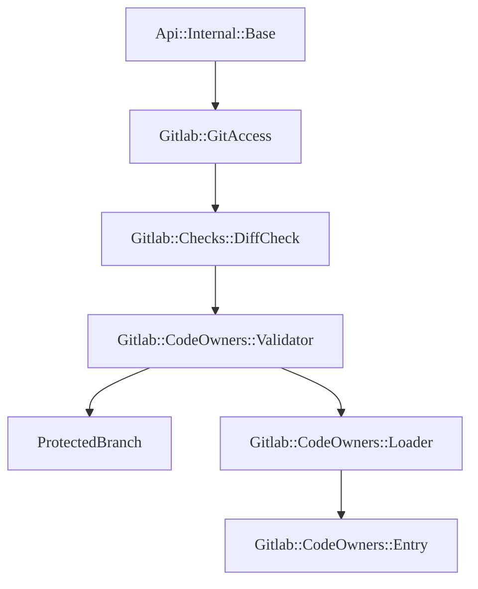
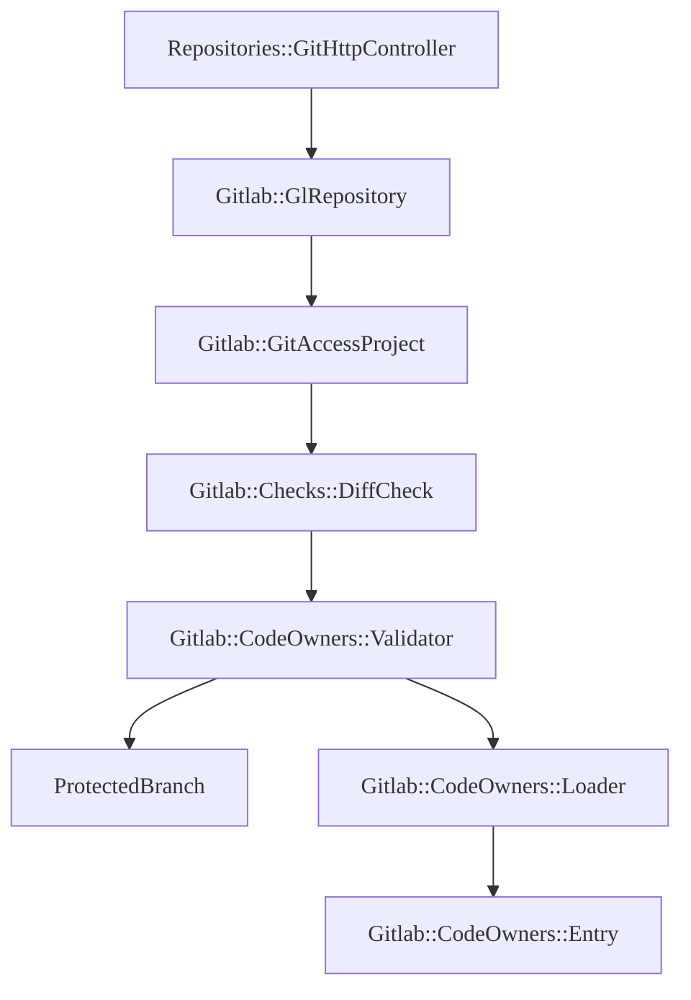
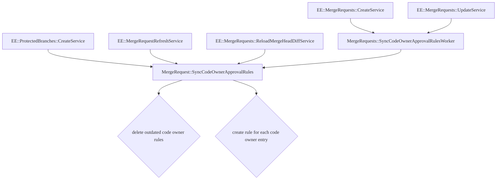

> - [Introduced](https://gitlab.com/gitlab-org/gitlab/-/issues/219916) in GitLab 15.10.

This document was created to help contributors understand the code design of
[Code Owners](../../user/project/codeowners/_index.md). You should read this
document before making changes to the code for this feature.

This document is intentionally limited to an overview of how the code is
designed, as code can change often. To understand how a specific part of the
feature works, view the code and the specs. The details here explain how the
major components of the Code Owners feature work.

NOTE:
This document should be updated when parts of the codebase referenced in this
document are updated, removed, or new parts are added.

## Business logic

All of the business logic for code owners is located in the `Gitlab::CodeOwners`
namespace. Code Owners is an EE-only feature, so the files only exist in the `./ee` directory.

- `Gitlab::CodeOwners`: the main module used to interact with the code owner rules.
  - Defined in `./ee/lib/gitlab/code_owners.rb`.
- `Gitlab::CodeOwners::File`: wraps a `CODEOWNERS` file and exposes the data through
  the class' public methods.
  - Defined in `./ee/lib/gitlab/code_owners/file.rb`.
- `Gitlab::CodeOwners::Section`: wraps a section heading from a
  `CODEOWNERS` file and parses the different parts.
  - Defined in `./ee/lib/gitlab/code_owners/section.rb`.
- `Gitlab::CodeOwners::Entry`: wraps an entry (a pattern and owners line) in a
  `CODEOWNERS` file and exposes the data through the class' public methods.
  - Defined in `./ee/lib/gitlab/code_owners/entry.rb`.
- `Gitlab::CodeOwners::Loader`: finds the correct `CODEOWNER` file and loads the
  content into a `Gitlab::CodeOwners::File` instance.
  - Defined in `./ee/lib/gitlab/code_owners/loader.rb`.
- `Gitlab::CodeOwners::ReferenceExtractor`: extracts `CODEOWNER` user, group,
  and email references from texts.
  - Defined in `./ee/lib/gitlab/code_owners/reference_extractor.rb`.
- `Gitlab::CodeOwners::UsersLoader`: the correct `CODEOWNER` file and loads the
  content into a `Gitlab::CodeOwners::File` instance.
  - Defined in `./ee/lib/gitlab/code_owners/users_loader.rb`.
- `Gitlab::CodeOwners::GroupsLoader`: finds the correct `CODEOWNER` file and loads
  the content into a `Gitlab::CodeOwners::File` instance.
  - Defined in `./ee/lib/gitlab/code_owners/groups_loader.rb`.
- `Gitlab::CodeOwners::Validator`: validates no files in the `CODEOWNERS` entries
  have been changed when a user pushes to a protected branch with `require_code_owner_approval` enabled.
  - Defined in `./ee/lib/gitlab/code_owners/validator.rb`.

## Where Code Owners sits in the Git access check execution order

`Gitlab::Checks::DiffCheck#file_paths_validations` returns either an empty array, or an array with a single member of the results of `#lfs_file_locks_validation` if LFS is enabled and file locks are present. The return result of `#validate_code_owners` in the EE version of this file is inserted at the end of this list in the `EE::Gitlab::Checks::DiffCheck#file_paths_validations`. LFS checks are performed before Code Owners checks.

These checks are executed after those listed in `#validations_for_path`, which exists only in the EE version, and include `#path_locks_validation` and `#file_name_validation`. This means that checks for Path Locks precede checks for Code Owners in the flow.

The check order is as follows in `EE` (only LFS exists as a non-EE feature):

- Path Locks
- Filenames
  - Blocks files containing secrets for example `id_rsa`
  - Blocks files matching the `PushRule#file_name_regex`
- LFS File Locks
- Code Owners

## Related models

### `ProtectedBranch`

The `ProtectedBranch` model is defined in `app/models/protected_branch.rb` and
extended in `ee/app/models/concerns/ee/protected_branch.rb`. The EE version includes a column
named `require_code_owner_approval` which prevents changes from being pushed directly
to the branch being protected if the file is listed in `CODEOWNERS`.

### `ApprovalMergeRequestRule`

The `ApprovalMergeRequestRule` model is defined in `ee/app/models/approval_merge_request_rule.rb`.
The model stores approval rules for a merge request. We use multiple rule types,
including a `code_owner` type rule.

## Controllers and Services

The following controllers and services below are being used for the approval
rules feature to work:

### `Api::Internal::Base`

This `/internal/allowed` endpoint is called when pushing to GitLab to ensure the
user is allowed to push. The `/internal/allowed` endpoint performs a `Gitlab::Checks::DiffCheck`.
In EE, this includes code owner checks.

Defined in `lib/api/internal/base.rb`.

### `Repositories::GitHttpController`

When changes are pushed to GitLab over HTTP, the controller performs an access check
to ensure the user is allowed to push. The checks perform a `Gitlab::Checks::DiffCheck`.
In EE, this includes Code Owner checks.

Defined in `app/controllers/repositories/git_http_controller.rb`.

### `EE::Gitlab::Checks::DiffCheck`

This module extends the CE `Gitlab::Checks::DiffChecks` class and adds code owner
validation. It uses the `Gitlab::CodeOwner::Validator` class to verify users are
not pushing files listed in `CODEOWNER` directly to a protected branch while the
branch requires code owner approval.

### `MergeRequests::SyncCodeOwnerApprovalRules`

This service is defined in `services/merge_requests/sync_code_owner_approval_rules.rb` and used for:

- Deleting outdated code owner approval rules when new changes are pushed to a merge request.
- Creating code owner approval rules for each changed file in a merge request that is also listed in the `CODEOWNER` file.

## Flow

These flowcharts should help explain the flow from the controllers down to the
models for different features.

A lot of the Code Owners implementations exist in the `EE` variants of the classes.

### Push changes to a protected branch with `require_code_owner_approval` enabled, over SSH

### Push changes to a protected branch with `require_code_owner_approval` enabled, over HTTPS

### Sync code owner rules to merge request approval rules

