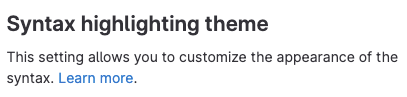
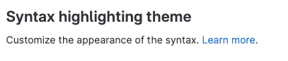
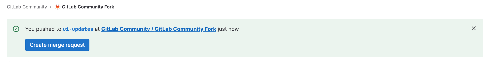
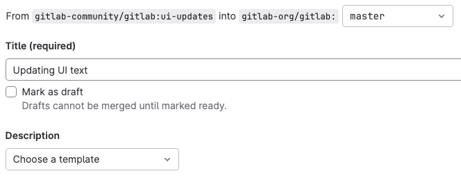
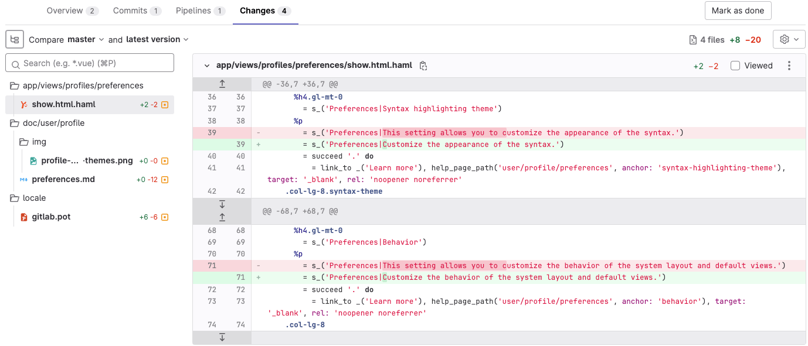
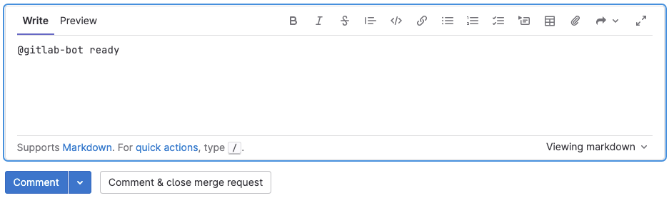

# Tutorial: Make a GitLab contribution

Anyone can contribute to the development of GitLab.

Maybe you want to add functionality that you feel is missing. Or maybe
you noticed some UI text that you want to improve.

This tutorial will walk you through the process of updating UI text
and related files by using the GitLab Development Kit and the GitLab community fork.
You can follow this example exactly to familiarize yourself with the process,
or you can choose other UI text to update.

## Steps

To make a contribution, you will:

1. [Configure the GitLab Development Kit](#step-1-configure-the-gitlab-development-kit)
1. [Make your code updates](#step-2-change-the-code)
1. [Push your changes to the community fork](#step-3-push-your-changes-to-the-community-fork)
1. [Create a merge request](#step-4-create-a-merge-request)

## Prerequisites

On your local machine:

- Ensure Git is installed.
  (From the command line, type `git -v`. If you get a result, you have Git installed.)
- Install a source code editor, or decide which tool you're going to use to edit files.

On GitLab.com:

- Create an account. Ensure you can successfully sign in.
- Go to the [`gitlab-community/community-members` group](https://gitlab.com/gitlab-community/community-members)
  and select **Request access**. This action will give you access to the GitLab
  community fork, where you'll author your changes.

## Step 1: Configure the GitLab Development Kit

The GitLab Development Kit (GDK) is a local version of GitLab that's yours to play with.
It's just like an installation of self-managed GitLab. It includes sample projects you
can use to test functionality, and it gives you access to administrator functionality.
You can run it on your local machine, or use GitPod to run a remote version.


If you've never used the GDK before, and you think you might contribute
more than once, you should install it.
If you already have a working GDK, you should
[update it to use the community fork](#an-existing-gdk-installation).

### A new GDK installation

Set aside about two hours to install the GDK. If all goes smoothly, it
should take about an hour to install.

Sometimes the installation needs some tweaks to make it work, so you should
also set aside some time for troubleshooting.
It might seem like a lot of work, but after you have the GDK running,
you'll be able to contribute much more often and more easily.

To install the GDK:

1. Ensure you're on
   [one of the supported platforms](https://gitlab.com/gitlab-org/gitlab-development-kit/-/tree/main/#supported-platforms)
   (macOS, Ubuntu, etc.).
1. Choose the directory where you want to install the GDK.
   In this location, a repository called `gitlab-development-kit` will be created,
   and the application will be installed.
1. From the command line, go to that directory.
   In this example, we will use the `development` directory.

   ```shell
   cd development
   ```

1. Run the one-line installation command:

   ```shell
   curl "https://gitlab.com/gitlab-org/gitlab-development-kit/-/raw/main/support/install" | bash
   ```

1. For the message `Where would you like to install the GDK? [./gitlab-development-kit]`,
   press Enter to accept the default location.

1. For the message `Which GitLab repo URL would you like to clone?`, enter the GitLab community fork:

   ```shell
   https://gitlab.com/gitlab-community/gitlab.git
   ```

While the installation is running, copy any messages that are displayed.
If you have any problems with the installation, you can use this output as
part of troubleshooting.

When the installation is complete:

1. Go to the directory where the GDK was installed:

   ```shell
   cd gitlab-development-kit
   ```

1. Start the GDK:

   ```shell
   gdk start
   ```

1. Connect to the GDK by using the URL provided. It should be something like <http://127.0.0.1:3000>.
1. Use the username `root` and the password `5iveL!fe`. You will be prompted
   to reset your password the first time you sign in.

If you have any problems, try going to the `gitlab-development-kit/gitlab`
directory and running these commands:

```shell
yarn install && bundle install
bundle exec rails db:migrate RAILS_ENV=development
```

From the `gitlab-development-kit` folder, you can also try running `gdk doctor`.

For more advanced troubleshooting, see
[the troubleshooting docs](https://gitlab.com/gitlab-org/gitlab-development-kit/-/tree/main/doc/troubleshooting).

### An existing GDK installation

If you have an existing GDK installation, you should update it so it's
using the community fork.

1. Delete the existing `gitlab-development-kit/gitlab` directory.
1. Clone the community fork into that location:

   ```shell
   cd gitlab-development-kit
   git clone https://gitlab.com/gitlab-community/gitlab.git
   ```

To confirm it was successful:

1. Ensure the `gitlab-development-kit/gitlab` directory exists.
1. Go to the top `gitlab-development-kit` directory and run `gdk stop` and `gdk start`.

If you get errors, run `gdk doctor` to troubleshoot. For more advanced troubleshooting, see
[the troubleshooting docs](https://gitlab.com/gitlab-org/gitlab-development-kit/-/tree/main/doc/troubleshooting).

## Step 2: Change the code

Now for the fun part. Let's edit some code.

In this example, I found some UI text I'd like to change.
In the upper-right corner in GitLab, I selected my avatar and then **Preferences**.
I want to change this text:



Other settings on the page start with the word `Customize` and skip the `This setting allows you to` part.
I'll update this phrase to match the others.

1. Search the `gitlab-development-kit/gitlab` directory for the string `This setting allows you to customize`.

   The results show one `.haml` file, two `.md` files, one `.pot` file, and
   several `.po` files.

1. Open the `.haml` file. This file is where the UI text resides.
1. Update the string. In this case, I'll remove the words before `customize`
   and start the word `customize` with a capital `C`.
1. Save the file.

You can check that you were successful:

- In the `gitlab-development-kit/gitlab` directory, type `git status`
  to show the file you modified:

  ```shell
          modified:   app/views/profiles/preferences/show.html.haml
  ```

- Refresh the web browser where you're viewing the GDK.
  The changes should be displayed. Take a screenshot.

  

### Update the translation files

English UI strings are localized into many languages.
These strings are saved in a `.pot` file, which you must update
any time you update UI text.

To generate the localization file:

1. Ensure you are in the `gitlab-development-kit/gitlab` directory.
1. Run the following command:

   ```shell
   bin/rake gettext:compile
   ```

   After several minutes, a `.pot` file is generated in the `/locale` directory.

Now, in the `gitlab-development-kit/gitlab` directory, if you type `git status`
you should have both files listed:

```shell
        modified:   app/views/profiles/preferences/show.html.haml
        modified:   locale/gitlab.pot
```

For more information about localization, see [internationalization](../i18n/externalization.md).

### Update the documentation

Documentation for GitLab is published on <https://docs.gitlab.com>.
When you add or update a feature, you must update the docs as well.

1. To find the documentation for a feature, the easiest thing is to search the
   docs site. In this case, the setting is described on this documentation page:

   ```plaintext
   https://docs.gitlab.com/ee/user/profile/preferences.html
   ```

1. The URL shows you the location of the file in the `/doc` directory.
   In this case, the location is:

   ```plaintext
   doc/user/profile/preferences.md
   ```

1. Go to this location in your local `gitlab` repository and update the `.md` file
   and any related images.

Now when you run `git status`, you should have something like:

```plaintext
        modified:   app/views/profiles/preferences/show.html.haml
        modified:   doc/user/profile/img/profile-preferences-syntax-themes.png
        modified:   doc/user/profile/preferences.md
        modified:   locale/gitlab.pot
```

To view these changes in action, you can
[check out a merge request where these changes have already been made](https://gitlab.com/gitlab-org/gitlab/-/merge_requests/116472).

## Step 3: Push your changes to the community fork

Now you're going to push your changes to the community fork. This is the next step
in getting your changes put into the main GitLab repository.

1. Ensure you are in the `gitlab-development-kit/gitlab` directory.
1. Create a branch. You don't want to work in the `master` branch.
   Instead, you want to create a branch for your work. In this example,
   we're going to call the branch `ui-updates`.

   ```shell
   git checkout -b ui-updates
   ```

1. Add the files to the staging area.

   ```shell
   git add .
   ```

1. Provide a commit message. GitLab has somewhat strict
   [commit message guidelines](merge_request_workflow.md#commit-messages-guidelines).
   To be safe, a general rule is to use three to five words, start with a capital letter,
   and do **not** end with a period.

   ```shell
   git commit -m "Updating UI text

   Standardizing the text on this page so
   that each area uses consistent language.

   Changelog: changed"
   ```

   The `Changelog: changed` is because we're changing an existing feature. If we were adding a feature, we'd
   use `Changelog: added`. For details, see [changelog entries](../changelog.md).

1. Push the changes to the community fork. At the same time, set the fork as your upstream,
   so that it will be in sync for any future contributions.

   ```shell
   git push --set-upstream origin ui-updates
   ```

## Step 4: Create a merge request

Now you're ready to push changes from the community fork to the main GitLab repository!

1. Go to [the community fork on GitLab.com](https://gitlab.com/gitlab-community/gitlab).
   You should see a message like this one:

   

   Select **Create merge request**.
   If you don't see this message, on the left sidebar, select **Merge requests > New merge request**.

1. Take a look at the branch names. You should be merging from your branch
   in the community fork to the `master` branch in the GitLab repository.

   

1. Fill out the information and then select **Save changes**.
   Don't worry if your merge request is not complete. If you don't want anyone
   from GitLab to review it, you can select the **Mark as draft** checkbox.
   If you're not happy with the merge request after you create it, you can
   close it, no harm done.

1. Select the **Changes** tab. It should look something like this:

   

   The red text shows the code before you made changes. The green shows what
   the code looks like now.

1. If you're happy with this merge request and want to start the review process, type
   `@gitlab-bot ready` in a comment and then select **Comment**.

   

Someone from GitLab will look at your request and let you know what the next steps are.

Now, any time you want to make a contribution to GitLab, you can just
go to the `gitlab-development-kit` folder and run `gdk update`. Then make
your changes in the `gitlab` directory and push them to the fork.

If you need help at any point in the process, type `@gitlab-bot help` in a comment
or initiate a [mentor session](https://about.gitlab.com/community/contribute/mentor-sessions/)
on [Discord](https://discord.gg/gitlab).

Congratulations on submitting your request, and thank you for your contribution!
