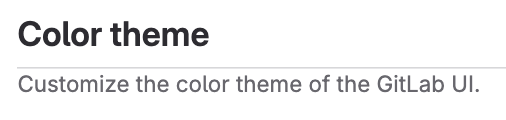

# Tutorial: Make a GitLab contribution

Anyone can contribute to the development of GitLab.

Maybe you want to add functionality that you feel is missing.
Or maybe you noticed some UI text that you want to improve.

This tutorial will walk you through the process of updating UI text
and related files using Gitpod or the GitLab Development Kit on the GitLab community fork.
You can follow this example to familiarize yourself with the process.

NOTE:
Join the [GitLab Discord server](https://discord.gg/gitlab), where GitLab team
members and the wider community are ready and waiting to answer your questions
and ensure [everyone can contribute](https://handbook.gitlab.com/handbook/company/mission/).

## Before you begin

- If you don't already have a GitLab account [create a new one](https://gitlab.com/users/sign_up).
  Confirm you can successfully [sign in](https://gitlab.com/users/sign_in).
- [Request access to the community forks](https://gitlab.com/groups/gitlab-community/community-members/-/group_members/request_access),
  a set of forks mirrored from GitLab repositories in order to improve the contributor experience.  
  - For more information, read the [community forks blog post](https://about.gitlab.com/blog/2023/04/04/gitlab-community-forks/).
  - The access request will be manually verified and should take no more than a few hours.
  - If you use a local development environment, you can start making changes locally before your access is granted.
    You must have access to the community fork to push your changes to it.

## Choose how you want to contribute

The two methods outlined in this tutorial cover:

- GitLab Development Kit (GDK)
  - Local development environment.
  - It's just like an installation of self-managed GitLab. It includes sample projects you
    can use to test functionality, and it gives you access to administrator functionality.
- Gitpod - Most contributors should use this option.
  - Remote development environment that runs the GDK remotely, regardless of your local hardware,
    operating system, or software.
  - Make and preview remote changes in your local browser.

The steps for each method vary in time and effort.
You should choose the one that fits your needs.

::Tabs

:::TabTitle Gitpod - Remote environment

- [Configure the remote development environment](#use-gitpod-to-contribute-without-a-local-environment-setup)
- [Change the code](#change-code-with-gitpod)
- [Create a merge request](#create-a-merge-request)
- [Complete the review process](#getting-a-review)

:::TabTitle GDK - Local environment

- [Configure the development environment](#install-and-configure-gitlab-development-kit-gdk)
- [Change the code](#change-code-with-the-gdk)
- [Create a merge request](#create-a-merge-request)
- [Complete the review process](#getting-a-review)

::EndTabs

## Configure the development environment

In this section, set up the GitLab development environment locally or through Gitpod
to make changes to the code.

### Use Gitpod to contribute without a local environment setup

Set aside about 15 minutes to launch the GDK in Gitpod.

1. [Launch the GDK in Gitpod](https://gitpod.io/#https://gitlab.com/gitlab-community/gitlab/-/tree/master/).
1. Select **Continue with GitLab** to start a Gitpod environment for this fork.
1. If this is your first time using Gitpod, create a free account and connect it
   to your GitLab account:
   1. Select **Authorize** when prompted to **Authorize Gitpod.io to use your account?**.
   1. On the **Welcome to Gitpod** screen, enter your name and select whether you would like
      to **Connect with LinkedIn** or **Continue with 10 hours per month**.
   1. Choose the `Browser` version of VS Code when prompted to **Choose an editor**.
   1. Continue through the settings until the **New Workspace** screen.
1. On the **New Workspace** screen, before you select **Continue**:
   - Leave the default repository URL: `gitlab.com/gitlab-community/gitlab/-/tree/master/`.
   - Select your preferred **Editor**.

      The examples in this tutorial use Visual Studio Code (VS Code) as the editor,
      sometimes referred to as an integrated development environment (IDE).

   - Leave the default **Class**: `Standard`.

1. Wait a few minutes for Gitpod to launch.

   You can begin exploring the codebase and making your changes after the editor you chose has launched.

1. You will need to wait a little longer for GitLab to be available to preview your changes.

   When the GitLab GDK is ready, the **Terminal** panel in Gitpod will return
   a URL local to the Gitpod environment:

   ```shell
   => GitLab available at http://127.0.0.1:3000.
   ```

   Select the `http://127.0.0.1:3000` to open the GitLab development environment in a new browser tab.

1. After the environment loads, log in as the default `root` user and
   follow the prompts to change the default password:

   - Username: `root`
   - Password: `5iveL!fe`

After the Gitpod editor is ready, continue to [Change the code with Gitpod](#change-code-with-gitpod).

### Install and configure GitLab Development Kit (GDK)

NOTE:
[Skip this step](#change-code-with-gitpod) if you're using Gitpod.

If you already have a working GDK,
[update it to use the community fork](#update-an-existing-gdk-installation).

Set aside about two hours to install the GDK. If all goes smoothly, it
should take about an hour to install.

Sometimes the installation needs some tweaks to make it work, so you should
also set aside some time for troubleshooting.
It might seem like a lot of work, but after you have the GDK running,
you'll be able to make changes much more often and more easily.

[View an interactive demo](https://gitlab.navattic.com/ak10d67) of this step.


To install the GDK:

1. Ensure you're on
   [one of the supported platforms](https://gitlab.com/gitlab-org/gitlab-development-kit/-/tree/main/#supported-platforms).
1. Confirm that [Git](../../topics/git/how_to_install_git/index.md) is installed,
   and that you have a source code editor.
1. Choose the directory where you want to install the GDK.
   The installation script installs the application to a new subdirectory called `gitlab-development-kit`.

   Keep the directory name short. Some users encounter issues with long directory names.

1. From the command line, go to that directory.
   In this example, create and change to the `dev` directory:

   ```shell
   mkdir ~/dev && cd "$_"
   ```

1. Run the one-line installation command:

   ```shell
   curl "https://gitlab.com/gitlab-org/gitlab-development-kit/-/raw/main/support/install" | bash
   ```

1. For the message `Where would you like to install the GDK? [./gitlab-development-kit]`,
   press <kbd>Enter</kbd> to accept the default location.
1. For the message `Which GitLab repo URL would you like to clone?`, enter the GitLab community fork URL:

   ```shell
   https://gitlab.com/gitlab-community/gitlab.git
   ```

1. For the message `GitLab would like to collect basic error and usage data`,
   choose your option based on the prompt.

   While the installation is running, copy any messages that are displayed.
   If you have any problems with the installation, you can use this output as
   part of [troubleshooting](#troubleshoot-gdk).

1. After the installation is complete,
   copy the `source` command from the message corresponding to your shell
   from the message `INFO: To make sure GDK commands are available in this shell`:

   ```shell
   source ~/.asdf/asdf.sh
   ```

1. Go to the directory where the GDK was installed:

   ```shell
   cd gitlab-development-kit
   ```

1. Run `gdk truncate-legacy-tables` to ensure that the data in the main and CI databases are truncated,
   then `gdk doctor` to confirm the GDK installation:

   ```shell
   gdk truncate-legacy-tables && gdk doctor
   ```

   - If `gdk doctor` returns errors, consult the [Troubleshoot GDK](#troubleshoot-gdk) section.
   - If `gdk doctor` returns `Your GDK is healthy`, proceed to the next step.

1. Start the GDK:

   ```shell
   gdk start
   ```

1. Wait for `GitLab available at http://127.0.0.1:3000`,
   and connect to the GDK using the URL provided.

1. Sign in with the username `root` and the password `5iveL!fe`. You will be prompted
   to reset your password the first time you sign in.

1. Continue to [Change the code with the GDK](#change-code-with-the-gdk).

#### Troubleshoot GDK

If you encounter issues, go to the `gitlab-development-kit/gitlab`
directory and run `gdk doctor`.

If `gdk doctor` returns Node or Ruby-related errors, run:

```shell
yarn install && bundle install
bundle exec rails db:migrate RAILS_ENV=development
```

For more advanced troubleshooting, see
[the troubleshooting docs](https://gitlab.com/gitlab-org/gitlab-development-kit/-/tree/main/doc/troubleshooting)
and the [#contribute channel on Discord](https://discord.com/channels/778180511088640070/997442331202564176).

#### Update an existing GDK installation

If you have an existing GDK installation, you should update it to use the community fork.

1. Delete the existing `gitlab-development-kit/gitlab` directory.
1. Clone the community fork into that location:

   ```shell
   cd gitlab-development-kit
   git clone https://gitlab.com/gitlab-community/gitlab.git
   ```

To confirm it was successful:

1. Ensure the `gitlab-development-kit/gitlab` directory exists.
1. Go to the top `gitlab-development-kit` directory and run `gdk stop` and `gdk start`.

If you get errors, run `gdk doctor` to troubleshoot. For more advanced troubleshooting, continue to the [Troubleshoot GDK](#troubleshoot-gdk) section.

## Change the code

Now for the fun part. Let's edit some code.

In this example, I found some UI text I'd like to change.
In the upper-right corner in GitLab, I selected my avatar and then **Preferences**.
I want to change `Customize the color of GitLab` to `Customize the color theme of the GitLab UI`:


### Change code with Gitpod

1. Create a new branch for your changes:

   Select `master` in the status bar, then from the **Select a branch or tag to checkout** box,
   select **Create new branch** and enter a name for the new branch.

   If your code change addresses an issue, [start the branch name with the issue number](../../user/project/repository/branches/index.md#prefix-branch-names-with-issue-numbers).

   The examples in this doc use a new branch called `ui-updates`.

1. Search the repository for the string `Customize the color of GitLab`:

   - In VS Code, select the search icon <i class="fa fa-search fa-flip-horizontal" aria-hidden="true"></i> from the side toolbar.

1. Select the `app/views/profiles/preferences/show.html.haml` file. 
1. Update the string to `Customize the color theme of the GitLab UI`.
1. Save your changes.
1. Use the IDE **Terminal** tab to commit the changes:

   ```shell
   git commit -m "Update UI text

   Standardizing the text on this page so
   that each area uses consistent language."
   ```

   Follow the GitLab
   [commit message guidelines](merge_request_workflow.md#commit-messages-guidelines).

1. Push the changes to the new branch:

   ```shell
   git push --set-upstream origin ui-updates
   ```

1. You can [create a merge request](#create-a-merge-request) with the code change,
   or continue to [update the translation files](#update-the-translation-files).

### Change code with the GDK

Use your local IDE to make changes to the code within the GDK directory.

[View an interactive demo of this step](https://gitlab.navattic.com/uu5a0dc5).

1. Create a new branch for your changes:

   ```shell
   git checkout -b ui-updates
   ```

1. Search the `gitlab-development-kit/gitlab` directory for the string `Customize the color of GitLab`.

   The results show one `.haml` file and several `.po` files.

1. Open the `app/views/profiles/preferences/show.html.haml` file.
1. Update the string from `Customize the color of GitLab` to 
   `Customize the color theme of the GitLab UI`.
1. Save the file.
1. You can check that you were successful:

   In the `gitlab-development-kit/gitlab` directory, type `git status`
   to show the file you modified:

   ```shell
           modified:   app/views/profiles/preferences/show.html.haml
   ```

1. Refresh the web browser where you're viewing the GDK.
  The changes should be displayed. Take a screenshot.

   

1. Commit the changes:

   ```shell
   git commit -a -m "Update UI text

   Standardizing the text on this page so
   that each area uses consistent language."
   ```

   Follow the GitLab
   [commit message guidelines](merge_request_workflow.md#commit-messages-guidelines).

1. Push the changes to the new branch:

   ```shell
   git push --set-upstream origin ui-updates
   ```

1. You can [create a merge request](#create-a-merge-request) with the code change,
   or continue to [update the translation files](#update-the-translation-files).

## Update the translation files

English UI strings are localized into many languages.
These strings are saved in a `.pot` file, which must be regenerated
any time you update UI text.

To automatically regenerate the localization file:

1. Ensure you are in the `gitlab-development-kit/gitlab` directory.
1. Run the following command:

   ```shell
   tooling/bin/gettext_extractor locale/gitlab.pot
   ```

   The `.pot` file will be generated in the `/locale` directory.

   Now, in the `gitlab-development-kit/gitlab` directory, if you type `git status`
   you should have both files listed:

   ```shell
           modified:   app/views/profiles/preferences/show.html.haml
           modified:   locale/gitlab.pot
   ```

1. Commit and push the changes.
1. [Create a merge request](#create-a-merge-request) or continue to update the documentation.

For more information about localization, see [internationalization](../i18n/externalization.md).

## Update the documentation

Documentation for GitLab is published on <https://docs.gitlab.com>.
When you add or update a feature, you must update the docs as well.

1. To find the documentation for a feature, the easiest thing is to search the
   docs site. In this case, the setting is described on this documentation page:

   ```plaintext
   https://docs.gitlab.com/ee/user/profile/preferences.html
   ```

1. The URL shows you the location of the file in the `/doc` directory.
   In this case, the location is:

   ```plaintext
   doc/user/profile/preferences.md
   ```

1. Go to this location in your local `gitlab` repository and update the `.md` file
   and any related images.

   Now when you run `git status`, you should have something like:

   ```plaintext
           modified:   app/views/profiles/preferences/show.html.haml
           modified:   doc/user/profile/img/profile-preferences-syntax-themes.png
           modified:   doc/user/profile/preferences.md
           modified:   locale/gitlab.pot
   ```

1. Commit and push the changes.
1. [Create a merge request](#create-a-merge-request) or continue to update the documentation.

## Create a merge request

Now you're ready to push changes from the community fork to the main GitLab repository!

[View an interactive demo of this step](https://gitlab.navattic.com/tu5n0haw).

1. Go to [the community fork on GitLab.com](https://gitlab.com/gitlab-community/gitlab).
   You should see a message like this one:

   

   Select **Create merge request**.
   If you don't see this message, on the left sidebar, select **Code > Merge requests > New merge request**.

1. Take a look at the branch names. You should be merging from your branch
   in the community fork to the `master` branch in the GitLab repository.

   

1. Fill out the information and then select **Save changes**.
   Don't worry if your merge request is not complete.
   
   If you don't want anyone from GitLab to review it, you can select the **Mark as draft** checkbox.
   If you're not happy with the merge request after you create it, you can close it, no harm done.

1. Select the **Changes** tab. It should look something like this:

   

   The red text shows the code before you made changes. The green shows what
   the code looks like now.

1. If you're happy with this merge request and want to start the review process, type
   `@gitlab-bot ready` in a comment and then select **Comment**.

   

Someone from GitLab will look at your request and let you know what the next steps are.

## Complete the review process

After you create a merge request, GitLab automatically triggers a [CI/CD pipeline](../../ci/pipelines/index.md)
that runs tests, linting, security scans, and more.

Your pipeline must be successful for your merge request to be merged.

- To check the status of your pipeline, at the top of your merge request, select **Pipelines**.
- If you need help understanding or fixing the pipeline, in a comment, use the `@gitlab-bot help` command.

### Getting a review

GitLab will triage your merge request automatically.
However, you can type `@gitlab-bot ready` in a comment to alert reviewers that your MR is ready.

- When the label is set to `workflow::ready for review`, [a developer reviews the MR](../code_review.md).
- After you have resolved all of their feedback and the MR has been approved, the MR is ready for merge.

If you need help at any point in the process, type `@gitlab-bot help` in a comment or initiate a
[mentor session](https://about.gitlab.com/community/contribute/mentor-sessions/) on [Discord](https://discord.gg/gitlab).

When the merge request is merged, your change becomes part of the GitLab codebase.
Great job! Thank you for your contribution!
