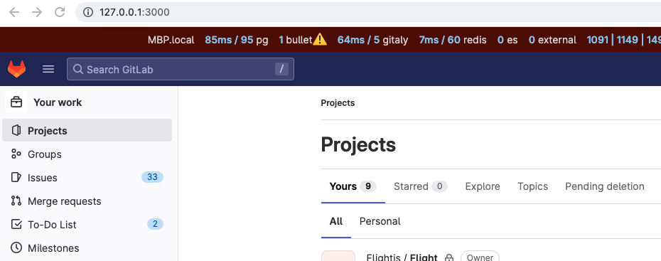

# Configure GDK-in-a-box

If you want to contribute to the GitLab codebase and want a development environment in which to test
your changes, you can use
[GDK-in-a-box](https://gitlab.com/gitlab-org/gitlab-development-kit/-/blob/main/doc/gdk_in_a_box.md),
a virtual machine (VM) pre-configured with [the GitLab Development Kit (GDK)](https://gitlab.com/gitlab-org/gitlab-development-kit).

The GDK is a local development environment that includes an installation of self-managed GitLab,
sample projects, and administrator access with which you can test functionality.

It requires 30 GB of disk space.

If you prefer to use GDK locally without a VM, use the steps in [Install the GDK development environment](configure-dev-env-gdk.md)

Follow the steps defined in the [GDK-in-a-box docs](https://gitlab.com/gitlab-org/gitlab-development-kit/-/blob/main/doc/gdk_in_a_box.md)
to download, configure and update GDK-in-a-box.

## Change the code

After the GDK is ready, continue to [Contribute code with the GDK](contribute-gdk.md).
