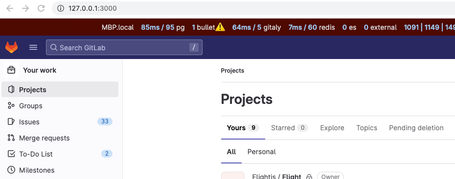

If you want to contribute to the GitLab codebase and want a development environment in which to test
your changes, you can use
[GDK-in-a-box](https://gitlab-org.gitlab.io/gitlab-development-kit/gdk_in_a_box/). GDK-in-a-box is available as a multi-platform container image, pre-configured with [the GitLab Development Kit (GDK)](https://gitlab.com/gitlab-org/gitlab-development-kit).



GDK-in-a-box Virtual Machine (VM) images are no longer supported and
were deprecated in favor of the container-based images.



The GDK is a local development environment that includes an installation of GitLab Self-Managed,
sample projects, and administrator access with which you can test functionality.

It requires 30 GB of disk space.



If you prefer to use GDK locally without a container, use the steps in [Install the GDK development environment](configure-dev-env-gdk.md)

## Download GDK-in-a-box

1. Install a container runtime.
   - Multiple options are available, including [Docker Desktop](https://www.docker.com/products/docker-desktop/), [Docker Engine](https://docs.docker.com/engine/install/), and [Rancher Desktop](https://docs.rancherdesktop.io/getting-started/installation).
   - Docker Desktop can also be installed through package managers like [Homebrew](https://formulae.brew.sh/formula/docker).
   - **Note**: On Rancher Desktop, you may want to disable Kubernetes under "Preferences".
   - Other container runtimes that support Docker-compatible commands should also work.
1. Pull the container image. The image requires a download of more than 8 GB and might take some time to download.
   - `docker pull registry.gitlab.com/gitlab-org/gitlab-development-kit/gitlab-gdk-in-a-box:latest`
1. Create a container from the image:

   ```shell
   docker run -d -h gdk.local --name gdk \
   -p 2022:2022 \
   -p 2222:2222 \
   -p 3000:3000 \
   -p 3005:3005 \
   -p 3010:3010 \
   -p 3038:3038 \
   -p 5100:5100 \
   -p 5778:5778 \
   -p 9000:9000 \
   registry.gitlab.com/gitlab-org/gitlab-development-kit/gitlab-gdk-in-a-box:latest
   ```

1. Continue to **Use VS Code to connect to GDK**.

## Use VS Code to connect to GDK

[View a demo video of this step](https://go.gitlab.com/b54mHb).



You might need to modify the system configuration of your container runtime (CPU cores and RAM) before starting it. A suggested configuration is at least 12 GB RAM, and 4 cores.



1. Start the container.
1. In VS Code, select **Terminal** > **New terminal**, then run a `curl` command to add an SSH key to your local `~/.ssh/config`:

   ```shell
   curl "https://gitlab.com/gitlab-org/gitlab-development-kit/-/raw/main/support/gdk-in-a-box/setup-ssh-key" | bash
   ```

   To learn more about the script, you can examine the
   [`setup-ssh-key` code](https://gitlab.com/gitlab-org/gitlab-development-kit/-/blob/main/support/gdk-in-a-box/setup-ssh-key).
1. In the script, type `1` to select the Container installation.
1. In VS Code, install the **Remote - SSH** extension:
   - [VS Code](https://marketplace.visualstudio.com/items?itemName=ms-vscode-remote.remote-ssh)
   - [VSCodium](https://open-vsx.org/extension/jeanp413/open-remote-ssh)
1. Connect VS Code to the container:
   - Select **Remote-SSH: Connect to host** from the command palette.
   - Select `gdk.local` to connect.
1. A new VS Code window opens.
   You can close the old window to avoid confusion.
   Complete the remaining steps in the new window.
1. In the VS Code terminal, run a `curl` command to configure Git in the GDK:

   ```shell
   curl "https://gitlab.com/gitlab-org/gitlab-development-kit/-/raw/main/support/gdk-in-a-box/first_time_setup" | bash
   ```

   - Enter your name and email address when prompted.
   - Add the displayed [SSH key to your profile](https://gitlab.com/-/user_settings/ssh_keys).

   To learn more about the script, you can examine the
   [`first_time_setup` code](https://gitlab.com/gitlab-org/gitlab-development-kit/-/blob/main/support/gdk-in-a-box/first_time_setup).

1. In VS Code, select **File** > **Open folder**, and go to: `/home/gdk/gitlab-development-kit/gitlab/`.
1. Open GitLab in your browser: `http://gdk.local:3000`.
   - If the page does not load, add `127.0.0.1 gdk.local` to your local machine's hosts file.
1. Sign in with the username `root` and password `5iveL!fe`.
1. Continue to [change the code with the GDK](contribute-gdk.md).

## Shut down the GDK Container

You can stop the container by running the following command on your host:

```shell
docker stop gdk
```

## Start the GDK Container

You can start the container again by running the following command on your host:

```shell
docker start gdk
```

## Remove the GDK Container



This deletes the current container and any data inside. Ensure you have committed any changes before running this command.



You can remove the container by running the following command on your host:

```shell
docker rm gdk
```

## Update GDK-in-a-box

You can update GDK-in-a-box while connected to `gdk.local` in VS Code.

In the VS Code terminal, enter:

```shell
gdk update
```

## Change the code

After the GDK is ready, continue to [Contribute code with the GDK](contribute-gdk.md).
