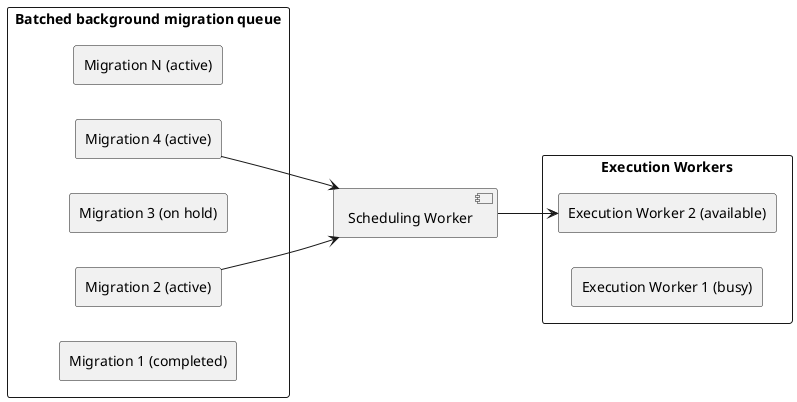
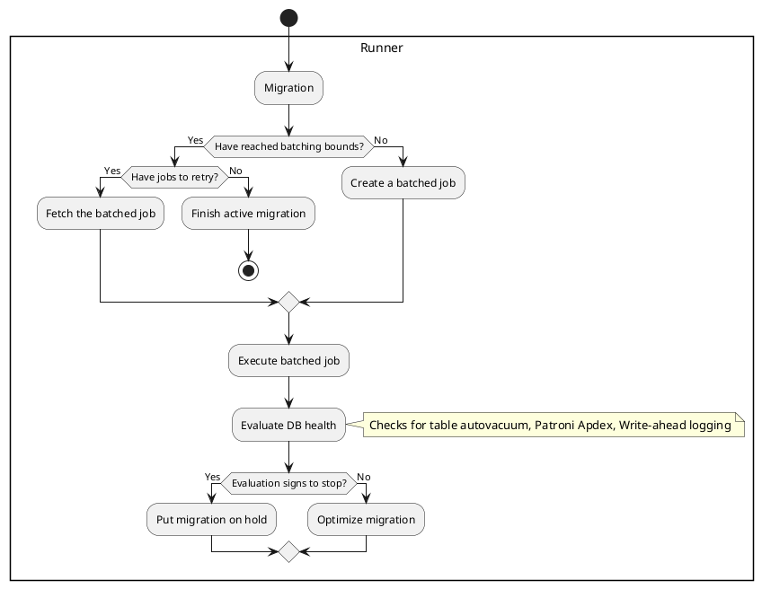
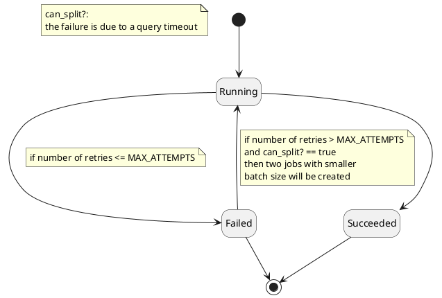
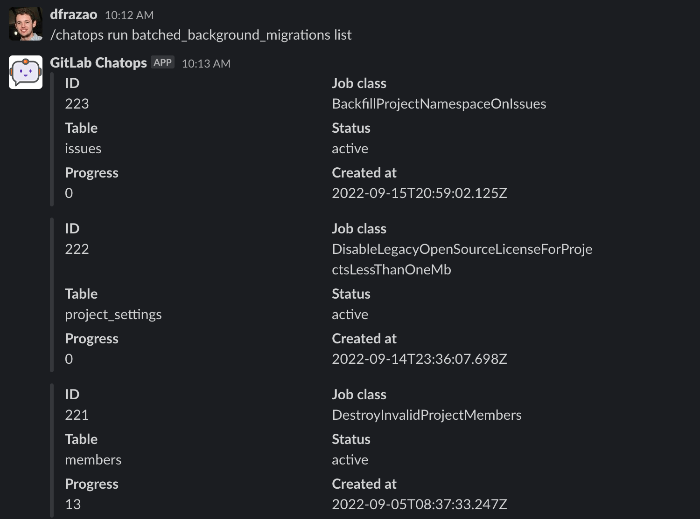
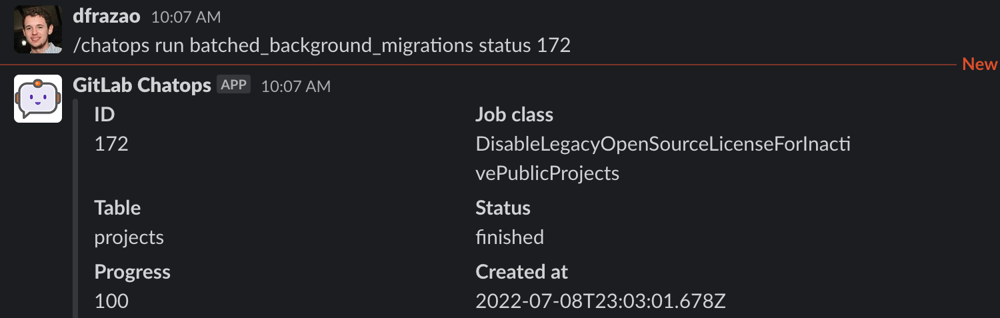
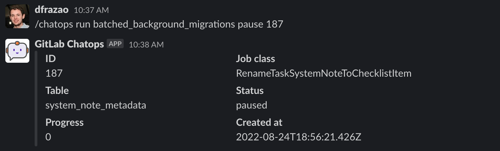
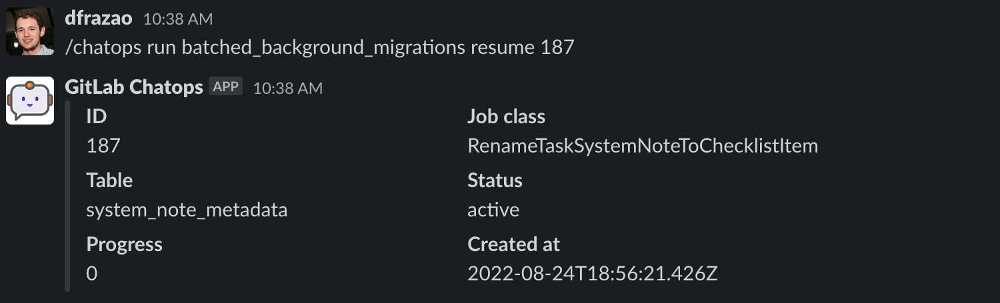

Batched background migrations should be used to perform data migrations whenever a
migration exceeds [the time limits](../migration_style_guide.md#how-long-a-migration-should-take)
in our guidelines. For example, you can use batched background
migrations to migrate data that's stored in a single JSON column
to a separate table instead.

NOTE:
Batched background migrations replaced the legacy background migrations framework.
Check that documentation in reference to any changes involving that framework.

NOTE:
The batched background migrations framework has ChatOps support. Using ChatOps, GitLab engineers can interact with the batched background migrations present in the system.

## When to use batched background migrations

Use a batched background migration when you migrate _data_ in tables containing
so many rows that the process would exceed
[the time limits in our guidelines](../migration_style_guide.md#how-long-a-migration-should-take)
if performed using a regular Rails migration.

- Batched background migrations should be used when migrating data in
  [high-traffic tables](../migration_style_guide.md#high-traffic-tables).
- Batched background migrations may also be used when executing numerous single-row queries
  for every item on a large dataset. Typically, for single-record patterns, runtime is
  largely dependent on the size of the dataset. Split the dataset accordingly,
  and put it into background migrations.
- Don't use batched background migrations to perform schema migrations.

Background migrations can help when:

- Migrating events from one table to multiple separate tables.
- Populating one column based on JSON stored in another column.
- Migrating data that depends on the output of external services. (For example, an API.)

### Notes

- If the batched background migration is part of an important upgrade, it must be announced
  in the release post. Discuss with your Project Manager if you're unsure if the migration falls
  into this category.
- You should use the [generator](#generate-a-batched-background-migration) to create batched background migrations,
  so that required files are created by default.

## How batched background migrations work

Batched background migrations (BBM) are subclasses of
`Gitlab::BackgroundMigration::BatchedMigrationJob` that define a `perform` method.
As the first step, a regular migration creates a `batched_background_migrations`
record with the BBM class and the required arguments. By default,
`batched_background_migrations` is in an active state, and those are picked up
by the Sidekiq worker to execute the actual batched migration.

All migration classes must be defined in the namespace `Gitlab::BackgroundMigration`. Place the files
in the directory `lib/gitlab/background_migration/`.

### Execution mechanism

Batched background migrations are picked from the queue in the order they are enqueued. Multiple migrations are fetched
and executed in parallel, as long they are in active state and do not target the same database table.
The default number of migrations processed in parallel is 2, for GitLab.com this limit is configured to 4.
Once migration is picked for execution, a job is created for the specific batch. After each job execution, migration's
batch size may be increased or decreased, based on the performance of the last 20 jobs.



Soon as a worker is available, the BBM is processed by the runner.



### Idempotence

Batched background migrations are executed in a context of a Sidekiq process.
The usual Sidekiq rules apply, especially the rule that jobs should be small
and idempotent. Ensure that in the case where your migration job is retried, data
integrity is guaranteed.

See [Sidekiq best practices guidelines](https://github.com/mperham/sidekiq/wiki/Best-Practices)
for more details.

### Migration optimization

After each job execution, a verification takes place to check if the migration can be optimized.
The optimization underlying mechanic is based on the concept of time efficiency. It calculates
the exponential moving average of time efficiencies for the last N jobs and updates the batch
size of the batched background migration to its optimal value.

This mechanism, however, makes it hard for us to provide an accurate estimation for total
execution time of the migration when using the [database migration pipeline](database_migration_pipeline.md).

We are discussing the ways to fix this problem in
[this issue](https://gitlab.com/gitlab-org/database-team/gitlab-com-database-testing/-/issues/162)

### Job retry mechanism

The batched background migrations retry mechanism ensures that a job is executed again in case of failure.
The following diagram shows the different stages of our retry mechanism:



- `MAX_ATTEMPTS` is defined in the [`Gitlab::Database::BackgroundMigration`](https://gitlab.com/gitlab-org/gitlab/blob/master/lib/gitlab/database/background_migration/batched_job.rb)
  class.
- `can_split?` is defined in the [`Gitlab::Database::BatchedJob`](https://gitlab.com/gitlab-org/gitlab/-/blob/master/lib/gitlab/database/background_migration/batched_job.rb) class.

### Failed batched background migrations

The whole batched background migration is marked as `failed`
(`/chatops run batched_background_migrations status MIGRATION_ID` shows
the migration as `failed`) if any of the following is true:

- There are no more jobs to consume, and there are failed jobs.
- More than [half of the jobs failed since the background migration was started](https://gitlab.com/gitlab-org/gitlab/blob/master/lib/gitlab/database/background_migration/batched_migration.rb#L160).

### Throttling batched migrations

Because batched migrations are update heavy and there have been incidents due to the heavy load from these migrations while the database was underperforming, a throttling mechanism exists to mitigate future incidents.

These database indicators are checked to throttle a migration. Upon receiving a
stop signal, the migration is paused for a set time (10 minutes):

- WAL queue pending archival crossing the threshold.
- Active autovacuum on the tables on which the migration works on.
- Patroni apdex SLI dropping below the SLO.
- WAL rate crossing the threshold.

There is an ongoing effort to add more indicators to further enhance the
database health check framework. For more details, see
[epic 7594](https://gitlab.com/groups/gitlab-org/-/epics/7594).

### Isolation

Batched background migrations must be isolated and cannot use application code (for example,
models defined in `app/models` except the `ApplicationRecord` classes).
Because these migrations can take a long time to run, it's possible
for new versions to deploy while the migrations are still running.

### Depending on migrated data

Unlike a regular or a post migration, waiting for the next release is not enough to guarantee that the data was fully migrated.
That means that you shouldn't depend on the data until the BBM is finished. If having 100% of the data migrated is a requirement,
then, the `ensure_batched_background_migration_is_finished` helper can be used to guarantee that the migration was finished and the
data fully migrated. ([See an example](https://gitlab.com/gitlab-org/gitlab/-/blob/41fbe34a4725a4e357a83fda66afb382828767b2/db/post_migrate/20210707210916_finalize_ci_stages_bigint_conversion.rb#L13-18)).

## How to

### Generate a batched background migration

The custom generator `batched_background_migration` scaffolds necessary files and
accepts `table_name`, `column_name`, and `feature_category` as arguments. When
choosing the `column_name`, ensure that you are using a column type that can be iterated over distinctly,
preferably the table's primary key. The table will be iterated over based on the column defined here.
For more information, see [Batch over non-distinct columns](#batch-over-non-distinct-columns).

Usage:

```shell
bundle exec rails g batched_background_migration my_batched_migration --table_name=<table-name> --column_name=<column-name> --feature_category=<feature-category>
```

This command creates the following files:

- `db/post_migrate/20230214231008_queue_my_batched_migration.rb`
- `spec/migrations/20230214231008_queue_my_batched_migration_spec.rb`
- `lib/gitlab/background_migration/my_batched_migration.rb`
- `spec/lib/gitlab/background_migration/my_batched_migration_spec.rb`

### Enqueue a batched background migration

Queueing a batched background migration should be done in a post-deployment
migration. Use this `queue_batched_background_migration` example, queueing the
migration to be executed in batches. Replace the class name and arguments with the values
from your migration:

```ruby
queue_batched_background_migration(
  JOB_CLASS_NAME,
  TABLE_NAME,
  JOB_ARGUMENTS,
  JOB_INTERVAL
  )
```

NOTE:
This helper raises an error if the number of provided job arguments does not match
the number of [job arguments](#use-job-arguments) defined in `JOB_CLASS_NAME`.

Make sure the newly-created data is either migrated, or
saved in both the old and new version upon creation. Removals in
turn can be handled by defining foreign keys with cascading deletes.

### Finalize a batched background migration

Finalizing a batched background migration is done by calling
`ensure_batched_background_migration_is_finished`, after at-least, one required stop from queuing it.
This ensures a smooth upgrade process for self-managed instances.

It is important to finalize all batched background migrations when it is safe
to do so. Leaving around old batched background migration is a form of
technical debt that needs to be maintained in tests and in application
behavior. It is important to note that you cannot depend on any batched
background migration being completed until after it is finalized.

We recommend that batched background migrations are finalized after all of the
following conditions are met:

- The batched background migration is completed on GitLab.com
- The batched background migration was added in or before the last [required stop](required_stops.md). For example if 17.8 is a required stop and the migration was added in 17.7, the finalizing migration can be added in 17.9.

The `ensure_batched_background_migration_is_finished` call must exactly match
the migration that was used to enqueue it. Pay careful attention to:

- The job arguments: Needs to exactly match or it will not find the queued migration
- The `gitlab_schema`: Needs to exactly match or it will not find the queued
  migration. Even if the `gitlab_schema` of the table has changed from
  `gitlab_main` to `gitlab_main_cell` in the meantime you must finalize it
  with `gitlab_main` if that's what was used when queueing the batched
  background migration.

When finalizing a batched background migration you also need to update the
`finalized_by` in the corresponding `db/docs/batched_background_migrations`
file. The value should be the timestamp/version of the migration you added to
finalize it. The [schema version of the RSpec tests](../testing_guide/testing_migrations_guide.md#testing-a-non-activerecordmigration-class)
associated with the migration should also be set to this version to avoid having the tests fail due
to future schema changes.

See the below [Examples](#examples) for specific details on what the actual
migration code should be.

NOTE:
If the migration is being finalized before one required stop since it was enqueued, an early finalization
error will be raised. If the migration requires to be finalized before one required stop,
use `skip_early_finalization_validation: true` option to skip this check.

### Deleting batched background migration code

Once a batched background migration has completed, is finalized and has not been [re-queued](#re-queue-batched-background-migrations),
the migration code in `lib/gitlab/background_migration/` and its associated tests can be deleted after the next required stop following
the finalization.

Here is an example scenario:

- 17.3 and 17.5 are required stops.
- In 17.1 the batched background migration is queued.
- In 17.4 the migration may be finalized, provided that it's completed in GitLab.com.
- In 17.6 the code related to the migration may be deleted.

Batched background migration code is routinely deleted when migrations are squashed.

### Re-queue batched background migrations

A batched background migration might need to be re-run for one of several
reasons:

- The migration contains a bug ([example](https://gitlab.com/gitlab-org/gitlab/-/merge_requests/93546)).
- The migration cleaned up data but the data became de-normalized again due to a
  bypass in application logic ([example](https://gitlab.com/gitlab-org/gitlab/-/merge_requests/123002)).
- The batch size of the original migration causes the migration to fail ([example](https://gitlab.com/gitlab-org/gitlab/-/merge_requests/121404)).

To requeue a batched background migration, you must:

- No-op the contents of the `#up` and `#down` methods of the
  original migration file. Otherwise, the batched background migration is created,
  deleted, then created again on systems that are upgrading multiple patch
  releases at once.
- Add a new post-deployment migration that re-runs the batched background
  migration.
- In the new post-deployment migration, delete the existing batched background
  migration using the `delete_batched_background_migration` method at the start
  of the `#up` method to ensure that any existing runs are cleaned up.
- Update the `db/docs/batched_background_migration/*.yml` file from the original
  migration to include information about the requeue.

#### Example

**Original Migration:**

```ruby
# frozen_string_literal: true

class QueueResolveVulnerabilitiesForRemovedAnalyzers < Gitlab::Database::Migration[2.2]
  milestone '17.3'

  MIGRATION = "ResolveVulnerabilitiesForRemovedAnalyzers"

  def up
    # no-op because there was a bug in the original migration, which has been
    # fixed by
  end

  def down
    # no-op because there was a bug in the original migration, which has been
    # fixed in https://gitlab.com/gitlab-org/gitlab/-/merge_requests/162527
  end
end
```

**Requeued migration:**

```ruby
# frozen_string_literal: true

class RequeueResolveVulnerabilitiesForRemovedAnalyzers < Gitlab::Database::Migration[2.2]
  milestone '17.4'

  restrict_gitlab_migration gitlab_schema: :gitlab_main

  MIGRATION = "ResolveVulnerabilitiesForRemovedAnalyzers"
  DELAY_INTERVAL = 2.minutes
  BATCH_SIZE = 10_000
  SUB_BATCH_SIZE = 100

  def up
    # Clear previous background migration execution from QueueResolveVulnerabilitiesForRemovedAnalyzers
    delete_batched_background_migration(MIGRATION, :vulnerability_reads, :id, [])

    queue_batched_background_migration(
      MIGRATION,
      :vulnerability_reads,
      :id,
      job_interval: DELAY_INTERVAL,
      batch_size: BATCH_SIZE,
      sub_batch_size: SUB_BATCH_SIZE
    )
  end

  def down
    delete_batched_background_migration(MIGRATION, :vulnerability_reads, :id, [])
  end
end
```

**Batched migration dictionary:**

The `milestone` and `queued_migration_version` should be the ones of requeued migration (in this example: RequeueResolveVulnerabilitiesForRemovedAnalyzers).

```markdown
---
migration_job_name: ResolveVulnerabilitiesForRemovedAnalyzers
description: Resolves all detected vulnerabilities for removed analyzers.
feature_category: static_application_security_testing
introduced_by_url: https://gitlab.com/gitlab-org/gitlab/-/merge_requests/162691
milestone: '17.4'
queued_migration_version: 20240814085540
finalized_by: # version of the migration that finalized this BBM
```

### Stop and remove batched background migrations

A batched background migration in running state can be stopped and removed for several reasons:

- When the migration is no longer relevant or required as the product use case changed.
- The migration has to be superseded with another migration with a different logic.

To stop and remove an inprogress batched background migration, you must:

- In Release N, No-op the contents of the `#up` and `#down` methods of the scheduling database migration.

```ruby
class BackfillNamespaceType < Gitlab::Database::Migration[2.1]
  # Reason why we don't need the BBM anymore. E.G: This BBM is no longer needed because it will be superseded by another BBM with different logic.
  def up; end

  def down; end
end
```

- In Release N, add a regular migration, to delete the existing batched migration. Delete the existing batched background migration using the `delete_batched_background_migration` method at the start of the `#up` method to ensure that any existing runs are cleaned up.

```ruby
class CleanupBackfillNamespaceType < Gitlab::Database::Migration[2.1]
  MIGRATION = "MyMigrationClass"
  DELAY_INTERVAL = 2.minutes
  BATCH_SIZE = 50_000

  restrict_gitlab_migration gitlab_schema: :gitlab_main

  def up
    delete_batched_background_migration(MIGRATION, :vulnerabilities, :id, [])
  end

  def down
    delete_batched_background_migration(MIGRATION, :vulnerabilities, :id, [])
  end
end
```

- In Release N, also delete the migration class file (`lib/gitlab/background_migration/my_batched_migration.rb`) and its specs.

All the above steps can be implemented in a single MR.

### Use job arguments

`BatchedMigrationJob` provides the `job_arguments` helper method for job classes to define the job arguments they need.

Batched migrations scheduled with `queue_batched_background_migration` **must** use the helper to define the job arguments:

```ruby
queue_batched_background_migration(
  'CopyColumnUsingBackgroundMigrationJob',
  TABLE_NAME,
  'name', 'name_convert_to_text',
  job_interval: DELAY_INTERVAL
)
```

NOTE:
If the number of defined job arguments does not match the number of job arguments provided when
scheduling the migration, `queue_batched_background_migration` raises an error.

In this example, `copy_from` returns `name`, and `copy_to` returns `name_convert_to_text`:

```ruby
class CopyColumnUsingBackgroundMigrationJob < BatchedMigrationJob
  job_arguments :copy_from, :copy_to
  operation_name :update_all

  def perform
    from_column = connection.quote_column_name(copy_from)
    to_column = connection.quote_column_name(copy_to)

    assignment_clause = "#{to_column} = #{from_column}"

    each_sub_batch do |relation|
      relation.update_all(assignment_clause)
    end
  end
end
```

### Use filters

By default, when creating background jobs to perform the migration, batched background migrations
iterate over the full specified table. This iteration is done using the
[`PrimaryKeyBatchingStrategy`](https://gitlab.com/gitlab-org/gitlab/-/blob/c9dabd1f4b8058eece6d8cb4af95e9560da9a2ee/lib/gitlab/database/migrations/batched_background_migration_helpers.rb#L17). If the table has 1000 records
and the batch size is 100, the work is batched into 10 jobs. For illustrative purposes,
`EachBatch` is used like this:

```ruby
# PrimaryKeyBatchingStrategy
Namespace.each_batch(of: 100) do |relation|
  relation.where(type: nil).update_all(type: 'User') # this happens in each background job
end
```

#### Using a composite or partial index to iterate a subset of the table

When applying additional filters, it is important to ensure they are properly
[covered by an index](iterating_tables_in_batches.md#example-2-iteration-with-filters)
to optimize `EachBatch` performance.
In the below examples we need an index on `(type, id)` or `id WHERE type IS NULL`
to support the filters. See
the [`EachBatch` documentation](iterating_tables_in_batches.md) for more information.

If you have a suitable index and you want to iterate only a subset of the table
you can apply a `where` clause before the `each_batch` like:

```ruby
# Works well if there is an index like either of:
#  - `id WHERE type IS NULL`
#  - `(type, id)`
# Does not work well otherwise.
Namespace.where(type: nil).each_batch(of: 100) do |relation|
  relation.update_all(type: 'User')
end
```

An advantage of this approach is that you get consistent batch sizes. But it is
only suitable where there is an index that matches the `where` clauses as well
as the batching strategy.

`BatchedMigrationJob` provides a `scope_to` helper method to apply additional filters and achieve this:

1. Create a new migration job class that inherits from `BatchedMigrationJob` and defines the additional filter:

   ```ruby
   class BackfillNamespaceType < BatchedMigrationJob

     # Works well if there is an index like either of:
     #  - `id WHERE type IS NULL`
     #  - `(type, id)`
     # Does not work well otherwise.
     scope_to ->(relation) { relation.where(type: nil) }
     operation_name :update_all
     feature_category :source_code_management

     def perform
       each_sub_batch do |sub_batch|
         sub_batch.update_all(type: 'User')
       end
     end
   end
   ```

   NOTE:
   For EE migrations that define `scope_to`, ensure the module extends `ActiveSupport::Concern`.
   Otherwise, records are processed without taking the scope into consideration.

1. In the post-deployment migration, enqueue the batched background migration:

   ```ruby
   class BackfillNamespaceType < Gitlab::Database::Migration[2.1]
     MIGRATION = 'BackfillNamespaceType'
     DELAY_INTERVAL = 2.minutes

     restrict_gitlab_migration gitlab_schema: :gitlab_main

     def up
       queue_batched_background_migration(
         MIGRATION,
         :namespaces,
         :id,
         job_interval: DELAY_INTERVAL
       )
     end

     def down
       delete_batched_background_migration(MIGRATION, :namespaces, :id, [])
     end
   end
   ```

### Access data for multiple databases

Background migration contrary to regular migrations does have access to multiple databases
and can be used to efficiently access and update data across them. To properly indicate
a database to be used it is desired to create ActiveRecord model inline the migration code.
Such model should use a correct [`ApplicationRecord`](multiple_databases.md#gitlab-schema)
depending on which database the table is located. As such usage of `ActiveRecord::Base`
is disallowed as it does not describe a explicitly database to be used to access given table.

```ruby
# good
class Gitlab::BackgroundMigration::ExtractIntegrationsUrl
  class Project < ::ApplicationRecord
    self.table_name = 'projects'
  end

  class Build < ::Ci::ApplicationRecord
    self.table_name = 'ci_builds'
  end
end

# bad
class Gitlab::BackgroundMigration::ExtractIntegrationsUrl
  class Project < ActiveRecord::Base
    self.table_name = 'projects'
  end

  class Build < ActiveRecord::Base
    self.table_name = 'ci_builds'
  end
end
```

Similarly the usage of `ActiveRecord::Base.connection` is disallowed and needs to be
replaced preferably with the usage of model connection.

```ruby
# good
Project.connection.execute("SELECT * FROM projects")

# acceptable
ApplicationRecord.connection.execute("SELECT * FROM projects")

# bad
ActiveRecord::Base.connection.execute("SELECT * FROM projects")
```

### Batch over non-distinct columns

The default batching strategy provides an efficient way to iterate over primary key columns.
However, if you need to iterate over columns where values are not unique, you must use a
different batching strategy.

The `LooseIndexScanBatchingStrategy` batching strategy uses a special version of [`EachBatch`](iterating_tables_in_batches.md#loose-index-scan-with-distinct_each_batch)
to provide efficient and stable iteration over the distinct column values.

This example shows a batched background migration where the `issues.project_id` column is used as
the batching column.

Database post-migration:

```ruby
class ProjectsWithIssuesMigration < Gitlab::Database::Migration[2.1]
  MIGRATION = 'BatchProjectsWithIssues'
  INTERVAL = 2.minutes
  BATCH_SIZE = 5000
  SUB_BATCH_SIZE = 500
  restrict_gitlab_migration gitlab_schema: :gitlab_main

  disable_ddl_transaction!
  def up
    queue_batched_background_migration(
      MIGRATION,
      :issues,
      :project_id,
      job_interval: INTERVAL,
      batch_size: BATCH_SIZE,
      batch_class_name: 'LooseIndexScanBatchingStrategy', # Override the default batching strategy
      sub_batch_size: SUB_BATCH_SIZE
    )
  end

  def down
    delete_batched_background_migration(MIGRATION, :issues, :project_id, [])
  end
end
```

Implementing the background migration class:

```ruby
module Gitlab
  module BackgroundMigration
    class BatchProjectsWithIssues < Gitlab::BackgroundMigration::BatchedMigrationJob
      include Gitlab::Database::DynamicModelHelpers

      operation_name :backfill_issues

      def perform
        distinct_each_batch do |batch|
          project_ids = batch.pluck(batch_column)
          # do something with the distinct project_ids
        end
      end
    end
  end
end
```

NOTE:
[Additional filters](#use-filters) defined with `scope_to` are ignored by `LooseIndexScanBatchingStrategy` and `distinct_each_batch`.

### Calculate overall time estimation of a batched background migration

It's possible to estimate how long a BBM takes to complete. GitLab already provides an estimation through the `db:gitlabcom-database-testing` pipeline.
This estimation is built based on sampling production data in a test environment and represents the max time that the migration could take and, not necessarily,
the actual time that the migration takes. In certain scenarios, estimations provided by the `db:gitlabcom-database-testing` pipeline may not be enough to
calculate all the singularities around the records being migrated, making further calculations necessary. As it made necessary, the formula
`interval * number of records / max batch size` can be used to determine an approximate estimation of how long the migration takes.
Where `interval` and `max batch size` refer to options defined for the job, and the `total tuple count` is the number of records to be migrated.

NOTE:
Estimations may be affected by the [migration optimization mechanism](#migration-optimization).

### Cleaning up a batched background migration

NOTE:
Cleaning up any remaining background migrations must be done in either a major
or minor release. You must not do this in a patch release.

Because background migrations can take a long time, you can't immediately clean
things up after queueing them. For example, you can't drop a column used in the
migration process, as jobs would fail. You must add a separate _post-deployment_
migration in a future release that finishes any remaining
jobs before cleaning things up. (For example, removing a column.)

To migrate the data from column `foo` (containing a big JSON blob) to column `bar`
(containing a string), you would:

1. Release A:
   1. Create a migration class that performs the migration for a row with a given ID.
   1. Update new rows using one of these techniques:
      - Create a new trigger for copy operations that don't need application logic.
      - Handle this operation in the model/service as the records are created or updated.
      - Create a new custom background job that updates the records.
   1. Queue the batched background migration for all existing rows in a post-deployment migration.
1. Release B:
   1. Add a post-deployment migration that checks if the batched background migration is completed.
   1. Deploy code so that the application starts using the new column and stops to update new records.
   1. Remove the old column.

Bumping the [import/export version](../../user/project/settings/import_export.md) may
be required, if importing a project from a prior version of GitLab requires the
data to be in the new format.

### Add indexes to support batched background migrations

Sometimes it is necessary to add a new or temporary index to support a batched background migration.
To do this, create the index in a post-deployment migration that precedes the post-deployment
migration that queues the background migration.

See the documentation for [adding database indexes](adding_database_indexes.md#analyzing-a-new-index-before-a-batched-background-migration)
for additional information about some cases that require special attention to allow the index to be used directly after
creation.

### Execute a particular batch on the database testing pipeline

NOTE:
Only [database maintainers](https://gitlab.com/groups/gitlab-org/maintainers/database/-/group_members?with_inherited_permissions=exclude) can view the database testing pipeline artifacts. Ask one for help if you need to use this method.

Let's assume that a batched background migration failed on a particular batch on GitLab.com and you want to figure out which query failed and why. At the moment, we don't have a good way to retrieve query information (especially the query parameters) and rerunning the entire migration with more logging would be a long process.

Fortunately you can leverage our [database migration pipeline](database_migration_pipeline.md) to rerun a particular batch with additional logging and/or fix to see if it solves the problem.

For an example see [Draft: `Test PG::CardinalityViolation` fix](https://gitlab.com/gitlab-org/gitlab/-/merge_requests/110910) but make sure to read the entire section.

To do that, you need to:

1. [Find the batch `start_id` and `end_id`](#find-the-batch-start_id-and-end_id)
1. [Create a regular migration](#create-a-regular-migration)
1. [Apply a workaround for our migration helpers](#apply-a-workaround-for-our-migration-helpers-optional) (optional)
1. [Start the database migration pipeline](#start-the-database-migration-pipeline)

#### Find the batch `start_id` and `end_id`

You should be able to find those in [Kibana](#viewing-failure-error-logs).

#### Create a regular migration

Schedule the batch in the `up` block of a regular migration:

```ruby
def up
  instance = Gitlab::BackgroundMigration::YourBackgroundMigrationClass.new(
      start_id: <batch start_id>,
      end_id: <batch end_id>,
      batch_table: <table name>,
      batch_column: <batching column>,
      sub_batch_size: <sub batch size>,
      pause_ms: <miliseconds between batches>,
      job_arguments: <job arguments if any>,
      connection: connection
    )

    instance.perform
end

def down
  # no-op
end
```

#### Apply a workaround for our migration helpers (optional)

If your batched background migration touches tables from a schema other than the one you specified by using `restrict_gitlab_migration` helper (example: the scheduling migration has `restrict_gitlab_migration gitlab_schema: :gitlab_main` but the background job uses tables from the `:gitlab_ci` schema) then the migration will fail. To prevent that from happening you must to monkey patch database helpers so they don't fail the testing pipeline job:

1. Add the schema names to [`RestrictGitlabSchema`](https://gitlab.com/gitlab-org/gitlab/-/blob/master/lib/gitlab/database/migration_helpers/restrict_gitlab_schema.rb#L57)

```diff
diff --git a/lib/gitlab/database/migration_helpers/restrict_gitlab_schema.rb b/lib/gitlab/database/migration_helpers/restrict_gitlab_schema.rb
index b8d1d21a0d2d2a23d9e8c8a0a17db98ed1ed40b7..912e20659a6919f771045178c66828563cb5a4a1 100644
--- a/lib/gitlab/database/migration_helpers/restrict_gitlab_schema.rb
+++ b/lib/gitlab/database/migration_helpers/restrict_gitlab_schema.rb
@@ -55,7 +55,7 @@ def unmatched_schemas
         end

         def allowed_schemas_for_connection
-          Gitlab::Database.gitlab_schemas_for_connection(connection)
+          Gitlab::Database.gitlab_schemas_for_connection(connection) << :gitlab_ci
         end
       end
     end
```

1. Add the schema names to [`RestrictAllowedSchemas`](https://gitlab.com/gitlab-org/gitlab/-/blob/master/lib/gitlab/database/query_analyzers/restrict_allowed_schemas.rb#L82)

```diff
diff --git a/lib/gitlab/database/query_analyzers/restrict_allowed_schemas.rb b/lib/gitlab/database/query_analyzers/restrict_allowed_schemas.rb
index 4ae3622479f0800c0553959e132143ec9051898e..d556ec7f55adae9d46a56665ce02de782cb09f2d 100644
--- a/lib/gitlab/database/query_analyzers/restrict_allowed_schemas.rb
+++ b/lib/gitlab/database/query_analyzers/restrict_allowed_schemas.rb
@@ -79,7 +79,7 @@ def restrict_to_dml_only(parsed)
             tables = self.dml_tables(parsed)
             schemas = self.dml_schemas(tables)

-            if (schemas - self.allowed_gitlab_schemas).any?
+            if (schemas - (self.allowed_gitlab_schemas << :gitlab_ci)).any?
               raise DMLAccessDeniedError, \
                 "Select/DML queries (SELECT/UPDATE/DELETE) do access '#{tables}' (#{schemas.to_a}) " \
                 "which is outside of list of allowed schemas: '#{self.allowed_gitlab_schemas}'. " \
```

#### Start the database migration pipeline

Create a Draft merge request with your changes and trigger the manual `db:gitlabcom-database-testing` job.

### Establish dependencies

In some instances, migrations depended on the completion of previously enqueued BBMs. If the BBMs are
still running, the dependent migration fails. For example: introducing an unique index on a large table can depend on
the previously enqueued BBM to handle any duplicate records.

The following process has been configured to make dependencies more evident while writing a migration.

- Version of the migration that queued the BBM is stored in _batched_background_migrations_ table and in BBM dictionary file.
- `DEPENDENT_BATCHED_BACKGROUND_MIGRATIONS` constant is added (commented by default) in each migration file.
  To establish the dependency, add `queued_migration_version` of the dependent BBMs. If not, remove
  the commented line.
- `Migration::UnfinishedDependencies` cop complains if the dependent BBMs are not yet finished. It determines
  whether they got finished by looking up the `finalized_by` key in the
  [BBM dictionary](https://gitlab.com/gitlab-org/gitlab/-/blob/master/lib/generators/batched_background_migration/templates/batched_background_migration_dictionary.template).

Example:

```ruby
# db/post_migrate/20231113120650_queue_backfill_routes_namespace_id.rb
class QueueBackfillRoutesNamespaceId < Gitlab::Database::Migration[2.1]
  MIGRATION = 'BackfillRouteNamespaceId'

  restrict_gitlab_migration gitlab_schema: :gitlab_main
  ...
  ...

  def up
    queue_batched_background_migration(
      MIGRATION,
      ...
    )
  end
end
```

```ruby
# This depends on the finalization of QueueBackfillRoutesNamespaceId BBM
class AddNotNullToRoutesNamespaceId < Gitlab::Database::Migration[2.1]
  DEPENDENT_BATCHED_BACKGROUND_MIGRATIONS = ["20231113120650"]

  def up
    add_not_null_constraint :routes, :namespace_id
  end

  def down
    remove_not_null_constraint :routes, :namespace_id
  end
end
```

## Managing

NOTE:
BBM management takes place through `chatops` integration, which is limited to GitLab team members only.

### List batched background migrations

To list the batched background migrations in the system, run this command:

`/chatops run batched_background_migrations list`

This command supports the following options:

- Database selection:
  - `--database DATABASE_NAME`: Connects to the given database:
    - `main`: Uses the main database (default).
    - `ci`: Uses the CI database.
- Environment selection:
  - `--dev`: Uses the `dev` environment.
  - `--staging`: Uses the `staging` environment.
  - `--staging_ref`: Uses the `staging_ref` environment.
  - `--production` : Uses the `production` environment (default).

Output example:



NOTE:
ChatOps returns 20 batched background migrations order by `created_at` (DESC).

### Monitor the progress and status of a batched background migration

To see the status and progress of a specific batched background migration, run this command:

`/chatops run batched_background_migrations status MIGRATION_ID`

This command supports the following options:

- Database selection:
  - `--database DATABASE_NAME`: Connects to the given database:
    - `main`: Uses the main database (default)
    - `ci`: Uses the CI database
- Environment selection:
  - `--dev`: Uses the `dev` environment.
  - `--staging`: Uses the `staging` environment.
  - `--staging_ref`: Uses the `staging_ref` environment.
  - `--production` : Uses the `production` environment (default).

Output example:



`Progress` represents the percentage of the background migration that has been completed.

Definitions of the batched background migration states:

- **Active:** Either:
  - Ready to be picked by the runner.
  - Running batched jobs.
- **Finalizing:** Running batched jobs.
- **Failed:** Failed batched background migration.
- **Finished:** All jobs were executed successfully and the batched background migration is complete.
- **Paused:** Not visible to the runner.
- **Finalized:** Batched migration was verified with
  [`ensure_batched_background_migration_is_finished`](#finalize-a-batched-background-migration) and is complete.

### Pause a batched background migration

If you want to pause a batched background migration, you need to run the following command:

`/chatops run batched_background_migrations pause MIGRATION_ID`

This command supports the following options:

- Database selection:
  - `--database DATABASE_NAME`: Connects to the given database:
    - `main`: Uses the main database (default).
    - `ci`: Uses the CI database.
- Environment selection:
  - `--dev`: Uses the `dev` environment.
  - `--staging`: Uses the `staging` environment.
  - `--staging_ref`: Uses the `staging_ref` environment.
  - `--production` : Uses the `production` environment (default).

Output example:



NOTE:
You can pause only `active` batched background migrations.

### Resume a batched background migration

If you want to resume a batched background migration, you need to run the following command:

`/chatops run batched_background_migrations resume MIGRATION_ID`

This command supports the following options:

- Database selection:
  - `--database DATABASE_NAME`: Connects to the given database:
    - `main`: Uses the main database (default).
    - `ci`: Uses the CI database.
- Environment selection:
  - `--dev`: Uses the `dev` environment.
  - `--staging`: Uses the `staging` environment.
  - `--staging_ref`: Uses the `staging_ref` environment.
  - `--production` : Uses the `production` environment (default).

Output example:



NOTE:
You can resume only `active` batched background migrations

### Enable or disable background migrations

In extremely limited circumstances, a GitLab administrator can disable either or
both of these [feature flags](../../administration/feature_flags.md):

- `execute_background_migrations`
- `execute_batched_migrations_on_schedule`

These flags are enabled by default. Disable them only as a last resort
to limit database operations in special circumstances, like database host maintenance.

WARNING:
Do not disable either of these flags unless you fully understand the ramifications. If you disable
the `execute_background_migrations` or `execute_batched_migrations_on_schedule` feature flag,
GitLab upgrades might fail and data loss might occur.

## Batched background migrations for EE-only features

All the background migration classes for EE-only features should be present in GitLab FOSS.
For this purpose, create an empty class for GitLab FOSS, and extend it for GitLab EE
as explained in the guidelines for
[implementing Enterprise Edition features](../ee_features.md#code-in-libgitlabbackground_migration).

NOTE:
Background migration classes for EE-only features that use job arguments should define them
in the GitLab FOSS class. Definitions are required to prevent job arguments validation from failing when
migration is scheduled in the GitLab FOSS context.

You can use the [generator](#generate-a-batched-background-migration) to generate an EE-only migration scaffold by passing
`--ee-only` flag when generating a new batched background migration.

## Debug

### Viewing failure error logs

You can view failures in two ways:

- Via GitLab logs:
  1. After running a batched background migration, if any jobs fail,
     view the logs in [Kibana](https://log.gprd.gitlab.net/goto/4cb43f40-f861-11ec-b86b-d963a1a6788e).
     View the production Sidekiq log and filter for:

     - `json.new_state: failed`
     - `json.job_class_name: <Batched Background Migration job class name>`
     - `json.job_arguments: <Batched Background Migration job class arguments>`

  1. Review the `json.exception_class` and `json.exception_message` values to help
     understand why the jobs failed.

  1. Remember the retry mechanism. Having a failure does not mean the job failed.
     Always check the last status of the job.

- Via database:

  1. Get the batched background migration `CLASS_NAME`.
  1. Execute the following query in the PostgreSQL console:

     ```sql
      SELECT migration.id, migration.job_class_name, transition_logs.exception_class, transition_logs.exception_message
      FROM batched_background_migrations as migration
      INNER JOIN batched_background_migration_jobs as jobs
      ON jobs.batched_background_migration_id = migration.id
      INNER JOIN batched_background_migration_job_transition_logs as transition_logs
      ON transition_logs.batched_background_migration_job_id = jobs.id
      WHERE transition_logs.next_status = '2' AND migration.job_class_name = "CLASS_NAME";
     ```

## Testing

Writing tests is required for:

- The batched background migrations' queueing migration.
- The batched background migration itself.
- A cleanup migration.

The `:migration` and `schema: :latest` RSpec tags are automatically set for
background migration specs. Refer to the
[Testing Rails migrations](../testing_guide/testing_migrations_guide.md#testing-a-non-activerecordmigration-class)
style guide.

Remember that `before` and `after` RSpec hooks
migrate your database down and up. These hooks can result in other batched background
migrations being called. Using `spy` test doubles with
`have_received` is encouraged, instead of using regular test doubles, because
your expectations defined in a `it` block can conflict with what is
called in RSpec hooks. Refer to [issue #35351](https://gitlab.com/gitlab-org/gitlab/-/issues/18839)
for more details.

## Best practices

1. Know how much data you're dealing with.
1. Make sure the batched background migration jobs are idempotent.
1. Confirm the tests you write are not false positives.
1. If the data being migrated is critical and cannot be lost, the
   clean-up migration must also check the final state of the data before completing.
1. Discuss the numbers with a database specialist. The migration may add
   more pressure on DB than you expect. Measure on staging,
   or ask someone to measure on production.
1. Know how much time is required to run the batched background migration.
1. Be careful when silently rescuing exceptions inside job classes. This may lead to
   jobs being marked as successful, even in a failure scenario.

   ```ruby
   # good
   def perform
     each_sub_batch do |sub_batch|
       sub_batch.update_all(name: 'My Name')
     end
   end

   # acceptable
   def perform
     each_sub_batch do |sub_batch|
       sub_batch.update_all(name: 'My Name')
     rescue Exception => error
       logger.error(message: error.message, class: error.class)

       raise
     end
   end

   # bad
   def perform
     each_sub_batch do |sub_batch|
       sub_batch.update_all(name: 'My Name')
     rescue Exception => error
       logger.error(message: error.message, class: self.class.name)
     end
   end
   ```

## Examples

### Routes use-case

The `routes` table has a `source_type` field that's used for a polymorphic relationship.
As part of a database redesign, we're removing the polymorphic relationship. One step of
the work is migrating data from the `source_id` column into a new singular foreign key.
Because we intend to delete old rows later, there's no need to update them as part of the
background migration.

1. Start by using the generator to create batched background migration files:

   ```shell
   bundle exec rails g batched_background_migration BackfillRouteNamespaceId --table_name=routes --column_name=id --feature_category=source_code_management
   ```

1. Update the migration job (subclass of `BatchedMigrationJob`) to copy `source_id` values to `namespace_id`:

   ```ruby
   class Gitlab::BackgroundMigration::BackfillRouteNamespaceId < BatchedMigrationJob
     # For illustration purposes, if we were to use a local model we could
     # define it like below, using an `ApplicationRecord` as the base class
     # class Route < ::ApplicationRecord
     #   self.table_name = 'routes'
     # end

     operation_name :update_all
     feature_category :source_code_management

     def perform
       each_sub_batch(
         batching_scope: -> (relation) { relation.where("source_type <> 'UnusedType'") }
       ) do |sub_batch|
         sub_batch.update_all('namespace_id = source_id')
       end
     end
   end
   ```

   NOTE:
   Job classes inherit from `BatchedMigrationJob` to ensure they are
   correctly handled by the batched migration framework. Any subclass of
   `BatchedMigrationJob` is initialized with the necessary arguments to
   execute the batch, and a connection to the tracking database.

1. Create a database migration that adds a new trigger to the database. Example:

   ```ruby
   class AddTriggerToRoutesToCopySourceIdToNamespaceId < Gitlab::Database::Migration[2.1]
     FUNCTION_NAME = 'example_function'
     TRIGGER_NAME = 'example_trigger'

     def up
       execute(<<~SQL)
         CREATE OR REPLACE FUNCTION #{FUNCTION_NAME}() RETURNS trigger
         LANGUAGE plpgsql
         AS $$
         BEGIN
           NEW."namespace_id" = NEW."source_id"
           RETURN NEW;
         END;
         $$;

         CREATE TRIGGER #{TRIGGER_NAME}() AFTER INSERT OR UPDATE
         ON routes
         FOR EACH ROW EXECUTE FUNCTION #{FUNCTION_NAME}();
       SQL
     end

     def down
       drop_trigger(TRIGGER_NAME, :routes)
       drop_function(FUNCTION_NAME)
     end
   end
   ```

1. Update the created post-deployment migration with required delay and batch sizes:

   ```ruby
   class QueueBackfillRoutesNamespaceId < Gitlab::Database::Migration[2.1]
     MIGRATION = 'BackfillRouteNamespaceId'
     DELAY_INTERVAL = 2.minutes
     BATCH_SIZE = 1000
     SUB_BATCH_SIZE = 100

     restrict_gitlab_migration gitlab_schema: :gitlab_main

     def up
       queue_batched_background_migration(
         MIGRATION,
         :routes,
         :id,
         job_interval: DELAY_INTERVAL,
         batch_size: BATCH_SIZE,
         sub_batch_size: SUB_BATCH_SIZE
       )
     end

     def down
       delete_batched_background_migration(MIGRATION, :routes, :id, [])
     end
   end
   ```

   ```yaml
    # db/docs/batched_background_migrations/backfill_route_namespace_id.yml
    ---
    migration_job_name: BackfillRouteNamespaceId
    description: Copies source_id values from routes to namespace_id
    feature_category: source_code_management
    introduced_by_url: "https://mr_url"
    milestone: 16.6
    queued_migration_version: 20231113120650
    finalized_by: # version of the migration that ensured this bbm
   ```

   NOTE:
   When queuing a batched background migration, you need to restrict
   the schema to the database where you make the actual changes.
   In this case, we are updating `routes` records, so we set
   `restrict_gitlab_migration gitlab_schema: :gitlab_main`. If, however,
   you need to perform a CI data migration, you would set
   `restrict_gitlab_migration gitlab_schema: :gitlab_ci`.

   After deployment, our application:
     - Continues using the data as before.
     - Ensures that both existing and new data are migrated.

1. Add a new post-deployment migration that checks that the batched background migration is complete. Also update
   `finalized_by` attribute in BBM dictionary with the version of this migration.

   ```ruby
   class FinalizeBackfillRouteNamespaceId < Gitlab::Database::Migration[2.1]
     MIGRATION = 'BackfillRouteNamespaceId'
     disable_ddl_transaction!

     restrict_gitlab_migration gitlab_schema: :gitlab_main

     def up
       ensure_batched_background_migration_is_finished(
         job_class_name: MIGRATION,
         table_name: :routes,
         column_name: :id,
         job_arguments: [],
         finalize: true
       )
     end

     def down
       # no-op
     end
   end
   ```

   ```yaml
    # db/docs/batched_background_migrations/backfill_route_namespace_id.yml
    ---
    migration_job_name: BackfillRouteNamespaceId
    description: Copies source_id values from routes to namespace_id
    feature_category: source_code_management
    introduced_by_url: "https://mr_url"
    milestone: 16.6
    queued_migration_version: 20231113120650
    finalized_by: 20231115120912
   ```

   NOTE:
   If the batched background migration is not finished, the system will
   execute the batched background migration inline. If you don't want
   to see this behavior, you need to pass `finalize: false`.

   If the application does not depend on the data being 100% migrated (for
   instance, the data is advisory, and not mission-critical), then you can skip this
   final step. This step confirms that the migration is completed, and all of the rows were migrated.

1. Add a database migration to remove the trigger.

   ```ruby
   class RemoveNamepaceIdTriggerFromRoutes < Gitlab::Database::Migration[2.1]
     FUNCTION_NAME = 'example_function'
     TRIGGER_NAME = 'example_trigger'

     def up
       drop_trigger(TRIGGER_NAME, :routes)
       drop_function(FUNCTION_NAME)
     end

     def down
       # Should reverse the trigger and the function in the up method of the migration that added it
     end
   end
   ```

After the batched migration is completed, you can safely depend on the
data in `routes.namespace_id` being populated.
