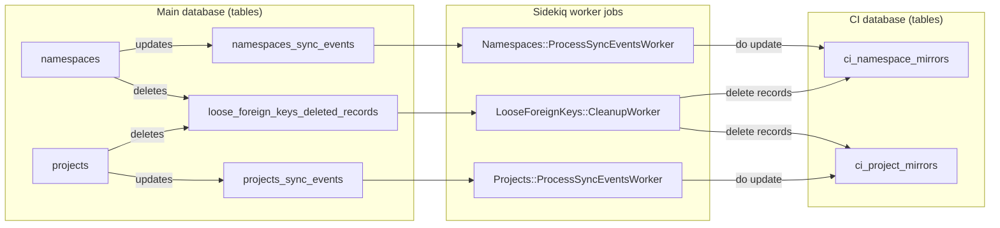
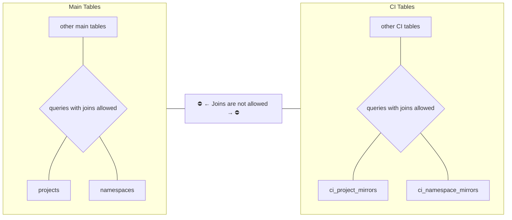

## Problem statement

As part of the database [decomposition work](https://gitlab.com/groups/gitlab-org/-/epics/6168),
which had the goal of splitting the single database GitLab is using, into two databases: `main` and
`ci`, came the big challenge of
[removing all joins between the `main` and the `ci` tables](multiple_databases.md#removing-joins-between-ci-and-non-ci-tables).
That is because PostgreSQL doesn't support joins between tables that belong to different databases.
However, some core application models in the main database are queried very often by the CI side.
For example:

- `Namespace`, in the `namespaces` table.
- `Project`, in the `projects` table.

Not being able to do `joins` on these tables brings a great challenge. The team chose to perform logical
replication of those tables from the main database to the CI database, in the new tables:

- `ci_namespace_mirrors`, as a mirror of the `namespaces` table
- `ci_project_mirrors`, as a mirror of the `projects` table

This logical replication means two things:

1. The `main` database tables can be queried and joined to the `namespaces` and `projects` tables.
1. The `ci` database tables can be joined with the `ci_namespace_mirrors` and `ci_project_mirrors` tables.



This replication was restricted only to a few attributes that are needed from each model:

- From `Namespace` we replicate `traversal_ids`.
- From `Project` we replicate only the `namespace_id`, which represents the group which the project belongs to.

## Keeping the CI mirrored tables in sync with the source tables

We must care about two type 3 events to keep
the source and the target tables in sync:

1. Creation of new namespaces or projects.
1. Updating the namespaces or projects.
1. Deleting namespaces/projects.



### Create and update

Syncing the data of newly created or updated namespaces or projects happens in this
order:

1. **On the `main` database**: Any `INSERT` or `UPDATE` on the `namespaces` or `projects` tables
   adds an entry to the tables `namespaces_sync_events`, and `projects_sync_events`. These tables
   also exist on the `main` database. These entries are added by triggers on both of the tables.
1. **On the model level**: After a commit happens on either of the source models `Namespace` or
   `Project`, it schedules the corresponding Sidekiq jobs `Namespaces::ProcessSyncEventsWorker`
   or `Projects::ProcessSyncEventsWorker` to run.
1. These workers then:
   1. Read the entries from the tables `(namespaces/project)_sync_events`
      from the `main` database, to check which namespaces or projects to sync.
   1. Copy the data for any updated records into the target
      tables `ci_namespace_mirrors`, `ci_project_mirrors`.

### Delete

When any of `namespaces` or `projects` are deleted, the target records on the mirrored
CI tables are deleted using the [loose foreign keys](loose_foreign_keys.md) (LFK) mechanism.

By having these items in the `config/gitlab_loose_foreign_keys.yml`, the LFK mechanism
was already working as expected. It deleted any records on the CI mirrored
tables that mapped to deleted `namespaces` or `projects` in the `main` database.

```yaml
ci_namespace_mirrors:
  - table: namespaces
    column: namespace_id
    on_delete: async_delete
ci_project_mirrors:
  - table: projects
    column: project_id
    on_delete: async_delete
```

## Consistency Checking

To make sure that both syncing mechanisms work as expected, we deploy
two extra worker jobs, triggered by cron jobs every few minutes:

1. `Database::CiNamespaceMirrorsConsistencyCheckWorker`
1. `Database::CiProjectMirrorsConsistencyCheckWorker`

These jobs:

1. Scan both of the source tables on the `main` database, using a cursor.
1. Compare the items in the `namespaces` and `projects` with the target tables on the `ci` database.
1. Report the items that are not in sync to Kibana and Prometheus.
1. Corrects any discrepancies.
