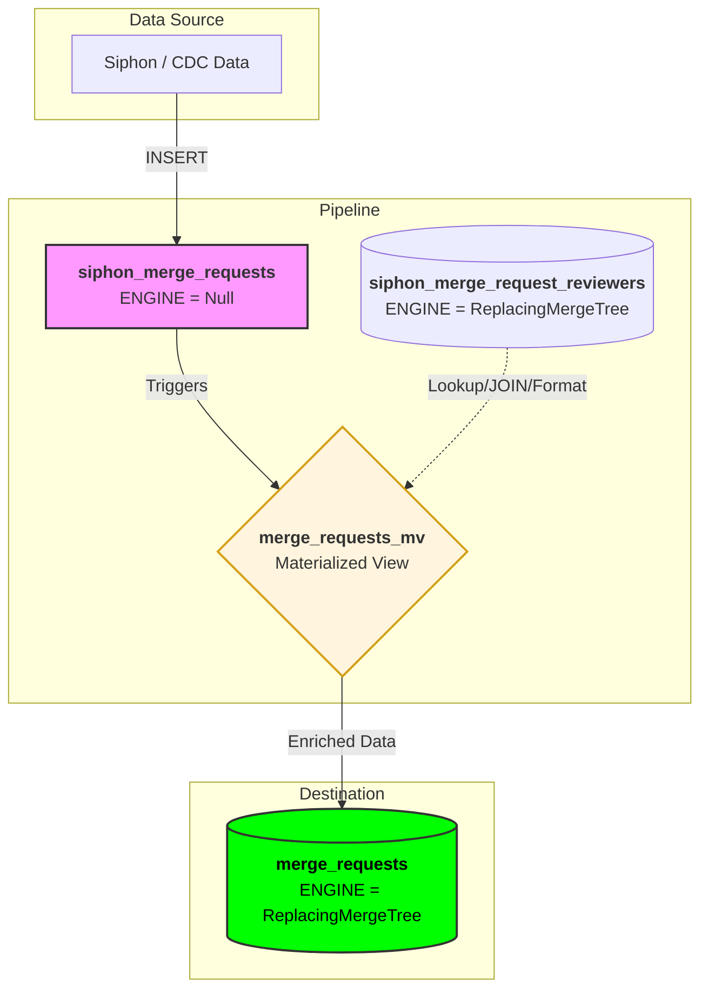

This document provides an overview of how to leverage [Siphon](https://gitlab.com/gitlab-org/analytics-section/siphon), our PostgreSQL change data capture (CDC) tool, to design analytical features using PostgreSQL data in ClickHouse.

## Glossary

- **[Organization](../../../user/organization/_index.md):** higher-level container for projects and groups.
- **Namespace:** Can point to a Group, Sub-group, User namespace, or a Project namespace (which acts as a shadow record for a Project).
- **Project:** Represents a GitLab Project.

## Architecture Overview

Siphon facilitates the movement of data from PostgreSQL to ClickHouse using a publish-subscribe model to ensure scalability and reliability.

1. **Siphon Producer:** Monitors the PostgreSQL logical replication slot and publishes row-level changes (`INSERT`, `UPDATE`, `DELETE`) to **NATS**.
1. **NATS:** Acts as the message broker, decoupling the producer from the consumers.
1. **Siphon Consumer:** Subscribes to NATS topics and writes the incoming data into **ClickHouse** using the `ReplacingMergeTree` engine.

## Requirements

This guide assumes that the following GitLab components are up and running:

- PostgreSQL with [`wal_level=logical`](https://gitlab-org.gitlab.io/gitlab-development-kit/howto/siphon/#enable-logical-replication-in-postgresql) configuration.
- ClickHouse
- NATS
- Siphon Producer and Siphon Consumer (for ClickHouse)

> [!note]
> **Current status:** Siphon is only available for local development via GDK for database tables present in the `main` database. You should set up these dependencies with GDK following [this guide](https://gitlab-org.gitlab.io/gitlab-development-kit/howto/siphon/). You can find help and discuss technical issues in the `#f_siphon` Slack channel.

## Table Replication Example

With Siphon, you can replicate a complete PostgreSQL table to ClickHouse. This process requires at least two steps:

1. **ClickHouse table creation:** Create the destination table in ClickHouse where Siphon replicates the data.
1. **Configuration change:** Update Siphon configuration so it is aware of the table.

In this example, we are replicating the `labels` table to ClickHouse.

### ClickHouse Table Creation

You can generate a ClickHouse database migration using a Rake task. This transforms the PostgreSQL schema for the specified table into a Siphon-compatible ClickHouse table definition.

```shell
bundle exec rails generate gitlab:click_house:siphon labels
```

Generated `CREATE TABLE` statement:

```sql
      CREATE TABLE IF NOT EXISTS siphon_labels
      (
        id Int64,
        title Nullable(String),
        color Nullable(String),
        project_id Nullable(Int64),
        created_at Nullable(DateTime64(6, 'UTC')),
        updated_at Nullable(DateTime64(6, 'UTC')),
        template Nullable(Bool) DEFAULT false,
        description Nullable(String),
        description_html Nullable(String),
        type Nullable(String),
        group_id Nullable(Int64),
        cached_markdown_version Nullable(Int64),
        lock_on_merge Bool DEFAULT false,
        archived Bool DEFAULT false,
        organization_id Nullable(Int64),
        _siphon_replicated_at DateTime64(6, 'UTC') DEFAULT now(),
        _siphon_deleted Bool DEFAULT FALSE
      )
      ENGINE = ReplacingMergeTree(_siphon_replicated_at, _siphon_deleted)
      PRIMARY KEY id
```

The generator includes all columns from the PostgreSQL table and adds two extra fields to track record updates (`_siphon_replicated_at` and `_siphon_deleted`). In case you want to skip some columns from the ClickHouse schema, you can do that by modifying the generated `CREATE TABLE` statement. Siphon will only insert data for columns which are available in ClickHouse.

By default, the generator uses the same primary key as PostgreSQL. You may modify this to suit your querying needs, provided the following two rules are met:

- All primary key columns from the PostgreSQL table **must** be included in the ClickHouse primary key.
- You may add extra columns to the primary key definition, provided the values of those columns **never change**.

Examples for such columns:

- Sharding keys.
- Columns which are not modifiable from the application, for example updating the `target_id` and `target_type` values of a `notes` record.

> [!note]
> Siphon and ClickHouse does not do any validations regarding the correctness of the primary key configuration.

### Siphon Configuration

After the table is created, you should update your Siphon configuration in `gdk.yml` and add your table:

```yaml
siphon:
  enabled: true
  tables:
  - organizations
  - namespaces
  - projects
  - labels
```

After this change, you can restart the Siphon-related processes in your GDK and eventually you should see data synchronized to your table.

```shell
gdk restart siphon-clickhouse-consumer siphon-producer-main-db
```

The updated configuration triggers Siphon to perform two actions:

1. **Initial Snapshot:** Take a snapshot of the current data to populate the `siphon_labels` table.
1. **Continuous Replication:** Capture all subsequent record changes in real-time via logical replication and apply them to the `siphon_labels` table.

> [!note]
> Depending on the table size, the initial data snapshot may take several minutes or hours to complete.

You can inspect the table from rails console:

```ruby
ClickHouse::Client.select('SELECT * FROM siphon_labels', :main)
```

Or you can start ClickHouse client and run the following query:

```sql
SELECT * FROM siphon_labels;
```

## Hierarchy Denormalization Examples

One of the biggest challenges at GitLab is querying data in the Namespace/Group hierarchy in PostgreSQL. Oftentimes, this is not efficiently possible, and a database query may time out when querying a larger data range.

There has been [extensive research](https://handbook.gitlab.com/handbook/engineering/architecture/design-documents/data_insights_platform_hierarchical_data_retrieval_optimization/) regarding hierarchy-based lookups in ClickHouse, and there are several approaches to making these possible with Siphon and ClickHouse.

In PostgreSQL, we have introduced a special, denormalized array column called `traversal_ids`. This contains all ancestor namespace IDs, which allows us to look up all entities in the hierarchy more efficiently. Hierarchy optimization in ClickHouse means that this denormalized column can be part of any table where there is a direct reference to a namespace or project.

### `traversal_path` Structure

In ClickHouse, `traversal_ids` is transformed to `traversal_path`, a slash (`/`) separated string.

```plaintext
1/9970/../92345/
```

- **First integer:** `organization_id` (allows organization-level lookups).
- **Second integer:** Top-level namespace ID (in this example: `gitlab-org`).
- **Last integer:** Pointer to a `Group` (or subgroup) or to a `ProjectNamespace` (references a `Project` record).

### How to Determine the `traversal_path`

Three ClickHouse [dictionaries](https://clickhouse.com/docs/dictionary) (hashmap cache) were added to the database for quick `traversal_path` lookup.

Look up `traversal_path` for a `namespaces.id` value:

```sql
SELECT dictGet('namespace_traversal_paths_dict', 'traversal_path', 9970);
```

Look up `traversal_path` for a `projects.id` value:

```sql
SELECT dictGet('project_traversal_paths_dict', 'traversal_path', 278964); -- GitLab project id
```

Look up `traversal_path` for an `organizations.id` value:

```sql
SELECT dictGet('organization_traversal_paths_dict', 'traversal_path', 1); -- "main" organization id
```

These dictionaries allow mostly `O(1)` access for looking up `traversal_path` values. Keep in mind that the returned data is cached and may not always be consistent. See the [Consistency Guarantees](#consistency-guarantees) section later in this document.

### Create a Hierarchy-Lookup Optimized Table

You can create a Siphon table that is optimized for hierarchical lookups with the following Rake task:

```shell
bundle exec rails generate gitlab:click_house:siphon labels --with-traversal-path
```

As a result, the generated table contains one extra column (`traversal_path`) with the dictionary lookup as the default value. Using the `$table_name.yml` table description file, the script will automatically detect the configured sharding keys and set the correct dictionary lookups.

Generated `CREATE TABLE` statement:

```sql
      CREATE TABLE IF NOT EXISTS siphon_labels
      (
        id Int64,
        title Nullable(String),
        color Nullable(String),
        project_id Nullable(Int64),
        created_at Nullable(DateTime64(6, 'UTC')),
        updated_at Nullable(DateTime64(6, 'UTC')),
        template Nullable(Bool) DEFAULT false,
        description Nullable(String),
        description_html Nullable(String),
        type Nullable(String),
        group_id Nullable(Int64),
        cached_markdown_version Nullable(Int64),
        lock_on_merge Bool DEFAULT false,
        archived Bool DEFAULT false,
        organization_id Nullable(Int64),
        traversal_path String DEFAULT multiIf(
          coalesce(group_id, 0) != 0, dictGetOrDefault('namespace_traversal_paths_dict', 'traversal_path', group_id, '0/'),
          coalesce(project_id, 0) != 0, dictGetOrDefault('project_traversal_paths_dict', 'traversal_path', project_id, '0/'),
          coalesce(organization_id, 0) != 0, dictGetOrDefault('organization_traversal_paths_dict', 'traversal_path', organization_id, '0/'),
          '0/'
        ),
        _siphon_replicated_at DateTime64(6, 'UTC') DEFAULT now(),
        _siphon_deleted Bool DEFAULT FALSE,
        PROJECTION pg_pkey_ordered (
          SELECT *
          ORDER BY id
        )
      )
      ENGINE = ReplacingMergeTree(_siphon_replicated_at, _siphon_deleted)
      PRIMARY KEY (traversal_path, id)
      SETTINGS deduplicate_merge_projection_mode = 'rebuild'
```

The primary keys for the table are: `(traversal_path, id)`. Additionally, the generator adds an extra [projection](https://clickhouse.com/docs/data-modeling/projections) for looking up records via the original PostgreSQL primary keys (name: `pg_pkey_ordered`). This is needed for Siphon to quickly locate existing records when replicating `DELETE` statements.

#### The `deduplicate_merge_projection_mode` setting

For tables utilizing projections, we explicitly set `deduplicate_merge_projection_mode` to `rebuild`. This configuration, which is automatically injected by our generator script, is critical for maintaining strict consistency between the parent table and its projections. During a merge, specifically when rows are being deduplicated, this mode instructs ClickHouse to discard the existing projection data and recalculate it from scratch using the newly deduplicated rows. Without this setting, the projection risks becoming stale or mathematically inconsistent with the source data.

#### Querying the Table

When querying hierarchy-optimized tables it's important to ensure that the `traversal_path` filter is part of the query and duplicates are filtered during query time.

**Querying exact `traversal_path` match: count items in a Group**

```sql
SELECT COUNT(*)
FROM (
  SELECT
    argMax(title, _siphon_replicated_at) AS title,
    argMax(_siphon_deleted, _siphon_replicated_at) AS _siphon_deleted,
    id,
    traversal_path
  FROM siphon_labels
  WHERE
    traversal_path = '1/9970/'
  GROUP BY traversal_path, id
)
WHERE _siphon_deleted = false
```

If we only know the `group_id`, we can use a dictionary lookup as the filter:

```sql
SELECT COUNT(*)
FROM (
  SELECT
    argMax(title, _siphon_replicated_at) AS title,
    argMax(_siphon_deleted, _siphon_replicated_at) AS _siphon_deleted,
    id,
    traversal_path
  FROM siphon_labels
  WHERE
    traversal_path = dictGetOrDefault('namespace_traversal_paths_dict', 'traversal_path', 9970, '0/')
  GROUP BY traversal_path, id
)
WHERE _siphon_deleted = false
```

**Querying self and descendants: count items in a Group hierarchy**

```sql
SELECT COUNT(*)
FROM (
  SELECT
    argMax(title, _siphon_replicated_at) AS title,
    argMax(_siphon_deleted, _siphon_replicated_at) AS _siphon_deleted,
    id,
    traversal_path
  FROM siphon_labels
  WHERE
    startsWith(traversal_path, '1/9970/')
  GROUP BY traversal_path, id
)
WHERE _siphon_deleted = false
```

#### Deduplication in Query Time

Siphon tables use the [ReplacingMergeTree](https://clickhouse.com/docs/guides/replacing-merge-tree) table engine. Unlike PostgreSQL, ClickHouse does not enforce uniqueness constraints at the time of insertion for performance reasons. Instead, the engine merges rows with the same primary key in the background.

Because this merge is asynchronous, queries may return multiple versions of the same row. To handle this, always apply query-time deduplication:

- Group By the primary key.
- Use `argMax(column, _siphon_replicated_at)` to select the latest value.
- Filter out rows where `_siphon_deleted` is true.

When writing queries against Siphon tables, always think about how to deduplicate the results:

```sql
SELECT title, id FROM labels ORDER BY title LIMIT 5
```

The query above is not deduplicated and it may return duplicated rows, one way of deduplicating the query is the following:

```sql
SELECT title, id
FROM (
  SELECT
    argMax(title, _siphon_replicated_at) AS title, -- take the latest `title` value
    argMax(_siphon_deleted, _siphon_replicated_at) AS _siphon_deleted, -- take the latest deletion status
    id,
    traversal_path
  FROM siphon_labels
  GROUP BY traversal_path, id -- GROUP BY primary key
)
WHERE
  _siphon_deleted = false -- Filter out deleted rows
ORDER BY title
LIMIT 5
```

If unsure what are the version and deleted columns, you can always inspect the table definition:

```sql
SHOW CREATE TABLE siphon_labels;
```

Find the `ENGINE` clause and look at the arguments:

```sql
ENGINE = ReplacingMergeTree(_siphon_replicated_at, _siphon_deleted)
```

### Near Real-Time Denormalization via `NULL` Engine

The GitLab PostgreSQL schema is optimized for normalized, transactional workloads. However, ClickHouse performance scales best with **denormalized** (wide) tables. While ClickHouse supports `JOINs`, they are computationally expensive. As a rule of thumb, **if a JOIN more than triples your query I/O, you should denormalize at ingestion time.**

This strategy is ideal for enrichment where relationships are `1:1` or `1:N` (where `N` is small, e.g., < 500 rows), such as adding **Assignee** and **Reviewer** data directly to a **Merge Request** record.

#### High-Level Overview

To avoid the cost of storing raw data twice, we utilize a "pass-through" pipeline:

1. **The Ingestion Point (Siphon Table):** Define a "landing" table using the `NULL` engine. This engine acts as a bufferless pipe that receives data from Siphon and triggers downstream logic, immediately discarding the raw bytes to save disk space.
1. **The Storage Table (Destination):** Define the final `ReplacingMergeTree` table. This schema includes both the source columns and the extra columns intended for denormalized data.
1. **The Logic Engine (Materialized View):** Define a Materialized View (MV) that "watches" the `NULL` table. Upon every insert, the MV performs the `JOIN` logic against existing reference tables to fetch enrichment data.
1. **The Landing:** The MV pushes the enriched, "wide" rows into the storage table.

#### Implementation Example: Denormalized Merge Request Reviewers

**Architecture Overview:**



*Note: For the sake of simplicity, unnecessary columns are omitted from the `merge_requests` table.*

##### 1. Create the `NULL` `siphon_merge_requests` table

First, generate a Siphon table for `merge_requests`:

```shell
bundle exec rails generate gitlab:click_house:siphon merge_requests --with-traversal-path
```

The resulting schema (after removing the projection and non-essential columns) appears as follows:

```sql
CREATE TABLE IF NOT EXISTS siphon_merge_requests
(
  id Int64 CODEC(DoubleDelta, ZSTD),
  target_branch String,
  source_branch String,
  source_project_id Nullable(Int64),
  author_id Nullable(Int64),
  title Nullable(String),
  created_at DateTime64(6, 'UTC') CODEC(Delta, ZSTD(1)),
  updated_at DateTime64(6, 'UTC') CODEC(Delta, ZSTD(1)),
  target_project_id Int64,
  iid Nullable(Int64),
  description Nullable(String),
  traversal_path String DEFAULT multiIf(coalesce(target_project_id, 0) != 0, dictGetOrDefault('project_traversal_paths_dict', 'traversal_path', target_project_id, '0/'), '0/') CODEC(ZSTD(3)),
  _siphon_replicated_at DateTime64(6, 'UTC') DEFAULT now() CODEC(ZSTD(1)),
  _siphon_deleted Bool DEFAULT FALSE CODEC(ZSTD(1))
)
ENGINE = Null;
```

**Key Notes:**

- The `ENGINE` is explicitly set to `Null`.
- Column compression remains defined but has no performance impact as data is never written to disk by this engine.

##### 2. Create the `siphon_merge_request_reviewers` table

Generate the reviewers table:

```shell
bundle exec rails generate gitlab:click_house:siphon merge_request_reviewers --with-traversal-path
```

**The generated schema:**

```sql
CREATE TABLE IF NOT EXISTS siphon_merge_request_reviewers
(
  id Int64 CODEC(DoubleDelta, ZSTD),
  user_id Int64,
  merge_request_id Int64,
  created_at DateTime64(6, 'UTC') CODEC(Delta, ZSTD(1)),
  state Int8 DEFAULT 0,
  project_id Int64,
  traversal_path String DEFAULT multiIf(coalesce(project_id, 0) != 0, dictGetOrDefault('project_traversal_paths_dict', 'traversal_path', project_id, '0/'), '0/') CODEC(ZSTD(3)),
  _siphon_replicated_at DateTime64(6, 'UTC') DEFAULT now() CODEC(ZSTD(1)),
  _siphon_deleted Bool DEFAULT FALSE CODEC(ZSTD(1)),
  PROJECTION pg_pkey_ordered (
    SELECT *
    ORDER BY id
  )
)
ENGINE = ReplacingMergeTree(_siphon_replicated_at, _siphon_deleted)
PRIMARY KEY (traversal_path, merge_request_id, id)
SETTINGS deduplicate_merge_projection_mode = 'rebuild', index_granularity = 1024;
```

**Modifications made:**

- `merge_request_id` is included in the primary key to optimize reviewer lookups per MR.
- `index_granularity` is decreased to 1024 to improve `JOIN` performance during the MV trigger.

##### 3. Create the `merge_requests` destination table

This table contains all columns from `siphon_merge_requests` plus additional denormalized columns (in this case, for reviewers). Reviewers are modeled as an array of `Tuples`, where each tuple contains the `user_id` and the review `state`.

```sql
CREATE TABLE IF NOT EXISTS merge_requests
(
  id Int64 CODEC(DoubleDelta, ZSTD),
  target_branch String,
  source_branch String,
  source_project_id Nullable(Int64),
  author_id Nullable(Int64),
  title Nullable(String),
  created_at DateTime64(6, 'UTC') CODEC(Delta, ZSTD(1)),
  updated_at DateTime64(6, 'UTC') CODEC(Delta, ZSTD(1)),
  target_project_id Int64,
  iid Nullable(Int64),
  description Nullable(String),
  traversal_path String DEFAULT multiIf(coalesce(target_project_id, 0) != 0, dictGetOrDefault('project_traversal_paths_dict', 'traversal_path', target_project_id, '0/'), '0/') CODEC(ZSTD(3)),
  reviewers Array(Tuple(UInt64, Int8)),
  _siphon_replicated_at DateTime64(6, 'UTC') DEFAULT now() CODEC(ZSTD(1)),
  _siphon_deleted Bool DEFAULT FALSE CODEC(ZSTD(1)),
  PROJECTION pg_pkey_ordered (
    SELECT *
    ORDER BY id
  )
)
ENGINE = ReplacingMergeTree(_siphon_replicated_at, _siphon_deleted)
PRIMARY KEY (traversal_path, id)
SETTINGS deduplicate_merge_projection_mode = 'rebuild'
```

##### 4. Creating the JOIN Materialized View

The Materialized View ensures that every insert into `siphon_merge_requests` is enriched with current reviewer data.

```sql
CREATE MATERIALIZED VIEW merge_requests_mv TO merge_requests
AS WITH
    cte AS
    (
        -- Store the current INSERT block for siphon_merge_requests table
        SELECT *
        FROM siphon_merge_requests
    ),
    collected_reviewers AS
    (
        SELECT
            traversal_path,
            merge_request_id,
            groupArray((user_id, state)) AS reviewers -- Build the Array(Tuple(UInt64, Int8)) value
        FROM
        (
            -- Load the deduplicated reviewer records for the given merge request values
            SELECT
                traversal_path,
                merge_request_id,
                id,
                argMax(user_id, _siphon_replicated_at) AS user_id,
                argMax(state, _siphon_replicated_at) AS state,
                argMax(_siphon_deleted, _siphon_replicated_at) AS _siphon_deleted
            FROM siphon_merge_request_reviewers
            WHERE (traversal_path, merge_request_id) IN (
                SELECT traversal_path, id
                FROM cte
            )
            GROUP BY traversal_path, merge_request_id, id
            HAVING _siphon_deleted = false
        )
        GROUP BY traversal_path, merge_request_id
    )
SELECT
    cte.id AS id,
    cte.target_branch AS target_branch,
    cte.source_branch AS source_branch,
    cte.source_project_id AS source_project_id,
    cte.author_id AS author_id,
    cte.title AS title,
    cte.created_at AS created_at,
    cte.updated_at AS updated_at,
    cte.target_project_id AS target_project_id,
    cte.iid AS iid,
    cte.description AS description,
    cte.traversal_path AS traversal_path,
    collected_reviewers.reviewers AS reviewers,
    cte._siphon_replicated_at AS _siphon_replicated_at,
    cte._siphon_deleted AS _siphon_deleted
FROM cte
LEFT JOIN collected_reviewers ON collected_reviewers.merge_request_id = cte.id AND collected_reviewers.traversal_path = cte.traversal_path
```

##### Siphon Configuration and the "Chicken-and-Egg" Problem

Materialized Views trigger on inserts to the source table (`siphon_merge_requests`). However, if an update occurs in the `siphon_merge_request_reviewers` table, the denormalized `merge_requests` table will not automatically update.

Because Siphon replicates tables independently, transactional dependencies from PostgreSQL are not natively preserved. To resolve this, Siphon includes a "refresh" callback feature. When a downstream record (reviewer) changes, Siphon can trigger an asynchronous "refresh" of the parent record (Merge Request). This re-inserts the parent row into the `Null` table after a short delay, re-triggering the MV and ensuring it picks up the latest reviewer state.

This is conceptually similar to the `.touch` method in Ruby on Rails, executed asynchronously across a collection of records.

**Siphon ClickHouse consumer configuration:**

```yaml
streams:
  # Note: to properly work with hierarchy de-normalization, the following tables also need to be replicated: namespaces, projects, organizations
  - identifier: merge_requests
    subject: merge_requests
    target: siphon_merge_requests
    # required for handling refresh callbacks from downstream tables
    enable_refresh_package: true
  - identifier: merge_request_reviewers
    subject: merge_request_reviewers
    target: siphon_merge_request_reviewers
    dedup_by:
      - id

clickhouse:
  # connectivity configuration is disabled
  refresh_on_change:
    - source_stream_identifier: merge_request_reviewers
      source_keys:
        - merge_request_id
      target_stream_identifier: merge_requests
      target_keys:
        - id
  # dedup_ configuration is needed for properly applying DELETE and UPDATE events
  dedup_config:
    - stream_identifier: merge_requests
      dedup_by_table: merge_requests
      dedup_by:
        - id
    - stream_identifier: merge_request_reviewers
      dedup_by:
        - id
```

##### Querying the Table

After the configuration is finished and data is replicated to the ClickHouse tables we can run a query on the `merge_requests` table. The following query counts Merge Requests for a project (`id = 12`) that are being reviewed by a specific user (`id = 73`) with a status of "requested changes" (`state = 3`).

```sql
SELECT COUNT(*)
FROM (
  SELECT
    id,
    argMax(reviewers, _siphon_replicated_at) AS reviewers,
    argMax(_siphon_deleted, _siphon_replicated_at) AS _siphon_deleted
  FROM merge_requests
  WHERE
  -- Filter for the project
  startsWith(traversal_path, dictGetOrDefault('project_traversal_paths_dict', 'traversal_path', 12, '0/'))
  GROUP BY traversal_path, id
  HAVING _siphon_deleted = false
)
WHERE
-- x.1: user id filter
-- x.2: review state filter
arrayExists(x -> x.1 = 73 AND x.2 = 3, reviewers);

```

*Note: Array data types may add extra overhead during parsing and filtering. When denormalized data is a simple list of IDs without associated state, a delimited string field (e.g., `'/user_id1/user_id2/'`) combined with `hasSubstr` can offer higher performance.*

### Consistency Guarantees

With all denormalizations, there are trade-offs. The Siphon-based hierarchy denormalization provides the following consistency guarantees under normal operation (assuming that the `namespaces` and `projects` tables have finished their initial data snapshot):

- Records in hierarchy-denormalized tables will be inserted, updated, and deleted correctly even when the column on which the hierarchy lookup is based has changed (e.g., `namespace_id` was updated).
  - **Note:** If the hierarchy lookup column (`namespace_id`) is a sharding key, these columns never change in PostgreSQL by design.
- When one of the namespace record references in the `traversal_path` changes (e.g., a subgroup/project is moved or deleted):
  - Eventual consistency is enforced via periodical consistency check jobs. The system aims to resolve these consistency issues in 5 minutes for large tables (note: this is to be implemented within [this issue](https://gitlab.com/gitlab-org/analytics-section/siphon/-/work_items/160)).

In development, consistency issues may appear more often as record creation may happen very close to the project or group creation. In these cases, the eventual consistency enforcement should resolve the problems in seconds or minutes (configurable).

#### Working in Cells Environment

Siphon-replicated database tables are by design support the [Cells architecture](../../cells/_index.md). Assuming that Siphon is configured on all cells, when an organization or group is moved to another cell, no extra data migrations are needed for ClickHouse.

The source of truth is always PostgreSQL which means that all record changes within the relocation process (organization movement) are replicated:

- Inserting data from Cell A to Cell B.
- Removing old/stale data from Cell A.

These changes are picked up by the Siphon producer via the logical replication stream and are eventually applied to ClickHouse by the Siphon consumer.
