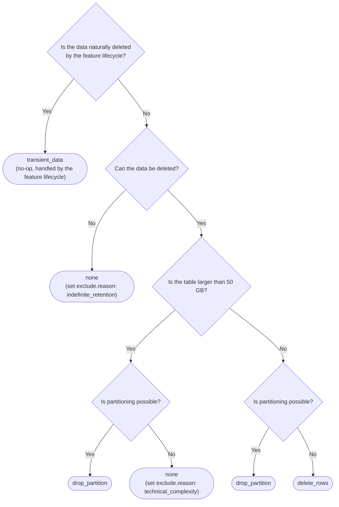

Every database table needs a declared data lifecycle, so that a retention decision is made once,
recorded next to the table and enforced by tooling.

A data retention policy declares how long rows stay in a table, how that window is enforced, and who
owns the enforcement work. For the reasoning behind the framework, see the
[data retention policy framework design document](https://handbook.gitlab.com/handbook/engineering/architecture/design-documents/data_retention_policy_framework/).

This framework establishes checks and tools to define and automate the retention policy, and it is the responsibility
of feature teams to decide the retention policy, capture justification where needed and implement the policy.

## Location

Data retention policy files are stored under `db/docs/data_retention/` folder, with
one file per table named `<table_name>.yml`. Different tools will refer this file to enforce and automate the strategy.

## Example data retention file

```yaml
---
retention_window: 90
enforcement_strategy: drop_partition
enforcing: true
work_item: https://gitlab.com/gitlab-org/gitlab/-/issues/:issue_id
pause_mechanism: application_setting
pause_mechanism::name: <application_setting_name>
```

## Schema

| Attribute               | Type    | Required    | Description                                                                                      |
|-------------------------|---------|-------------|--------------------------------------------------------------------------------------------------|
| `exclude`               | Hash    | no          | Excludes the table from retention, with a reason. Unset means the table is subject to retention. |
| `retention_window`      | Integer | yes         | Number of days the data remains in the database after its creation.                              |
| `enforcement_strategy`  | String  | yes         | How the retention window is enforced.                                                            |
| `enforcing`             | Boolean | yes         | Whether the retention policy is actively enforced.                                               |
| `work_item`             | URL     | conditional | Issue or epic recording the justification and the enforcement plan, with label `data-retention`. |
| `pause_mechanism`       | String  | yes         | How retention can be paused for this table.                                                      |
| `pause_mechanism::name` | String  | conditional | Name of the application setting or feature flag.                                                 |

### Exclude

Excludes the table from data retention. This attribute is not set by default, which means the table is subject to retention.

To exclude a table, set `exclude.reason` to one of the below allowed reasons.

- `indefinite_retention`: the data must be retained indefinitely, for example for compliance or audit
  purposes or a core entity table (such as `organizations`) that does not accumulate
  rows that can be aged out. This reason is a stopgap. The goal is to eventually move indefinitely retained data out of the hot OLTP database into cold
  storage, so tables that use this reason are expected to be revisited in future.
- `technical_complexity`: the table is larger than the 50 GB soft limit and cannot be partitioned, so
  `drop_partition` is not achievable. You must justify the specific technical constraints that make partitioning impossible in the
  `work_item`. These will be reviewed async to find common patterns and build tools/framework to solve the complexity.

> [!note]
> Team capacity constraints or questions regarding implementing the `enforcement_strategy` should not be treated as `technical_complexity`.

When `exclude.reason` is set, two coupled attributes are fixed:

1. `retention_window` must be `-1`.
1. `enforcement_strategy` must be `none`.

```yaml
---
exclude:
  reason: indefinite_retention
retention_window: -1
enforcement_strategy: none
enforcing: false
work_item: https://gitlab.com/gitlab-org/gitlab/-/issues/:issue_id
pause_mechanism: none
```

The coupling is bidirectional.
The values `retention_window: -1` and `enforcement_strategy: none` are valid only when
`exclude.reason` is set.
In every other case, set both attributes to concrete values by following the
[decision tree](#enforcement-strategy).

### Retention window

How long the data remains in the database after its initial creation, as a number of days.

The value `-1` is valid only when `exclude.reason` is set.
In all other cases, set this attribute to a positive number of days.

### Enforcement strategy

How the retention window is enforced.

The available values are:

- `drop_partition`: the table is partitioned and partitions are dropped after they age past
  `retention_window`.
- `delete_rows`: rows are deleted in batches (using [Background operations](../background_operations.md)) and the data cannot be retrieved afterwards.
- `transient_data`: the data is tied to a user or feature lifecycle that already deletes it as part of that lifecycle.
  Capture the lifecycle details in the `work_item`.
- `none`: the table is excluded from retention. Valid only when `exclude.reason` is set.

#### Decision tree



#### Data recovery

The point at which data becomes unrecoverable differs by strategy:

- `drop_partition`: after the retention period the partition is detached and kept for a grace window before being
  dropped (7 days by default in the current `PartitionManager`, configurable to a lower value). Data remains
  recoverable from the detached partition until it is dropped.
- `delete_rows`: a hard cutoff, because rows are lost immediately on deletion and no soft-delete
  system is in place today.
- `transient_data`: data loss is governed by the lifecycle of the owning feature rather than by this
  framework.
- `none`: no data loss, because the table is retained indefinitely.

##### Why deleting rows is a last resort

A `DELETE` is a write, and enforcing a retention window through deletes turns cleanup into a continuous write
workload that scales with volume: to hold the retention window on a growing table, the deletion rate must keep pace with the
insertion rate, so every row inserted is eventually a row deleted. This cost is paid forever, in proportion to how
much data flows through the table:

1. **Write amplification.** A `DELETE` marks the heap tuple dead, the row's entries in every index become dead and
   must later be removed by index vacuuming. Autovacuum then re-reads and re-dirties the same heap pages and every
   index to clean up, so the write cost of each deleted row is paid more than once. In practice this roughly doubles
   the table's write load and if deletion cannot keep up with insertion, the retention window is never enforced.
1. **The table never shrinks.** Vacuum makes the freed space reusable for future inserts, but the on-disk footprint
   stays at its high-water mark unless the table is rewritten (for example using `pg_repack`).
   Deleting rows can cap growth, but it cannot bring a table that has crossed the size limit back under it automatically.
1. **WAL and replication load.** WAL volume scales with pages touched, not rows deleted. Deletes scattered across
   cold pages emit a full-page image per page after each checkpoint, and vacuum generates a second wave of WAL
   cleaning the same pages. All of it ships to every replica and to the WAL archive, adding lag.

`drop_partition` is not free either, but its cost is one-time: converting an existing large table to a partitioned
one is an expensive migration (see [Large tables](#large-tables)). After that, `DETACH PARTITION CONCURRENTLY` is a
metadata operation, it produces no dead tuples and effectively no WAL regardless of how many rows the partition
held and tables partitioned from the start avoid the migration cost entirely. So `delete_rows` pays continuously
in proportion to volume, while `drop_partition` pays once. See PlanetScale's
[The only scalable delete](https://planetscale.com/blog/the-only-scalable-delete) for more information.

`delete_rows` is still reasonable for narrow, lightly indexed, low-traffic tables with no viable partition key.
Record the justification in the `work_item`.

#### Large tables

The hard limit for a table on GitLab.com is 100 GB. We use 50 GB as a soft limit — a buffer that leaves room to
partition existing tables or perform actions to consistently reduce the size footprint before the hard limit is
reached. Tables larger than this 50 GB soft limit must use partitioning. Any non-partitioning proposal for a table
over this limit must record its justification in the `work_item`. See
[Large tables limitations](../large_tables_limitations.md) for the constraints
that apply to these tables.

### Enforcing

Defines whether the retention policy enforcement is active.

You can declare a retention policy at table creation time with `enforcing` set to `false` and
switch it to `true` after the enforcement is actually in place.

This separation exists because the policy is declared when the table is created, while the
enforcement implementation often lands later.

### Work item (label: ~data-retention)

An issue or epic that records both the justification for the retention decision and the
implementation plan for enforcing it on the table.

Setting `enforcing` to `true` requires this work item. Set label `~data-retention` in the work item,
which will be used by automation tools to track progress of this program.

### Pause mechanism

How retention enforcement can be paused for a table.

The available values are `none`, `application_setting` and `feature_flag`.

### Pause mechanism name

The name of the application setting or feature flag that enables and disables retention for the
table. A single setting or flag can be shared across multiple tables, for example one setting that covers
the CI domain.

## Defaults for GitLab.com

Based on the standard requirements for GitLab.com, the defaults are the following.
These values are for reference only, so follow the [decision tree](#enforcement-strategy) for optimal
decision making.

| Attribute            | Default                                   |
|----------------------|-------------------------------------------|
| Exclude              | Unset (the table is subject to retention) |
| Retention window     | 1 month                                   |
| Enforcement strategy | `drop_partition`                          |
| Pause mechanism      | `application_setting`                     |

## Options for GitLab Self-Managed

Data retention is enabled by default on all new instances.

Owning teams are responsible for providing ways to disable data retention for their domains.
They can create application settings or feature flags shared across multiple tables to cover entire
domains.
