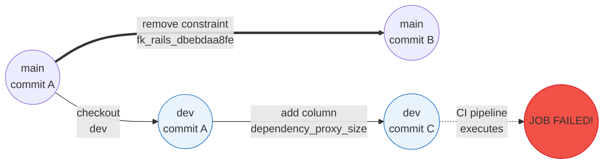

This job runs on the test stage of a merge request pipeline. It checks:

1. A schema dump comparison between the author's working branch and the target branch,
   after executing a rollback of your new migrations. This check validates that the
   schema properly resets to what it was before executing this new migration.
1. A schema dump comparison between the author's working branch and the `db/structure.sql`
   file that the author committed. This check validates that it contains all the expected changes
   in the migration.
1. A Git diff between the `db/schema_migrations` that the author committed and the
   one that the script generated after running migrations. This check validates that everything
   was properly committed.

## Troubleshooting

### False positives

This job is not allowed to fail, but it can throw some false positives.

For example, when we drop a column and then roll back, this column is always
re-added at the end of the list of columns. If the column was previously in
the middle of the list, the rollback can't return the schema back exactly to
its previous state. In such cases apply the `pipeline:skip-check-migrations`
label to skip this check.

For a real-life example, refer to
[this failed job](https://gitlab.com/gitlab-org/gitlab/-/jobs/2006544972#L138).
Here, the author dropped the `position` column.

### Schema dump comparison fails after rollback

This failure often happens if your working branch is behind the target branch.
A real scenario:

1. You check out the `dev` working branch from the `main` target branch. At this point,
   each branch has their `HEAD` at commit A.
1. Someone works on the `main` branch and drops the `fk_rails_dbebdaa8fe` constraint,
   thus creating commit B on `main`.
1. You add column `dependency_proxy_size` to your `dev` branch.
1. The `db:check-migrations` job fails for your `dev` branch's CI/CD pipeline, because
   the `structure.sql` file did not rollback to its expected state.

This happened because branch `dev` contained commits A and C, not B. Its database schema
did not know about the removal of the `fk_rails_dbebdaa8fe` constraint. When comparing the two
schemas, the `dev` branch contained this constraint while the `main` branch didn't.

This example really happened. Read the [job failure logs](https://gitlab.com/gitlab-org/gitlab/-/jobs/1992050890).

To fix these kind of issues, rebase the working branch onto the target branch to get the latest changes.
