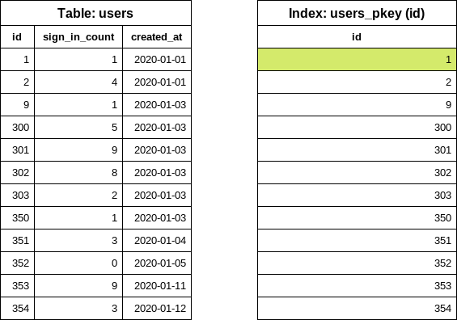
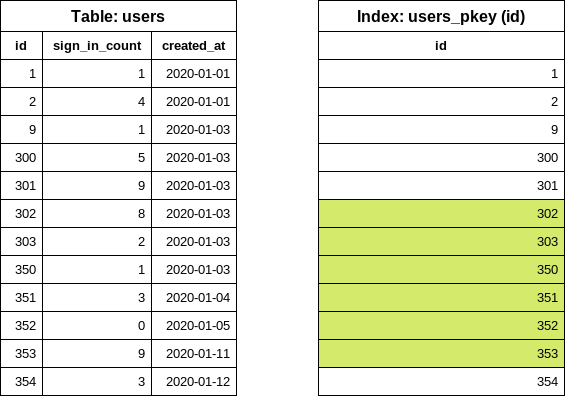
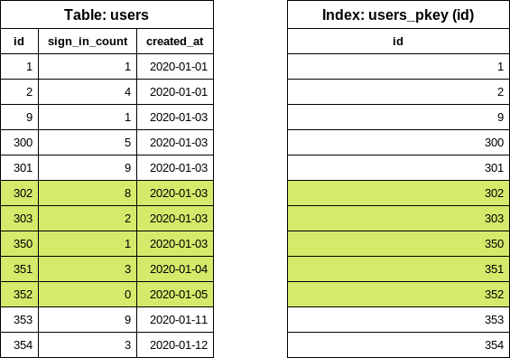
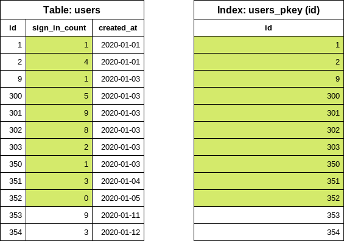
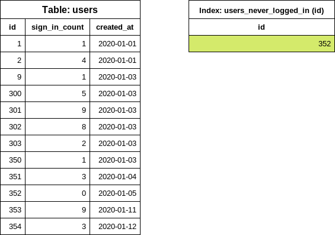
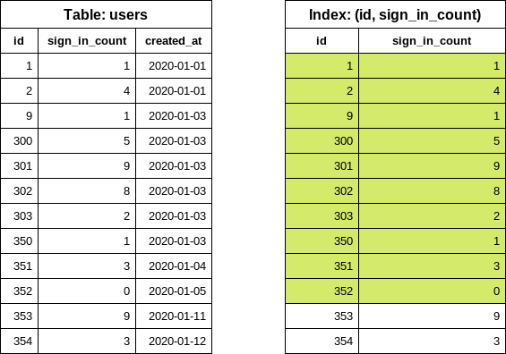
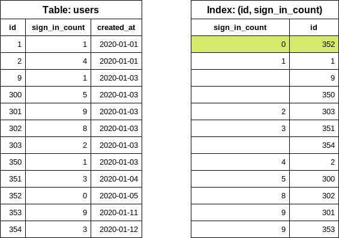

Rails provides a method called `in_batches` that can be used to iterate over
rows in batches. For example:

```ruby
User.in_batches(of: 10) do |relation|
  relation.update_all(updated_at: Time.now)
end
```

Unfortunately, this method is implemented in a way that is not very efficient,
both query and memory usage wise.

To work around this you can include the `EachBatch` module into your models,
then use the `each_batch` class method. For example:

```ruby
class User < ActiveRecord::Base
  include EachBatch
end

User.each_batch(of: 10) do |relation|
  relation.update_all(updated_at: Time.now)
end
```

This produces queries such as:

```plaintext
User Load (0.7ms)  SELECT  "users"."id" FROM "users" WHERE ("users"."id" >= 41654)  ORDER BY "users"."id" ASC LIMIT 1 OFFSET 1000
  (0.7ms)  SELECT COUNT(*) FROM "users" WHERE ("users"."id" >= 41654) AND ("users"."id" < 42687)
```

The API of this method is similar to `in_batches`, though it doesn't support
all of the arguments that `in_batches` supports. You should always use
`each_batch` _unless_ you have a specific need for `in_batches`.

## Iterating over non-unique columns

You should not use the `each_batch` method with a non-unique column (in the context of the relation) as it
[may result in an infinite loop](https://gitlab.com/gitlab-org/gitlab/-/issues/285097).
Additionally, the inconsistent batch sizes cause performance issues when you
iterate over non-unique columns. Even when you apply a max batch size
when iterating over an attribute, there's no guarantee that the resulting
batches don't surpass it. The following snippet demonstrates this situation
when you attempt to select
`Ci::Build` entries for users with `id` between `1` and `10,000`, the database returns
`1 215 178` matching rows.

```ruby
[ gstg ] production> Ci::Build.where(user_id: (1..10_000)).size
=> 1215178
```

This happens because the built relation is translated into the following query:

```ruby
[ gstg ] production> puts Ci::Build.where(user_id: (1..10_000)).to_sql
SELECT "ci_builds".* FROM "ci_builds" WHERE "ci_builds"."type" = 'Ci::Build' AND "ci_builds"."user_id" BETWEEN 1 AND 10000
=> nil
```

`And` queries which filter non-unique column by range `WHERE "ci_builds"."user_id" BETWEEN ? AND ?`,
even though the range size is limited to a certain threshold (`10,000` in the previous example) this
threshold does not translate to the size of the returned dataset. That happens because when taking
`n` possible values of attributes, one can't tell for sure that the number of records that contains
them is less than `n`.

### Loose-index scan with `distinct_each_batch`

When iterating over a non-unique column is necessary, use the `distinct_each_batch` helper
method. The helper uses the [loose-index scan technique](https://wiki.postgresql.org/wiki/Loose_indexscan)
(skip-index scan) to skip duplicated values within a database index.

Example: iterating over distinct `author_id` in the Issue model

```ruby
Issue.distinct_each_batch(column: :author_id, of: 1000) do |relation|
  users = User.where(id: relation.select(:author_id)).to_a
end
```

The technique provides stable performance between the batches regardless of the data distribution.
The `relation` object returns an ActiveRecord scope where only the given `column` is available.
Other columns are not loaded.

The underlying database queries use recursive CTEs, which adds extra overhead. We therefore advise to use
smaller batch sizes than those used for a standard `each_batch` iteration.

## Column definition

`EachBatch` uses the primary key of the model by default for the iteration. This works most of the
cases, however in some cases, you might want to use a different column for the iteration.

```ruby
Project.distinct.each_batch(column: :creator_id, of: 10) do |relation|
  puts User.where(id: relation.select(:creator_id)).map(&:id)
end
```

The query above iterates over the project creators and prints them out without duplications.

NOTE:
In case the column is not unique (no unique index definition), calling the `distinct` method on
the relation is necessary. Using not unique column without `distinct` may result in `each_batch`
falling into an endless loop as described in following
[issue](https://gitlab.com/gitlab-org/gitlab/-/issues/285097).

## `EachBatch` in data migrations

When dealing with data migrations the preferred way to iterate over a large volume of data is using
`EachBatch`.

A special case of data migration is a [batched background migration](batched_background_migrations.md)
where the actual data modification is executed in a background job. The migration code that
determines the data ranges (slices) and schedules the background jobs uses `each_batch`.

## Efficient usage of `each_batch`

`EachBatch` helps to iterate over large tables. It's important to highlight that `EachBatch`
does not magically solve all iteration-related performance problems, and it might not help at
all in some scenarios. From the database point of view, correctly configured database indexes are
also necessary to make `EachBatch` perform well.

### Example 1: Simple iteration

Let's consider that we want to iterate over the `users` table and print the `User` records to the
standard output. The `users` table contains millions of records, thus running one query to fetch
the users likely times out.

This table is a simplified version of the `users` table which contains several rows. We have a few
smaller gaps in the `id` column to make the example a bit more realistic (a few records were
already deleted). One index exists on the `id` field:

| `ID` | `sign_in_count` | `created_at` |
| -- | :-------------: | ------------ |
| 1 | 1 | 2020-01-01 |
| 2 | 4 | 2020-01-01 |
| 9 | 1 | 2020-01-03 |
| 300 | 5 | 2020-01-03 |
| 301 | 9 | 2020-01-03 |
| 302 | 8 | 2020-01-03 |
| 303 | 2 | 2020-01-03 |
| 350 | 1 | 2020-01-03 |
| 351 | 3 | 2020-01-04 |
| 352 | 0 | 2020-01-05 |
| 353 | 9 | 2020-01-11 |
| 354 | 3 | 2020-01-12 |

Loading all users into memory (avoid):

```ruby
users = User.all

users.each { |user| puts user.inspect }
```

Use `each_batch`:

```ruby
# Note: for this example I picked 5 as the batch size, the default is 1_000
User.each_batch(of: 5) do |relation|
  relation.each { |user| puts user.inspect }
end
```

#### How `each_batch` works

As the first step, it finds the lowest `id` (start `id`) in the table by executing the following
database query:

```sql
SELECT "users"."id" FROM "users" ORDER BY "users"."id" ASC LIMIT 1
```



Notice that the query only reads data from the index (`INDEX ONLY SCAN`), the table is not
accessed. Database indexes are sorted so taking out the first item is a very cheap operation.

The next step is to find the next `id` (end `id`) which should respect the batch size
configuration. In this example we used a batch size of 5. `EachBatch` uses the `OFFSET` clause
to get a "shifted" `id` value.

```sql
SELECT "users"."id" FROM "users" WHERE "users"."id" >= 1 ORDER BY "users"."id" ASC LIMIT 1 OFFSET 5
```


Again, the query only looks into the index. The `OFFSET 5` takes out the sixth `id` value: this
query reads a maximum of six items from the index regardless of the table size or the iteration
count.

At this point, we know the `id` range for the first batch. Now it's time to construct the query
for the `relation` block.

```sql
SELECT "users".* FROM "users" WHERE "users"."id" >= 1 AND "users"."id" < 302
```


Notice the `<` sign. Previously six items were read from the index and in this query, the last
value is "excluded". The query looks at the index to get the location of the five `user`
rows on the disk and read the rows from the table. The returned array is processed in Ruby.

The first iteration is done. For the next iteration, the last `id` value is reused from the
previous iteration to find out the next end `id` value.

```sql
SELECT "users"."id" FROM "users" WHERE "users"."id" >= 302 ORDER BY "users"."id" ASC LIMIT 1 OFFSET 5
```



Now we can easily construct the `users` query for the second iteration.

```sql
SELECT "users".* FROM "users" WHERE "users"."id" >= 302 AND "users"."id" < 353
```



### Example 2: Iteration with filters

Building on top of the previous example, we want to print users with zero sign-in count. We keep
track of the number of sign-ins in the `sign_in_count` column so we write the following code:

```ruby
users = User.where(sign_in_count: 0)

users.each_batch(of: 5) do |relation|
  relation.each { |user| puts user.inspect }
end
```

`each_batch` produces the following SQL query for the start `id` value:

```sql
SELECT "users"."id" FROM "users" WHERE "users"."sign_in_count" = 0 ORDER BY "users"."id" ASC LIMIT 1
```

Selecting only the `id` column and ordering by `id` forces the database to use the
index on the `id` (primary key index) column however, we also have an extra condition on the
`sign_in_count` column. The column is not part of the index, so the database needs to look into
the actual table to find the first matching row.



NOTE:
The number of scanned rows depends on the data distribution in the table.

- Best case scenario: the first user was never logged in. The database reads only one row.
- Worst case scenario: all users were logged in at least once. The database reads all rows.

In this particular example, the database had to read 10 rows (regardless of our batch size setting)
to determine the first `id` value. In a "real-world" application it's hard to predict whether the
filtering causes problems or not. In the case of GitLab, verifying the data on a
production replica is a good start, but keep in mind that data distribution on GitLab.com can be
different from self-managed instances.

#### Improve filtering with `each_batch`

##### Specialized conditional index

```sql
CREATE INDEX index_on_users_never_logged_in ON users (id) WHERE sign_in_count = 0
```

This is how our table and the newly created index looks like:



This index definition covers the conditions on the `id` and `sign_in_count` columns thus makes the
`each_batch` queries very effective (similar to the simple iteration example).

It's rare when a user was never signed in so we a anticipate small index size. Including only the
`id` in the index definition also helps to keep the index size small.

##### Index on columns

Later on, we might want to iterate over the table filtering for different `sign_in_count` values, in
those cases we cannot use the previously suggested conditional index because the `WHERE` condition
does not match with our new filter (`sign_in_count > 10`).

To address this problem, we have two options:

- Create another, conditional index to cover the new query.
- Replace the index with a more generalized configuration.

NOTE:
Having multiple indexes on the same table and on the same columns could be a performance bottleneck
when writing data.

Let's consider the following index (avoid):

```sql
CREATE INDEX index_on_users_never_logged_in ON users (id, sign_in_count)
```

The index definition starts with the `id` column which makes the index very inefficient from data
selectivity point of view.

```sql
SELECT "users"."id" FROM "users" WHERE "users"."sign_in_count" = 0 ORDER BY "users"."id" ASC LIMIT 1
```

Executing the query above results in an `INDEX ONLY SCAN`. However, the query still needs to
iterate over an unknown number of entries in the index, and then find the first item where the
`sign_in_count` is `0`.



We can improve the query significantly by swapping the columns in the index definition (prefer).

```sql
CREATE INDEX index_on_users_never_logged_in ON users (sign_in_count, id)
```



The following index definition does not work well with `each_batch` (avoid).

```sql
CREATE INDEX index_on_users_never_logged_in ON users (sign_in_count)
```

Since `each_batch` builds range queries based on the `id` column, this index cannot be used
efficiently. The DB reads the rows from the table or uses a bitmap search where the primary
key index is also read.

##### "Slow" iteration

Slow iteration means that we use a good index configuration to iterate over the table and
apply filtering on the yielded relation.

```ruby
User.each_batch(of: 5) do |relation|
  relation.where(sign_in_count: 0).each { |user| puts user inspect }
end
```

The iteration uses the primary key index (on the `id` column) which makes it safe from statement
timeouts. The filter (`sign_in_count: 0`) is applied on the `relation` where the `id` is already
constrained (range). The number of rows is limited.

Slow iteration generally takes more time to finish. The iteration count is higher and
one iteration could yield fewer records than the batch size. Iterations may even yield
0 records. This is not an optimal solution; however, in some cases (especially when
dealing with large tables) this is the only viable option.

### Using Subqueries

Using subqueries in your `each_batch` query does not work well in most cases. Consider the following example:

```ruby
projects = Project.where(creator_id: Issue.where(confidential: true).select(:author_id))

projects.each_batch do |relation|
  # do something
end
```

The iteration uses the `id` column of the `projects` table. The batching does not affect the
subquery. This means for each iteration, the subquery is executed by the database. This adds a
constant "load" on the query which often ends up in statement timeouts. We have an unknown number
of [confidential issues](../../user/project/issues/confidential_issues.md), the execution time
and the accessed database rows depend on the data distribution in the `issues` table.

NOTE:
Using subqueries works only when the subquery returns a small number of rows.

#### Improving Subqueries

When dealing with subqueries, a slow iteration approach could work: the filter on `creator_id`
can be part of the generated `relation` object.

```ruby
projects = Project.all

projects.each_batch do |relation|
  relation.where(creator_id: Issue.where(confidential: true).select(:author_id))
end
```

If the query on the `issues` table itself is not performant enough, a nested loop could be
constructed. Try to avoid it when possible.

```ruby
projects = Project.all

projects.each_batch do |relation|
  issues = Issue.where(confidential: true)

  issues.each_batch do |issues_relation|
    relation.where(creator_id: issues_relation.select(:author_id))
  end
end
```

If we know that the `issues` table has many more rows than `projects`, it would make sense to flip
the queries, where the `issues` table is batched first.

### Using `JOIN` and `EXISTS`

When to use `JOINS`:

- When there's a 1:1 or 1:N relationship between the tables where we know that the joined record
  (almost) always exists. This works well for "extension-like" tables:
  - `projects` - `project_settings`
  - `users` - `user_details`
  - `users` - `user_statuses`
- `LEFT JOIN` works well in this case. Conditions on the joined table need to go to the yielded
  relation so the iteration is not affected by the data distribution in the joined table.

Example:

```ruby
User.each_batch do |relation|
  relation
    .joins("LEFT JOIN personal_access_tokens on personal_access_tokens.user_id = users.id")
    .where("personal_access_tokens.name = 'name'")
end
```

`EXISTS` queries should be added only to the inner `relation` of the `each_batch` query:

```ruby
User.each_batch do |relation|
  relation.where("EXISTS (SELECT 1 FROM ...")
end
```

### Complex queries on the relation object

When the `relation` object has several extra conditions, the execution plans might become
"unstable".

Example:

```ruby
Issue.each_batch do |relation|
  relation
    .joins(:metrics)
    .joins(:merge_requests_closing_issues)
    .where("id IN (SELECT ...)")
    .where(confidential: true)
end
```

Here, we expect that the `relation` query reads the `BATCH_SIZE` of user records and then
filters down the results according to the provided queries. The planner might decide that
using a bitmap index lookup with the index on the `confidential` column is a better way to
execute the query. This can cause an unexpectedly high amount of rows to be read and the
query could time out.

Problem: we know for sure that the relation is returning maximum `BATCH_SIZE` of records
however, the planner does not know this.

Common table expression (CTE) trick to force the range query to execute first:

```ruby
Issue.each_batch(of: 1000) do |relation|
  cte = Gitlab::SQL::CTE.new(:batched_relation, relation.limit(1000))

  scope = cte
    .apply_to(Issue.all)
    .joins(:metrics)
    .joins(:merge_requests_closing_issues)
    .where("id IN (SELECT ...)")
    .where(confidential: true)

  puts scope.to_a
end
```

### Counting records

For tables with a large amount of data, counting records through queries can result
in timeouts. The `EachBatch` module provides an alternative way to iteratively count
records. The downside of using `each_batch` is the extra count query which is executed
on the yielded relation object.

The `each_batch_count` method is a more efficient approach that eliminates the need
for the extra count query. By invoking this method, the iteration process can be
paused and resumed as needed. This feature is particularly useful in situations
where error budget violations are triggered after five minutes, such as when performing
counting operations within Sidekiq workers.

To illustrate, counting records using `EachBatch` involves invoking an additional
count query as follows:

```ruby
count = 0

Issue.each_batch do |relation|
  count += relation.count
end

puts count
```

On the other hand, the `each_batch_count` method enables the counting process to be
performed more efficiently (counting is part of the iteration query) without invoking
an extra count query:

```ruby
count, _last_value = Issue.each_batch_count # last value can be ignored here
```

Furthermore, the `each_batch_count` method allows the counting process to be paused
and resumed at any point. This capability is demonstrated in the following code snippet:

```ruby
stop_at = Time.current + 3.minutes

count, last_value = Issue.each_batch_count do
  stop_at.past? # condition for stopping the counting
end

# Continue the counting later
stop_at = Time.current + 3.minutes

count, last_value = Issue.each_batch_count(last_count: count, last_value: last_value) do
  stop_at.past?
end
```

### `EachBatch` vs `BatchCount`

When adding new counters for Service Ping, the preferred way to count records is using the
`Gitlab::Database::BatchCount` class. The iteration logic implemented in `BatchCount`
has similar performance characteristics like `EachBatch`. Most of the tips and suggestions
for improving `BatchCount` mentioned above applies to `BatchCount` as well.

## Iterate with keyset pagination

There are a few special cases where iterating with `EachBatch` does not work. `EachBatch`
requires one distinct column (usually the primary key), which makes the iteration impossible
for timestamp columns and tables with composite primary keys.

Where `EachBatch` does not work, you can use
[keyset pagination](pagination_guidelines.md#keyset-pagination) to iterate over the
table or a range of rows. The scaling and performance characteristics are very similar to
`EachBatch`.

Examples:

- Iterate over the table in a specific order (timestamp columns) in combination with a tie-breaker
  if column user to sort by does not contain unique values.
- Iterate over the table with composite primary keys.

### Iterate over the issues in a project by creation date

You can use keyset pagination to iterate over any database column in a specific order (for example,
`created_at DESC`). To ensure consistent order of the returned records with the same values for
`created_at`, use a tie-breaker column with unique values (for example, `id`).

Assume you have the following index in the `issues` table:

```sql
idx_issues_on_project_id_and_created_at_and_id" btree (project_id, created_at, id)
```

### Fetching records for further processing

The following snippet iterates over issue records within the project using the specified order
(`created_at, id`).

```ruby
scope = Issue.where(project_id: 278964).order(:created_at, :id) # id is the tie-breaker

iterator = Gitlab::Pagination::Keyset::Iterator.new(scope: scope)

iterator.each_batch(of: 100) do |records|
  puts records.map(&:id)
end
```

You can add extra filters to the query. This example only lists the issue IDs created in the last
30 days:

```ruby
scope = Issue.where(project_id: 278964).where('created_at > ?', 30.days.ago).order(:created_at, :id) # id is the tie-breaker

iterator = Gitlab::Pagination::Keyset::Iterator.new(scope: scope)

iterator.each_batch(of: 100) do |records|
  puts records.map(&:id)
end
```

### Updating records in the batch

For complex `ActiveRecord` queries, the `.update_all` method does not work well, because it
generates an incorrect `UPDATE` statement.
You can use raw SQL for updating records in batches:

```ruby
scope = Issue.where(project_id: 278964).order(:created_at, :id) # id is the tie-breaker

iterator = Gitlab::Pagination::Keyset::Iterator.new(scope: scope)

iterator.each_batch(of: 100) do |records|
  ApplicationRecord.connection.execute("UPDATE issues SET updated_at=NOW() WHERE issues.id in (#{records.dup.reselect(:id).to_sql})")
end
```

NOTE:
To keep the iteration stable and predictable, avoid updating the columns in the `ORDER BY` clause.

### Iterate over the `merge_request_diff_commits` table

The `merge_request_diff_commits` table uses a composite primary key (`merge_request_diff_id, relative_order`),
which makes `EachBatch` impossible to use efficiently.

To paginate over the `merge_request_diff_commits` table, you can use the following snippet:

```ruby
# Custom order object configuration:
order = Gitlab::Pagination::Keyset::Order.build([
  Gitlab::Pagination::Keyset::ColumnOrderDefinition.new(
    attribute_name: 'merge_request_diff_id',
    order_expression: MergeRequestDiffCommit.arel_table[:merge_request_diff_id].asc,
    nullable: :not_nullable
  ),
  Gitlab::Pagination::Keyset::ColumnOrderDefinition.new(
    attribute_name: 'relative_order',
    order_expression: MergeRequestDiffCommit.arel_table[:relative_order].asc,
    nullable: :not_nullable
  )
])
MergeRequestDiffCommit.include(FromUnion) # keyset pagination generates UNION queries

scope = MergeRequestDiffCommit.order(order)

iterator = Gitlab::Pagination::Keyset::Iterator.new(scope: scope)

iterator.each_batch(of: 100) do |records|
  puts records.map { |record| [record.merge_request_diff_id, record.relative_order] }.inspect
end
```

### Order object configuration

Keyset pagination works well with simple `ActiveRecord` `order` scopes
([first example](#iterate-over-the-issues-in-a-project-by-creation-date)).
However, in special cases, you need to describe the columns in the `ORDER BY` clause (second example)
for the underlying keyset pagination library. When the `ORDER BY` configuration cannot be
automatically determined by the keyset pagination library, an error is raised.

The code comments of the
[`Gitlab::Pagination::Keyset::Order`](https://gitlab.com/gitlab-org/gitlab/-/blob/master/lib/gitlab/pagination/keyset/order.rb)
and [`Gitlab::Pagination::Keyset::ColumnOrderDefinition`](https://gitlab.com/gitlab-org/gitlab/-/blob/master/lib/gitlab/pagination/keyset/column_order_definition.rb)
classes give an overview of the possible options for configuring the `ORDER BY` clause. You can
also find a few code examples in the
[keyset pagination](keyset_pagination.md#complex-order-configuration) documentation.
