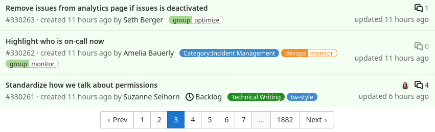

This document gives an overview of the current capabilities and provides best practices for paginating over data in GitLab, and in particular for PostgreSQL.

## Why do we need pagination?

Pagination is a popular technique to avoid loading too much data in one web request. This usually happens when we render a list of records. A common scenario is visualizing parent-children relations (has many) on the UI.

Example: listing issues within a project

As the number of issues grows within the project, the list gets longer. To render the list, the backend does the following:

1. Loads the records from the database, usually in a particular order.
1. Serializes the records in Ruby. Build Ruby (ActiveRecord) objects and then build a JSON or HTML string.
1. Sends the response back to the browser.
1. The browser renders the content.

We have two options for rendering the content:

- HTML: backend deals with the rendering (HAML template).
- JSON: the client (client-side JavaScript) transforms the payload into HTML.

Rendering long lists can significantly affect both the frontend and backend performance:

- The database reads a lot of data from the disk.
- The result of the query (records) is eventually transformed to Ruby objects which increases memory allocation.
- Large responses take more time to send over the wire, to the user's browser.
- Rendering long lists might freeze the browser (bad user experience).

With pagination, the data is split into equal pieces (pages). On the first visit, the user receives only a limited number of items (page size). The user can see more items by paginating forward which results in a new HTTP request and a new database query.



## General guidelines for paginating

### Pick the right approach

Let the database handle the pagination, filtering, and data retrieval. Implementing in-memory pagination on the backend (`paginate_array` from Kaminari) or on the frontend (JavaScript) might work for a few hundreds of records. If application limits are not defined, things can get out of control quickly.

### Reduce complexity

When we list records on the page we often provide additional filters and different sort options. This can complicate things on the backend side significantly.

For the MVC version, consider the following:

- Reduce the number of sort options to the minimum.
- Reduce the number of filters (dropdown list, search bar) to the minimum.

To make sorting and pagination efficient, for each sort option we need at least two database indexes (ascending, descending order). If we add filter options (by state or by author), we might need more indexes to maintain good performance. Indexes are not free, they can significantly affect the `UPDATE` query timings.

It's not possible to make all filter and sort combinations performant, so we should try optimizing the performance by usage patterns.

### Prepare for scaling

Offset-based pagination is the easiest way to paginate over records, however, it does not scale well for large database tables. As a long-term solution, [keyset pagination](keyset_pagination.md) is preferred. Switching between offset and keyset pagination is generally straightforward and can be done without affecting the end-user if the following conditions are met:

- Avoid presenting total counts, prefer limit counts.
  - Example: count maximum 1001 records, and then on the UI show 1000+ if the count is 1001, show the actual number otherwise.
  - See the [badge counters approach](../merge_request_concepts/performance.md#badge-counters) for more information.
- Avoid using page numbers, use next and previous page buttons.
  - Keyset pagination doesn't support page numbers.
- For APIs, advise against building URLs for the next page by "hand".
  - Promote the usage of the [`Link` header](../../api/rest/_index.md#pagination-link-header) where the URLs for the next and previous page are provided by the backend.
  - This way changing the URL structure is possible without breaking backward compatibility.

NOTE:
Infinite scroll can use keyset pagination without affecting the user experience since there are no exposed page numbers.

## Options for pagination

### Offset pagination

The most common way to paginate lists is using offset-based pagination (UI and REST API). It's backed by the popular [Kaminari](https://github.com/kaminari/kaminari) Ruby gem, which provides convenient helper methods to implement pagination on ActiveRecord queries.

Offset-based pagination is leveraging the `LIMIT` and `OFFSET` SQL clauses to take out a specific slice from the table.

Example database query when looking for the 2nd page of the issues within our project:

```sql
SELECT issues.* FROM issues WHERE project_id = 1 ORDER BY id LIMIT 20 OFFSET 20
```

1. Move an imaginary pointer over the table rows and skip 20 rows.
1. Take the next 20 rows.

Notice that the query also orders the rows by the primary key (`id`). When paginating data, specifying the order is very important. Without it, the returned rows are non-deterministic and can confuse the end-user.

#### Page numbers

Example pagination bar:


The Kaminari gem renders a nice pagination bar on the UI with page numbers and optionally quick shortcuts the next, previous, first, and last page buttons. To render these buttons, Kaminari needs to know the number of rows, and for that, a count query is executed.

```sql
SELECT COUNT(*) FROM issues WHERE project_id = 1
```

#### Performance

##### Index coverage

To achieve the good performance, the `ORDER BY` clause needs to be covered by an index.

Assuming that we have the following index:

```sql
CREATE INDEX index_on_issues_project_id ON issues (project_id);
```

Let's try to request the first page:

```sql
SELECT issues.* FROM issues WHERE project_id = 1 ORDER BY id LIMIT 20;
```

We can produce the same query in Rails:

```ruby
Issue.where(project_id: 1).page(1).per(20)
```

The SQL query returns a maximum of 20 rows from the database. However, it doesn't mean that the database only reads 20 rows from the disk to produce the result.

This is what happens:

1. The database tries to plan the execution in the most efficient way possible based on the table statistics and the available indexes.
1. The planner knows that we have an index covering the `project_id` column.
1. The database reads all rows using the index on `project_id`.
1. The rows at this point are not sorted, so the database sorts the rows.
1. The database returns the first 20 rows.

In case the project has 10,000 rows, the database reads 10,000 rows and sorts them in memory (or on disk). This does not scale well in the long term.

To fix this we need the following index:

```sql
CREATE INDEX index_on_issues_project_id ON issues (project_id, id);
```

By making the `id` column part of the index, the previous query reads maximum 20 rows. The query performs well regardless of the number of issues within a project. So with this change, we've also improved the initial page load (when the user loads the issue page).

NOTE:
Here we're leveraging the ordered property of the b-tree database index. Values in the index are sorted so reading 20 rows does not require further sorting.

#### Known issues

##### `COUNT(*)` on a large dataset

Kaminari by default executes a count query to determine the number of pages for rendering the page links. Count queries can be quite expensive for a large table. In an unfortunate scenario the queries time out.

To work around this, we can run Kaminari without invoking the count SQL query.

```ruby
Issue.where(project_id: 1).page(1).per(20).without_count
```

In this case, the count query is not executed and the pagination no longer renders the page numbers. We see only the next and previous links.

##### `OFFSET` on a large dataset

When we paginate over a large dataset, we might notice that the response time gets slower and slower. This is due to the `OFFSET` clause that seeks through the rows and skips N rows.

From the user point of view, this might not be always noticeable. As the user paginates forward, the previous rows might be still in the buffer cache of the database. If the user shares the link with someone else and it's opened after a few minutes or hours, the response time might be significantly higher or it would even time out.

When requesting a large page number, the database needs to read `PAGE * PAGE_SIZE` rows. This makes offset pagination **unsuitable for large database tables** however, with an [optimization technique](offset_pagination_optimization.md) the overall performance of the database queries can be slightly improved.

Example: listing users on the Admin area

Listing users with a very simple SQL query:

```sql
SELECT "users".* FROM "users" ORDER BY "users"."id" DESC LIMIT 20 OFFSET 0
```

The query execution plan shows that this query is efficient, the database only read 20 rows from the database (`rows=20`):

```plaintext
 Limit  (cost=0.43..3.19 rows=20 width=1309) (actual time=0.098..2.093 rows=20 loops=1)
   Buffers: shared hit=103
   ->  Index Scan Backward using users_pkey on users  (cost=0.43..X rows=X width=1309) (actual time=0.097..2.087 rows=20 loops=1)
         Buffers: shared hit=103
 Planning Time: 0.333 ms
 Execution Time: 2.145 ms
(6 rows)
```

See the [Understanding EXPLAIN plans](understanding_explain_plans.md) to find more information about reading execution plans.

Let's visit the 50_000th page:

```sql
SELECT "users".* FROM "users" ORDER BY "users"."id" DESC LIMIT 20 OFFSET 999980;
```

The plan shows that the database reads 1_000_000 rows to return 20 rows, with a very high execution time (5.5 seconds):

```plaintext
Limit  (cost=137878.89..137881.65 rows=20 width=1309) (actual time=5523.588..5523.667 rows=20 loops=1)
   Buffers: shared hit=1007901 read=14774 written=609
   I/O Timings: read=420.591 write=57.344
   ->  Index Scan Backward using users_pkey on users  (cost=0.43..X rows=X width=1309) (actual time=0.060..5459.353 rows=1000000 loops=1)
         Buffers: shared hit=1007901 read=14774 written=609
         I/O Timings: read=420.591 write=57.344
 Planning Time: 0.821 ms
 Execution Time: 5523.745 ms
(8 rows)
```

We can argue that a typical user does not visit these pages. However, API users could go to very high page numbers (scraping, collecting data).

### Keyset pagination

Keyset pagination addresses the performance concerns of "skipping" previous rows when requesting a large page, however, it's not a drop-in replacement for offset-based pagination. When moving an API endpoint from offset-based pagination to keyset-based pagination, both must be supported. Removing one type of pagination entirely is a [breaking changes](../../update/terminology.md#breaking-change).

Keyset pagination used in both the [GraphQL API](../graphql_guide/pagination.md#keyset-pagination) and the [REST API](../../api/rest/_index.md#keyset-based-pagination).

Consider the following `issues` table:

|`id`|`project_id`|
|-|-|
|1|1|
|2|1|
|3|2|
|4|1|
|5|1|
|6|2|
|7|2|
|8|1|
|9|1|
|10|2|

Let's paginate over the whole table ordered by the primary key (`id`). The query for the first page is the same as the offset pagination query, for simplicity, we use 5 as the page size:

```sql
SELECT "issues".* FROM "issues" ORDER BY "issues"."id" ASC LIMIT 5
```

Notice that we didn't add the `OFFSET` clause.

To get to the next page, we need to extract values that are part of the `ORDER BY` clause from the last row. In this case, we just need the `id`, which is 5. Now we construct the query for the next page:

```sql
SELECT "issues".* FROM "issues" WHERE "issues"."id" > 5 ORDER BY "issues"."id" ASC LIMIT 5
```

Looking at the query execution plan, we can see that this query read only 5 rows (offset-based pagination would read 10 rows):

```plaintext
 Limit  (cost=0.56..2.08 rows=5 width=1301) (actual time=0.093..0.137 rows=5 loops=1)
   ->  Index Scan using issues_pkey on issues  (cost=0.56..X rows=X width=1301) (actual time=0.092..0.136 rows=5 loops=1)
         Index Cond: (id > 5)
 Planning Time: 7.710 ms
 Execution Time: 0.224 ms
(5 rows)
```

#### Known issues

##### No page numbers

Offset pagination provides an easy way to request a specific page. We can edit the URL and modify the `page=` URL parameter. Keyset pagination cannot provide page numbers because the paging logic might depend on different columns.

In the previous example, the column is the `id`, so we might see something like this in the `URL`:

```plaintext
id_after=5
```

In GraphQL, the parameters are serialized to JSON and then encoded:

```plaintext
eyJpZCI6Ijk0NzMzNTk0IiwidXBkYXRlZF9hdCI6IjIwMjEtMDQtMDkgMDg6NTA6MDUuODA1ODg0MDAwIFVUQyJ9
```

NOTE:
Pagination parameters are visible to the user, so be careful about which columns we order by.

Keyset pagination can only provide the next, previous, first, and last pages.

##### Complexity

Building queries when we order by a single column is very easy, however, things get more complex if tie-breaker or multi-column ordering is used. The complexity increases if the columns are nullable.

Example: ordering by `id` and `created_at` where `created_at` is nullable, query for getting the second page:

```sql
SELECT "issues".*
FROM "issues"
WHERE (("issues"."id" > 99
        AND "issues"."created_at" = '2021-02-16 11:26:17.408466')
       OR ("issues"."created_at" > '2021-02-16 11:26:17.408466')
       OR ("issues"."created_at" IS NULL))
ORDER BY "issues"."created_at" DESC NULLS LAST, "issues"."id" DESC
LIMIT 20
```

##### Tooling

A generic keyset pagination library is available within the GitLab project which can most of the cases easily replace the existing, Kaminari based pagination with significant performance improvements when dealing with large datasets.

Example:

```ruby
# first page
paginator = Project.order(:created_at, :id).keyset_paginate(per_page: 20)
puts paginator.to_a # records

# next page
cursor = paginator.cursor_for_next_page
paginator = Project.order(:created_at, :id).keyset_paginate(cursor: cursor, per_page: 20)
puts paginator.to_a # records
```

For a comprehensive overview, take a look at the [keyset pagination guide](keyset_pagination.md) page.

#### Performance

Keyset pagination provides stable performance regardless of the number of pages we moved forward. To achieve this performance, the paginated query needs an index that covers all the columns in the `ORDER BY` clause, similarly to the offset pagination.

### General performance guidelines

See the [pagination general performance guidelines page](pagination_performance_guidelines.md).
