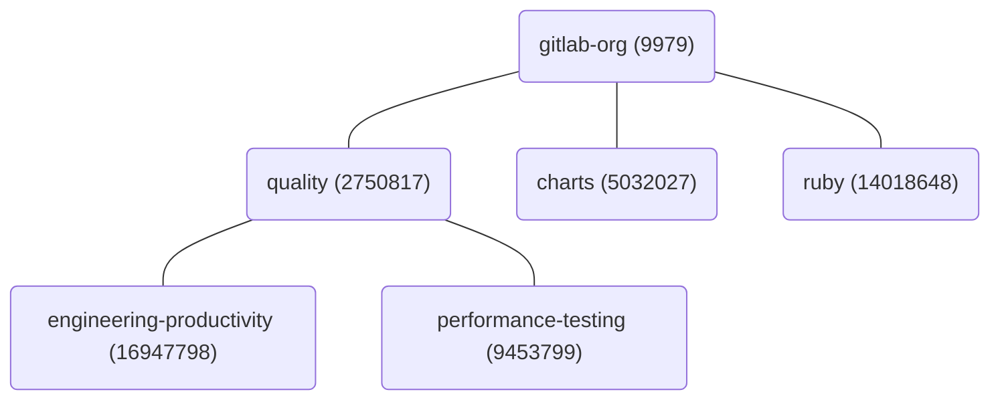
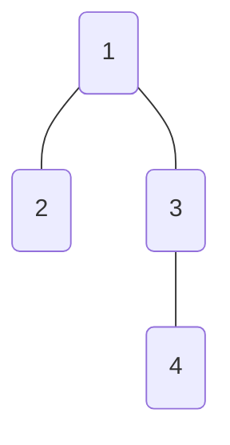

The group hierarchy in GitLab is represented with a tree, where the root element
is the top-level namespace, and the child elements are the subgroups or the
recently introduced `Namespaces::ProjectNamespace` records.

The tree is implemented in the `namespaces` table ,via the `parent_id` column.
The column points to the parent namespace record. The top level namespace has no
`parent_id`.

Partial hierarchy of `gitlab-org`:



Efficiently iterating over the group hierarchy has several potential use cases.
This is true especially in background jobs, which need to perform queries on the group hierarchy,
where stable and safe execution is more important than fast runtime. Batch iteration
requires more network round-trips, but each batch provides similar performance
characteristics.

A few examples:

- For each subgroup, do something.
- For each project in the hierarchy, do something.
- For each issue in the hierarchy, do something.

## Problem statement

A group hierarchy could grow so big that a single query would not be able to load
it in time. The query would fail with statement timeout error.

Addressing scalability issues related to very large groups requires us to store
the same data in different formats (de-normalization). However, if we're unable
to load the group hierarchy, then de-normalization could not be implemented.

One de-normalization technique would be to store all descendant group IDs for a
given group. This would speed up queries where we need to load the group and its
subgroups. Example:



| GROUP_ID | DESCENDANT_GROUP_IDS   |
|----------|------------------------|
| 1        | `[2,3,4]`              |
| 2        | `[]`                   |
| 3        | `[4]`                  |
| 4        | `[]`                   |

With this structure, determining all the subgroups would require us to read only
one row from the database, instead of 4 rows. For a hierarchy as big as 1000 groups,
this could make a huge difference.

The reading of the hierarchy problem is solved with this de-normalization. However,
we still need to find a way to persist this data in a table. Because a group and
its hierarchy could grow very large, we cannot expect a single query to work here.

```sql
SELECT id FROM namespaces WHERE traversal_ids && ARRAY[9970]
```

The query above could time out for large groups, so we need to process the data in batches.

Implementing batching logic in a tree is not something we've looked at before,
and it's fairly complex to implement. An `EachBatch` or `find_in_batches` based
solution would not work because:

- The data (group IDs) are not sorted in the hierarchy.
- Groups in subgroups don't know about the top-level group ID.

## Algorithm

The batching query is implemented as a recursive CTE SQL query, where one batch
would read a maximum of N rows. Due to the tree structure, reading N rows might
not necessarily mean that we're reading N group IDs. If the tree is structured in
a non-optimal way, a batch could return less (but never more) group IDs.

The query implements a [depth-first](https://en.wikipedia.org/wiki/Depth-first_search)
tree walking logic, where the DB scans the first branch of the tree until the leaf
element. We're implementing depth-first algorithm because, when a batch is finished,
the query must return enough information for the next batch (cursor). In GitLab,
we limit the depth of the tree to 20, which means that in the worst case, the
query would return a cursor containing 19 elements.

Implementing a [breadth-first](https://en.wikipedia.org/wiki/Breadth-first_search)
tree walking algorithm would be impractical, because a group can have unbounded
number of descendants, thus we might end up with a huge cursor.

1. Create an initializer row that contains:
   1. The currently processed group ID (top-level group ID)
   1. Two arrays (tree depth and the collected IDs)
   1. A counter for tracking the number of row reads in the query.
1. Recursively process the row and do one of the following (whenever the condition matches):
   - Load the first child namespace and update the currently processed namespace
     ID if we're not at the leaf node. (Walking down a branch)
   - Load the next namespace record on the current depth if there are any rows left.
   - Walk up one node and process rows at one level higher.
1. Continue the processing until the number of reads reaches our `LIMIT` (batch size).
1. Find the last processed row which contains the data for the cursor, and all the collected record IDs.

```sql
WITH RECURSIVE result AS (
  (
    SELECT
      9970 AS current_id, /* current namespace id we're processing */
      ARRAY[9970]::int[] AS depth, /* cursor */
      ARRAY[9970]::int[] AS ids,  /* collected ids */
      1::bigint AS reads,
      'initialize' AS action
  ) UNION ALL
  (
    WITH cte AS ( /* trick for referencing the result cte multiple times */
      select * FROM result
    )
    SELECT * FROM (
      (
        SELECT /* walk down the branch */
          namespaces.id,
          cte.depth || namespaces.id,
          cte.ids || namespaces.id,
          cte.reads + 1,
          'walkdown'
        FROM namespaces, cte
        WHERE
        namespaces.parent_id = cte.current_id
        ORDER BY namespaces.id ASC
        LIMIT 1
      ) UNION ALL
      (
        SELECT /* find next element on the same level */
          namespaces.id,
          cte.depth[:array_length(cte.depth, 1) - 1] || namespaces.id,
          cte.ids || namespaces.id,
          cte.reads + 1,
          'next'
        FROM namespaces, cte
        WHERE
        namespaces.parent_id = cte.depth[array_length(cte.depth, 1) - 1] AND
        namespaces.id > cte.depth[array_length(cte.depth, 1)]
        ORDER BY namespaces.id ASC
        LIMIT 1
      ) UNION ALL
      (
        SELECT /* jump up one node when finished with the current level */
          cte.current_id,
          cte.depth[:array_length(cte.depth, 1) - 1],
          cte.ids,
          cte.reads + 1,
          'jump'
        FROM cte
        WHERE cte.depth <> ARRAY[]::int[]
        LIMIT 1
      )
    ) next_row LIMIT 1
  )
)
SELECT current_id, depth, ids, action
FROM result
```

```plaintext
 current_id |    depth     |          ids           |   action
------------+--------------+------------------------+------------
         24 | {24}         | {24}                   | initialize
         25 | {24,25}      | {24,25}                | walkdown
         26 | {24,26}      | {24,25,26}             | next
        112 | {24,112}     | {24,25,26,112}         | next
        113 | {24,113}     | {24,25,26,112,113}     | next
        114 | {24,113,114} | {24,25,26,112,113,114} | walkdown
        114 | {24,113}     | {24,25,26,112,113,114} | jump
        114 | {24}         | {24,25,26,112,113,114} | jump
        114 | {}           | {24,25,26,112,113,114} | jump
```

NOTE:
Using this query to find all the namespace IDs in a group hierarchy is likely slower
than other querying methods, such as the current `self_and_descendants` implementation
based on the `traversal_ids` column. The query above should be only used when
implementing batch iteration over the group hierarchy.

Rudimentary batching implementation in Ruby:

```ruby
class NamespaceEachBatch
  def initialize(namespace_id:, cursor: nil)
    @namespace_id = namespace_id
    @cursor = cursor || { current_id: namespace_id, depth: [namespace_id] }
  end

  def each_batch(of: 500)
    current_cursor = cursor.dup

    first_iteration = true
    loop do
      new_cursor, ids = load_batch(cursor: current_cursor, of: of, first_iteration: first_iteration)
      first_iteration = false
      current_cursor = new_cursor

      yield ids

      break if new_cursor[:depth].empty?
    end
  end

  private

  # yields array of namespace ids
  def load_batch(cursor:, of:, first_iteration: false)
    recursive_cte = Gitlab::SQL::RecursiveCTE.new(:result,
      union_args: { remove_order: false, remove_duplicates: false })

    ids = first_iteration ? namespace_id.to_s : ""

    recursive_cte << Namespace.select(
      Arel.sql(Integer(cursor.fetch(:current_id)).to_s).as('current_id'),
      Arel.sql("ARRAY[#{cursor.fetch(:depth).join(',')}]::int[]").as('depth'),
      Arel.sql("ARRAY[#{ids}]::int[]").as('ids'),
      Arel.sql("1::bigint AS count")
    ).from('(VALUES (1)) AS does_not_matter').limit(1)

    cte = Gitlab::SQL::CTE.new(:cte, Namespace.select('*').from('result'))

    union_query = Namespace.with(cte.to_arel).from_union(
      walk_down,
      next_elements,
      up_one_level,
      remove_duplicates: false,
      remove_order: false
    ).select('current_id', 'depth', 'ids', 'count').limit(1)

    recursive_cte << union_query

    scope = Namespace.with
      .recursive(recursive_cte.to_arel)
      .from(recursive_cte.alias_to(Namespace.arel_table))
      .limit(of)
    row = Namespace.from(scope.arel.as('namespaces')).order(count: :desc).limit(1).first

    [
      { current_id: row[:current_id], depth: row[:depth] },
      row[:ids]
    ]
  end

  attr_reader :namespace_id, :cursor

  def walk_down
    Namespace.select(
      Arel.sql('namespaces.id').as('current_id'),
      Arel.sql('cte.depth || namespaces.id').as('depth'),
      Arel.sql('cte.ids || namespaces.id').as('ids'),
      Arel.sql('cte.count + 1').as('count')
    ).from('cte, LATERAL (SELECT id FROM namespaces WHERE parent_id = cte.current_id ORDER BY id LIMIT 1) namespaces')
  end

  def next_elements
    Namespace.select(
      Arel.sql('namespaces.id').as('current_id'),
      Arel.sql('cte.depth[:array_length(cte.depth, 1) - 1] || namespaces.id').as('depth'),
      Arel.sql('cte.ids || namespaces.id').as('ids'),
      Arel.sql('cte.count + 1').as('count')
    ).from('cte, LATERAL (SELECT id FROM namespaces WHERE namespaces.parent_id = cte.depth[array_length(cte.depth, 1) - 1] AND namespaces.id > cte.depth[array_length(cte.depth, 1)] ORDER BY id LIMIT 1) namespaces')
  end

  def up_one_level
    Namespace.select(
      Arel.sql('cte.current_id').as('current_id'),
      Arel.sql('cte.depth[:array_length(cte.depth, 1) - 1]').as('depth'),
      Arel.sql('cte.ids').as('ids'),
      Arel.sql('cte.count + 1').as('count')
    ).from('cte')
      .where('cte.depth <> ARRAY[]::int[]')
      .limit(1)
  end
end

iterator = NamespaceEachBatch.new(namespace_id: 9970)
all_ids = []
iterator.each_batch do |ids|
  all_ids.concat(ids)
end

# Test
puts all_ids.count
puts all_ids.sort == Namespace.where('traversal_ids && ARRAY[9970]').pluck(:id).sort
```

Example batch query:

```sql
SELECT
    "namespaces".*
FROM ( WITH RECURSIVE "result" AS ((
            SELECT
                15847356 AS current_id,
                ARRAY[9970,
                12061481,
                12128714,
                12445111,
                15847356]::int[] AS depth,
                ARRAY[]::int[] AS ids,
                1::bigint AS count
            FROM (
                VALUES (1)) AS does_not_matter
            LIMIT 1)
    UNION ALL ( WITH "cte" AS MATERIALIZED (
            SELECT
                *
            FROM
                result
)
            SELECT
                current_id,
                depth,
                ids,
                count
            FROM ((
                    SELECT
                        namespaces.id AS current_id,
                        cte.depth || namespaces.id AS depth,
                        cte.ids || namespaces.id AS ids,
                        cte.count + 1 AS count
                    FROM
                        cte,
                        LATERAL (
                            SELECT
                                id
                            FROM
                                namespaces
                            WHERE
                                parent_id = cte.current_id
                            ORDER BY
                                id
                            LIMIT 1
) namespaces
)
                UNION ALL (
                    SELECT
                        namespaces.id AS current_id,
                        cte.depth[:array_length(
                            cte.depth, 1
) - 1] || namespaces.id AS depth,
                        cte.ids || namespaces.id AS ids,
                        cte.count + 1 AS count
                    FROM
                        cte,
                        LATERAL (
                            SELECT
                                id
                            FROM
                                namespaces
                            WHERE
                                namespaces.parent_id = cte.depth[array_length(
                                    cte.depth, 1
) - 1]
                                AND namespaces.id > cte.depth[array_length(
                                    cte.depth, 1
)]
                            ORDER BY
                                id
                            LIMIT 1
) namespaces
)
                UNION ALL (
                    SELECT
                        cte.current_id AS current_id,
                        cte.depth[:array_length(
                            cte.depth, 1
) - 1] AS depth,
                        cte.ids AS ids,
                        cte.count + 1 AS count
                    FROM
                        cte
                    WHERE (
                        cte.depth <> ARRAY[]::int[]
)
                LIMIT 1
)
) namespaces
    LIMIT 1
))
SELECT
    "namespaces".*
FROM
    "result" AS "namespaces"
LIMIT 500) namespaces
ORDER BY
    "count" DESC
LIMIT 1
```

Execution plan:

```plaintext
 Limit  (cost=16.36..16.36 rows=1 width=76) (actual time=436.963..436.970 rows=1 loops=1)
   Buffers: shared hit=3721 read=423 dirtied=8
   I/O Timings: read=412.590 write=0.000
   ->  Sort  (cost=16.36..16.39 rows=11 width=76) (actual time=436.961..436.968 rows=1 loops=1)
         Sort Key: namespaces.count DESC
         Sort Method: top-N heapsort  Memory: 27kB
         Buffers: shared hit=3721 read=423 dirtied=8
         I/O Timings: read=412.590 write=0.000
         ->  Limit  (cost=15.98..16.20 rows=11 width=76) (actual time=0.005..436.394 rows=500 loops=1)
               Buffers: shared hit=3718 read=423 dirtied=8
               I/O Timings: read=412.590 write=0.000
               CTE result
                 ->  Recursive Union  (cost=0.00..15.98 rows=11 width=76) (actual time=0.003..432.924 rows=500 loops=1)
                       Buffers: shared hit=3718 read=423 dirtied=8
                       I/O Timings: read=412.590 write=0.000
                       ->  Limit  (cost=0.00..0.01 rows=1 width=76) (actual time=0.002..0.003 rows=1 loops=1)
                             I/O Timings: read=0.000 write=0.000
                             ->  Result  (cost=0.00..0.01 rows=1 width=76) (actual time=0.001..0.002 rows=1 loops=1)
                                   I/O Timings: read=0.000 write=0.000
                       ->  Limit  (cost=0.76..1.57 rows=1 width=76) (actual time=0.862..0.862 rows=1 loops=499)
                             Buffers: shared hit=3718 read=423 dirtied=8
                             I/O Timings: read=412.590 write=0.000
                             CTE cte
                               ->  WorkTable Scan on result  (cost=0.00..0.20 rows=10 width=76) (actual time=0.000..0.000 rows=1 loops=499)
                                     I/O Timings: read=0.000 write=0.000
                             ->  Append  (cost=0.56..17.57 rows=21 width=76) (actual time=0.862..0.862 rows=1 loops=499)
                                   Buffers: shared hit=3718 read=423 dirtied=8
                                   I/O Timings: read=412.590 write=0.000
                                   ->  Nested Loop  (cost=0.56..7.77 rows=10 width=76) (actual time=0.675..0.675 rows=0 loops=499)
                                         Buffers: shared hit=1693 read=357 dirtied=1
                                         I/O Timings: read=327.812 write=0.000
                                         ->  CTE Scan on cte  (cost=0.00..0.20 rows=10 width=76) (actual time=0.001..0.001 rows=1 loops=499)
                                               I/O Timings: read=0.000 write=0.000
                                         ->  Limit  (cost=0.56..0.73 rows=1 width=4) (actual time=0.672..0.672 rows=0 loops=499)
                                               Buffers: shared hit=1693 read=357 dirtied=1
                                               I/O Timings: read=327.812 write=0.000
                                               ->  Index Only Scan using index_namespaces_on_parent_id_and_id on public.namespaces namespaces_1  (cost=0.56..5.33 rows=29 width=4) (actual time=0.671..0.671 rows=0 loops=499)
                                                     Index Cond: (namespaces_1.parent_id = cte.current_id)
                                                     Heap Fetches: 7
                                                     Buffers: shared hit=1693 read=357 dirtied=1
                                                     I/O Timings: read=327.812 write=0.000
                                   ->  Nested Loop  (cost=0.57..9.45 rows=10 width=76) (actual time=0.208..0.208 rows=1 loops=442)
                                         Buffers: shared hit=2025 read=66 dirtied=7
                                         I/O Timings: read=84.778 write=0.000
                                         ->  CTE Scan on cte cte_1  (cost=0.00..0.20 rows=10 width=72) (actual time=0.000..0.000 rows=1 loops=442)
                                               I/O Timings: read=0.000 write=0.000
                                         ->  Limit  (cost=0.57..0.89 rows=1 width=4) (actual time=0.203..0.203 rows=1 loops=442)
                                               Buffers: shared hit=2025 read=66 dirtied=7
                                               I/O Timings: read=84.778 write=0.000
                                               ->  Index Only Scan using index_namespaces_on_parent_id_and_id on public.namespaces namespaces_2  (cost=0.57..3.77 rows=10 width=4) (actual time=0.201..0.201 rows=1 loops=442)
                                                     Index Cond: ((namespaces_2.parent_id = (cte_1.depth)[(array_length(cte_1.depth, 1) - 1)]) AND (namespaces_2.id > (cte_1.depth)[array_length(cte_1.depth, 1)]))
                                                     Heap Fetches: 35
                                                     Buffers: shared hit=2025 read=66 dirtied=6
                                                     I/O Timings: read=84.778 write=0.000
                                   ->  Limit  (cost=0.00..0.03 rows=1 width=76) (actual time=0.003..0.003 rows=1 loops=59)
                                         I/O Timings: read=0.000 write=0.000
                                         ->  CTE Scan on cte cte_2  (cost=0.00..0.29 rows=9 width=76) (actual time=0.002..0.002 rows=1 loops=59)
                                               Filter: (cte_2.depth <> '{}'::integer[])
                                               Rows Removed by Filter: 0
                                               I/O Timings: read=0.000 write=0.000
               ->  CTE Scan on result namespaces  (cost=0.00..0.22 rows=11 width=76) (actual time=0.005..436.240 rows=500 loops=1)
                     Buffers: shared hit=3718 read=423 dirtied=8
                     I/O Timings: read=412.590 write=0.000
```
